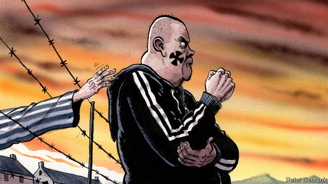

###### Charlemagne

# Historical memorials are not enough to stop anti-Semitism in Europe 

 

> print-edition iconPrint edition | Europe | Aug 22nd 2019 

TEREZIN IS AN old garrison town in today’s Czech Republic that was used by the Nazis as a Jewish ghetto during the second world war. Some 33,000 Jews died in Theresienstadt, as it is known in German, and over twice that number were transported from there to death in extermination camps further east. Today it is an eerie site: part town and part ghost-town, walls speckled with commemorative plaques, train tracks overgrown. The ghetto museum contains drawings by children who were imprisoned there. One by Arnost Jilovsky, born in 1931, depicts a wire fence with wheeling birds and fluffy clouds beyond. Doris Weiserova, one year younger, sketched butterflies fluttering through a flowery meadow. Both died in October 1944 in Auschwitz. 

The literary immortalisation of Terezin’s strange atmosphere came in 2001 with the novel “Austerlitz”. Written by WG Sebald, a German author, it recounts the narrator’s sporadic encounters with Jacques Austerlitz, an architectural historian whose Welsh foster parents concealed his true origins as one of the Jewish children evacuated to Britain under the Kindertransport initiative. Having for decades avoided 20th-century history, Austerlitz eventually traces his story back to Terezin, where his mother was interned before being killed. In the ghetto museum he finally comes to terms with the facts of the Holocaust. Pacing the streets outside, he particularly notices “the gates and doorways… all of them obstructing access to a darkness never yet penetrated.” 

Like many European countries, the Czech Republic contains myriad historical markers documenting the evil of anti-Semitism. One is a memorial in Prague’s main station dedicated in 2017 by children of the Kindertransport to their murdered parents. Reminders of the lessons of history are plentiful for those willing to learn. Yet a report last month by the Federation of Jewish Communities revealed a 189% increase in anti-Semitic incidents in the Czech Republic between 2015 and 2018. Returning from Terezin to Prague, Charlemagne noticed a fresh crack on the Kindertransport memorial. Someone had recently taken a hammer to it. 

A poll by the European Union of 16,000 Jews in 12 member states found that 89% thought anti-Semitism had risen in the past five years, and that one in three had experienced harassment in the past year. Sometimes resurgent anti-Semitism is violent and proud, as with the beating with a belt of two men wearing skullcaps in Berlin last spring. Elsewhere it wears a mask of false innocence. Viktor Orban, Hungary’s prime minister, maintains excellent relations with his Israeli counterpart Binyamin Netanyahu—yet he employs anti-Semitic themes in propaganda against George Soros, a Hungarian-born liberal philanthropist. The leaders of Britain’s Labour Party have for years tolerated anti-Semitism in the ranks. All this in a continent awash with memorials of what happens when one turns a blind eye to bigotry. 

There are two possible conclusions to draw. One is that Europe’s commemorations of the Holocaust simply need to be bigger. But ten minutes by cab from the site of last year’s belt-beating in Berlin is the Memorial to the Murdered Jews of Europe, a sea of gravestone-like pillars taking up an entire city block. If prominence were the key, this should curb the attacks. The more awkward conclusion is that memorials are not enough—that, read wrongly, they can imply that anti-Semitism belongs only to the past, and engender complacency about the present. Mr Orban can point to the cluster of iron shoes near the Hungarian parliament, marking the shooting of Jews there by fascists in 1944 and 1945, as proof that his country takes history seriously. Meanwhile, the opening of Budapest’s newest Holocaust museum was delayed for years over complaints that it downplayed Hungarian collaboration with the Nazis. 

Formal events and sites marking the Holocaust and other acts of anti-Semitism are of course essential and moving. Terezin is one of many examples. But the lessons to which they bear testament cannot just be compartmentalised as acts of penance separate from everyday life. They must somehow impose themselves outside of commemorative events and memorials. They must invade the comfortable consciousness of ordinary citizens. 

A survey by Comres and CNN last September found that 34% of Europeans said they had heard little or nothing of the Holocaust. Education and explanation are understandably at the heart of the European Jewish Congress’s recently published action plan to tackle anti-Semitism. It proposes a clearer definition of the phenomenon, new guidelines for schools and more funding for teaching and researching the Holocaust. But that will be an uphill struggle. Ignorance and indifference are laying fresh tracks on which anti-Semitic hatred can travel. 

How to derail the train? Law enforcement must crack down systematically on anti-Semitic crimes. Leaders must shun politicians who blur the boundaries between mainstream politics and anti-Semitic filth. Educators and civil-society organisations must spread the lessons of the past. All must play their part in bridging the divide between memorials and everyday life. “Only when the generation that survived the war is no longer with us,” said Angela Merkel last year, “will we discover if we have learned from history.” 

Sebald’s novel should act as inspiration. Austerlitz’s trip to Terezin, to his first reckoning with his past after decades of denial, is prompted by the resonances of the oppressive violence of the past in the buildings he encounters on his travels. He is particularly obsessed with Europe’s great train stations: places of happiness, but also silent witnesses to exploitation and oppression, to soldiers marching off to war, to exile and deportation. In Sebald’s Europe the past cannot merely be contained by designated places of memory. It seethes and writhes insistently, barely below the surface of everyday life. To learn the lessons, that surface must be broken.■ 

