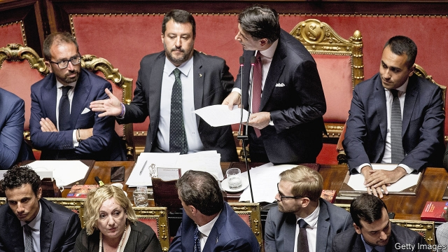

###### Salvini’s gamble

# Matteo Salvini hopes elections will make him Italy’s prime minister 

 

> print-edition iconPrint edition | Europe | Aug 22nd 2019 

IT SEEMS AT times that Italy’s role is to terrify the euro zone’s other member states. In 2011 the refusal of its then prime minister, Silvio Berlusconi, to tackle the euro crisis drove the single currency to the brink of collapse. Since then the country has had six governments and as many market-spooking crises. Its latest government fell apart on August 20th, when Giuseppe Conte resigned as prime minister, ending a rickety 14-month coalition between two populist, Eurosceptic parties: the anti-establishment Five Star Movement (M5S) and the nativist Northern League. The previous week Matteo Salvini, the League’s leader, had withdrawn confidence in the government. He wants the top job for himself. How alarmed should Italy’s partners be? 

Not very, thought investors. The following day, as President Sergio Mattarella began consulting party leaders on the way forward, the yield gap between Italian and German government bonds (an indicator of market concern) shrank to its narrowest since the end of July. Bank shares rose, as did the Milan bourse as a whole. That reflected expectations that Mr Mattarella would not call an election, but would instead broker a coalition deal between the M5S and the centre-left Democratic Party (PD). With the support of some independents, they could muster slim majorities in both houses of parliament. 

Nicola Zingaretti, the leader of the PD, fuelled the optimism. After weeks of apparent resistance to the idea of a coalition with the M5S, he said his party had given him a mandate to negotiate a deal. Mr Zingaretti set five conditions: allegiance to the European Union; environmentally sustainable development; changing immigration policy to get Europe involved; more economic redistribution; and fully accepting parliamentary democracy. Curiously, only the last point is likely to be difficult for the Five Stars. The party was founded on a commitment to let citizens vote directly on legislation via the internet (though in practice it has let that idea slide). 

Other issues may prove more troublesome. The PD are economic Keynesians who favour big infrastructure schemes; the Five Stars often oppose them on environmental grounds. Mr Zingaretti’s demand for a clean break with the previous government may mean he would veto a cabinet post for the M5S’s leader, Luigi Di Maio, who served as deputy prime minister. And there is suspicion that Mr Zingaretti may not work hard to avoid an election: the PD has won ground in the polls since the previous election and now leads the M5S. 

The parties do not have much time. Italy is rather slow to dissolve a parliament and convene a new one; in 2018 it took almost three months. If an election is to be called this autumn, it must happen soon. Parliament needs to pass a budget by January. That will be especially tricky this year. At least €23bn ($25bn) in spending cuts or new taxes are needed to meet the EU’s fiscal rules and shrink the state’s immense debt, equivalent to 132% of GDP. Otherwise Italy will have to push ahead with plans to impose a whopping value-added-tax increase, which could kill off the feeble economic recovery. 

Ironically, European Commission officials would prefer a coalition that includes Forza Italia, the centre-right party of Mr Berlusconi. The M5S favours higher welfare spending, and it is felt in Brussels that an “Ursula government” (so named because the PD, the M5S and Forza Italia all backed Ursula von der Leyen’s bid for the Commission presidency) would dilute its influence. But the anti-corruption M5S shuns Mr Berlusconi, a convicted tax fraudster. 

For Eurocrats, as for markets, the most daunting scenario is an election. Control of the Italian parliament can be secured with around 40% of the vote. Polls suggest the League could take 37%. The Brothers of Italy, a party of former neo-fascists, might get 6%. That could yield an uncompromisingly right-wing, nativist, Eurosceptic government with Mr Salvini at its helm. 

Although EU officials see the League’s economic policies as marginally better than those of the M5S, it is “considered worse for everything else”, says Mujtaba Rahman of the Eurasia Group, a consultancy. The League opposes humanitarian efforts to rescue migrants crossing the Mediterranean. It is close to Russia (one of Mr Salvini’s associates was recently caught on tape discussing funding from Kremlin-friendly oil interests). And it is opposed to the euro zone’s 3% cap on budget deficits. Mr Salvini has promised that, if elected, he will introduce big tax cuts in an attempt to revive Italy’s stagnant growth. With Europe’s economy slowing, a no-deal Brexit looming and a new commission just entering office, a victory for the League could be a perfect storm for the EU. Markets may be sanguine, but Italy’s politics could yet wreak havoc in the euro zone. ■ 

