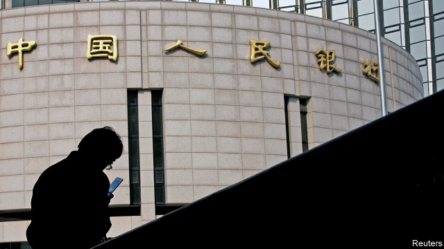
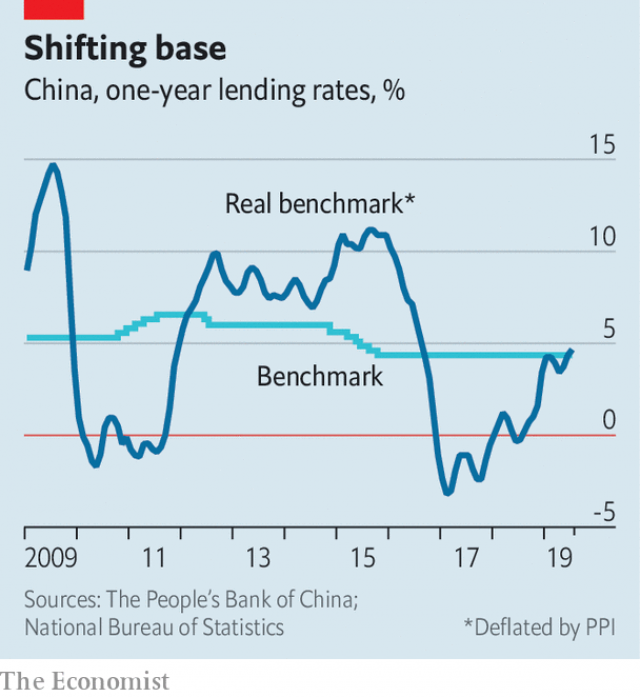

###### At any rate

# China’s interest-rate revamp highlights the slow march of reform 

 

> print-edition iconPrint edition | Finance and economics | Aug 22nd 2019 

FOR A CASE study in the complexity of transitions from central planning, consider the knotty mess that is China’s interest-rate system. More than 40 years after Mao Zedong died, the country is an economic superpower, yet it still struggles to manage bank lending using interest rates, rather than through heavy-handed interventions such as credit quotas. To make this shift, the central bank has created a dizzying array of instruments. S&P Global, a rating agency, counts 20 separate monetary-policy tools in China, from newfangled liquidity-injection facilities to old-fashioned instructions to banks; America, by contrast, has just six main instruments. 

Now China has modernised its arsenal with a new benchmark interest rate, unveiled on August 16th. The Loan Prime Rate (LPR), as it is known, will become the reference rate for banks pricing corporate loans. Announced monthly, it will be the average of what 18 designated commercial banks charge their best corporate clients, expressed as a spread over the banks’ own cost of borrowing from the central bank. 

In theory this should make Chinese lending rates more responsive to financial conditions. Under the previous system, banks priced loans from a one-year lending rate set by the central bank. It has refrained from changing that rate since 2015, concerned, in part, that investors would over-react. It does, however, regularly tweak liquidity levels, and has bemoaned the fact that its cautious easing in recent months has not translated into lower borrowing costs in the private sector. 

For industrial firms real (ie, inflation-adjusted) interest rates have instead climbed from an average of less than 1% last year to more than 4% this year (see chart). Officials say the LPR will lessen the strain on companies. On August 20th, the day it went into effect, the rate was set a tenth of a percentage point below the previous benchmark, a marginal cut. 

 

Nevertheless, it would be a mistake to view the LPR as a silver bullet, either for monetary easing or for China’s longer-term project of interest-rate reform. When banks are concerned about the economic outlook, as many increasingly are, they can simply demand higher risk premiums over the benchmark from their borrowers. 

There is no getting round the fact that China must do more if it wants to embolden its lenders. The central bank would need to cut their funding costs sharply, but it is reluctant to do so, worried about whipping investors into a speculative frenzy. The government would need to expand its fiscal stimulus, but it is worried about adding fuel to China’s debt problem. 

As for the redesign of Chinese monetary policy, there is still much to do. The central bank formally answers to the State Council. Any big changes in interest rates are thus political decisions, not purely economic ones (although a cynic might say the same is true in America, Yi Gang, governor of the People’s Bank of China, faces umpteen more constraints than Jerome Powell of the Federal Reserve). Moreover, the LPR makes China’s monetary-policy toolkit more cluttered. Banks have been told that for the time being the new benchmark will not apply to mortgages. It will thus be possible for China to cut rates for companies but not for homebuyers. After all these years, Chinese planners remain reluctant to cede too much power to the market.■ 
<<<<<<< HEAD

-- 

 单词注释:

1.revamp[ri:'væmp]:vt. 换新鞋面, 修理, 修补, 修改 [经] 整修, 补, 修改 

2.Aug[]:abbr. 八月（August） 

3.complexity[kәm'pleksiti]:n. 复杂, 复杂性, 复杂的事物 

4.transition[træn'ziʃәn]:n. 转变, 转换, 变迁, 过渡时期, 临时转调 [化] 跃迁 

5.knotty['nɒti]:a. 有结的, 多节的, 多瘤的, 棘手的 

6.superpower[.sju:pә'pauә]:n. 超级强权, 超级大国 [经] 超级大国 

7.intervention[.intә'venʃәn]:n. 插入, 介入, 调停 [经] 干预 

8.quota['kwәutә]:n. 配额, 限额 [化] 定额 

9.array[ә'rei]:n. 排列, 衣服, 大批, 军队 vt. 布署, 打扮, 排列 [计] 数组; 阵列 

10.newfangled['nju:fæŋgld]:a. 新奇的, 最新式的, 最新流行的 

11.modernise['mɔdәnaiz]:vt.vi. (使)现代化, (使)适应现代需要 vi. 用现代方法 

12.arsenal['ɑ:snәl]:n. 兵工厂, 军械库 [机] 兵工厂 

13.benchmark[]:[计] 基准程序; 基准 

14.unveil[.ʌn'veil]:vt. 揭开, 揭幕, 除去...的面纱 vi. 显露, 除去面纱 

15.lpr[]:abbr. lymphoproliferation 淋巴组织增生 

16.corporate['kɒ:pәrit]:a. 社团的, 合伙的, 公司的 [经] 团体的, 法人的, 社团的 

17.designate['dezigneit]:vt. 指定, 指明, 称呼 a. 已选出而未上任的 

18.client['klaiәnt]:n. 客户, 顾客, 委托人 [计] 客户, 客户机, 客户机程序 

19.responsive[ri'spɒnsiv]:a. 回答的, 应答的, 易感应的 

20.refrain[ri'frein]:n. 重复的话, 叠句, 副歌 vi. 节制, 避免, 克制 

21.investor[in'vestә]:n. 投资者 [经] 投资者 

22.tweak[twi:k]:n. 拧, 扭, 焦急 vt. 扭, 开足马力 

23.liquidity[li'kwiditi]:n. 流动性, 流畅 [经] 流动性 

24.bemoan[bi'mәun]:vt. 哀悼, 惋惜, 认为遗憾, 哀叹 

25.sector['sektә]:n. 扇形, 部门, 部分, 函数尺, 象限仪, 段, 区段 vt. 把...分成扇形 [计] 扇面; 扇区; 段; 区段 

26.les[lei]:abbr. 发射脱离系统（Launch Escape System） 

27.marginal['mɑ:dʒinәl]:a. 边缘的, 最低限度的, 有旁注的 [医] 缘的 

28.monetary['mʌnitәri]:a. 货币的, 金钱的 [经] 货币的, 金融的 

29.premium['pri:miәm]:n. 额外补贴, 奖金, 奖赏, 保险费 [医] 保险费 

30.borrower['bɒrәuә]:n. 借用人, 剽窃者 [经] 借款人, 借用人 

31.embolden[im'bәuldn]:vt. 使大胆, 使有胆量 

32.lender['lendә]:n. 出借人, 贷方 [经] 出借者, 贷方, 贷款人 

33.speculative['spekjuleitiv]:a. 思索性的, 投机的, 推测的 [经] 投机的, 冒险的 

34.frenzy['frenzi]:n. 疯狂, 狂暴, 狂怒 [医] 暴怒, 狂乱 

35.fiscal['fiskәl]:a. 财政的, 国库的 [经] 财政上的, 会计的, 国库的 

36.stimulus['stimjulәs]:n. 刺激, 激励, 刺激品 [医] 刺激特, 刺激 

37.redesign[,ri:di'zain]:[化] 重新设计 

38.formally['fɒ:mәli]:adv. 正式地, 形式上 

39.cynic['sinik]:n. 犬儒学派的人, 玩世不恭的人, 愤世嫉俗者, 好挖苦人的人 a. 犬儒学派的 

40.yi[ji:]:n. 彝人；彝语 

41.umpteen[.ʌmp'ti:n]:a. 无数的 

42.constraint[kәn'streint]:n. 强制, 约束 [计] 约束 

43.jerome[dʒә'rәum]:n. 杰罗姆（男子名） 

44.powell['pәuәl, 'pauәl]:n. 鲍威尔（英国物理学家） 

45.toolkit[]:[计] 工具包 

46.clutter['klʌtә]:n. 杂乱 vt. 弄乱, 使凌乱 

47.mortgage['mɒ:gidʒ]:n. 抵押, 约束性义务, 抵押借款 vt. 抵押, 以...作担保, 把...许给 

48.homebuyer[ˈhəʊmbaɪə(r)]:n. 购房者 

49.planner['plænә]:n. 计划者, 设计者, 安排者 [机] 刨床机 

50.cede[si:d]:vt. 割让 [法] 割让, 让与, 放弃 
=======
>>>>>>> 50f1fbac684ef65c788c2c3b1cb359dd2a904378

