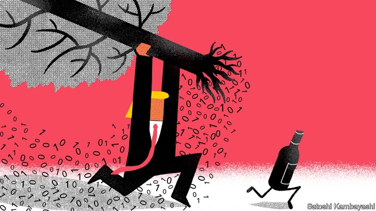

###### Digital services tax

# France is giving unilateralism a go 

 

> print-edition iconPrint edition | Finance and economics | Aug 22nd 2019 

“DON’T TAX you, don’t tax me, tax that fellow behind the tree.” Historically, this rhyme has poked fun at the tax-shy American public. Today it reflects complaints against the French government, which on July 25th introduced a tax on digital services. American companies such as Amazon, Facebook and Google are protesting that they are being treated like the fellow behind the tree. President Donald Trump is itching to hit back. Unilateralism is a language he can understand. 

At the heart of the dispute lies a mismatch between where companies make their profits and where those profits are booked for tax purposes. Governments wail that as data and ideas can zip across borders, taxable profits can slip between their tax-collectors’ fingers. The solution requires international co-ordination, to avoid everyone trying to tax the same stuff at once. But negotiations overseen by the OECD, a club of mostly rich countries, are taking too long for the French. 

Hence their levy of 3% on the revenues generated from French users of online platforms and digital advertising. The tax is blunt, but that is part of the point. It is meant as an interim measure, to be ditched once an international agreement is reached. It could even make a deal more likely. Affected companies may prefer that to unilateral taxes, and lobby for it. 

Not surprisingly, the Trump administration has taken umbrage. It has begun an investigation into the French tax under Section 301 of the Trade Act of 1974 (the same law by which it justifies tariffs on China). On August 19th eight officials heard the companies’ formal complaints. “We cannot absorb this expense,” claimed Amazon’s representative. 

No one likes new taxes, of course. But the companies do have a point. International trade rules are supposed to stop governments treating foreign companies differently from their own. And the French seem to have singled out America’s big technology firms. The tax will only hit companies with at least €750m ($830m) in global revenue from the relevant digital services and at least €25m derived from French users. Those thresholds conveniently exclude most French companies. Further clues lie in the French nickname for the levy, “the GAFA tax”—a reference to Google, Apple, Facebook and Amazon. 

The French appear to have defined the taxed services selectively too. Subscription-based digital services are spared, along with crowdfunding websites and digital payment services. More broadly, Hosuk Lee Makiyama of the European Centre for International Political Economy, a think-tank in Brussels, notes the inconsistency of the French position. France is keen to grab a slice of America’s digitally derived corporate profits, but is loth to agree to new rules that would allow the Chinese tax authorities to share in the spoils from French-owned luxury brands. 

The administration seems almost certain to end up finding fault with the French. America could then complain to the World Trade Organisation. But Mr Trump is more likely to fight unilateralism with unilateralism, by raising taxes on French individuals or firms, or by imposing tariffs. The president appears particularly keen to raise duties on French wine. 

If this happens, free-traders will surely grumble that Mr Trump has again chosen commercial conflict over co-operation. But the irony is that behind closed doors, his officials had been acting constructively in the multilateral talks at the OECD. Whereas Barack Obama’s administration had resisted further reforms, particularly those that could affect America’s technology companies, Steven Mnuchin, Mr Trump’s treasury secretary, was much more open to them. 

It may seem that the French are giving Mr Trump a taste of his own medicine—using unilateral action to put pressure on a negotiating partner. But they may have made tricky discussions more difficult. Admittedly, Mr Mnuchin might not have been able to get Mr Trump’s approval for any OECD reform. But now the dispute is playing out on the presidential Twitter feed. And for once, Mr Trump will be able to deny that he started it. ■ 
<<<<<<< HEAD

-- 

 单词注释:

1.unilateralism[.ju:ni'lætәrәlizm]:n. 单方面政策(的实行), 单方面裁军 

2.Aug[]:abbr. 八月（August） 

3.historically[his'tɔrikәli]:adv. 历史上地；从历史观点上说 

4.amazon['æmәzɒn]:n. 亚马孙河 [医] 无乳腺者 

5.facebook[]:n. 脸谱网 

6.google[]:谷歌；搜索引擎技术；谷歌公司 

7.itch[itʃ]:n. 痒, 渴望, 疥疮 vi. 发痒, 渴望 

8.unilateralism[.ju:ni'lætәrәlizm]:n. 单方面政策(的实行), 单方面裁军 

9.mismatch[mis'mætʃ]:n. 错配 vt. 错配, 使...成不相配的婚姻 

10.wail[weil]:n. 恸哭, 哀号, 嚎啕, 呼啸(声) vi. 恸哭, 呼啸, 悲叹, 哀号, 嚎啕 

11.datum['deitәm]:n. 论据, 材料, 资料, 已知数 [医] 材料, 资料, 论据 

12.taxable['tæksәbl]:a. 可征税的, 应征税的 [经] 可征税的, 应纳税的 

13.negotiation[ni.gәuʃi'eiʃәn]:n. 谈判, 磋商, 交涉 [经] 谈判, 协商 

14.oversee[.әuvә'si:]:vt. 向下看, 了望, 监督, 偷看到 [法] 监察, 监督, 俯瞰 

15.Oecd[]:[经] 已开发国家组织 

16.levy['levi]:n. 税款, 所征的人数, 征收 vi. 征税, 课税 vt. 征收, 强求, 召集 

17.online[]:[计] 联机 

18.advertising['ædvәtaiziŋ]:n. 广告业, 广告 a. 广告的 [计] 发广告 

19.blunt[blʌnt]:a. 钝的, 坦率的, 麻痹的 

20.interim['intәrim]:a. 暂时的, 临时的, 间歇的 n. 过渡时期 

21.unilateral[.ju:ni'lætәrәl]:a. 单方面的, 单边的, 片面的 [医] 单侧的, 一侧的 

22.lobby['lɒbi]:n. 大厅, 休息室, 游说议员者 vi. 游说议员, 游说 vt. 游说 

23.umbrage['ʌmbridʒ]:n. 不快, 生气, 阴影, 树荫, 怀疑等模糊感觉 

24.tariff['tærif]:n. 关税, 关税表, 价格表, 收费表 vt. 课以关税 [计] 价目表 

25.cannot['kænɒt]:aux. 无法, 不能 

26.differently['difrentli]:adv. 差异, 不同, 各别, 各种 

27.threshold['θreʃәuld]:n. 门槛, 入口, 开端, 阈 [计] 阈; 阈值 

28.conveniently[]:a. 方便, 合宜 

29.nickname['nikneim]:n. 绰号, 昵称 vt. 给...取绰号, 叫错名字 [计] 绰号 

30.gafa[]:[网络] 广州美术学院(Guangzhou Academy of Fine Arts)；国际园艺博览会；牛奶咖啡 

31.selectively[]:adv. 有选择地 

32.crowdfunding[kraʊd'fʌndɪŋ]:n. 众筹 [网络] 群众集资；网路集资；集资模式 

33.broadly['brɒ:dli]:adv. 宽广地, 明白地, 无礼貌地 

34.lee[li:]:n. 背风处, 避风处, 下风处, 保护, 庇护 a. 避风的, 背风的, 下风的, 保护的 

35.Brussel[]:n. 布鲁塞尔（比利时首都） 

36.inconsistency[.inkәn'sistәnsi]:n. 不一致, 易变, 前后矛盾的事物 [法] 前后矛盾, 不一致 

37.grab[græb]:n. 抓握, 掠夺, 强占, 东方沿岸帆船 vi. 抓取, 抢去 vt. 攫取, 捕获, 霸占 

38.digitally[]:adv. 数位 

39.corporate['kɒ:pәrit]:a. 社团的, 合伙的, 公司的 [经] 团体的, 法人的, 社团的 

40.loth[lәuθ]:a. 不愿意的, 厌恶的 

41.organisation[,ɔ: ^әnaizeiʃən; - ni'z-]:n. 组织, 团体, 体制, 编制 

42.grumble['grʌmbl]:n. 怨言, 满腹牢骚 vi. 抱怨, 发牢骚, 发隆隆声 vt. 抱怨 

43.irony['aiәrәni]:n. 反语, 讽刺, 具有讽刺意味的事 

44.constructively[]:adv. 建设性地 

45.multilateral[.mʌlti'lætәrәl]:a. 多边的, 多国的 [经] 多边的, 涉及多方的 

46.barack[bɑ:'ræk]:n. 巴拉克（男子名） 

47.steven['sti:vn]:n. 史蒂文（男子名） 

48.treasury['treʒәri]:n. 国库, 宝库, 财政部, 国库券 [经] 库存, 国库, 金库 

49.tricky['triki]:a. 狡猾的, 机敏的 

50.admittedly[әd'mitidli]:adv. 公认地, 诚然 

51.presidential[.prezi'denʃәl]:a. 总统制的, 总统的, 首长的, 统辖的 [法] 总统的, 议长的, 总经理的 

52.twitter['twitә]:n. 啁啾, 唧唧喳喳声 vi. 啭, 啁啾, 颤抖 vt. 嘁嘁喳喳地讲, 抖动 
=======
>>>>>>> 50f1fbac684ef65c788c2c3b1cb359dd2a904378

