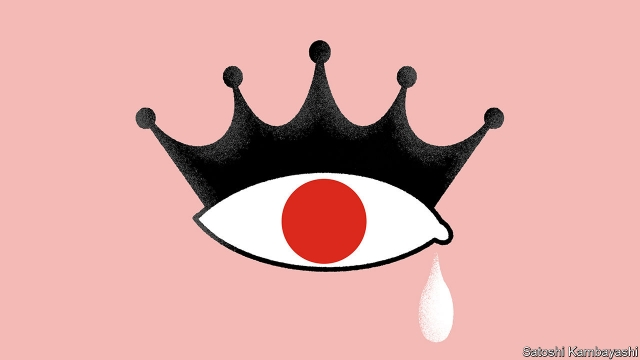

###### Buttonwood

# The Japanification of bond markets 

 

> print-edition iconPrint edition | Finance and economics | Aug 22nd 2019 

IN THE 1920S E.M. Forster, an English novelist, set out the difference between a story and a plot. “The king died and then the queen died” is a story, he wrote. But a sense of causality is needed to make a plot more than just a sequence of events. “The king died and then the queen died of grief” is a plot. 

Investors like stories as much as anyone. They like plots even more. A durable narrative, and one that is on everybody’s lips once again, is “Japanification”. A Forsterian summary might read: “The bubble burst, people became cautious and the economy got stuck in too low a gear to stop prices and interest rates from falling.” In its strongest form Japanification is a pure tragedy, in which rich, debt-ridden economies are destined to follow the path set by Japan. In another, softer version only countries with rapidly ageing workforces, such as Germany, are thus fated. 

Germany’s bond market is now priced for endless stagnation. Its interest rates are negative on everything from overnight deposits to 30-year bonds. But it is striking how depressed bond yields are in countries with only a passing resemblance to Japan. A 30-year American Treasury yields just 2%, for instance. As currently scripted, Japanification is narrowly defined but broadly applied. It is the fear that policymakers have lost for good their ability to gin up the economy. A big question is whether the current situation is just one act in an unfolding drama, or where the story ends. 

Japan’s experience was the trailer for all this. When its ten-year bond yields fell below 2% in 1998, there was a lot of head-scratching, says Peter Tasker, a seasoned analyst of Japan’s economy. At the time, Japan’s government had a huge budget deficit. For its long-term interest rates to fall made little sense. Hedge funds began to short Japanese government bonds (a lossmaking trade that became known as the “widowmaker”). But the country’s consumer prices kept drifting lower. And so did its interest rates. 

Ever since, Japanification has been a fear that is alternately raised and dismissed. In November 2002 Ben Bernanke, then a governor of the Federal Reserve, gave a famous it-can’t-happen-here speech about Japan. The lessons drawn from Japan’s failures were: own up to bad debts; fix the banks; use policy tools to spur the economy; don’t let asset prices collapse. After the 2008 crisis, some of these lessons were applied, if unevenly. A decade on, Japanification is back. People continue to be astonished by how far long-term interest rates can fall, just as they were earlier in Japan. And the declines have been broadly felt. In Australia, which has a young population and has not suffered a recession in a quarter-century, ten-year bond yields are below 1%. 

The cause of all this is renewed concern about global stagnation. A synchronised pickup in the world economy in 2017 has turned to synchronised slowdown. Central banks, including the Fed, are cutting interest rates. But there is more to it than that. With short-term interest rates already so low, there are grave doubts that central banks have the power to get the economy back on track. You see this pessimism in forecasts of medium-term inflation derived from the swaps market, which are markedly lower than they were earlier this year. “The problem with being Japan is that if you get an economic shock, monetary policy has nowhere to go,” says Steve Englander of Standard Chartered, a bank. Europe has already reached this point. 

There is an alternative script. In this version today’s Japanification spurs a response that leads to its defeat. If monetary policy has run out of road, there is always fiscal policy. If the economy lacks demand, governments can help to fill it by borrowing cheaply to cut taxes and raise spending. The politics are not there yet, but the Japanification of bond markets will move things along. “Before there is a consensus on a shift in policy, you need to see the downside risks [to the economy] clearly,” says Mr Englander. Once that shift takes place, the fear of stagnation recedes. 

The political response to the threat of stagnation is likely to be more radical than it was in Japan, says Mr Tasker. The tricky part for bond investors is guessing how long this takes. There are already stirrings of a rethink in Germany, a country hostile to fiscal stimulus. For now, these are only stirrings. Bond yields may languish for a while, before they rise in anticipation of fiscal stimulus. But the queen need not die of grief. After a period of mourning, she may find happiness again. The plot thickens.■ 

-- 

 单词注释:

1.buttonwood['bʌtnwʊd]: 美洲悬铃木 

2.Japanification[]:[网络] 日本化；哈日族；日本的经济传染病 

3.Aug[]:abbr. 八月（August） 

4.EM[em]:[计] 媒体用毕符 [化] 射气 

5.Forster['fɔ:stә]:福斯特(姓氏) 

6.causality[kɒ:'zæliti]:n. 因果关系 [化] 因果性 

7.grief[gri:f]:n. 伤心, 忧愁, 悲痛, 不幸, 灾难 

8.investor[in'vestә]:n. 投资者 [经] 投资者 

9.narrative['nærәtiv]:n. 叙述, 故事 a. 叙述的, 叙事的, 故事体的 

10.Forsterian[]:[网络] 福斯特人 

11.destine['destin]:vt. 注定, 预定 

12.stagnation[stæg'neiʃәn]:n. 淤塞, 停滞 [医] 停滞, 滞留, 郁积 

13.resemblance[ri'zemblәns]:n. 相似处, 类似, 肖像 

14.treasury['treʒәri]:n. 国库, 宝库, 财政部, 国库券 [经] 库存, 国库, 金库 

15.currently['kʌrәntli]:adv. 现在, 当前, 一般, 普通 [计] 当前 

16.script[skript]:n. 手迹, 手稿, 正本, 手写体 vt. 改编为演出本 [计] 手写体, 小型程序 

17.narrowly['nærәuli]:adv. 狭窄地, 严密地, 仔细地, 几乎不, 勉强地, 仅仅 

18.broadly['brɒ:dli]:adv. 宽广地, 明白地, 无礼貌地 

19.policymaker['pɔlisi.meikә]:n. 政策制定者；决策人 

20.gin[dʒin]:n. 杜松子酒, 轧棉机, 陷阱 vt. 轧棉, 用陷阱捕 

21.trailer['treilә]:n. 追踪者, 拖车 [电] 拖车 

22.peter['pi:tә]:vi. 逐渐消失, 逐渐减少 

23.tasker[]: [人名] [英格兰人姓氏] 塔斯克职业名称, 计件工, 来源于盎格鲁诺曼底法语, 含义是“任务”(task)+er; [地名] [尼日尔] 塔斯凯尔 

24.analyst['ænәlist]:n. 分析者, 精神分析学家 [化] 分析员; 化验员 

25.deficit['defisit]:n. 赤字, 不足额 [医] 短缺 

26.lossmaking['lɔs,meikiŋ;'lɔ:s-]:a. <英>老是亏损的 

27.widowmaker[]: 射孔枪；凿岩机 

28.alternately['ɒ:ltәnәtli]:adv. 交替地, 间隔地 

29.ben[ben]:n. 内室 [医] 贝昂(俗名,一般指辣木Moringa oleifera,有时也指一些不同属的植物) 

30.bernanke[]:n. 伯南克（姓氏） 

31.asset['æset]:n. 资产, 有益的东西 

32.unevenly[]:adv. 不平坦地；不均衡地；不平行地 

33.recession[ri'seʃәn]:n. 后退, 凹处, 衰退, 归还 [医] 退缩 

34.synchronise['siŋkrәnaiz, 'sin-]:vi. (使)同时发生, (使)整步, (使)同步, (使)同速进行 vt. 使在时间上一致, 校准, 把钟表拨至相同的时间, 把...并列对照 

35.pickup['pikʌp]:n. 拾起, 加速, 刺激, 猎物的收集, 好转, 恢复健康, 搭车者, 兴奋剂, 电视摄像 [电] 拾音器 

36.slowdown['slәudaun]:n. 降低速度, 减速 

37.pessimism['pesimizm]:n. 悲观, 悲观情绪, 悲观主义 [医] 悲观主义 

38.inflation[in'fleiʃәn]:n. 胀大, 夸张, 通货膨胀 [化] 充气吹胀; 膨胀 

39.markedly['mɑ:kidli]:adv. 显著地, 醒目地, 明显地 

40.monetary['mʌnitәri]:a. 货币的, 金钱的 [经] 货币的, 金融的 

41.steve[]:n. 史蒂夫（男子名） 

42.englander['iŋ^lәndә(r)]:n. 英国人；英格兰人 

43.charter['tʃɑ:tә]:n. 特许状, 执照, 宪章 vt. 特许, 发给特许执照 

44.alway['ɔ:lwei]:adv. 永远；总是（等于always） 

45.fiscal['fiskәl]:a. 财政的, 国库的 [经] 财政上的, 会计的, 国库的 

46.cheaply['tʃipli]:adv. 便宜地 

47.politic['pɒlitik]:a. 精明的, 明智的, 策略的 

48.downside['daunsaid]:n. 底侧；下降趋势 

49.recede[ri'si:d]:vi. 向后退, 退却, 收回, 降低, 减弱 [医] 退缩 

50.tricky['triki]:a. 狡猾的, 机敏的 

51.stirring['stә:riŋ]:a. 活跃的, 忙碌的, 激动人心的 [化] 调和; 搅拌 

52.rethink[ri:'θiŋk]:v. 再想, 重想 

53.stimulus['stimjulәs]:n. 刺激, 激励, 刺激品 [医] 刺激特, 刺激 

54.languish['læŋgwiʃ]:vi. 憔悴, 凋萎, 苦思 

55.anticipation[æn.tisi'peiʃәn]:n. 预期, 预料 [医] 提前出现(如遗传病) 

