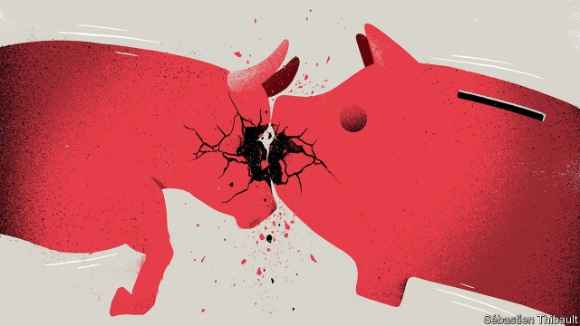

###### Free exchange

# The onset of a downturn is as much a matter of mood as of money 

 

> print-edition iconPrint edition | Finance and economics | Aug 22nd 2019 

IN RECENT WEEKS the human and silicon brains at Google have registered an alarming rise in searches related to “recession”. It is easily explained. As markets gyrate, talk in the press (including this very column) turns to the risk of a slump. Even so, the stories must leave some Googlers baffled. In July, after all, the American economy added 164,000 jobs and retail sales kept climbing. President Donald Trump, too, is bemused. He has taken to warning darkly that conspirators are attacking his presidency by frightening the economy into an unnecessary downturn. The claim of conspiracy is absurd, but the threat of recession is not. Recessions can indeed appear as if out of the blue. 

Today’s confusion owes something to the world’s odd recent economic history. The last global slump occurred amid an epic financial crisis. The one before that began nearly two decades ago, accompanied, again, by a stockmarket crash. (Between August 2000 and September 2001 the S&P 500 index fell by more than 30% and the NASDAQ by more than 60%. Now, by contrast, those indices are pretty much where they were a year ago.) Most people working today cannot remember a recession not linked to financial chaos. But downturns can occur without market meltdowns. Indeed, many economists think recessions need not occur at all. 

A recession is commonly taken to mean two or more consecutive quarters of falling output. More broadly, recessions happen when many economic variables—GDP, industrial production, employment and so on—flip from expansion to contraction. In their models, macroeconomists get such episodes going by introducing a “shock”: a random perturbation which knocks an economy off kilter. A sharp rise in oil prices might do the trick, or a financial panic, or a change in policy like a jump in interest rates or an austerity budget. Shocks can impose new constraints on firms and households by cutting off sources of credit or sales. Or they may force people to reconsider their plans—nudging them to shelve proposed investments until the dust raised by a shock settles. Shock-based explanations of recessions make intuitive sense. They allow people to say that x caused y: that unemployment rose because share prices fell, for instance. 

But economic causation is rarely so clear-cut. Higher interest rates hurt some people but leave others better off or unaffected. The failure of a large manufacturer creates pain for workers and shareholders but opportunities for rivals, who can hoover up displaced labour and capital. Not all shocks lead to recessions. When they do, it is often because something goes wrong with an economy’s ability to roll with the punches: spending falls somewhere but is not offset by increases elsewhere. Perhaps the creditors who benefit from higher interest rates park their windfalls in the safe haven of government bonds, rather than recycling them into job-creating expenditure. Housing investment in America began to subtract from GDP growth in the fourth quarter of 2005. But the economy did not fall into recession for two more years, when other sources of spending ceased to outweigh the housing drag. 

Recessions, then, are not just the after-effects of shocks, but periods when people and firms fail to use valuable resources as they become available. As demand slackens, bargains bloom in the form of cut-rate goods, willing and available workers, and appealingly priced assets. In the depths of a catastrophic financial crisis no one but Warren Buffett may have the guts and the means to spend more as others cut back. But most recessions are not associated with such calamities. The downturn of the early 1990s was an example of what Paul Krugman, a Nobel economics laureate, has called a “smorgasbord recession”, the product of a mix of troubles in modest portions. In these garden-variety slumps, people and firms with the capacity to spend more, who might normally leap at the chance to buy discounted goods or hire overqualified workers, instead allow their cash to pile up. 

At its heart this behaviour is a matter of mass psychology, or “animal spirits”, as John Maynard Keynes put it. Economies are great chains of earning and spending, held together by shared expectations that all will continue as normal. People spend their incomes freely, on everything from homes to haircuts, in the belief that their jobs will not disappear and their incomes wither. Consequently, builders and stylists have jobs and incomes from which they too can spend. Faith in economic expansion is self-fulfilling. But it is not invulnerable. Contagious pessimism can flip an economy from one equilibrium to another, in which cautious consumers spend less and hiring and investment fall accordingly, validating the initial outbreak of pessimism. Shocks can precipitate a switch in sentiment by weakening links in the great chain. But if the public is confident enough of the durability of an expansion then even a big shock may not halt it. Conversely, if the mood in markets and on Main Street is sour enough, even a modest nudge may push an economy into a slump. 

Over the past century, as governments assumed responsibility for preventing downturns, economic expansions grew longer and recessions became milder and less frequent. When drooping demand threatens an economy, governments and central banks use fiscal and monetary policy to deliver an offsetting rise in spending. But their commitment to fighting recessions also plays a psychological role. The credible promise to resist downturns gives markets confidence that the economy will keep up its strength. 

Confidence, though, is slippery. It may wane as interest rates fall, leaving central banks less room to jolt economies out of their pessimism, and as government policymakers fumble their fiscal tools. It may wilt in the face of leaders’ erratic and self-defeating behaviour. Recessions, to no small degree, are a state of mind. You don’t need a conspiracy theory to see that just now the world’s mood is troubled.■ 
<<<<<<< HEAD

-- 

 单词注释:

1.onset['ɒnset]:n. 开始, 攻击, 进攻 [医] 起始, 开始 

2.downturn['dauntә:n]:n. (尤指经济方面的)衰退, 下降趋势 [电] 低迷时期 

3.Aug[]:abbr. 八月（August） 

4.silicon['silikәn]:n. 硅 [化] 硅Si 

5.google[]:谷歌；搜索引擎技术；谷歌公司 

6.recession[ri'seʃәn]:n. 后退, 凹处, 衰退, 归还 [医] 退缩 

7.gyrate['dʒaireit]:a. 旋涡状的 vi. 旋转, 不停地转动 

8.slump[slʌmp]:n. 暴跌, 垂头弯腰的姿态 vi. 猛然掉落, 陷入, 衰落(经济等) 

9.googlers[]:[网络] 谷歌人；谷歌工程师 

10.baffle['bæfl]:vt. 困惑, 为难, 使挫折 vi. 徒作挣扎 n. 迷惑, 挡板 

11.bemuse[bi'mju:z]:vt. 使发呆 

12.darkly['dɑ:kli]:adv. 暗, 黑, 呈黑 

13.conspirator[kәn'spirәtә]:n. 同谋者, 阴谋者, 反叛者 [法] 共谋者, 阴谋家 

14.presidency['prezidәnsi]:n. 总统职权, 总裁职位 

15.conspiracy[kәn'spirәsi]:n. 同谋, 阴谋, 阴谋集团 [法] 阴谋, 通谋, 共谋 

16.amid[ә'mid]:prep. 在其间, 在其中 [经] 在...中 

17.epic['epik]:n. 史诗, 叙事诗 a. 史诗的, 叙事诗的 

18.stockmarket[s'tɒkmɑ:kɪt]: 证券市场; 证券交易所; 证券行情 

19.nasdaq['næz,dæk]:abbr. 全国证券交易商自动报价系统协会（National Association of Securities Dealers Automated Quotation） 

20.cannot['kænɒt]:aux. 无法, 不能 

21.chao[]:n. 钞（货币） 

22.meltdown['meltdaun]:[经] 销毁(货币等), 变卖(财产) 

23.economist[i:'kɒnәmist]:n. 经济学者, 经济家 [经] 经济学家 

24.consecutive[kәn'sekjutiv]:a. 连续的, 联贯的 [计] 连续的; 连接的 

25.broadly['brɒ:dli]:adv. 宽广地, 明白地, 无礼貌地 

26.contraction[kәn'trækʃәn]:n. 收缩, 缩写式, 害病 [医] 收缩; 挛缩; 牙弓内缩 

27.macroeconomist[,mækrəʊɪ'kɒnəmɪst]:n. 宏观经济学家 

28.perturbation[,pә:tә:'beiʃәn]:n. 不安, 扰乱, 紊乱, 烦扰 [化] 摄动; 微扰 

29.kilter['kiltә]:n. 良好状态, 顺利, 平衡 

30.austerity[ɒ'sterәti]:n. 朴素, 苦行, 严格, 严峻 

31.constraint[kәn'streint]:n. 强制, 约束 [计] 约束 

32.reconsider[.ri:kәn'sidә]:v. 再考虑, 重新考虑 

33.shelve[ʃelv]:vt. 放置架子上, 搁置 vi. 渐渐倾斜 

34.intuitive[in'tju:itiv]:a. 直觉的 

35.x[eks]:n. 未知数 [计] 交换, 变址, 索引, 传输 

36.causation[kɒ:'zeiʃәn]:n. 因果关系, 原因 [法] 因果律, 原因作用, 因果关系 

37.unaffected[.ʌnә'fektid]:a. 不矫揉造作的, 自然的, 未受影响的, 未被感动的 [经] 不受影响的 

38.shareholder['ʃєә.hәuldә]:n. 股东 [法] 股东, 股票持有人 

39.hoover['hu:vә]:n. 胡佛电动吸尘器 vi. 用真空吸尘器打扫 

40.displace[dis'pleis]:vt. 移置, 替换, 转移 

41.offset['ɒ:fset]:n. 抵消, 把...并列, 旁系, 支管, 用胶印法印 vt. 弥补, 抵消, 胶印 vi. 装支管 n. 偏移量 [计] 偏移量 

42.creditor['kreditә]:n. 债权人 [法] 债权人, 债主, 贷方 

43.windfall['windfɒ:l]:n. 被风吹落的果子, 横财 [经] 意外损失 

44.haven['heivn]:n. 港, 避难所, 安息所 vt. 安置...于港中, 庇护, 入港 

45.recycling[]:[电] 再循环 

46.outweigh[.aut'wei]:vt. 比...重, 比...重要, 比...有价值 

47.slacken['slækәn]:vt. 使松弛, 放松, 放慢 vi. 变松弛, 减弱, 松劲 

48.appealingly[]:adv. 有感染力, 吸引人, 有趣, 哀诉似, 恳求似 

49.asset['æset]:n. 资产, 有益的东西 

50.catastrophic[.kætә'strɒfik]:a. 悲惨的, 灾难的 

51.warren['wɒrәn]:n. 养兔场, 拥挤的地区 

52.buffett['bʌfit]: [人名] 巴菲特 

53.gut[gʌt]:n. 剧情, 内容, 内脏, 肚子, 海峡, 勇气 vt. 取出内脏, 毁坏...的内部 

54.calamity[kә'læmiti]:n. 灾难, 不幸事件 

55.paul[pɔ:l]:n. 保罗（男子名） 

56.krugman[]:n. [人名]克鲁格曼 

57.Nobel['nәubel]:n. 诺贝尔 

58.laureate['lɒ:riәt]:a. 戴桂冠的, 用月桂树枝编织成的, 荣誉的 n. 桂冠诗人 vt. 使戴桂冠 

59.smorgasbord['smɔ:^әsbɔ:d]:n. 瑞典式自助餐 

60.overqualify[]:[网络] 能力水准超越；能力水平超越 

61.john[dʒɔn]:n. 盥洗室, 厕所, 嫖客 

62.maynard['meinәd]:n. 梅纳德（男子名） 

63.wither['wiðә]:vt. 使凋谢, 使消亡, 使畏缩 vi. 枯萎, 衰退 

64.builder['bildә]:n. 建立者 [机] 组份 

65.stylist['stailist]:n. 文体学家, 时装设计师 

66.invulnerable[in'vʌlnәrәbl]:a. 不会受伤害的, 刀枪不入的, 无懈可击的, 无可反驳的 

67.contagious[kәn'teidʒәs]:a. 触染性的, 会蔓延的 [医] (接)触(传)染的 

68.pessimism['pesimizm]:n. 悲观, 悲观情绪, 悲观主义 [医] 悲观主义 

69.flip[flip]:vt. 掷, 弹, 轻击, 空翻 vi. 用指轻弹, 抽打, 蹦跳 n. 抛, 弹, 筋斗 a. 无礼的 [计] 翻转 

70.equilibrium[.i:kwi'libriәm]:n. 平衡, 平静, 均衡 [化] 平衡 

71.les[lei]:abbr. 发射脱离系统（Launch Escape System） 

72.validate['vælideit]:vt. 使有效, 使生效, 确认, 证实, 验证 [计] 验证 

73.outbreak['autbreik]:n. 爆发, 暴动 [医] 暴发 

74.precipitate[pri'sipiteit]:n. 沉淀物, 凝结物, 结果 vt. 猛抛, 使陷入, 促成, 使沉淀 vi. 猛地落下 a. 突然的, 猛地落下的, 轻率的 

75.sentiment['sentimәnt]:n. 感情, 感伤, 情操, 情绪, 感想, 意见 [医] 情感, 情操 

76.durability[,djuәrә'biliti]:[计] 耐久性, 耐用性, 持久性 

77.nudge[nʌdʒ]:n. 用肘轻推, 推动, 讨厌家伙 

78.droop[dru:p]:vi. 下垂, 消沉 vt. 使下垂 n. 低垂, 消沉 

79.fiscal['fiskәl]:a. 财政的, 国库的 [经] 财政上的, 会计的, 国库的 

80.monetary['mʌnitәri]:a. 货币的, 金钱的 [经] 货币的, 金融的 

81.credible['kredәbl]:a. 可信的, 可靠的 [法] 可信的, 可靠的 

82.wane[wein]:n. 减少, 衰微, 败落, 亏缺, 月亏 vi. 变小, 亏缺, 衰落, 消逝, 退潮 

83.jolt[dʒәult]:n. 震摇, 摇动, 颠簸 vi. 颠簸而行, 震摇 vt. 使颠簸, 使慌张, 猛击 

84.policymaker['pɔlisi.meikә]:n. 政策制定者；决策人 

85.fumble['fʌmbl]:n. 摸索, 笨拙的行动, 漏球 vt. 摸索, 乱摸, 笨拙的处理, 漏接(球) vi. 摸索, 笨手笨脚, 漏球 

86.wilt[wilt]:v. (使)枯萎, (使)衰弱, (使)畏缩 n. 枯萎, 衰弱, 憔悴 

87.erratic[i'rætik]:n. 古怪的人, 漂泊无定的人 a. 不稳定的, 奇怪的 
=======
>>>>>>> 50f1fbac684ef65c788c2c3b1cb359dd2a904378

