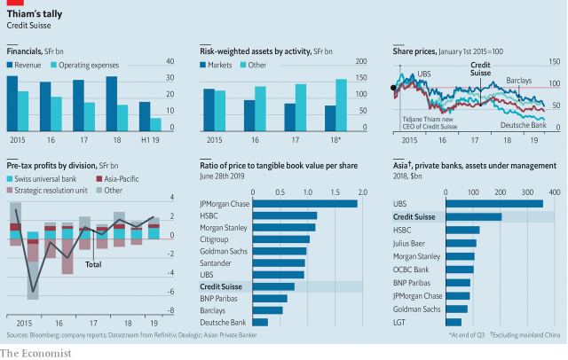

###### L’étranger

# Tidjane Thiam’s overhaul of Credit Suisse is paying off 

 

> print-edition iconPrint edition | Finance and economics | Aug 22nd 2019 

TIDJANE THIAM is not the first non-Swiss chief executive of Credit Suisse. His American predecessor, Brady Dougan, held the job for eight years. But Mr Dougan was an insider, having been at the firm for ages. Mr Thiam was anything but. A citizen of France and Ivory Coast, where he was a government minister in the late 1990s, he had been a consultant at McKinsey and had overseen the European arm of Aviva and the whole of Prudential, two British insurers. Before taking the top job at Credit Suisse in 2015, he had never even worked for a bank. Charming in person and intimidating and forceful by reputation, Mr Thiam walked straight into a tempest. 

From the start he knew that Credit Suisse’s defences against disaster were uncomfortably thin. Its common equity tier 1 capital covered just 10.3% of risk-weighted assets (RWAs), less than at any of its peers. To bolster them Mr Thiam quickly raised SFr6bn ($6.3bn) in equity. Unleashing his inner consultant, he set about reorganising the bank’s structure, steering it towards wealth management and away from the riskier whirlpools of investment banking. Mr Thiam promised deep cost cuts from the start, when, he now says, “there is the greatest willingness to change and no ‘restructuring fatigue’”. 

But within months a nightmare had unfolded. In the last quarter of 2015 Credit Suisse made a stonking net loss of SFr6.4bn, as it wrote down the value of its investment bank and was buffeted by trading losses. More cash glugged away when the bank settled American charges that it had mis-sold residential mortgage-backed securities a decade before. Another share sale, raising SFr4bn, ensued in 2017. With a mild whiff of desperation, Mr Thiam even proposed floating Credit Suisse’s sturdy domestic bank, an idea he later ditched. 

The firm’s shares—and presumably Mr Thiam—still bear the imprint of those rights issues and write-downs. Their price is half what it was when Mr Thiam took over, and about 70% of tangible book value. The bank is still not free of legal and ethical shadows: it is being sued over loans in Mozambique before his time (see article). 

Nevertheless, Mr Thiam has survived and now argues the worst is over. The restructuring programme was completed last year. The “strategic resolution unit” (SRU) housing dud assets, which once held a quarter of RWAs, has been closed. In the latest quarter the firm’s return on tangible equity (RoTE) climbed to 9.7%, roughly what investors regard as par for banks. Many European banks struggle to do as well (although Credit Suisse’s bigger neighbour, UBS, which shifted its weight from investment banking to wealth management a few years earlier, rang up 11.9%). The question now is whether the restyled Credit Suisse can progress from mere stability towards higher profitability and growth. 

Mr Thiam may have studied engineering in Paris, but instead of elegant simplicity he opted for an unusual, complex and asymmetrical structure for the firm, based around five divisions. One houses a Swiss universal bank. Another contains all the Asian businesses. Three functional divisions cover the rest of the world—wealth management, investment banking and global markets (trading). 

In total, markets-related activities accounted for half of RWAs in 2015. Now their share is just one-third. Reckoning that banks’ sales and trading revenues would stagnate, thanks to overcapacity and technological advance, Mr Thiam chose “not to be all things to all people and to have very low costs”. Growth would come instead from managing the assets of rich people—especially the very rich indeed. The trading platform would still be needed, but at a size to serve those clients. 

He borrows a parallel from his former trade. Insurers prefer policies with repeated premiums to one-offs. Revenues from managing the assets of the wealthy, Mr Thiam says, recur like the former, because once clients place money with you, then, if you look after them, they tend to stay; trading revenues come and go like single premiums. Net new assets in wealth management in all territories have been growing at about 5% a year, and profits at 15%. 

Mr Thiam’s aim to be “the bank for entrepreneurs”—both while they are making money and once they have made it—is the rationale for the dedicated division for Asia, which is minting billionaires fast. If you are a tycoon whose personal and business finances are intertwined, you might want to sell shares in your firm and invest the proceeds: why should you face the hassle of dealing with different parts of the firm? Being joined up works: about half of wealth-management inflows in Asia, Mr Thiam says, come from referrals by local investment bankers. 

He had also bet on Asia at Prudential, trying to buy AIA, a big regional life insurer. But that was predicated on the growing mass of the region’s middle class. At Credit Suisse, he is after the truly rich. In Asia’s fragmented wealth-management market, Credit Suisse’s SFr219bn of assets, or a 12% share, ranks a healthy second, according to Magdalena Stoklosa of Morgan Stanley. UBS leads the pack. 

 

Asia still accounts for just one-sixth of revenue and pre-tax profits. After decades of globetrotting, the anchor of the firm remains reliable Switzerland, which yields fully half of profits. The integrated Swiss bank reflects the same reasoning about entrepreneurs as in Asia, but in an economy with several generations’ start. Two-thirds of total growth in assets under management in the past three years, Mr Thiam says, has come from existing clients, which are also more profitable than new ones. 

Yet with wealth on the up and trading in retreat, revenue growth has been sluggish. Profits have risen mainly because costs have been cut. Operating costs have been slashed by 18% in four years. Rather than shave budgets across the board, Mr Thiam canned whole activities, such as private banking in America. “Cost cuts have to be binary,” he says. Then fixed expenses, such as floor space and computer systems, can be got rid of. He has also become stricter about spending on contractors and consultants, bringing some in-house. Rather than worry about the ratio of cost to income, a standard gauge of efficiency, he sets absolute targets, so that increases in revenue go to profit rather than being spent. Budgets are still scrutinised in weekly meetings. 

Though an outsider, Mr Thiam has relied mainly on insiders. He brought in Pierre-Olivier Bouée, the chief operating officer, a colleague at McKinsey and Aviva and his chief risk officer at Prudential, and Adam Gishen, the head of investor relations and communications, who advised him at the Pru. But he has mainly promoted from within, having decided that Credit Suisse already contained the right people, even if they were a rung or two from the top. The chief financial officer, David Mathers, has been in his job since 2010. That is unusual; incoming bosses at other troubled banks have swept away more senior people. One internal success, however, has turned sour: Iqbal Khan, the head of international wealth-management, left abruptly in July. 

With its time in purgatory seemingly over, Credit Suisse is aiming to push its RoTE into double figures. Market conditions permitting, it aimed to breach 10% this year, but that now looks a stretch. With global interest rates falling, trade wars raging and markets jittery, the months ahead may be tricky for banks and wealth managers everywhere. 

After four years, Mr Thiam is an outsider no more. Running one of Europe’s banks is a hazardous occupation: ask John Cryan, sacked after less than three years at Deutsche Bank in 2018, or John Flint, ousted from HSBC this month, after 30 years at the bank but a mere year and a half in the hot seat. Mr Thiam says he wants to become a Swiss citizen in due course. He was recently elected to the International Olympic Committee, based in Lausanne. Perhaps he will stay a while yet.■ 
<<<<<<< HEAD

-- 

 单词注释:

1.Tidjane[]:提贾尼 

2.overhaul[.әuvә'hɒ:l]:vt. 分解检查, 翻修, 精细检查, 彻底革新 n. 分解检查, 精细检查, 大检修 

3.Suisse[swi:s]:<法> = Switzerland 

4.Aug[]:abbr. 八月（August） 

5.Tidjane[]:提贾尼 

6.thiam[]:[网络] 蒂亚姆；添；忝 

7.predecessor[.predi'sesә]:n. 前任, 先辈, 前身 [医] 初牙, 前辈, 祖先 

8.Brady[]:[经] 布莱迪 

9.dougan[]: [人名] [苏格兰人、爱尔兰人姓氏] 杜根 Duggan的变体 

10.insider['in'saidә]:n. 内部的人, 权威人士, 知道内情的人 [经] 熟悉内情者 

11.thiam[]:[网络] 蒂亚姆；添；忝 

12.ivory['aivәri]:n. 象牙, 乳白色 a. 象牙制的, 乳白色的 

13.McKinsey[]:n. 麦肯锡（公司） 

14.oversee[.әuvә'si:]:vt. 向下看, 了望, 监督, 偷看到 [法] 监察, 监督, 俯瞰 

15.aviva[ə'vi:və]:n. 阿维娃（女子名） 

16.prudential[pru:'denʃәl]:a. 审慎的, 精明的, 起咨询作用的 

17.insurer[in'ʃuәrә]:n. 保险公司 [法] 保险人, 承保人, 保险公司 

18.charm[tʃɑ:m]:n. 吸引力, 魔力, 符咒 vt. 迷住, 使陶醉, 行魔法 vi. 用符咒, 有魅力 

19.forceful['fɒ:sful]:a. 有力的, 强烈的, 有说服力的 

20.tempest['tempist]:n. 暴风雨, 骚动 vt. 使受大风暴影响, 使骚动, 使激动 

21.uncomfortably[ʌnˈkʌmftəbli]:adv. 不舒适地, 不自在地, 令人不快地 

22.equity['ekwiti]:n. 公平, 公正 [经] 权益, 产权 

23.tier[tiә]:n. 排, 层, 等级 

24.asset['æset]:n. 资产, 有益的东西 

25.les[lei]:abbr. 发射脱离系统（Launch Escape System） 

26.peer[piә]:n. 同等的人, 匹敌, 贵族 vi. 凝视, 窥视, 费力地看, 隐现 vt. 与...同等, 封为贵族 

27.bolster['bәulstә]:n. 支持, 长枕 vt. 支持, 支撑 

28.quickly['kwikli]:adv. 很快地 

29.unleash[.ʌn'li:ʃ]:vt. 解开...的皮带, 发出, 发动 

30.reorganise[]:vi.vt. 改组, 改革, 整顿, 整编, 改编 

31.risky['riski]:a. 危险的 

32.whirlpool['hwә:lpu:l]:n. 漩涡, 涡流 [化] 涡流 

33.nightmare['naitmєә]:n. 梦魇, 恶梦, 可怕的事物(或情景、人物) [医] 梦魇, 恶梦 

34.stonk[stɒŋk]:n. 猛烈炮击 

35.glug[^lʌ^]:<口>vi.发汩汩声  vt.大口喝 

36.residential[.rezi'denʃәl]:a. 住宅的, 与居住有关的 [法] 有关居住的, 房产的:居所的, 适于居住的 

37.ensue[en'su:]:vi. 跟着发生, 继起 vt. 追求 

38.whiff[hwif]:n. 一吹, 一吸, 一阵, 一点点, 一口烟 vi. 轻轻地吹, 喷气, 三击不中出局, 垂钓 vt. 吹送, 喷出, 吸, 使三击不中出局 

39.desperation[.despә'reiʃәn]:n. 绝望 

40.sturdy['stә:di]:a. 强健的, 健全的 [医] 羊晕倒病, 羊蹒跚病 

41.imprint[im'print]:vt. 印, 铭刻 n. 印, 印记, 特征, 痕迹, 版本说明 

42.tangible['tændʒәbl]:n. 可触知的东西, 有形资产 a. 可触摸的, 有实体的, 非相像的, 有形的, 明确的 

43.ethical['eθikәl]:a. 伦理的, 民族的, 民族特有的 [医] 伦理的, 道德的 

44.sue[su:]:vt. 控告, 起诉, 请求 vi. 提出诉讼, 提出请求 

45.Mozambique[.mәuzәm'bi:k]:n. 莫桑比克 

46.restructuring[]:[计] 重构的 

47.SRU[]:[网络] 信号路由单元(Signal Routing Unit)；战略反应部队(Strategic Response Unit) 

48.dud[dʌd]:n. 衣服, 哑弹, 无用物 a. 无用的 

49.rote[rәut]:n. 机械性的背诵, 死记硬背 

50.investor[in'vestә]:n. 投资者 [经] 投资者 

51.par[pɑ:]:n. 标准, 票面价值, 平均数量, 同等水平 a. 票面的, 平常的, 标准的, 平价的 [计] 重新传输的肯定回答 

52.UB[]:[计] 上限 

53.restyle[ri:'stail]:vt.改变…的风格(或格调),改变…的式样[款式] 

54.profitability[.prɒfitә'biliti]:n. 收益性, 利益率 [经] 可获利润率 

55.opt[ɒpt]:vi. 选择 

56.asymmetrical[]:a. 不对称的, 偏位的 [计] 非对称的, 不对称的 

57.functional['fʌŋkʃәnәl]:a. 功能的 [医] 机能的, 功能的, 官能的 

58.reckon['rekәn]:vt. 计算, 总计, 估计, 认为, 猜想 vi. 数, 计算, 估计, 依赖, 料想 

59.stagnate['stægneit]:v. (使)淤塞, (使)停滞, (使)变萧条 

60.overcapacity[.әuvәkә'pæsәti]:n. 生产能力过剩 [经] 生产能力过利, 设备过利 

61.technological[.teknә'lɒdʒikl]:a. 技术的 [经] 工艺的, 技术的 

62.client['klaiәnt]:n. 客户, 顾客, 委托人 [计] 客户, 客户机, 客户机程序 

63.premium['pri:miәm]:n. 额外补贴, 奖金, 奖赏, 保险费 [医] 保险费 

64.recur[ri'kә:]:vi. 复发, 回到, 重现, 再来, 诉诸, 采用, 循环 

65.rationale[.ræʃә'nɑ:li]:n. 基本原理 [医] 原理, 理论 

66.dedicate['dedikeit]:vt. 献出, 贡献 

67.mint[mint]:n. 薄荷, 造币厂, 巨额 vt. 铸造, 铸币, 制造 

68.billionaire[.biljә'nєә]:n. 亿万富翁 

69.tycoon[tai'ku:n]:n. 企业界大亨, 将军 [经] 企业界巨头, 企业家 

70.intertwine[.intә'twain]:v. (使)纠缠, (使)缠绕 

71.hassle['hæsl]:n. 激烈而持久的争论 vi. 争论 vt. 与...争辩, 使烦恼 

72.inflow['inflәu]:n. 流入, 流入物 

73.referral[ri'fә:rәl]:n. 参照, 介绍, 被介绍人, 转诊病人 

74.banker['bæŋkә]:n. 银行家, 庄家 [经] 银行业者, 银行家 

75.AIA[]:[经] 美国建筑师协会 

76.regional['ri:dʒәnәl]:a. 地方的, 地域性的 [医] 区的, 部位的 

77.predicate['predikәt]:n. 谓语, 谓项 a. 谓语的 vt. 断定为, 使基于, 意味着, 预言 vi. 断言 [计] 谓词; 判定; 断定 

78.Magdalena[,mæɡdə'leinə; -'li:-]:n. 马格达莱纳（哥伦比亚省份）；马格达莱纳河 

79.stoklosa[]:斯托克洛萨 

80.Morgan['mɒ:gәn]:n. 摩根马 

81.stanley['stænli]:n. 斯坦利（男子名） 

82.globetrot['ɡləubtrɔt]:vi. 环球旅行；周游世界 

83.fully['fuli]:adv. 十分地, 完全地, 充分地 

84.entrepreneur[.ɒntrәprә'nә:]:n. 企业家, 主办人 [经] 承包商, 企业家 

85.sluggish['slʌgiʃ]:a. 偷懒的, 懒惰的, 迟钝的 [经] 萧条的, 呆滞的 

86.slash[slæʃ]:v. 猛砍, 乱砍 n. 猛砍, 乱砍, 删减 [计] 斜线 

87.canned[kænd]:a. 罐装的, 录音的, 一稿数用的, 刻板的, 被囚的 [机] 洋铁罐的, 罐头的 

88.binary['bainәri]:a. 由两部分组成的, 二进位的, 二元的 [计] 二进制的; 二态的; 二进制, 二进制文件传输类型设置命令 

89.contractor['kɒntræktә]:n. 立契约的人, 承包商 [化] 承包者; 承包工厂 

90.scrutinise[]:vt.vi. 细看, 仔细检查, 审查, 细阅 [经] 详细检查, 细细地看 

91.outsider[' aut'saidә]:n. 外人, 局外人, 非会员, 外行, 门外汉, 比赛中获胜可能性不大的选手 [经] 外船公司 

92.Adam['ædәm]:n. 亚当 [计] 自动直接存取管理 

93.Pru[]:n. (Pru)人名；(缅)布鲁 abbr. 外围阻力单位（Peripheral Resistance Unit） 

94.david['deivid]:n. 大卫；戴维（男子名） 

95.Mathers[]:n. (Mathers)人名；(英)马瑟斯；(德)马特斯 

96.incoming['inkʌmiŋ]:a. 进来的, 刚开始的, 新来的 n. 进来 

97.Iqbal[]:n. 伊克巴尔（姓氏）；孩子的天空（电影名） 

98.khan[kɑ:n]:n. 可汗, 商队宿店 

99.abruptly[ә'brʌptli]:adv. 突然地, 唐突地 

100.purgatory['pә:gәtәri]:n. 涤罪, 炼狱 a. 涤罪的 

101.seemingly['si:miŋli]:adv. 看来似乎, 表面上看来 

102.breach[bri:tʃ]:n. 裂口, 违背, 破坏, 违反, 突破, 破裂 vt. 攻破, 突破 vi. 跳出水面 

103.jittery['dʒitәri]:a. 极度紧张不安的 

104.tricky['triki]:a. 狡猾的, 机敏的 

105.hazardous['hæzәdәs]:a. 危险的, 冒险的, 碰运气的 [法] 危险的, 冒险的, 碰运气的 

106.john[dʒɔn]:n. 盥洗室, 厕所, 嫖客 

107.cryan[]: [人名] 克赖恩 

108.deutsche[]:n. 德意志联邦共和国马克 

109.flint[flint]:n. 打火石, 燧石, 极硬的东西 [化] 燧石 

110.oust[aust]:vt. 逐出, 罢黜, 剥夺, 驱逐 [法] 驱逐, 剥夺, 免职 

111.hsbc[]:abbr. 汇丰银行（Hong Kong and Shang Hai Banking Corporation） 

112.Lausanne[lәu'zæn]:洛桑[瑞士西部城市,在日内瓦湖北岸] 
=======
>>>>>>> 50f1fbac684ef65c788c2c3b1cb359dd2a904378

