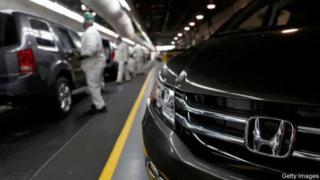
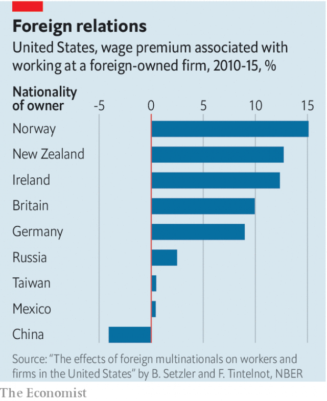

###### Multinational companies

# Who wins from foreign investment? 

 

> print-edition iconPrint edition | Finance and economics | Aug 22nd 2019 

SHAWNEA ROSSER earned upwards of $29 an hour when she worked for General Motors in Dayton, Ohio. But in 2008 the factory closed. Years later the building was bought by Fuyao Group, a Chinese multinational company that makes glass. The new American managers promised that the “historic” project would “give people jobs, and give a future to your kids and my kids”. Sounds great. But Ms Rosser’s new job paid just $12.84. 

The plight of Ms Rosser and her coworkers is captured in “American Factory”, a documentary released on August 21st by Netflix that explores the tensions that arise from the factory’s foreign ownership. There is discontent among American workers, but the source is unclear. Could it simply reflect the post-crisis reality of American manufacturing work? Or are the different Chinese employment practices to blame? 

A new study offers part of an answer, by asking who benefits when foreign investors open up shop. On average, foreign companies in fact pay workers around 25% more than American ones. But that could be because they employ relatively skilled workers. Bradley Setzler and Felix Tintelnot of the University of Chicago match anonymised employee and company tax records to estimate the true wage premium. 

The economists look to see what happens when American workers move between companies. They find that when someone hops between two American-owned firms, their wages barely budge. But when they skip from a domestically owned one to a foreign one, their wages go up by around 7%. And when they jump from a foreign-owned firm to a domestic one, their wages sag. 

 

Messrs Setzler and Tintelnot also find that the boost to wages from working at a foreign-owned firm is skewed in favour of the highly skilled. They derive a measure of skills by adjusting pay for age, firm, industry and location. Based on that measure, people in the bottom 10% of the skills distribution saw no pay premium at all for working at a foreign-owned company. 

The researchers also ask whether a firm’s country of origin might matter for the wage premium on offer. Unsurprisingly, richer home countries tend to mean fatter American pay packets. Companies from Norway and New Zealand pay best; those from Mexico and Taiwan give barely any premium. Only one country seems to offer a pay penalty (see chart). On average, they calculate that between 2010 and 2015, Chinese-owned firms paid around 4% less than American ones for similar jobs. That is not a huge gap—certainly compared with the drop in Ms Rosser’s hourly pay between GM and Fuyao Group. But when you are not paid a lot, it is big enough to hurt.■ 

-- 

 单词注释:

1.multinational[.mʌlti'næʃәnl]:a. 多国的, 跨国公司的 n. 跨国公司 

2.Aug[]:abbr. 八月（August） 

3.Rosser['rɔsә]:n. 伐木工人 

4.dayton['deitən]:n. 代顿（美国俄亥俄州西南部城市） 

5.Ohio[әu'haiәu]:n. 俄亥俄 

6.multinational[.mʌlti'næʃәnl]:a. 多国的, 跨国公司的 n. 跨国公司 

7.historic[hi'stɒrik]:a. 历史上著名的, 有历史性的 

8.plight[plait]:n. 困境, 窘境 vt. 宣誓, 保证 

9.Rosser['rɔsә]:n. 伐木工人 

10.coworker[]:n. 共同工作的人, 同事, 合作者 

11.documentary[.dɒkju'mentәri]:n. 记录片 a. 文件的 

12.netflix[]:n. 全球十大视频网站中唯一收费站点 

13.discontent[.diskәn'tent]:n. 不满 

14.unclear[.ʌn'kliә]:a. 不易了解的, 不清楚的, 含混的 

15.manufacturing[.mænju'fæktʃәriŋ]:n. 制造业 a. 制造业的 

16.investor[in'vestә]:n. 投资者 [经] 投资者 

17.bradley['brædli]:n. 布兰得利（男子名） 

18.setzler[]: [人名] 塞茨勒 

19.felix['fi:liks]:n. 菲力克斯（男子名）；费力克斯制导炸弹 

20.Chicago[ʃi'kɑ:gәu]:n. 芝加哥 

21.anonymised[]:使匿名（anonymise 过去式及过去分词形式） 匿名的 

22.premium['pri:miәm]:n. 额外补贴, 奖金, 奖赏, 保险费 [医] 保险费 

23.economist[i:'kɒnәmist]:n. 经济学者, 经济家 [经] 经济学家 

24.hop[hɒp]:n. 单脚跳, 跳跃, 舞会, 飞行 vi. 单脚跳, 跳跃 vt. 跃过, 跳上, 加蛇麻子于, 服麻醉药 [计] 跳跃式传输 

25.budge[bʌdʒ]:vi. 微微移动 vt. 推动 n. 羔羊皮 

26.domestically[dәu'mestikli]:adv. 家庭式地, 国内地 

27.sag[sæg]:vi. 下垂, 倾斜, 萎靡, 萧条, 变得乏味 vt. 使下垂 n. 下垂, 倾斜, 萧条 [计] 系统分析组, 语法分析生成程序, 电压下降 

28.Messrs['mesәz]:[法][pl. ](=Messieurs)各位(先生) 

29.skew[skju:]:a. 斜的, 歪的 n. 歪斜, 偏态家庭关系 vi. 歪斜, 侧转 vt. 使歪斜, 曲解 [计] 扭斜; 歪斜; 偏斜 

30.unsurprisingly[]:adv. 不出所料的；不出奇的；意料中的 

31.Norway['nɒ:wei]:n. 挪威 

32.zealand['zi:lәnd]:n. 西兰岛（丹麦最大的岛） 

33.taiwan['tai'wɑ:n]:n. 台湾 

34.penalty['penәlti]:n. 处罚, 刑罚, 罚款, 罚球, 报应, 不利结果, 妨碍 [经] 罚金(款), 违约金 

35.les[lei]:abbr. 发射脱离系统（Launch Escape System） 

36.hourly['auәli]:a. 每小时的, 以小时计的, 频繁的 adv. 每小时地, 频繁地, 不绝地 

37.GM[]:通用汽车公司, 总经理, 导弹 [经] 通用汽车公司 

