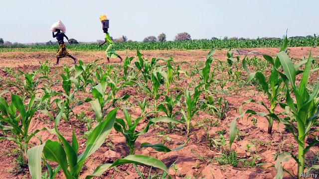
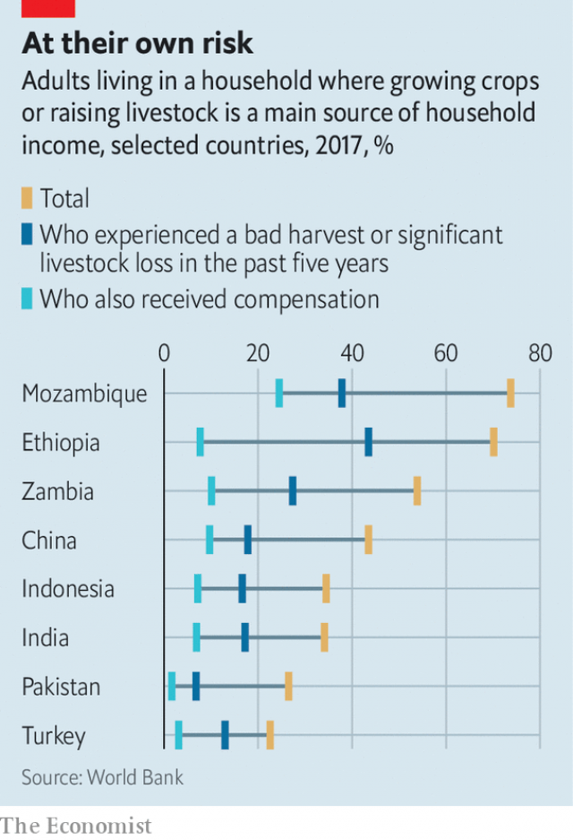

###### Under cover

# The poor, who most need insurance, are least likely to have it 

 

> print-edition iconPrint edition | International | Aug 22nd 2019 

LIKE MANY Zambian farmers, Stephen Chomba suffered badly from a prolonged drought that started just after last year’s planting season in October. The maize seeds he had used in his little 12-hectare farm in Chilanga, on the outskirts of the capital, Lusaka, failed to germinate. He risked losing his entire crop. Then, to his astonishment, he received a phone-call from the seed company. He was told he was entitled to pick up replacement seeds at no cost. He was, it turned out, insured. 

His story shows how technology and new ideas can bring insurance to poor people around the world—but also how difficult that task is. Moves to expand “financial inclusion” are being extended to bring the poor insurance as well as mobile-money accounts and access to credit. 

It is the very poor who need insurance most of all, and as climate change makes extreme weather more common, poor farmers are likely to find themselves ever more vulnerable. Mr Chomba has seven children to support, five of them still at school. For such families a loss like the one he faced is much more than a temporary setback. It can tip them into crippling debt or utter destitution. But most poor people around the world assume that insurance is not for them. Indeed, if they think about it at all, many wonder why they would pay money now, a premium, for something they hope never to need, a claim for some unforeseen loss. 

Since 2011 the World Bank, with funding from the Bill and Melinda Gates Foundation, has produced a financial-inclusion index, or “Findex”, an attempt to measure access to financial services. Included in the most recent Findex, covering 2017, was a survey of farmers across a range of poorer countries. About half had experienced at least one very bad year in the past five. The vast majority had borne the entire financial risk of the loss, receiving nothing from either an insurance payout or government assistance (see chart). 

 

In India, for example, many poor farmers have no insurance, says Shree Kant Kumar, of VimoSEWA, the insurance arm of SEWA, a women’s union and microfinance provider. “Most insurance is either subsidised or forced,” he says. Based in Ahmedabad, in the state of Gujarat, Mr Kant says that in the 1980s SEWA noticed that some of the women to whom it had lent money were unable to repay because a calamity had befallen them. So in 1992 it started offering life insurance, adding health insurance in 2000. 

The government also offers a crop-insurance scheme, which is subsidised. But this is available only to farmers who take out loans through co-operatives, and tend to be relatively well-off. Mr Kant says Indian small farmers cover their risks as their ancestors did—by hoarding produce and having more children, to look after them, they hope, when they are old. 

Among a group of rice-farmers in the village of Jalalpur are some who have dabbled with insurance, thanks to the government-subsidised scheme. Some complain it did not pay out despite terrible harvests in 2015-16. Others have had no claims, and resent paying premiums and getting nothing back. Indeed, SEWA has now begun to pay no-claims bonuses to people who do not submit a claim for several years. 

In Zambia Mr Chomba did recall that, when he bought his seeds, the salesman had mentioned insurance. But he had assumed it was just part of his patter. In fact, in giving his mobile-phone number he had registered for insurance. It covered only non-germination, and paid out only in seeds. The extended drought left him with a crop about one-fifth of a normal year’s. But that was a lot better than nothing. 

Mobile-phone adoption has outpaced both financial inclusion and insurance coverage. According to GSMA, an organisation of mobile operators, 5.1bn people—two-thirds of the world—had mobile phones in 2018. It expects the number to rise to 5.8bn, or 71% by 2025. According to the Findex, 78% of the world’s unbanked adults receiving wages in cash had a mobile phone. Even Zambia, a poor country, has a mobile-penetration rate of over 80%. 

This makes it easier to reach the unbanked, both to market insurance services to them and to manage and even pay claims. It is still, however, a tough sell. An agricultural fair in Zambia’s Mumbwa district is a three-hour drive from Lusaka, much of it through maize fields desiccated by drought. A farmer at the fair says the year has been so bad, “it will send all but the very strong to the wall.” But he and others there find the idea of crop insurance tricky to grasp. Trying to explain are representatives of Pula, the “insurtech” firm that designed the coverage, and the Zambian subsidiary of Bayer, an agribusiness giant, that sells it with its maize seeds. The idea is unfamiliar. And sometimes farmers buying seed do not go through the minimal registration procedure needed for insurance—the seed shop may not explain it to them, or they are in too much of a hurry. 

In selling insurance to the poor, three things seem most important: trust, price and ease. The most important way of establishing trust is the demonstration effect. One of the seed-marketers in Mumbwa laments that more fuss is not made about payouts like the one Mr Chomba received. Kamlaben Dayabhai Parmar, a midwife and an insurance agent for SEWA in Gujarat, would agree. In her village, 35 families are insured through SEWA; she receives a small cut of the premiums. Her main sales tactic is to make payments public—large claims, for example, are paid at village meetings. 

Correspondingly, where claims are not paid, or met in full, insurance can soon get a bad name, often unjustifiably. So Ms Parmar is interrupted while advertising the benefits of insurance by an assertive woman in a pink sari, who complains that she made a health claim, and received 2,000 rupees when her total costs were 10,000 rupees. She terminated her policy when the premiums rose. 

Similar problems have dogged some “index-insurance” schemes. A number of firms in east Africa offer farmers crop-insurance that will pay out automatically to a mobile-phone account, without the need to put in a claim, if, say, a rainfall index drops below a certain threshold. This is ingenious. Following an index is cheaper than assessing farmers’ lost crops, or counting how many of his cows have survived a drought. And since the index is out of the farmer’s control, “moral hazard” is reduced—he cannot do anything to make a payout more likely. But the enthusiasm for index insurance has waned somewhat. It has to make some general assumptions. Some policyholders might lose their crops but receive no payout, discouraging others. 

The other important elements in increasing take-up of insurance—price and ease—are often linked. MicroEnsure, a British-based “insurtech”, signed up millions of customers by offering life-insurance policies given away with mobile-phone top-ups, as an incentive to loyal customers. It provides cover to 8.6m people in Africa and Asia. But its boss, Richard Leftley, says that asking customers to answer even three simple questions (name, age and next of kin) could be enough to deter them from taking up a free offer. 

Or insurance may be bundled with a product, making the price invisible and buying it as straightforward as possible. People, says Ndavi Muia of Bayer, will not pay for insurance unless it is a statutory requirement, like motor insurance. So Pula’s premium is paid by the seed company, which absorbs the cost and bundles the insurance with its product to boost sales. It can afford this because the payout is in seed and the risk period relatively short. 

The idea of buying insurance against the failure of a product you are purchasing seems obvious to many people in developed markets, but not to many poor people. Lumkani, a Johannesburg-based firm, sells fire-detection equipment (Lumkani means “beware” in Xhosa). South African townships suffer lots of fires. Lumkani’s devices are networked, so that an alarm triggers those nearby, and users get an SMS alert of a fire in their district, or indeed their own home. They also come with fire insurance, with coverage for total losses up to 40,000 rand ($2,600). For smaller losses, says David Gluckman, Lumkani’s boss, policyholders often have to be chivvied into claiming. 

An Indian insurer, called Toffee (as in “as easy as…”) offers a range of products, such as theft and damage cover for bicycles, “commuting” insurance (for accidents riders might have); and insurance against mosquito-borne diseases such as dengue (which it hopes pharmacies will promote to people buying insect-repellent). It boasts that it takes less than 200 seconds to buy a policy on its app or website and less than three days to pay claims. 

Such insurtech firms can win business by serving the poor, venturing into parts of the market long neglected by insurers, and through digital processes, exploiting the chronic inefficiency of well-established competitors. But it is hard for them to make large margins. They are intermediaries between customers and the insurance companies that actually underwrite the policies. Many also find it hard to achieve the volume of business that would bring economies of scale. 

Many working on insurance for the poor believe that, to make a real difference, insurers need to do two things. The first is to think of their role rather differently, “to move beyond providing merely an indemnity for losses”, in the words of Hugh Terry, founder of the Digital Insurer, an online trade journal. Rather they should be helping clients reduce and manage risk, using the new technologies to advise and incentivise them into better practices: farmers into planting the right seeds at the right time; health-policy holders to manage medical conditions online and so on. 

Second, in poor countries, they probably need to work with governments, and governments will need to use some of the money they spend on their poorest citizens to promote insurance. Pula, for example, is on a pilot scheme in Zambia, involving 150,000 farmers. They will be offered crop-yield insurance, sold with seeds and fertiliser, under the government’s Farmer Input Support Programme, which subsidises the cost of inputs to small-scale maize-producers. This will be the first time the government has used a “yield index”, covering a wide range of risks affecting the harvest, as opposed to a simple weather index. Pula already has a similar collaboration with Nigeria’s government. 

The upshot should be that more farmers will benefit from the comfort Mr Chomba received from having something of a safety-net. And, as insurance becomes more commonplace, fewer, presumably, will be so taken by surprise. ■ 

