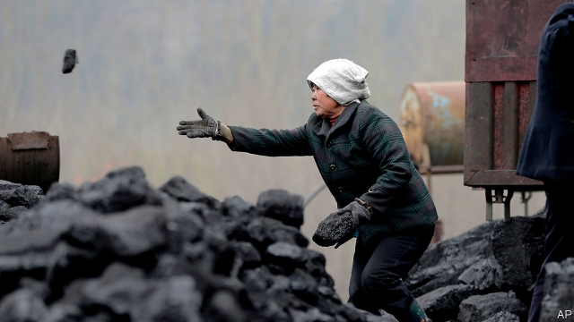

###### Betting on black

# Asian governments are the biggest backers of the filthiest fuel 

 

> print-edition iconPrint edition | Leaders | Aug 22nd 2019 

IN THE DENSE gloom about climate change, news of coal’s decline seems like a pinprick of hope. President Donald Trump may adore “beautiful, clean coal”, but even he cannot save it. A growing number of countries want to phase out coal entirely, a transition eased by cheap natural gas and the plunging cost of wind and solar power. 

That is good news. Coal has been the largest engine of climate change to date, accounting for nearly a third of the rise in average temperatures since the Industrial Revolution. Any pressure on it therefore counts as progress. 

However, last year coal-fired electricity emitted more than ten gigatonnes of carbon dioxide for the first time, 30% of the world’s total. It may be in decline in the West, but many Asian governments continue to promote coal-fired power generation. They are making a dangerous bet. 

Asia accounts for 75% of the world’s coal demand—China alone consumes half of it. The Chinese government has taken steps to limit pollution and support renewables. Yet coal consumption there rose in 2018, as it did the year before. In India coal demand grew by 9% last year. In Vietnam it swelled by almost a quarter. To keep the rise in global temperatures to no more than 1.5°C relative to pre-industrial times, climatologists insist that almost all coal plants must shut by 2050, which means starting to act now. Today’s trends would keep the last coal plant open until 2079, estimates UBS, a bank. Asia’s coal-fired power regiment has a sprightly average age of 15, compared with a creaky 40 years in America, close to retirement. 

There are several reasons for this, but one stands out: government support. In India state-owned companies invest more than $6bn in coal mining and coal-fired power each year; state-backed banks provide some $10.6bn in financing. Indonesia doles out more than $2bn annually for consumption of coal-fired power. China supports coal not just at home but abroad, supplying about $9.5bn a year in foreign funding. Japan and South Korea finance coal projects outside their borders, too. 

Government support is hardly surprising. State-backed coal firms make money and create jobs. Wind turbines and solar panels provide power only intermittently; for now, dirtier power plants are needed as back up. Gas is pummelling coal in America, but remains a bit-player in India and much of South-East Asia, since it has to be imported and is relatively expensive. 

Disentangling coal from the region’s economies is difficult. Indonesian coal companies are a powerful lobby; not coincidentally, power tariffs favour coal over wind and solar projects. In India coal subsidises passenger fees on railways. And heavy lending by state-owned banks has tied the health of the financial system to that of the coal industry. 

Nevertheless, governments betting on coal face three big risks. One is environmental. Emissions from coal plants that are already built—let alone new ones—will ensure that the world exceeds the level of carbon-dioxide emissions likely to push global temperatures up by more than 1.5°C. 

There is an economic risk, too. Public-sector zeal for coal is matched only by private-sector distaste (see article). Banks, including Asian ones, have increasingly said they will stop funding new coal plants. Wind and solar farms make coal look increasingly expensive. A study has found that private banks provided three-quarters of loans to Indian renewables projects last year; state-backed banks doled out two-thirds of those for coal. 

And then there is politics. Voters do not like breathing soot. More of them are concerned about climate change, too, as they face unpredictable growing seasons, floods and droughts. 

Promisingly, more Asian politicians are voicing support for clean power. In July Rodrigo Duterte, the Philippines’ president, instructed his energy minister to reduce his country’s dependence on coal. In June India’s government said it planned to have 500 gigawatts of renewable power by 2030. But to speed the transition, governments in Asia and elsewhere must do more. 

Politicians should move faster to reduce state support for coal. Rich countries should find ways to help. Middle-income countries in Asia would be right to point out that wealthier counterparts used coal to fuel their own growth and that America, Britain, Germany and Japan are among those that continue to support coal, for instance through tax breaks and budgetary transfers (and imports from coal-powered Asia). Abandoning coal in Asia may require diplomacy on a scale that few governments are ready to contemplate. But abandon coal they must. ■ 

