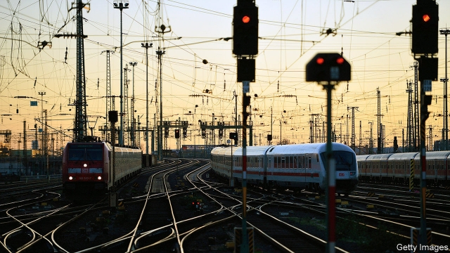

###### Take aim

# Germany needs fiscal stimulus. Here’s how to do it 

 

> print-edition iconPrint edition | Leaders | Aug 22nd 2019 

ON AUGUST 19TH the Bundesbank warned that Germany could soon be in recession. The economy shrank in the second quarter of the year; two consecutive quarterly contractions are often taken to define a downturn. In June industrial production was 5.2% lower than a year earlier, the biggest fall in a decade. Some investors hope that the run of bad news will persuade Germany to overcome its deep-rooted suspicion of fiscal stimulus. Sure enough, a day before the central bank’s warning, Olaf Scholz, the finance minister, said the government could afford a hit to its finances of €50bn ($56bn)—about 1.4% of GDP. 

Unfortunately Mr Scholz has shown little desire to use that money now. Chancellor Angela Merkel has said she sees no need. That is lamentable. The case for using fiscal stimulus to fight the downturn has recently become overwhelming. 

There are arguments to be made against higher deficits when economies weaken and inflation is low. Spending can be unaffordable because the government is already too indebted. Some critics argue that it is up to central bankers, not finance ministers, to cope with the economic cycle. A worry is that more borrowing will drive up interest rates, deterring private-sector investment. 

None of these applies to Germany. Stimulus is patently affordable. The government can borrow for 30 years at negative interest rates. As a result, it could probably spend double what Mr Scholz suggests for years and still keep its debt-to-GDP ratio steady at around a prudent 60%. Central bankers are hamstrung. Short-term interest rates cannot fall much further. The European Central Bank is likely to start buying more assets in September, which will help but may not be enough. And crowding out investment is not a concern. Negative rates are a sign that Europe is awash with savings and bereft of plans to put them to use (see article). If Germany deployed them to improve its decaying infrastructure, its firms would probably invest more, not less. 

 

The country needs looser fiscal policy in both the long term and the short term. It has neglected infrastructure in pursuit of needlessly restrictive fiscal targets, most recently its “black zero” ban on deficits. This has, for example, left 11% of its bridges in poor condition and its railways plagued by delays. Germany should replace the deficit ban with a rule allowing borrowing for investment spending. It should use tax breaks to encourage its private firms, innovation laggards, to invest more too, including in research and development. 

In the short term Germany needs demand. This necessity has grown in strength this year as the economy has deteriorated. Although unemployment is just 3.1%, the Bundesbank has warned that joblessness could soon rise. The domestic economy cannot endure brutal global trading conditions for ever. 

It would be better to use fiscal policy to prevent a deep downturn than to wait for recession to bring about a bigger deficit of its own accord. If a preventive stimulus turned out to be premature, the worst that could happen is slightly higher inflation than today’s 1.1%—which would in any case help the ECB hit its inflation target of close to 2%. A little more inflation would also even out imbalances in competitiveness between Germany and the rest of the euro zone. 

Unfortunately infrastructure projects take time to get going. They face planning hurdles and bottlenecks in the construction industry. The federal government has already struggled to spend all of its existing meagre infrastructure budget. 

The best thing, therefore, would be to supplement a long-term programme of infrastructure investment with an immediate, temporary boost, such as payroll-tax cuts, designed to forestall a downturn. Germany stands to benefit from both prongs of this strategy. Continuing to reject them is fiscal folly. ■ 

-- 

 单词注释:

1.fiscal['fiskәl]:a. 财政的, 国库的 [经] 财政上的, 会计的, 国库的 

2.stimulus['stimjulәs]:n. 刺激, 激励, 刺激品 [医] 刺激特, 刺激 

3.Aug[]:abbr. 八月（August） 

4.bundesbank['bundəs,bæŋk]:n. 德意志联邦银行 

5.recession[ri'seʃәn]:n. 后退, 凹处, 衰退, 归还 [医] 退缩 

6.consecutive[kәn'sekjutiv]:a. 连续的, 联贯的 [计] 连续的; 连接的 

7.contraction[kәn'trækʃәn]:n. 收缩, 缩写式, 害病 [医] 收缩; 挛缩; 牙弓内缩 

8.downturn['dauntә:n]:n. (尤指经济方面的)衰退, 下降趋势 [电] 低迷时期 

9.investor[in'vestә]:n. 投资者 [经] 投资者 

10.olaf['әulәf, 'ɔl-]:n. 奥拉夫（男子名） 

11.scholz[]:n. (Scholz)人名；(瑞典)斯科尔茨；(英)肖尔茨 

12.chancellor['tʃɑ:nsәlә]:n. 大臣, 总理, 首相, 大使馆/领事馆的一等秘书, 司法官, 大学校长 

13.angela['ændʒilә]:n. 安吉拉（女子名） 

14.merkel[]: [人名] 默克尔; [地名] [美国] 默克尔 

15.lamentable['læmәntәbl]:a. 可悲的, 哀伤的, 可怜的 

16.overwhelm[.әuvә'hwelm]:vt. 淹没, 受打击, 制服, 压倒, 使不知所措 [法] 打翻, 倾覆, 覆盖 

17.deficit['defisit]:n. 赤字, 不足额 [医] 短缺 

18.inflation[in'fleiʃәn]:n. 胀大, 夸张, 通货膨胀 [化] 充气吹胀; 膨胀 

19.unaffordable[ˌʌnə'fɔ:dəbl]:a. 买不起的, 负担不起的 

20.indebted[in'detid]:a. 负债的, 受惠的 [法] 负债的, 法律上有义务偿还的 

21.banker['bæŋkә]:n. 银行家, 庄家 [经] 银行业者, 银行家 

22.deter[di'tә:]:vt. 制止, 吓住, 威慑 

23.stimulus['stimjulәs]:n. 刺激, 激励, 刺激品 [医] 刺激特, 刺激 

24.patently['peitntli]:adv. 明显地, 公然地 

25.affordable[]:[计] 普及型 

26.prudent['pru:dnt]:a. 审慎的, 三思而后行的, 精明的, 节俭的 

27.hamstring['hæmstriŋ]:n. 后腿腱 vt. 切断腿腱使成跛腿, 使瘫痪 

28.cannot['kænɒt]:aux. 无法, 不能 

29.asset['æset]:n. 资产, 有益的东西 

30.awash[ә'wɒʃ]:a. 与水面齐平的, 被浪冲打的 

31.bereave[bi'ri:v]:vt. 使孤寂, 使丧失, 使失去 

32.deploy[di'plɒi]:v. 展开, 配置 

33.infrastructure['infrәstrʌktʃә]:n. 基础结构, 基础设施 [经] 基础设施 

34.les[lei]:abbr. 发射脱离系统（Launch Escape System） 

35.loos[]:n. 损耗, 洗手间（loo复数形式） 

36.needlessly[]:adv. 不必要地；无用地 

37.restrictive[ri'striktiv]:a. 限制的, 约束的, 限定的 n. 限制词 

38.plague[pleig]:n. 瘟疫, 天罚, 麻烦, 灾祸 vt. 折磨, 使苦恼, 使得灾祸 

39.innovation[.inәu'veiʃәn]:n. 改革, 创新 [法] 创新, 改革, 刷新 

40.laggard['lægәd]:n. 迟钝者, 落后者 a. 迟钝的, 落后的 

41.deteriorate[di'tiәriәreit]:v. (使)恶化 

42.joblessness['dʒɔblisnis]:n. 失业；无活可干（jobless的名词形式） 

43.brutal['bru:tәl]:a. 残忍的, 野蛮的, 不讲理的 

44.preventive[pri'ventiv]:a. 预防的, 防止的 n. 防止物, 预防方法, 预防药 

45.premature[.premә'tjuә]:a. 早产的, 过早的, 不成熟的 n. 早产儿, 过早发生的事物 

46.ECB[]:[计] 事件控制块 

47.imbalance[im'bælәns]:n. 不平衡, 不均衡 [医] 不平衡, 失调 

48.competitiveness[]:[经] 竞争 

49.euro['juәrәu]:n. 欧元（欧盟的统一货币单位） 

50.hurdle['hә:dl]:n. 障碍, 跳栏, 临时活动篱笆 vt. 用篱笆围, 越过, 克服 

51.bottleneck['bɒtlnek]:n. 瓶颈 [经] 瓶颈, 增产障碍 

52.meagre['mi:^ә(r)]:a. 瘦的, 不毛的, 贫乏的, 贫弱的, 少量的, 力量不够的, 质不高的, 量不足的 

53.forestall[fɒ:'stɒ:l]:vt. 预先阻止, 先...一步行动, 占先一步, 垄断, 阻碍 [法] 先采取行动预防或阻止, 垄断 

54.prong[prɒŋ]:n. 叉状物, 耙子 vt. 刺, 贯穿, 翻掘 

55.folly['fɒli]:n. 愚蠢, 荒唐事, 讽刺剧 

