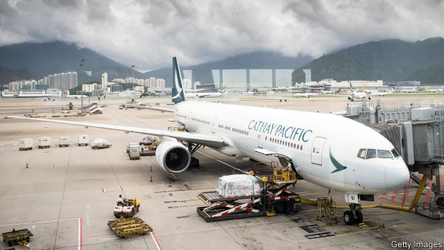

###### Cathay’s mayday

# Why China’s assault on Cathay Pacific should scare all foreign firms 

 

> print-edition iconPrint edition | Leaders | Aug 22nd 2019 

AS THE TRADE war chips away at its allure, China wants to retain the affection of foreign businesses. It has promised to level the playing field between them and their domestic rivals. This pledge is meant as reassurance that Chinese firms will receive no special favours. But it has taken on a different light over the past week, in the wake of China’s assault on Cathay Pacific, Hong Kong’s flagship airline. China is taking a hard line against foreign companies that displease it, lashing out at their bosses and demanding obedience, much as it wields control over domestic enterprises. Firms in Hong Kong are in the cross-hairs, but it would be a mistake to think China will stop there. 

With 26,000 employees in Hong Kong, Cathay initially took a neutral stance as protests engulfed the city. The airline would not dream of telling its employees what to think, its chairman proclaimed. His defiance withered, though, as criticism from China mounted. When the Chinese aviation authority, absurdly, accused the airline of imperilling safety because its employees had joined the protests, Cathay dumped its chief executive. A climate of fear now pervades it. Chinese inspectors have started screening the phones of Cathay crew for anti-Beijing material. 

Global firms may console themselves with the thought that Cathay was uniquely vulnerable. Although it is Asia’s biggest international carrier and a perennial contender for best airline in global rankings, its fate rests almost entirely on China. As much as 70% of its cargo and passengers pass through Chinese airspace. Its biggest shareholder is Swire Pacific, a Hong Kong-based group immersed in China, from soft drinks to property. Swire executives appear to have concluded that any resistance would be an act of corporate self-immolation. 

Cathay is far from alone. It joins a list of foreign firms that have wound up on the wrong side of politics in Beijing. Often the remedies are relatively simple, if nauseating. A series of luxury brands—Versace, Coach and Givenchy—have recently offered profuse apologies for selling T-shirts that appeared to identify Hong Kong as being separate from China (see article). 

As a general rule, the more foreign companies prize China’s market, the more they have to fear (see article). HSBC, Europe’s biggest bank, has come under pressure for sharing information with American authorities that helped them build a fraud case against the chief financial officer of Huawei, a Chinese telecoms giant. With its strategy predicated on growth in China, HSBC cannot afford to become a villain there. This month it ousted both its chief executive and the head of its China unit, though it denied any connection with the Huawei controversy. 

Cathay’s predicament shows why global boardrooms are growing more anxious about Chinese anger. The main worry used to be consumer boycotts, fuelled by state media. These harmed Japanese carmakers and South Korean retailers, but their Chinese sales typically recovered after a few quarters. 

The attack on Cathay went further. China’s airline regulator declared it unsafe, the international arm of ICBC, a bank, recommended selling its shares and CITIC Bank boycotted it. The bogus regulatory warning gave all Chinese firms a pretext to shun it. These entities are not household names outside China but are active around the world. ICBC is the planet’s biggest bank by assets. CITIC Bank belongs to one of the most global of Chinese state conglomerates. Their participation in the flagellation of Cathay is a reminder that their ultimate loyalty is to the party. 

Using state firms as battle spears gives the lie to China’s claim that it is managing them according to market principles. And weaponising regulators undermines China’s ambitions to play a bigger international role. The airline supervisor had earned respect in leading the charge to ground the 737 MAX, Boeing’s troubled aeroplane; its Cathay warning makes it look like a political hack. The party may well get foreign companies to toe its line on Hong Kong. In the process it is revealing its true nature.■ 

-- 

 单词注释:

1.mayday['meidei]:n. 救难信号 

2.assault[ә'sɒ:t]:n. 攻击, 袭击 vt. 袭击, 攻击 vi. 发动攻击 

3.Cathay[kæ'θei]:n. 中国 

4.Aug[]:abbr. 八月（August） 

5.chip[tʃip]:n. 屑片, 薄片, 碎片 vt. 削, 切, 削成碎片, 使摔倒, 凿 vi. 削下屑片 [计] 孔屑; 组件; 晶片; 芯片 

6.allure[ә'luә]:vt. 引诱, 吸引 n. 魅力, 诱惑力 

7.pledge[pledʒ]:n. 诺言, 保证, 誓言, 抵押, 信物, 保人, 祝愿 vt. 许诺, 保证, 使发誓, 抵押, 典当, 举杯祝...健康 

8.reassurance[.ri:ә'ʃurәns]:n. 安心, 放心, 再保证 

9.hong[hɔŋ]:n. （中国、日本的）行, 商行 

10.flagship['flægʃip]:n. 旗舰 

11.lash[læʃ]:n. 鞭子, 鞭打, 睫毛, 责骂, 讽刺 vt. 鞭打, 摆动, 扎捆, 冲击, 讽刺, 煽动 vi. 冲洗, 鞭打, 责骂 

12.obedience[ә'bi:djәns]:n. 服从, 顺从, 忠实 [法] 服从, 顺从, 遵从 

13.wield[wi:ld]:vt. 挥舞, 运用 

14.kong[kɔŋ]:n. 含锡砾石下的无矿基岩；钢 

15.initially[i'niʃәli]:adv. 最初, 开头 

16.stance[stæns]:n. 准备击球姿势, 站立的姿势, 位置, 姿态 [经] 地位, 形势 

17.engulf[in'gʌlf]:vt. 卷入, 吸进, 吞没, 使全神贯注 

18.defiance[di'faiәns]:n. 蔑视, 挑战 [法] 挑战, 藐视, 违抗 

19.wither['wiðә]:vt. 使凋谢, 使消亡, 使畏缩 vi. 枯萎, 衰退 

20.absurdly[әb'sә:dli]:adv. 荒谬地, 荒唐地, 愚蠢地 

21.imperil[im'peril]:vt. 使处于危险, 危害 

22.pervade[pә'veid]:vt. 弥漫于, 遍及于, 流行于, 蔓延, 渗透于, 充满 

23.inspector[in'spektә]:n. 检查员, 巡视员 [化] 检查员 

24.console[kәn'sәul]:vt. 安慰, 藉慰 n. 控制台 [计] 控制台 

25.uniquely[]:adv. 独特地；珍奇地 

26.vulnerable['vʌlnәrәbl]:a. 易受伤害的, 有弱点的, 易受影响的, 脆弱的, 成局的 [医] 易损的 

27.perennial[pә'reniәl]:a. 常年的, 长期的, 反复的 [医] 多年生的 

28.contender[kәn'tendә(r)]:n. 参赛者, 争论者, 斗争者, 竞争者 

29.ranking['ræŋkiŋ]:n. 等级, 地位 a. 上级的, 头等的, 超群的 

30.entirely[in'taiәli]:adv. 完全, 全然, 一概 

31.shareholder['ʃєә.hәuldә]:n. 股东 [法] 股东, 股票持有人 

32.Swire[]:n. 太古集团 

33.immerse[i'mә:s]:vt. 沉浸, 使陷入 [医] 浸[入] 

34.corporate['kɒ:pәrit]:a. 社团的, 合伙的, 公司的 [经] 团体的, 法人的, 社团的 

35.politic['pɒlitik]:a. 精明的, 明智的, 策略的 

36.nauseate['nɒ:sieit]:vi. 作呕, 产生恶感, 厌恶 vt. 使厌恶, 使恶心 

37.sery[]:n. (Sery)人名；(俄)谢雷；(科特)塞里 

38.profuse[prә'fju:s]:a. 很多的, 丰富的, 浪费的, 慷慨的 

39.hsbc[]:abbr. 汇丰银行（Hong Kong and Shang Hai Banking Corporation） 

40.fraud[frɒ:d]:n. 欺骗, 欺诈, 诡计, 骗子 [经] 欺诈, 舞弊, 骗子 

41.huawei[]: 华为 

42.telecom['telәkɔm]:telecommunication 电信 

43.predicate['predikәt]:n. 谓语, 谓项 a. 谓语的 vt. 断定为, 使基于, 意味着, 预言 vi. 断言 [计] 谓词; 判定; 断定 

44.cannot['kænɒt]:aux. 无法, 不能 

45.villain['vilәn]:n. 坏人, 恶棍 [法] 歹徒, 恶棍, 恶徒 

46.oust[aust]:vt. 逐出, 罢黜, 剥夺, 驱逐 [法] 驱逐, 剥夺, 免职 

47.controversy['kɒntrәvә:si]:n. 论争, 辩论, 论战, 争论 [法] 论战, 争论, 争吵 

48.predicament[pri'dikәmәnt]:n. 处境, 穷境, 困局 

49.boardroom['bɒ:drum]:n. 会议室, 证券交换场所 

50.carmaker['kɑ:,meikә(r)]:n. 汽车制造商 

51.Korean[kә'riәn]:n. 朝鲜人, 朝鲜语 a. 朝鲜人的, 朝鲜语的 

52.retailer['ri:teilә]:n. 零售商人, 传播的人 [经] 零售商 

53.typically['tipikәli]:adv. 代表性地；作为特色地 

54.regulator['regjuleitә]:n. 调整者, 校准者, 校准器, 调整器, 标准钟 [化] 调节剂; 调节器 

55.icbc[]:abbr. 中国工商银行（Industrial and Commercial Bank of China） 

56.citic[,siaɪtiaɪ'si]: 中国国际信托投资公司 

57.bogus['bәugәs]:a. 假的, 伪造的 [经] 伪的, 伪造的 

58.regulatory['regjulәtәri]:a. 受控制的, 统制的, 调整的 [经] 规则的 

59.pretext['pri:tekst]:n. 借口, 托词 v. 以...为借口 

60.shun[ʃʌn]:vt. 避开, 规避, 避免 

61.entity['entiti]:n. 实体, 实存物, 存在 [计] 实体 

62.asset['æset]:n. 资产, 有益的东西 

63.conglomerate[kәn'glɒmәrit]:a. 聚成球形的, 砾岩性的 n. 集成物, 混合体, 砾岩 v. (使)凝聚成团 

64.participation[.pɑ:tisi'peiʃәn]:n. 参与, 分享 [经] 参与, 参股 

65.flagellation[.flædʒә'leiʃәn]:n. 鞭打 [医] 1轻叩法; 鞭击; 鞭毛突出 

66.reminder[ri'maindә]:n. 提醒的人, 暗示 [经] 催单 

67.weaponising['wepənaiz]:vt. 把…改装成武器；使…武器化 

68.undermine[.ʌndә'main]:vt. 在...下面挖, 渐渐破坏, 暗地里破坏 [法] 暗中破坏, 以阴谋中伤伤害 

69.supervisor[.sju:pә'vaizә]:n. 管理者, 监督者, 指导者, 视导员 [计] 管理程序 

70.MAX[mæks]:[计] 最大 

71.hack[hæk]:n. 劈, 砍, 砍痕, 出租车, 干咳, 晒架, 鹤嘴锄 vt. 劈, 砍, 出租, 用旧 vi. 劈, 砍, 干咳, 驾驶出租车 a. 出租的 

