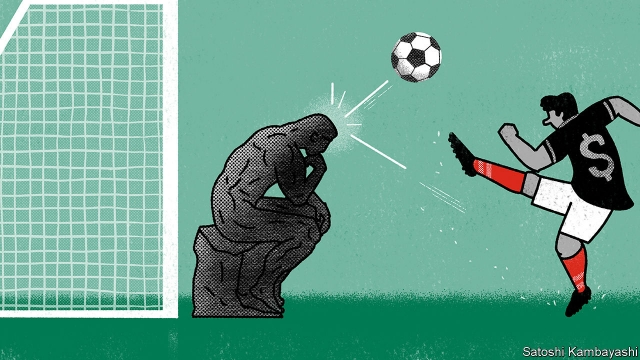
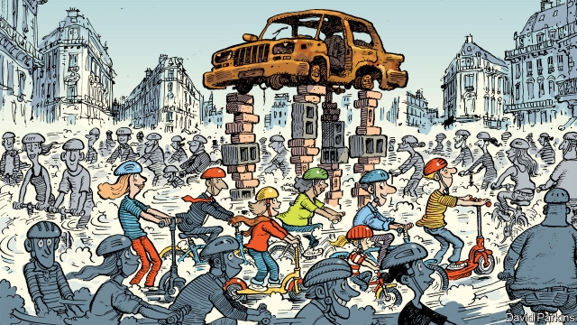

###### On the Amazon, BlackRock, Toni Morrison, e-scooters, HR, dry cleaning

# Letters to the editor 

> Aug 24th 2019 

 

You misrepresented the position of the Brazilian government on the protection of the Amazon rainforest (“Deathwatch”, August 3rd). In fact, combating deforestation is an unwavering commitment of the government. The single largest operation ever conducted to combat illegal deforestation in the Amazon took place recently, on June 5th. It brought together 165 federal environmental agents, who dismantled a criminal organisation specialising in illegal logging and timber trafficking. 

Brazil has reduced deforestation in the Amazon by 72% over the past 15 years. We have regenerated 9.4m hectares of vegetation (more than the total area of Scotland) and replanted forests in another 2m hectares. As the report rightly indicates, Brazilian agriculture is a clear example of how environmental protection and economic development can go hand in hand. Only 30% of Brazilian territory is dedicated to agriculture and ranching, while in European countries these figures usually range between 45% and 65%. 

The deforestation data published in June come from a satellite system, DETER, the main purpose of which is not to generate compiled deforestation rates, but to release deforestation warnings to guide the work of forces on the ground. It is a crucial instrument, which will be preserved, but one that is not suitable for this kind of analysis. Deforestation rates are published once a year through a different satellite system, PRODES. Finally, as an additional layer of oversight, the Brazilian government is buying a new system of high-resolution satellite images to be collected on a daily basis. This will be another tool in the fight against deforestation. 

FRED ARRUDAAmbassador of BrazilLondon 

I read your report while bouncing down logging roads in the Madre de Dios region of the Peruvian Amazon. During my visit I personally took a chainsaw to an 80-year-old cumaru tree. But for our harvesting that tree eventually would have stopped growing, stopped metabolising carbon dioxide into oxygen and decomposed, releasing its carbon and methane. Instead, the tree’s lumber will be turned into useful products and its carbon sequestered. More importantly, these concessions will protect the forest for up to 80 years. Leaving this managed paradise, I saw first-hand what happens to forests that aren’t sustainably harvested. They are burned to the ground to make way for farms and mines. 

Sustainable forestry is our best opportunity to preserve the lungs of our planet, by ensuring that the Amazon is sustainably commercial. We should be consuming more wood products, as I’m sure my fellow subscribers to the print edition would agree. 

W. GARNER ROBINSONChief executiveRobinson Lumber CompanyNew Orleans 

Can we all stop pretending that humanity cares about the environment? The reality is that the organising principle of civilisation is maximising consumption. When consumerism runs up against the environment, consumerism will, in the end, win. The sooner public policy faces up to this fact the better. Sadly, the only Amazon most people care about is the one that offers same-day delivery. 

DANIEL MAUROChicago 

 

Just because a good idea becomes well-known, or widely accepted, doesn’t make it any less effective. Buttonwood (July 20th) raised the question of whether investment factors such as value, momentum, size, quality and minimum volatility may lose their long-term effectiveness because of overcrowding. Yet a large body of academic work, including from six Nobel-prize winners, has substantiated the broad and persistent returns generated by these investment strategies over time. 

In published research papers, we have estimated factor capacity by examining assets managed in those strategies* and weighing transaction costs**. Our findings suggest there is ample capacity to make factor investing effective for some time to come. Based on our research, the amount of money allocated to factor strategies is a fraction of the $26trn in total market capitalisation of the broader S&P 500 Index (as of July 31st). Factor- investing strategies have the capacity to absorb more than 100 times the amount that is invested today. We believe factor strategies globally may reach at least hundreds of billions and, in many cases, trillions of dollars of assets before we concern ourselves with capacity. 

ANDREW ANGHead of factor investingBlackRockNew York 

 

Speech is not violenceToni Morrison was a great writer, but her statement, “Oppressive language does more than represent violence; it is violence” is off the mark (“On malign words”, August 10th). In fact, it contradicts the First Amendment of the constitution, which relies on the distinction between oppressive speech and violence, protecting the former but not the latter. Morrison was right that oppressive language should “be rejected, altered and exposed”, but the government may not punish it. 

FELICIA NIMUE ACKERMANProfessor of philosophyBrown UniversityProvidence, Rhode Island 

 

Charlemagne mused about how the electric scooter is making European cities car-free (August 3rd). But a study of e-scooters in Barcelona by the automobile club found that 38% of the people that took to them used to walk, 10% used to cycle and 33% used to travel by public transport. Only 10% replaced their car or motorbike with an e-scooter. The overall effect of e-scooters might be negative, as people stand on them instead of walking or cycling and they take custom away from public transport. 

IGNACIO MARTIN VELASCOParis 

 

Bartleby has an unerring ability to detect the nonsense emanating from HR (July 13th). At my job operating a drawbridge I am expected to set performance goals relating to “core competencies.” These include building relationships, oriented outcomes, creativity and innovation. Curiously, they do not include safely operating the 900-tonne piece of mechanical infrastructure entrusted to my care. At my annual review, learning agility is defined in terms of “an awareness of changing workplace trends”. That such skills are valued more highly than not crushing pedestrians says something. 

KRISTIAN WILLIAMSPortland, Oregon 

 

“Weak foundations” (July 20th) reported that declining sales of decorative paints foretold the downturn in 2008. In the early days of the consultancy I work for we used to ask one of the partners how his family’s dry-cleaning business was doing. When people tighten their belts, we noticed that the first thing they do is to postpone the dry-cleaning of their smart suits and dresses. 

SIMON BLAKEYBradford, West Yorkshire 

* Ang, A., A. Madhavan, A. Sobczyk. Crowding, Capacity, and Valuation of Minimum Volatility Strategies” The Journal of Index Investing. Feb 2017, 7 (4) 41-50 DOI: 10.3905/jii.2017.7.4.041 

 **Ratcliffe, R., P. Miranda and A. Ang. Capacity of Smart Beta Strategies from a Transaction Cost Perspective. The Journal of Index Investing. Nov 2017, 8 (3) 39-50 DOI: 10.3905/jii.2017.8.3.039 

 
<<<<<<< HEAD

-- 

 单词注释:

1.amazon['æmәzɒn]:n. 亚马孙河 [医] 无乳腺者 

2.blackrock[]:n. 黑石集团（美国一家债券基金管理公司） 

3.toni['tәuni]:n. 托妮（女子名） 

4.morrison['mɔrisn]:n. 莫里森（姓氏） 

5.hr[]:[经] 小时 

6.Aug[]:abbr. 八月（August） 

7.misrepresent['mis.repri'zent]:vt. 不如实地叙述(或说明), 不称职地代表 

8.Brazilian[brә'ziljәn]:n. 巴西人 a. 巴西的, 巴西人的 

9.rainforest['rein'fɔrist]:[生态]雨林 

10.deathwatch['deθwɒtʃ]:n. 临终看护 

11.combat['kɒmbæt]:n. 争斗, 战斗 vi. 战斗, 争斗 vt. 与...战斗, 与...斗争 

12.deforestation[di:.fɒ:ri'steiʃәn]:n. 采伐森林, 森林开伐 [法] 砍伐森森 

13.unwavering[.ʌn'weivәriŋ]:a. 不动摇的, 坚定的 

14.environmental[in.vaiәrәn'mentәl]:a. 周围的, 环境的 [经] 环境的, 环保的 

15.dismantle[dis'mæntl]:vt. 拆除...的设备, 分解, 去除覆盖物 

16.organisation[,ɔ: ^әnaizeiʃən; - ni'z-]:n. 组织, 团体, 体制, 编制 

17.specialise['speʃә,laiz]:vt. 特加指明, 列举, 使专门化, 限定...的范围 vt.vi. (使)特化, (使)专化 vi. 成为专家, 专务, 专攻, 专门研究, 逐条详述 

18.trafficking[ˈtræfikɪŋ]:n. 非法交易 

19.Brazil[brә'zil]:n. 巴西 

20.regenerate[ri'dʒenәreit]:vt. 使再生, 重建, 革新 vi. 新生, 再生 a. 新生的, 再生的 [计] 再生; 重写 

21.hectare['hektɑ:]:n. 公顷 [经] 公顷 

22.vegetation[.vedʒi'teiʃәn]:n. 植物 [医] 贽生物, 贽疣, 增殖体; 生长, 增殖 

23.replant[.ri:'plɑ:nt]:vt. 改种, 在...再植, 使移居 

24.rightly['raitli]:adv. 合适地, 正当地, 正确地 

25.dedicate['dedikeit]:vt. 献出, 贡献 

26.ranch[ræntʃ. rɑ:ntʃ]:n. 大牧场 v. 经营牧场 

27.datum['deitәm]:n. 论据, 材料, 资料, 已知数 [医] 材料, 资料, 论据 

28.deter[di'tә:]:vt. 制止, 吓住, 威慑 

29.deforestation[di:.fɒ:ri'steiʃәn]:n. 采伐森林, 森林开伐 [法] 砍伐森森 

30.oversight['әuvәsait]:n. 勘漏, 失察, 失败, 照料 [经] 监督权 

31.fred[fred]:n. 佛瑞德（男子名） 

32.madre['mɑ:ðre]:n. 母亲（西班牙语） 

33.de[di:]:[化] 非对映体过量 [医] 铥(69号元素铥的别名,1916年Eder离得的假想元素) 

34.DIO[]:[计] 数据输入输出, 直接输入输出 

35.Peruvian[pә'ru:viәn]:a. 秘鲁的, 秘鲁人的, 秘鲁文化的 n. 秘鲁人 

36.chainsaw['tʃeinsɔ:]:vt.用链锯割,<喻>肢解 

37.metabolise[mi'tæbәlaiz, me-]:v. 使物质替换, 使变形 

38.decompose[.di:kәm'pәuz]:v. 分解, (使)腐烂 

39.methane['meθein]:n. 甲烷, 沼气 [化] 甲烷; 沼气 

40.sequester[si'kwestә]:vt. 使隐退, 使隔绝, 扣押, 没收 [化] 螯合剂; 多价螯合剂 

41.importantly[]:adv. 重要地；大量地；有名望地；自命不凡地 

42.concession[kәn'seʃәn]:n. 特许, 让步, 认可 [经] 核准, 许可, 特殊(权) 

43.sustainably[]:adv. 支撑得住；能保持住地 

44.sustainable[sә'steinәbl]:a. 足可支撑的, 养得起的, 可以忍受的 

45.forestry['fɒristri]:n. 林学, 森林地 [法] 林地, 林学, 林业 

46.subscriber[sʌbs'kraibә]:n. 签署者, 捐献者, 订户 [经] 定户 

47.W['dʌb(ә)lju:]:[计] 等待, 写, 字 [医] 钨(74号元素) 

48.garner['gɑ:nә]:n. 谷仓, 积蓄 vt. 储存, 贮藏 

49.orleans[ɔ:'liәnz, 'ɔ:l-]:n. 奥尔良（法国城市） 

50.humanity[hju:'mæniti]:n. 人性, 人类, 博爱 

51.civilisation[,sivilai'zeiʃən;-li'z-]:n. 文明, 文明世界, 文化, 开化, 教化 

52.maximise['mæksimaiz]:vt. 把...增加到最大限度, 把...扩大到最大限度, 充分重视, 找出...的最高值 

53.consumerism[kәn'sju:mәrizm]:n. 保护消费者利益运动 

54.daniel['dænjәl]:n. 丹尼尔（男子名） 

55.les[lei]:abbr. 发射脱离系统（Launch Escape System） 

56.buttonwood['bʌtnwʊd]: 美洲悬铃木 

57.momentum[mәu'mentәm]:n. 动力, 动量 [化] 动量 

58.volatility[.vɒlә'tiliti]:n. 挥发性, 挥发度, 轻快, 易变, 短暂 [计] 变更率 

59.effectiveness[i'fektivnis]:n. 效力 [经] 有效性, 能行性 

60.overcrowd[.әuvә'kraud]:vt. 容纳过多的人, 使过度拥挤 

61.substantiate[sәb'stænʃieit]:vt. 使实体化, 证实 [经] 确证 

62.persistent[pә'sistәnt]:a. 固执的, 坚持的, 持续的, 作用持久的 [法] 坚持的, 固执的, 持续的 

63.asset['æset]:n. 资产, 有益的东西 

64.transaction[træn'sækʃәn]:n. 交易, 办理, 学报, 和解协议 [计] 事务处理 

65.capitalisation[,kæpitәlai'zeiʃən;-li'z-]:n. <主英>=capitalization 

66.globally[]:[计] 全局地 

67.trillion['triljәn]:n. 大量 [经] 兆 

68.andrew['ændru:]:n. 安德鲁（男子名） 

69.york[jɔ:k]:n. 约克郡；约克王朝 

70.oppressive[ә'presiv]:a. 压制性的, 压迫的, 沉重的 

71.malign[mә'lain]:a. 有害的, 恶性的, 有恶意的 vt. 诽谤, 说坏话 

72.amendment[ә'mendmәnt]:n. 修订, 改善, 改良, 改正 [化] 调理剂; 修正 

73.oppressive[ә'presiv]:a. 压制性的, 压迫的, 沉重的 

74.felicia[fә'lisiә]:n. 费利西亚（女子名） 

75.nimue[]:[网络] 妮穆；妮妙；尼米埃 

76.rhode[]:n. 罗德岛 

77.Charlemagne['ʃɑ:lә'mein]:查理曼大帝(742-814, 世称 Charles the Great或Charles I, 768-814为法兰克王, 800-814为西罗马帝国皇帝) 

78.muse[mju:z]:n. 沉思, 冥想 v. 沉思, 冥想, 若有所思地凝望或说 

79.scooter['sku:tә]:n. 小型摩托车, 踏板车 [机] 机车 

80.Barcelona[.bɑ:si'lәunә]:n. 巴塞罗那 

81.ignacio[]:n. (Ignacio)人名；(西、葡、英)伊格纳西奥 

82.Martin['mɑ:tin]:n. 马丁, 圣马丁鸟 

83.bartleby[]:[网络] 巴特比；巴特白；老板是空气 

84.unerring[.ʌn'ә:riŋ]:a. 不犯错误的, 无过失的, 没有打歪的 [法] 无过失的, 无错误的, 正确的 

85.emanate['emәneit]:vi. 散发, 发出, 发源 

86.drawbridge['drɒ:bridʒ]:n. (可开闭的)吊桥 

87.competency['kɔmpit(ә)nsi]:n. 足以使人过舒适生活的富裕收入, 充裕的生活条件 [法] 权能, 资格, 资产 

88.creativity[.kri:ei'tiviti]:n. 创造力, 创造性 

89.innovation[.inәu'veiʃәn]:n. 改革, 创新 [法] 创新, 改革, 刷新 

90.curiously['kjuәriәsli]:adv. 好奇地 

91.infrastructure['infrәstrʌktʃә]:n. 基础结构, 基础设施 [经] 基础设施 

92.entrust[in'trʌst]:vt. 信托, 交托, 委托 [经] 委托 

93.agility[ә'dʒiliti]:n. 敏捷, 灵活, 机敏 

94.awareness[ә'weәnis]:n. 意识, 认识 [计] 识别, 议定, 明白 

95.kristian[]:克里斯蒂安（人名） 

96.Oregon['ɒ:rigɒn]:n. 俄勒冈 

97.decorative['dekәreitiv]:a. 装饰性的 

98.foretell[fɒ:'tel]:vt. 预言, 预告, 预示 

99.downturn['dauntә:n]:n. (尤指经济方面的)衰退, 下降趋势 [电] 低迷时期 

100.consultancy[]:n. 商量, 协商, 磋商, 会诊, 与...商量, 咨询, 请教, 找(医生)看病, 查阅, 考虑 [经] 咨询业务, 咨询服务 

101.tighten['taitn]:vt. 勒紧, 使变紧 vi. 变紧, 绷紧 

102.simon['saimәn]:n. 西蒙（男子名） 

103.Yorkshire['jɔ:kʃә]:n. 约克郡, 约克王朝 

104.ang[]:abbr. （美国）空军国民警卫队（Air National Guard）；美国报业公会（American Newspaper Guild） 

105.madhavan[]: [人名]马德哈万 

106.valuation[.vælju'eiʃәn]:n. 评价, 估价, 价值判断 [经] 估价, 计价, 评价 

107.volatility[.vɒlә'tiliti]:n. 挥发性, 挥发度, 轻快, 易变, 短暂 [计] 变更率 

108.R[ɑ:(r)]:[计] 半径, 比例, 读, 接收, 寄存器, 复位, 电阻, 程式 

109.p[pi:]:便士 [计] 页, 对, 并行, 奇偶性, 指示器, 多项式, 程序, 方法, 皮 

110.miranda[mi'rændә]:n. 米兰达（女子名） 

111.beta['beitә]:n. 希腊字母表的第二个字母 [医] β(希腊文的第二个字母), 乙种 

112.transaction[træn'sækʃәn]:n. 交易, 办理, 学报, 和解协议 [计] 事务处理 

113.nov[]:abbr. 十一月（November） 
=======
>>>>>>> 50f1fbac684ef65c788c2c3b1cb359dd2a904378

