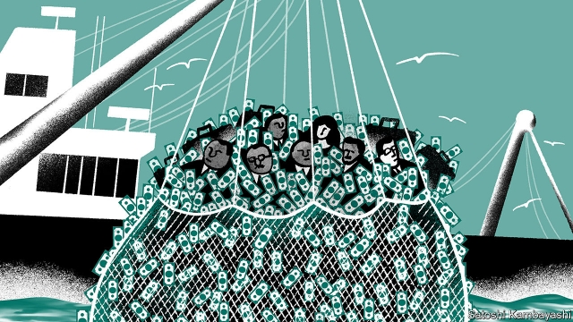

###### The net tightens

# A $2bn loan scandal sank Mozambique’s economy 

 

> print-edition iconPrint edition | Middle East and Africa | Aug 22nd 2019 

THE LATEST exhibition by Nelsa Guambe, an artist from Mozambique, is a startling chronicle of her country’s predicament. Strange faces stare from a collage of newspaper headlines about corruption. “Sharks of Maputo”, reads a clipping pasted onto the tie of an unnamed government minister. A grotesque beast—captioned “the monster of the West”—looms over a city, grasping at a shoal of fish. 

The inspiration for these jarring images is a colossal debt scandal, which has sunk Mozambique’s economy and rocked its political elite. Between 2013 and 2014 three state-backed companies took on more than $2bn of questionable debt, guaranteed by the government (equivalent to about 13% of GDP). Some $1.2bn of it was borrowed in secret, behind the backs of parliament and the public. The hidden loans were revealed in 2016, but only now is justice catching up with the alleged conspirators, who are accused of pocketing millions. A string of court cases this year has drawn in a billionaire shipbuilder, a trio of ex-Credit Suisse bankers and a former finance minister. 

The context for the three deals was that interest rates in the rich world were low. Investors could find better returns in Mozambique, where huge natural-gas reserves had been found offshore. A plan evolved across three continents. In Mozambique a clique of officials created three companies, ostensibly to build shipyards, police the coast and catch tuna. They bought trawlers and patrol boats from Privinvest, a shipbuilder headquartered in Abu Dhabi. The purchases were paid for with loans arranged by Credit Suisse, VTB and BNP Paribas, three European banks. 

Only one of the deals was made public: an $850m loan for a fishing fleet. The loan was chopped up and sold on to investors. In 2016 the government agreed with investors to swap this “tuna debt” for a conventional bond, issued directly by the state. At the time it said little about the other, secret loans—but admitted their existence weeks later. Foreign donors were horrified, and stopped contributing to the budget. The IMF packed its bags. Mozambique’s currency lost more than a third of its value against the dollar in six months. Inflation surged and the central bank hiked interest rates. Growth collapsed. The companies made no profit; the trawlers caught few fish. 

Uncovering the alleged corruption has been difficult. The same party that oversaw the scandal is still in power. President Filipe Nyusi was, until 2014, head of the defence ministry, which had links to the tainted companies. An audit of the loans, funded by the Swedish embassy and published in 2017, complained that it had not been given access to relevant documents and was unable to trace $500m in borrowed funds. Debt campaigners say that their phones are tapped, their houses broken into and their meetings spied on. 

Pressure has come from the American Department of Justice, which dug into suspicious payments wired through American banks. Last December it filed an indictment charging eight people with crimes relating to bribery, wire fraud and money-laundering. The conspirators created the maritime projects, it alleges, “as fronts to raise money to enrich themselves”. The companies bought equipment from Privinvest at vastly inflated prices, it claims. In return, say prosecutors, Privinvest diverted more than $200m into bribes and kickbacks, including over $150m to Mozambican officials and some $50m to the bankers who arranged the loans. 

The indictment touches three points of a triangle. First, it names the three ex-Credit Suisse bankers: Andrew Pearse, Detelina Subeva and Surjan Singh. It says that they hid information, invented fake competing bids and prepped Mozambican officials with answers to due-diligence questions, wrong-footing their own compliance department. Mr Pearse and Ms Subeva left the bank in the summer of 2013, as the second loan was being finalised, and joined a Privinvest subsidiary. They have each pleaded guilty to one charge against them in a New York court (Mr Singh is yet to plead). Separately, Mozambique is suing Credit Suisse, Privinvest and others in London for damages relating to the secret loans. 

Second, the indictment names the lead salesman of Privinvest, who is in American custody, and its chief financial officer. It does not charge the firm itself or its chief executive, Iskandar Safa, a French-Lebanese billionaire (and former discus champion). But in a court statement last month Mr Pearse said that Mr Safa knew about bribes that Privinvest was paying, prompting Mozambique to sue Mr Safa as well. Privinvest and its employees have denied wrongdoing. A lawyer for the group questions whether America even has jurisdiction over alleged crimes on the other side of the world. 

At the third point of the triangle are three Mozambican officials, including Manuel Chang, the finance minister who approved the loan guarantees. He was arrested in Johannesburg airport in December, and has been the subject of a legal and diplomatic tussle ever since. The American government is requesting his extradition. But so too is the government of Mozambique, which wants him to face justice at home—perhaps to prevent him spilling the beans on others in a foreign courtroom. 

The American intervention has stirred Mozambican authorities into action. In February they arrested several people in connection with the debt scandal, including the son of Armando Guebuza, who was president when the loans were made. This month 20 people were indicted on charges including corruption and money-laundering. But this is not a genuine quest for justice, says Fernando Lima, a veteran journalist in Maputo. The government is desperate to get back into the good books of the international community. It also has one eye on elections in October. 

Meanwhile, the debts are not being paid back. Whether they should be is an open question. The three loans are tainted with corruption and were all guaranteed without parliamentary approval, which is required by the constitution (parliament retroactively approved the loans after the scandal broke). As part of its case against Credit Suisse, Mozambique wants the guarantee on the first hidden loan to be ruled invalid. It is trying to restructure the other hidden loan, arranged by VTB, a Russian state bank. 

The tuna debt is a different matter. In June the top constitutional court in Mozambique ruled that the initial loan, contracted in 2013, was indeed illegal. But it is unclear what weight the ruling has in English law (under which the debt was issued). A crucial question is whether the sin of the original loan carries forward to the bond which replaced it in 2016. Matthias Goldmann of Goethe University in Germany says it should not be possible to wash clean a dirty deal by swapping it for a new one. Many lawyers think otherwise. So far Mozambique has said it will repay bondholders, albeit later than it first promised. 

Mozambique may be able to win enough damages to pay off some of its debts, especially if more evidence of corruption comes to light. It could also sell off the trawlers, which bob idly in Maputo harbour. But beneath the legal questions lies a moral one, say many in Mozambique. “We should not pay,” argues Denise Namburete of the Budget Monitoring Forum, a civil-society group. Many players are responsible for the scandal, she says, but not the Mozambican people. ■ 

