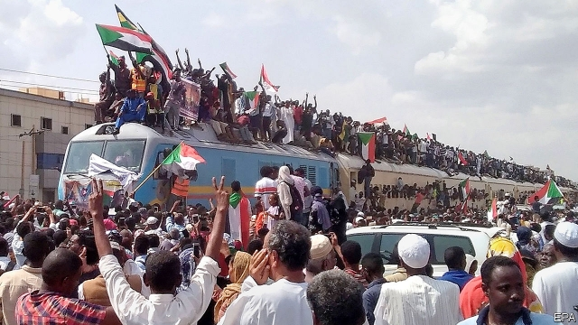

###### Compromise in Khartoum

# A power-sharing deal in Sudan paves the way for civilian rule 

 

> print-edition iconPrint edition | Middle East and Africa | Aug 22nd 2019 

IT WAS A stunning sight for many Sudanese. For nearly 30 years Omar al-Bashir led a crooked and genocidal regime in Sudan. On August 19th, four months after being ousted in a coup, Mr Bashir sat in a cage in a Sudanese courtroom. It was the first day of his trial for corruption. When asked where he lived, Mr Bashir seemed amused by his comeuppance. “Formerly the airport district, at army headquarters, but now Kobar prison,” he said with a laugh. 

Sudan is entering a new chapter, and the trial of Mr Bashir is only part of it. A day earlier, after months of negotiations, the military junta that has run things since the coup agreed to share power with civilian leaders. A transitional government led by Abdalla Hamdok, an economist, is expected to take over on September 1st. If all goes well elections will be held in 2022. News of the deal caused the streets of the capital to erupt in celebration. But many of the democrats rejoicing were also nervous about the path ahead. 

That is because the generals still hold much sway. They signed the agreement only after coming under intense pressure from foreign powers. Under the deal, a new Sovereign Council responsible for defence and foreign affairs will be made up of five soldiers and six civilians. But it will be led by Lieutenant-General Abdel Fattah al-Burhan for 21 months (after which he is supposed to hand over to a civilian). The army also controls the defence and interior ministries, which have large budgets and were responsible for past abuses. The generals, who accumulated vast wealth under Mr Bashir, are already buying off opponents. 

The appointment of Muhammad Hamdan Dagalo (known as Hemedti) to the council is particularly worrying. The paramilitary commander is said to be one of the richest men in Sudan, having strong-armed his way into the gold business. He is also intensely feared. His Rapid Support Forces (RSF) grew out of the Janjaweed, a militia responsible for genocide in Darfur. The RSF led a bloody crackdown on protesters in June, killing more than 100. The generals may worry that real reform will lead to accountability. It is notable that Mr Bashir is on trial only for corruption—not torture or murder, in which the armed forces and security services were complicit. 

Sudan is huge and disunited. Rebel leaders in Darfur, Blue Nile state and South Kordofan rejected the power-sharing agreement, arguing that it did too little to accommodate them. The generals have tried to cut separate deals with these groups. “Given the junta’s desire to divide and rule, the civilian opposition cannot afford to be seen as excluding the rebels from the transition,” says the International Crisis Group, a think-tank. But the opposition is itself divided. Some factions have rejected the agreement because of the role of former junta members and the failure to hold them accountable for past violence. 

The new government faces immediate challenges, not least a collapsing economy. It will try to convince America to remove Sudan from its list of state sponsors of terror, which would open it up to foreign investment. The IMF and World Bank might then help Sudan deal with a mountain of public debt. All that will take time. Meanwhile, Sudanese people are suffering from shortages of food, fuel and electricity. Anger over a spike in the price of bread sparked the first protests against Mr Bashir last year. More unrest may be unavoidable. But for now, at least, there is hope. ■ 

-- 

 单词注释:

1.Khartoum[ka:'tu:m]:n. 喀土穆（苏丹首府） 

2.Sudan[su:'dæn]:n. 苏丹 [化] 苯偶氮间苯二酚; 苏丹 

3.Aug[]:abbr. 八月（August） 

4.stunning['stʌniŋ]:a. 打昏迷的, 弄得人昏头昏脑的, 令人震惊的 

5.Sudanese[su:dә'ni:z]:a. 苏丹的, 苏丹人的 n. 苏丹人 

6.omar['әjmɑ:(r)]:n. 奥马尔（男子名） 

7.crook[kruk]:n. 钩, 弯曲部分, 坏蛋 vt. 使弯曲, 诈骗 vi. 弯曲 

8.genocidal[.dʒenә'saidәl]:a. 种族灭绝的 

9.regime[rei'ʒi:m]:n. 政权, 当权期间, 政体, 社会制度, 体制, 情态 [医] 制度, 生活制度 

10.oust[aust]:vt. 逐出, 罢黜, 剥夺, 驱逐 [法] 驱逐, 剥夺, 免职 

11.coup['ku:]:n. 砰然的一击, 妙计, 出乎意料的行动, 政变 [医] 发作, 中, 击 

12.Bashir[]:n. (Bashir)人名；(英、俄、阿富、巴基)巴希尔；(阿拉伯)贝希尔 

13.courtroom['kɒ:trum]:n. 法庭, 审判室 [法] 法庭, 审判室 

14.corruption[kә'rʌpʃәn]:n. 腐败, 堕落, 贪污 [计] 论误 

15.comeuppance[.kʌm'ʌpәns]:n. 应得的惩罚 

16.formerly['fɒ:mәli]:adv. 从前, 以前 

17.headquarter[,hed'kwɔ:tә]:vt. 将...的总部设在 

18.negotiation[ni.gәuʃi'eiʃәn]:n. 谈判, 磋商, 交涉 [经] 谈判, 协商 

19.junta['dʒʌntә]:n. 以武力政变上台的(军)政府, 私党, 阴谋小集团, 政务会 

20.transitional[træn'siʒәnl]:a. 变迁的, 过渡期的 [医] 转变的, 过渡的; 过渡型单核白细胞 

21.abdalla[]:n. (Abdalla)人名；(葡、塞)阿布达拉；(西)阿夫达利亚；(阿拉伯、坦桑)阿卜杜拉 

22.economist[i:'kɒnәmist]:n. 经济学者, 经济家 [经] 经济学家 

23.democrat['demәkræt]:n. 民主人士, 民主主义者, 民主党党员 [经] 民主党 

24.sovereign['sɒvrin]:n. 元首, 独立国 a. 具有主权的, 至高无上的, 国王的, 完全的 

25.Abdel[]:n. (Abdel)人名；(阿拉伯、哈萨、塔吉、吉尔、乌兹、阿塞、土库、乍、塞)阿卜杜勒 

26.Fattah[]:[网络] 法塔赫 

27.muhammad[]:n. 穆罕默德 

28.Hamdan[]:哈姆丹（苏丹城市, 东经 28º40' 北纬 12º30'） 

29.paramilitary[.pærә'militәri]:a. 辅助军事的 

30.intensely[ɪn'tenslɪ]:adv. 强烈地; 极度; 剧烈地 

31.rsf[]: [医][=raw soybean flour]生大豆粉 

32.janjaweed[]:[网络] 贾贾威德；金戈威德；阿拉伯民兵 

33.militia[mi'liʃә]:n. 义勇军, 民兵组织, 国民军 

34.genocide['dʒenәu,said]:n. 种族灭绝, 灭绝整个种族的大屠杀 [医] 种族灭绝(侵略军队加害居民的罪行) 

35.darfur[dɑ:'fuə]:n. 达尔富尔（苏丹地名） 

36.bloody['blʌdi]:a. 血腥的, 嗜杀的, 有血的 

37.crackdown['krækdaun]:n. 制裁, 镇压, 痛击 

38.protester[]:n. 抗议者, 持异议者, 拒付者 [经] 反对者 

39.accountability[ә.kauntә'biliti]:n. 负有责任, 可说明性 [化] 衡算计量 

40.notable['nәutәbl]:n. 著名人士, 值得注意之事物 a. 值得注意的, 显著的 

41.complicit[kәm'plisit]:a. 有同谋关系的,串通一气的[由 complicity 逆构] 

42.disunite[.disju'nait]:vt. 使分离, 使不和 

43.Nile[nail]:n. 尼罗河 

44.Kordofan[,kɔ:dәj'fæn]:科尔多凡[苏丹省名] 

45.opposition[.ɒpә'ziʃәn]:n. 反对, 敌对, 相反, 在野党 [医] 对生, 对向, 反抗, 反对症 

46.cannot['kænɒt]:aux. 无法, 不能 

47.transition[træn'ziʃәn]:n. 转变, 转换, 变迁, 过渡时期, 临时转调 [化] 跃迁 

48.faction['fækʃәn]:n. 小派系, 内讧 [法] 宗派, 派别, 小集团 

49.accountable[ә'kauntәbl]:a. 负有责任的, 可说明的, 可解释的 [经] 负有责任的 

50.IMF[]:国际货币基金组织 [经] 国际货币基金 

51.spike[spaik]:n. 长钉, 鞋钉, 钉状物, 尖峰状物, 穗 vt. 以大钉钉牢, 用尖物刺穿, 阻止, 弃置不用 [计] 尖峰信号 

52.unavoidable[.ʌnә'vɒidәbl]:a. 不可避免的, 不得已的, 不能作废的 [医] 难免的 

