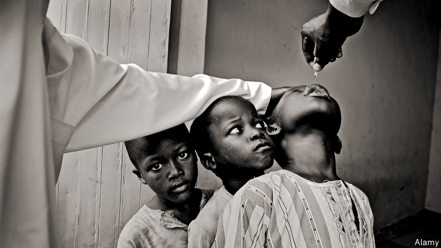

###### Vanquishing the virus

# Africa is on the verge of being declared polio-free 

 

> print-edition iconPrint edition | Middle East and Africa | Aug 22nd 2019 

ERADICATING POLIO is hard. It is even harder when politicians and imams fan the conspiracy theory that the polio vaccine is part of a Western plot to sterilise Muslims, as happened for several years in northern Nigeria. So in 2015 Nigeria’s president, Muhammadu Buhari, decided to set an example. He gave the vaccine to one of his grandchildren on television, before rallying politicians and tribal leaders to join the campaign. 

His efforts, and those of hundreds of thousands of volunteers, have paid off. On August 21st Nigeria marked three years since its last documented case of wild polio. That means the country is set to be declared polio-free by the World Health Organisation-backed Global Polio Eradication Initiative. If that happens, probably next year, all of Africa will be officially free of the virus. Polio will remain in only Afghanistan and Pakistan; and one day it will be completely eradicated, like smallpox was in 1980. 

Mass vaccination in Nigeria, Africa’s most populous country, was a logistical challenge. Health workers went village to village in round after round of campaigns. They were stationed in markets and at border crossings. To reach remote spots, they got creative. Satellite imaging was used to map the islands around Lake Chad. Then health workers went by canoe to deliver the vaccine. 

Violence was a big problem. Polio was last found in a child in Borno, a north-eastern state ravaged by Boko Haram. The jihadist group prefers kidnapping children to vaccinating them. It helped spread the myth about sterilisation. So brave health workers have been rushing into areas from which it retreats (even temporarily). An improving security situation has helped. In 2015 about 600,000 children were not accessible. Now that number is under 100,000. 

Volunteers trained to spot the virus have been crucial in preventing outbreaks—not just of polio. In 2014 they helped trace nearly 900 people who may have been exposed to Ebola after an infected man from Liberia arrived in Lagos. Nigeria quickly contained the virus, which killed eight in the country. 

The big worry now is that polio from Afghanistan and Pakistan may be brought to Africa and lead to new outbreaks. In the past polio from India made its way to Angola and Congo after they were declared polio-free. The strain from Pakistan is already travelling: it was recently found in sewage in Iran. That is one reason why it is important to maintain high vaccination rates in Africa. 

This week’s anniversary is good news, but risks remain. Mutations of the weakened virus in the vaccine are circulating in several African countries, including Nigeria. Higher vaccination rates will solve that problem, too. More work is still needed.■ 

-- 

 单词注释:

1.vanquish['væŋkwiʃ]:vt. 打败, 征服, 克服 [法] 征服, 战胜, 击败 

2.verge[vә:dʒ]:n. 边缘, 边界, 起始点 vi. 处在边缘, 接近, 下沉, 趋向 

3.Aug[]:abbr. 八月（August） 

4.eradicate[i'rædikeit]:vt. 根除, 扑灭, 根绝, 消灭 

5.polio[]:n. 脊髓灰质炎, 小儿麻痹症 [医] 脊髓灰质炎 

6.imam[i'mɑ:m]:n. 阿訇, 伊玛目 

7.conspiracy[kәn'spirәsi]:n. 同谋, 阴谋, 阴谋集团 [法] 阴谋, 通谋, 共谋 

8.polio[]:n. 脊髓灰质炎, 小儿麻痹症 [医] 脊髓灰质炎 

9.vaccine['væksi:n]:n. 牛痘苗, 疫苗 a. 疫苗的, 牛痘的 

10.sterilise['sterɪlaɪz]:vt. 使无用; 使无菌; 使绝育; 使贫瘠化 

11.Muslim['mjzlim; (?@) 'mʌzlem]:n. 伊斯兰教, 伊斯兰教教徒 

12.Nigeria[nai'dʒiriә]:n. 尼日利亚 

13.buhari[]:[网络] 布哈里 

14.rally['ræli]:n. 重振旗鼓, 集合, 群众集会, 跌停回升 v. 重整旗鼓, 集合, 恢复精神, 团结, 挖苦, 嘲笑 

15.tribal[traibl]:a. 部落的, 宗族的 

16.polio[]:n. 脊髓灰质炎, 小儿麻痹症 [医] 脊髓灰质炎 

17.eradication[i,rædi'keiʃәn]:n. 连根拔除, 歼灭, 消灭, 根除, 使断根 [医] 根除, 扑灭, 消灭 

18.officially[ә'fiʃәli]:adv. 作为公务员, 职务上, 官方地 

19.Afghanistan[æf'gænistæn]:n. 阿富汗 

20.Pakistan[.pɑ:ki'stɑ:n]:n. 巴基斯坦 

21.smallpox['smɒ:lpɒks]:n. 天花 [医] 天花, 痘疮 

22.vaccination[.væksi'neiʃәn]:n. 接种疫苗, 种痘 [医] 接种; 种痘 

23.populous['pɒpjulәs]:a. 人口多的, 人口稠密的 

24.logistical[ lə'dʒɪstɪkl]:a. 逻辑的; 后勤方面的 

25.Chad[tʃæd]:n. 乍得 [计] 孔屑 

26.borno['bɔ:nəu]: [地名] [尼日利亚、意大利] 博尔诺 

27.ravage['rævidʒ]:n. 破坏, 蹂躏 v. 毁坏, 破坏, 掠夺 

28.boko['bәukәu]:n. <英俚>鼻子 

29.haram['heәrәm]:n. (=harem)(伊斯兰教徒)女眷居住的内室,闺房, (伊斯兰教徒的)女眷,共配一雄的一群雌性动物 

30.jihadist[]:n. 伊斯兰圣战士 

31.kidnap['kidnæp]:vt. 绑架, 诱拐, 拐骗 [法] 拐带, 诱拐, 绑架 

32.vaccinate['væksineit]:v. 预防接种 

33.myth[miθ]:n. 神话, 虚构的事, 虚构的人 

34.sterilisation[ˌsterɪlaɪ'zeɪʃən]: [医]绝育, 消毒, 灭菌 

35.temporarily['tempәrәrәli]:adv. 暂时, 一时, 临时 

36.ebola[i'bəulə]:n. 埃博拉病毒 

37.Liberia[lai'biәriә]:n. 利比里亚 [经] 利比利亚 

38.Lagos['lɑ:gәs]:n. 拉各斯(尼日利亚的首都) 

39.quickly['kwikli]:adv. 很快地 

40.outbreak['autbreik]:n. 爆发, 暴动 [医] 暴发 

41.Angola[æŋ'^әulә]:[经] 安哥拉 

42.Congo['kɔŋ^әu]:n. 刚果, 刚果河, 工夫茶 [建] 刚果, 直接刚果红 

43.sewage['sju:idʒ]:n. 脏水, 污水 [医] 污水, 污物 

44.Iran[i'rɑ:n]:n. 伊朗 

45.mutation[mju:'teiʃәn]:n. 变化, 突变, 元音变化 [化] 突变 

