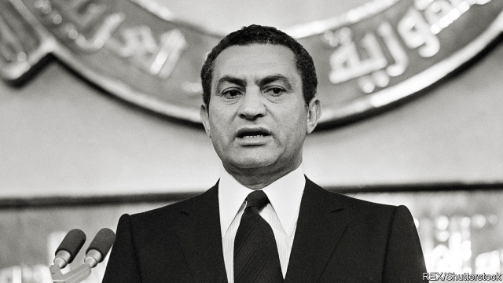

###### La vache qui vit

# Many Egyptians miss their deposed president, Hosni Mubarak 

 

> print-edition iconPrint edition | Middle East and Africa | Aug 22nd 2019 

HOSNI MUBARAK once shut off the internet to discourage protests. So what happened to one of his biggest online supporters this summer is ironic. Karim Hussein shares photos and videos of the former dictator with the 3m followers of his “I’m Sorry, Mr President” Facebook page. Many of his posts are subtly political, like a tongue-in-cheek list of reasons why Egyptians wanted to overthrow Mr Mubarak in 2011: a stable pound; manageable external debt; thriving tourism. (All have worsened since the revolution.) 

Mr Hussein also wrote that the ex-president allowed a free press. That was an exaggeration. But the current president, Abdel-Fattah al-Sisi, does not tolerate even the limited political freedoms his predecessor did. On July 9th police arrested Mr Hussein on suspicion of “spreading false news”. 

Back in 2011, when a popular uprising ended Mr Mubarak’s 30-year rule, it was hard to imagine much nostalgia. Many Egyptians felt their country was adrift, led by an old man who was not up to the job. They mocked his doddering demeanour by calling him la vache qui rit, the laughing cow, after a French brand of processed cheese with a beaming bovine on the box. 

Eight years later, more than a few Egyptians view the past through rose-tinted glasses. Ordinary people recall a president who maintained a subsidy scheme that kept prices low. The dispirited remnants of Egypt’s civil society miss the relative openness. Mr Mubarak allowed a bit of space for opposition, as a safety valve and a sop to the West. Mr Sisi has ramped up executions and persecutes even supporters who step out of line. “They were professionals. Now they’re amateurs,” says one activist of those in charge. 

Mr Mubarak and his sons have stoked nostalgia by returning to the public eye. In May the former president sat for a rare interview with a Kuwaiti journalist. The discussion was largely about foreign affairs. He held forth on Iraq’s invasion of Kuwait in 1990 and Donald Trump’s efforts at Israeli-Palestinian peace. But it cast him back in his cherished role as a well-travelled elder statesman. His eldest son, Alaa, has also become more visible. He pops up in photos on social media, playing backgammon in humble cafés or dining in El Prince, a popular haunt in the working-class Imbaba district, famed for heaping portions of fried liver and other healthy fare. 

All of this seems to unnerve Mr Sisi. On June 26th Alaa was photographed cheering for Egypt at an Africa Cup football match in Cairo. The authorities revoked his fan ID card shortly after, barring him from future matches. Last month he tweeted criticism of a minister who quipped that those who speak ill of Egypt should have their throats cut. A sycophantic newspaper soon accused him of links to the banned Muslim Brotherhood. Samir Sabri, a hyperactive pro-government lawyer, sued him for “solidarity with a terrorist group”. 

This seems irrational. No one truly expects Alaa to challenge Mr Sisi. His patrimony would not protect him—even a former army chief who stood for the presidency last year wound up in jail. But the public has soured on Mr Sisi, who lacks a political party or trusted allies (ironically, his own sons are increasingly powerful aides). “Mubarak had a regime. Sisi has himself,” says an activist. The government’s overreactions are signs of its weakness, not Mr Mubarak’s strength. Coincidentally, your correspondent noticed last month that Egyptair no longer serves processed cheese with its in-flight meals. ■ 
<<<<<<< HEAD

-- 

 单词注释:

1.La[lɔ:, lɑ:]:[医] 镧(57号元素) 

2.vache[]:[网络] 母牛；奶牛；江诗丹顿 

3.qui[]:abbr. 定量超声指数（Quantitative Ultrasound Index）；门控；速度 

4.vit[vit]:abbr. vitreous 玻璃的; vitamin 维他命; vital 活的; vitrified 玻璃化的 

5.depose[di'pәuz]:vt. 免职, 废黜, 作证 vi. 作证, 供证 

6.Hosni[]:n. (Hosni)人名；(阿拉伯)胡斯尼 

7.Mubarak[]:n. 穆巴拉克（姓氏） 

8.Aug[]:abbr. 八月（August） 

9.Hosni[]:n. (Hosni)人名；(阿拉伯)胡斯尼 

10.Mubarak[]:n. 穆巴拉克（姓氏） 

11.online[]:[计] 联机 

12.supporter[sә'pɒ:tә]:n. 支持者, 后盾, 迫随者, 护身织物 [法] 支持者, 赡养者, 抚养者 

13.ironic[aiә'rɔnik]:a. 冷嘲的, 挖苦的, 反话的, 讽刺的, 令人啼笑皆非的, 出乎意料的 

14.Karim[]:n. 卡里姆（男子名） 

15.Hussein[]:n. 侯赛因（姓氏） 

16.dictator['dikteitә]:n. 命令者, 独裁者 

17.follower['fɒlәuә]:n. 从者, 属下, 追补者 [电] 随动机 

18.facebook[]:n. 脸谱网 

19.subtly['sʌtli]:adv. 敏锐地, 巧妙地, 精细地 

20.overthrow[.әuvә'θrәu]:n. 推翻, 瓦解, 倾覆 vt. 打倒, 推翻, 倾覆 

21.manageable['mænidʒәbl]:a. 易办的, 易管理的, 易控制的 

22.worsen['wә:sn]:vt. 使更坏, 使恶化 vi. 变得更坏, 恶化 

23.exaggeration[ig.zædʒә'reiʃәn]:n. 夸张, 夸大的事物, 夸大之词 

24.predecessor[.predi'sesә]:n. 前任, 先辈, 前身 [医] 初牙, 前辈, 祖先 

25.uprise[ʌp'raiz]:n. 升起, 起立, 上山坡, 出现 vi. 上升, 起义, 出现 

26.nostalgia[nɒs'tældʒiә]:n. 乡愁, 向往过去, 怀旧之情 [医] 怀乡病 

27.adrift[ә'drift]:adv. 漂流地, 漂浮着, 随波逐流地 a. 漂浮着的 

28.mock[mɒk]:n. 嘲笑, 戏弄, 模仿 a. 假的, 伪造的, 模拟的 adv. 虚伪地 vt. 嘲弄, 模仿, 使失望, 欺骗, 挫败 vi. 嘲弄 

29.dodder['dɒdә]:vi. 摇摆, 蹒跚 n. 菟丝子 

30.demeanour[di'mi:nә]:n. 行为, 举止 

31.La[lɔ:, lɑ:]:[医] 镧(57号元素) 

32.RIT[]:[计] 信息传输速率 

33.bovine['bәuvain]:a. 牛的；似牛的；迟钝的 

34.dispirit[dis'pirit]:vt. 使沮丧, 使气馁 

35.remnant['remnәnt]:n. 剩余, 零料, 遗迹 a. 剩余的, 残余的 

36.openness['әupәnnis]:n. 公开；宽阔；率真 

37.opposition[.ɒpә'ziʃәn]:n. 反对, 敌对, 相反, 在野党 [医] 对生, 对向, 反抗, 反对症 

38.valve[vælv]:n. 活瓣, 阀, 活门 v. 装阀, 用阀调节 

39.sop[sɒp]:n. 面包片, 湿透的东西, 一滩(液体), 小贿赂, 懦夫 vt. 浸湿, 吸水, 贿赂 vi. 渗透, 湿透 

40.sisi[]:n. (Sisi)人名；(意)西西 abbr. 短增量敏感指数（short increment sensitivity index） 

41.ramp[ræmp]:n. 斜坡, 坡道, 敲诈 vi. 狂跳乱撞, 乱冲, 敲诈, 蔓延 vt. 使有斜面, 敲诈 

42.execution[.eksi'kju:ʃәn]:n. 实行, 完成, 执行, 死刑 [计] 执行 

43.persecute['pә:sikju:t]:vt. 迫害, 虐待, 困扰, 同...捣乱 [法] 迫害, 虐待, 烦扰 

44.activist['æktivist]:n. 激进主义分子 

45.stoke[stәuk]:v. 司炉, (使)大吃 

46.Kuwaiti[ku'weiti, kә'waiti]:a. 科威特的, 科威特人的 n. 科威特人 

47.Kuwait[kә'wait]:n. 科威特 

48.cherish['tʃeriʃ]:vt. 珍爱, 怀有, 爱护 

49.eldest['eldist]:a. 最年长的, 排行中第一的 n. 最年长者, 排行中第一者 

50.alaa[]:n. (Alaa)人名；(阿拉伯)阿拉 abbr. 抗淋巴细胞自身抗体（antilymphocyte autoantibody） 

51.backgammon[bæk'gæmәn]:n. 巴加门15子棋 

52.dining['dainiŋ]:n. 正餐, 宴会 

53.el[el]:abbr. 预期损失（Expected Loss） 

54.haunt[hɒ:nt]:n. 常到的地方, 生息地 vt. 常到, 出没于, 萦绕于 vi. 出没, 作祟 

55.imbaba[]:[网络] 印巴巴；印巴巴区；开罗印巴巴 

56.famed[feimd]:a. 著名的, 闻名的 

57.unnerve[.ʌn'nә:v]:vt. 使失去勇气, 使胆怯, 使不能自制 [医] 除神经 

58.Egypt['i:dʒipt]:n. 埃及 

59.Cairo['kaiәrәu]:n. 开罗 

60.revoke[ri'vәuk]:vt. 撤回, 废除 vi. 藏牌 n. 藏牌 [计] 取消权限程序 

61.id[id]:n. 遗传素质, 本能冲动 [计] 识别, 标识符, 项目说明 

62.tweet[twi:t]:vi. 啁啾 n. 小鸟叫声 

63.quip[kwip]:n. 妙语, 遁辞, 讽刺 v. 说讽刺话, 嘲弄 

64.sycophantic[.sikә'fæntik]:a. 说奉承话的, 阿谀的 

65.Muslim['mjzlim; (?@) 'mʌzlem]:n. 伊斯兰教, 伊斯兰教教徒 

66.Samir[]:n. 萨米尔（用于阿拉伯和印度的男子名） 

67.sabri[]:[网络] 萨布里；耐心；布连 

68.hyperactive[,haipә(:)'ræktiv]:a. 活动过度的 [计] 超...的 

69.sue[su:]:vt. 控告, 起诉, 请求 vi. 提出诉讼, 提出请求 

70.solidarity[.sɒli'dæriti]:n. 团结, 团结一致, 共同一致 [法] 团结, 共同责任 

71.terrorist['terәrist]:n. 恐怖分子 [法] 恐怖份子, 恐怖主义 

72.irrational[i'ræʃәnәl]:n. 无理数 a. 无理性的, 不合理的 

73.patrimony['pætrimәni]:n. 祖传的财物, 继承物 [经] 世袭财产, 遗产 

74.presidency['prezidәnsi]:n. 总统职权, 总裁职位 

75.ally['ælai. ә'lai]:n. 同盟者, 同盟国, 助手 vt. 使联盟, 使联合, 使有关系 vi. 结盟 

76.ironically[]:adv. 冷嘲地, 挖苦地, 讽刺地, 令人啼笑皆非地 

77.aide[eid]:n. 助手, 副官 [计] 数据输入的可说明性 

78.regime[rei'ʒi:m]:n. 政权, 当权期间, 政体, 社会制度, 体制, 情态 [医] 制度, 生活制度 

79.overreaction[]:[经] 反应过度 

80.coincidentally[]:adv. 巧合地；一致地 

81.egyptair[]: 埃及航空公司 
=======
>>>>>>> 50f1fbac684ef65c788c2c3b1cb359dd2a904378

