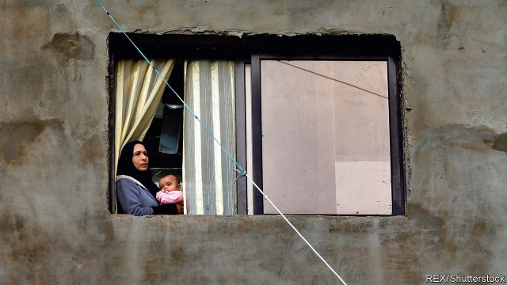

###### No refuge

# Politicians are stoking anti-refugee sentiment in Lebanon 

 

> print-edition iconPrint edition | Middle East and Africa | Aug 22nd 2019 

THE CONCRETE walls ringing the Al-Awdah camp for Syrian refugees in Lebanon appear cheerful. Pink hearts adorn one segment, SpongeBob SquarePants another. The walls, though, are the only remaining traces of 178 homes that were demolished in June, ostensibly for building-code violations. “It’s an upsetting thing,” says Abu Jawad, a longtime resident. “Even if it was only temporary, this was where you raised your children.” 

The demolitions are part of an increasingly vicious campaign against the estimated 1m-1.5m Syrian refugees in Lebanon. Over the past few months the Lebanese government has deported hundreds of them and tightened restrictions on those who remain. Politicians have blamed them for a raft of economic problems. Spurred on by incendiary reports in the press, vigilantes have attacked camps and harassed Syrians in the streets. “I don’t think there is any scenario where this ends well,” says Carmen Geha of the American University in Beirut. 

On an official level, Syrian refugees were never welcomed in Lebanon. Stiff work and visa restrictions and local measures, such as curfews, have been in place for years. When the refugees started arriving in 2011, the government stopped aid agencies from setting up formal camps. Politicians feared that if the Syrians stayed it would upset the sectarian balance underpinning Lebanon’s power-sharing system. In 2015, when Syrian refugees were about a quarter of the population, the government told the United Nations to stop registering new asylum cases. 

But the recent campaign is more intense. The charge has been led by the Free Patriotic Movement (FPM), a Maronite Christian party that rules in alliance with Hizbullah, a Shia militia-cum-party. Gebran Bassil, the foreign minister and son-in-law of President Michel Aoun, alarmed many when he tweeted about the positive “genetic” qualities of Lebanese in June amid a crackdown on foreign labour. Sympathetic media have broadcast footage of members of the FPM youth wing harassing Syrians in Beirut. Police raids have targeted unlicensed Syrian workers. “If you’re dying from hunger, what are you supposed to do?” shouts a Syrian taxi driver. “I have to work to live.” 

According to Lebanon’s main intelligence agency, more than 170,000 refugees have already returned since the end of 2017, either on their own or with the help of the agency’s “voluntary return” scheme, which buses ostensibly consenting refugees back to Syria. In April Lebanon’s top defence council issued orders to start deporting Syrians who cross into Lebanon illegally. Hundreds of Syrians, including army defectors, have since been deported without due process, according to aid groups. “This is a red line that has been crossed,” says Ghida Frangieh, a lawyer with Legal Agenda, a local advocacy group. 

Those who want to send the Syrians home note that Lebanon has more refugees relative to its population than any other country. (Half of Mexico could settle in the United States and Lebanon would still come first.) Officials say refugees strain roads, hospitals, schools and electricity and water supplies, while crowding Lebanese out of jobs. They suspect that many Syrians cross the border just for the handouts, and that aid workers are exaggerating the crisis to justify their jobs. “Who is the only loser here? Lebanon,” says Nicolas Chedrawi of the FPM. 

The actual impact of refugees on the economy is less clear. Syrians do compete with Lebanese for low-skilled jobs. But increased demand for teachers, doctors and other service-providers has created new work, too. An injection of aid money has boosted consumption. Most of Lebanon’s problems, from power cuts to the non-collection of rubbish, are not because of refugees, but because of Lebanon’s dysfunctional and corrupt politics. 

Lebanese officials push the idea that Syria is now safe. “That is stupid, stupid, stupid,” says an aid worker. Dozens of civilians have been killed recently, as the Syrian government tries to retake the last major rebel stronghold, in and around Idlib province. The risk of arbitrary detention and disappearance remain high. Young men who return face military conscription. Others are exposed to revenge attacks from embittered neighbours or Syria’s many unruly militias. 

The authorities in Lebanon appear undeterred by the principle of non-refoulement, which prohibits sending people back to countries where they will face persecution. Other governments in the Middle East and elsewhere are considering similar actions—and taking them. Turkey, which has 3.6m Syrian refugees, stands accused of deporting some of them to Idlib. 

Many Lebanese think Mr Bassil is whipping up nativist fervour to further his own presidential ambitions. “In a way, he is our Trump,” says Ahmad Fatfat, a former lawmaker with the Future Movement, a Sunni party. The response from other politicians has been muted. Most seem content to scapegoat Syrian refugees, instead of taking responsibility for their own failures. ■ 

