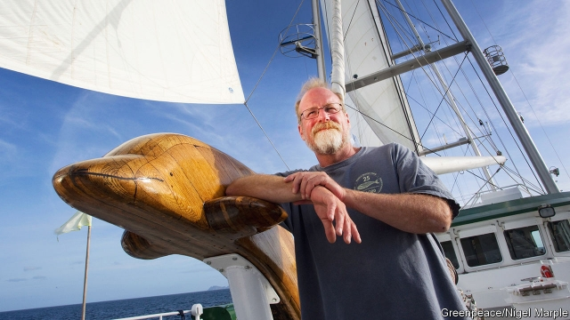

###### Hoisting the sails

# Obituary: Steve Sawyer died on July 31st 

 

> print-edition iconPrint edition | Obituary | Aug 22nd 2019 

THE YOUNG MAN Steve Sawyer briefly met on July 10th 1985 on the deck of the Greenpeace boat Rainbow Warrior, as it sat in dock at Auckland in New Zealand, had nothing remarkable about him. Short, slim, clean-shaven and with light blond hair, he looked like just another student visitor. He wished Mr Sawyer a happy birthday—as it was, with the full works of ice cream and cake—and good luck with his current campaign, to stop French nuclear testing in Mururoa. Then he left. At 1am, after a meeting onshore of the skippers of all the protest boats, Mr Sawyer got the call that the Rainbow Warrior had been sunk. Two limpet bombs placed on the hull had exploded, driving a huge hole through the engine room, and the boat’s photographer had drowned while trying to rescue his gear. 

The “student”, it turned out, belonged to the French secret service. Mr Sawyer had long suspected that the French would try something. His campaign in Polynesia had been deliberately designed to annoy the hell out of them, so that they would take their radioactive poison and their vile weapons away from where people were trying to live. The Rainbow Warrior had already been rammed by French vessels and the crew beaten up, non-violence met with violence, so the gritty old re-purposed trawler was used to confrontation. This, however, was a whole new level. 

And the repercussions shocked him. As he was trying to get to grips with the situation, people began turning up with bucketfuls of money. When he went to find a taxi, he was ushered to the front of the queue. In the baked-potato shop, the man at the cash register would not charge him. Across the world, people made donations and joined Greenpeace to protest against oil-drilling, mining, seal-hunting, whaling and dumping of toxic waste, as well as nuclear testing—anything which, in the words of Aldo Leopold, on which he had hung since college, destroyed “the integrity, stability and beauty” of the biosphere. Long before mobile phones, the bombing of the Rainbow Warrior created a media storm around him. The next year he found himself director of Greenpeace USA, and two years later director of Greenpeace International. 

The bombing had filled him, and through him Greenpeace, with even more defiant purpose. Since its founding in 1971 this had been a raggedy band, making its point with risky stunts that were denounced more than praised. It was this hippy-crazy aspect that had made him, a hippy himself back then, sign up immediately when a canvasser came to the door. But he found, as a lifelong devotee of Tolkien, a strong Hobbit element too. When battered little boats put themselves between illegal whaling vessels and the whales, daring them to fire their harpoons, or their crews sprayed seal pups with green dye to make their fur worthless; when activists, so tiny against those monsters, scaled oil-rigs in the North Atlantic to unfurl banners reading “Climate Emergency”, or blocked pipelines belching toxic waste into the sea, he was reminded of the brave little group of Bilbo, Frodo, Sam and the rest, who left the quiet Shire “to shake the towers and counsels of the Great”. They were small, shaggy-haired and barefoot, usually unarmed and often frightened. But they lived, and eventually triumphed, by their wits. Every problem had a solution, and every battle could be won, if you thought hard and fast enough. 

He taught himself that, deliberately wandering off barefoot in the woods to have to puzzle his way home. He taught his children that (giving his son Sam a good Hobbit name). And he taught Greenpeace, fiercely applying his red pen to press releases and, when necessary, demanding sharp thinking as loudly as he liked to play his blues guitar. He became, and was inevitably called, Gandalf, not merely for his grizzled beard, lean sportsman’s height and philosophy degree, but also for the wise way he managed his ever-growing crowd of anti-authoritarians. Under him the organisation gained weight in every sense. Therefore it won battles. The French abandoned their nuclear testing in Polynesia, besides losing the damages suit that Greenpeace had filed against their government. Bugged by small-boat irritation, the United States ceased its testing off Alaska. In 1987 the Montreal protocol curbed CFC depletion of the ozone layer, and in 1991 the Antarctic protocol, which people thought unachievable, barred drilling there for 50 years. By the time he stepped down, in 2007, he had put Greenpeace at the centre of attempts to counter climate change. 

Under him it also expanded its humanitarian side, sending its boats to help after typhoons and tsunamis. This was a role which it, and he, had stumbled into almost by accident in 1985, when he made a detour on Rainbow Warrior’s voyage to Polynesia to evacuate 300 people, their livestock and parts of their buildings from Rongelap atoll to another island. Fallout from American nuclear testing had made the atoll uninhabitable, but the Americans had declared it clear, despite a horrifically high rate of stillbirths, deformities and cancers. Nothing he did afterwards meant more to him than that rescue, and few things moved him more than seeing the livid thyroidectomy scars of the women who greeted him. But one was the thought of what Greenpeace was engaged in: “nothing less than a fight to the death for the future of the planet”. 

His progress in that fight could be traced through the Greenpeace boats. The seaborne aspect of most protests was partly why he had joined, as someone who had loved to sail from childhood on the lakes near his home in New Hampshire. In 1981 he masterminded the refit of the first Rainbow Warrior, putting in bus engines because, appropriately, they had been used in landing craft on D-Day, and later installing a ketch rig for the Pacific voyage. Its successor, Rainbow Warrior II, launched in 1989, was a refitted three-mast schooner; the next, Rainbow Warrior III, was a purpose-built yacht with no less than 1,255 square metres of sail. By then, as director of the Global Wind Energy Council, he was working full-time and worldwide to promote wind power. It was promoted too through the ever-increasing strength, utility and beauty of the Rainbow Warriors, risen from the harbour floor in Auckland to take on the guarding of the Earth.■ 
<<<<<<< HEAD

-- 

 单词注释:

1.hoist[hɒist]:n. 升高, 起重机, 推动 v. 升起, 升高, 举起 

2.steve[]:n. 史蒂夫（男子名） 

3.sawy[]:n. (Sawy)人名；(阿拉伯)萨维 

4.obituary[ә'bitjuәri]:a. 关于死亡的, 讣告的 n. 讣告 

5.Aug[]:abbr. 八月（August） 

6.briefly['brifli]:adv. 简短地, 扼要地, 简明地, 简单地 

7.greenpeace['gri:npi:s]:n. 绿色和平组织（保护动物不遭捕猎等） 

8.warrior['wɒ:riә]:n. 战士, 勇士, 武士, 鼓吹战争的人, 战斗, 尚武 

9.Auckland[ɒ:klәnd]:n. 奥克兰(新西兰港口) 

10.zealand['zi:lәnd]:n. 西兰岛（丹麦最大的岛） 

11.blond[blɒnd]:a. 金发的 n. 白肤碧眼金发的人 

12.mururoa[]:[网络] 穆鲁罗阿；穆鲁路；穆鲁罗瓦 

13.onshore['ɒnʃɒ:]:a. 向陆的, 陆上的, 在国内的 adv. 向陆地, 在陆上, 在国内 

14.skipper['skipә]:n. 船长, 机长, 队长 

15.limpet['limpit]:n. 纠缠者 

16.hull[hʌl]:n. 壳, 皮, 船体 vt. 去壳 

17.Polynesia[.pɒli'ni:ʒiә]:n. 波利尼西亚 

18.vile[vail]:a. 恶劣的, 肮脏的, 低廉的, 卑鄙的 [法] 极坏的, 恶劣的, 卑鄙的 

19.ram[ræm]:n. 公羊, 撞锤 vi. 猛击, 撞 vt. 猛击, 填塞, 反复灌输 n. 只读内存, 随机存取内存, 随机存取存储器 [计] 随机存取存储器 

20.gritty['griti]:a. 有砂砾的, 坚韧不拔的 

21.trawler['trɒ:lә]:n. 拖网渔船 [法] 拖网船, 拖网捕鱼的船, 拖网捕鱼的人 

22.confrontation[.kɔnfrʌn'teiʃәn]:n. 对抗；对质；面对 

23.repercussion[.ri:pә'kʌʃәn]:n. 弹回, 反响, 反射 [医] 消退[法], 消肿[法], 浮动诊胎法 

24.bucketful['bʌkitfjl]:n. (一)桶, 满桶 

25.usher['ʌʃә]:n. 引座员, 招待员 vt. 引导, 招待 vi. 作招待员 

26.donation[dәu'neiʃәn]:n. 捐赠物, 捐款, 捐赠 [经] 赠品, 捐款, 捐赠 

27.toxic['tɒksik]:a. 有毒的, 中毒的 [医] 中毒的, 毒物的 

28.aldo['ɑ:ldәj,'ɔ:l-,'æl-]:n. 奥尔多（男子名） 

29.leopold['li:әpәjld]:n. 利奥波德（男子名） 

30.integrity[in'tegriti]:n. 正直, 廉正, 完整 [计] 完整性 

31.biosphere['baiәsfiә]:n. 生物圈 [医] 生物圈, 生物层 

32.USA[ju: es 'ei]:美国, 美利坚合众国, 美国陆军 

33.defiant[di'faiәnt]:a. 挑衅的, 目中无人的 

34.raggedy['ræ^idi]:a. 有些破的, 有些参差不齐的, 有些刺耳的 

35.risky['riski]:a. 危险的 

36.stunt[stʌnt]:n. 特技, 绝技, 花招, 噱头, 手腕, 发育不良 vt. 阻碍成长 vi. 表演特技 

37.denounce[di'nauns]:vt. 告发, 抨击, 谴责 [法] 谴责, 斥责, 告发 

38.hippy['hipi]:n. 嬉皮士 

39.canvasser['kænvәsә]:n. 游说者, 检票员, 兜揽生意的人 [经] 推销员, 兜揽生意的人保险经纪人 

40.lifelong['laiflɒŋ]:a. 终身的, 毕生的 

41.devotee[.devә'ti:]:n. 爱好者, 献身者, 虔诚的宗教信徒 

42.Tolkien[]:n. (Tolkien)人名；(英)托尔金 托尔金 

43.hobbit['hɑbət]:n. （英国作家J R R Tolkien笔下的） 

44.batter['bætә]:v. 连续猛打（尤其指妇女），猛击 n. 面糊（食物），击球员，打击手 

45.harpoon[hɑ:'pu:n]:n. 鱼叉 vt. 用鱼叉叉, 用鱼叉捕获 

46.pup[pʌp]:n. 小狗, 幼畜, 令人讨厌的年轻人 v. 生小狗 

47.activist['æktivist]:n. 激进主义分子 

48.monster['mɒnstә]:n. 怪物, 恶人, 巨物 [医] 畸胎 

49.unfurl[.ʌn'fә:l]:vt. 展开, 展示, 公开, 使临风招展 vi. 打开, 展开, 显露 

50.belch[beltʃ]:vi. 打嗝, 喷吐 vt. 打嗝, 吼叫着发出(命令), 喷吐 n. 打嗝, 喷吐 

51.bilbo['bilbәu]:n. 好剑, 带枷的铁镣 

52.frodo[]: [人名]弗罗多 

53.SAM[sæm]:[计] 安全性帐户管理器 

54.shire['ʃaiә]:n. 郡 

55.counsel['kaunsәl]:n. 商议, 忠告, 法律顾问 v. 商议, 劝告 

56.barefoot['bєәfut]:a. 赤脚的 

57.unarm[.ʌn'ɑ:m]:vt. 缴械 vi. 放下武器 

58.fiercely['fiәsli]:adv. 猛烈地, 厉害地 

59.inevitably[in'evitәbli]:adv. 不可避免地 

60.Gandalf[]:甘道夫（人名） 

61.grizzle['grizl]:n. 灰色, 灰色物, 斑白头发 vi. 变成灰色, 抱怨 vt. 使成灰色 

62.organisation[,ɔ: ^әnaizeiʃən; - ni'z-]:n. 组织, 团体, 体制, 编制 

63.bug[bʌg]:n. 错误, 虫, 病菌, 缺陷, 窃听器, 癖好, 防盗报警器, 双座小汽车, 要人 vt. 装防盗报警器, 装窃听器, 激怒 vi. 捉虫, 暴突 [计] 缺点, 错误 

64.irritation[.iri'teiʃәn]:n. 刺激, 烦恼, 刺激物 [医] 刺激[作用], 兴奋 

65.Alaska[ә'læskә]:n. 阿拉斯加州 

66.montreal[,mɔntri'ɔ:l]:n. 蒙特利尔（加拿大东南部港市） 

67.protocol['prәutәkɒl]:n. 草案, 礼仪, 协议 v. 拟定 [计] 协议, 协议列表实用程序 

68.curb[kә:b]:n. 抑制, 勒马绳, 边石 vt. 抑制, 束缚, 勒住 

69.cfc[]:abbr. 中央发射控制（Central Fire Control）；全套设备控制台（Complex Facility Console）；统一运费分类表（Consolidated Freight Classification）；认证理财顾问师（ertified Financial Consultant） 

70.depletion[di'pli:ʃәn]:n. 消耗, 耗尽, 放血 [医] 排除, 缺失(液体), 衰竭[状态](由于缺液) 

71.ozone['әuzәun]:n. 新鲜的空气, 臭氧, 使人愉快的影响 [化] 臭氧 

72.unachievable[ˌʌnəˈtʃi:vəbl]:a. 不可实现的 

73.humanitarian[hju:.mæni'tєәriәn]:n. 人道主义者, 博爱者, 基督凡人论者 a. 人道主义的, 博爱的, 凡人论的 

74.tsunami[tsu'nɑ:mi]:n. 海啸 

75.detour['di:tuә]:n. 绕路, 迂回 v. (使)绕道 

76.Rongelap[]:[网络] 朗格拉普；辐射尘还污染了；隆吉拉普 

77.atoll['ætɒl]:n. 环状珊瑚岛, 环礁 

78.fallout['fɒ:laut]:n. 原子尘的降下, 辐射性微尘, 原子尘, 附带结果 [医] [放射尘]回降 

79.uninhabitable['ʌnin'hæbitәbl]:a. 不可居住的, 不适宜居住的 

80.horrifically[hɔ'rifikəli]:adv. 极其可怕地；令人恐惧地 

81.stillbirth['stilbә:θ]:n. 死产, 死胎 [医] 死产 

82.deformity[di'fɒ:mәti]:n. 残缺, 畸形, 残缺者 [医] 变形, 畸形 

83.afterwards['ɑ:ftәwәdz]:adv. 然后, 后来 

84.livid['livid]:a. 铁青的 [医] 青紫的 

85.thyroidectomy[.θairɒi'dektәmi]:n. 甲状腺切除术 [医] 甲状腺切除术 

86.les[lei]:abbr. 发射脱离系统（Launch Escape System） 

87.seaborne['si:bɒ:n]:a. 海上的, 漂流的 [经] 海运的, 由海轮装运的 

88.hampshire['hæmpʃiә]:n. 汉普郡（英国南部之一郡） 

89.mastermind['mɑ:stәmaind]:n. 优秀策划者, 才子 vt. 指导, 主持, 策划 

90.refit[.ri:'fit]:v. 整修, 改装 n. 整修, 改装 

91.appropriately[]:adv. 适当的, 恰如其分的, 恰当的, 合适的 

92.ketch[ketʃ]:n. 双桅纵帆船 

93.rig[rig]:n. 装备, 帆装 vt. 装配, 装扮, 给船装帆, 垄断, 操纵 

94.successor[sәk'sesә]:n. 继承者, 接任者 [计] 后继 

95.ii[]:abbr. 微光（Image Intensification） 

96.schooner['sku:nә]:n. 纵帆船, 大酒杯 

97.iii[]:num. 罗马数字3 

98.yacht[jɒt]:n. 快艇, 游艇 vi. 驾游艇, 乘游艇 

99.warrior['wɒ:riә]:n. 战士, 勇士, 武士, 鼓吹战争的人, 战斗, 尚武 
=======
>>>>>>> 50f1fbac684ef65c788c2c3b1cb359dd2a904378

