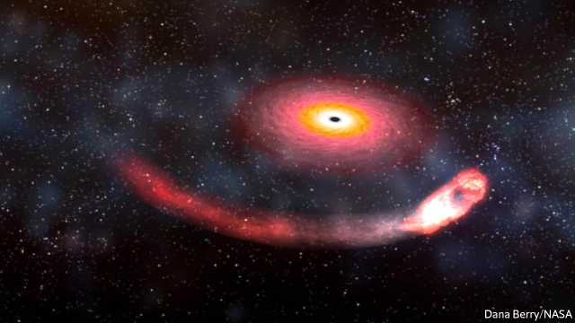
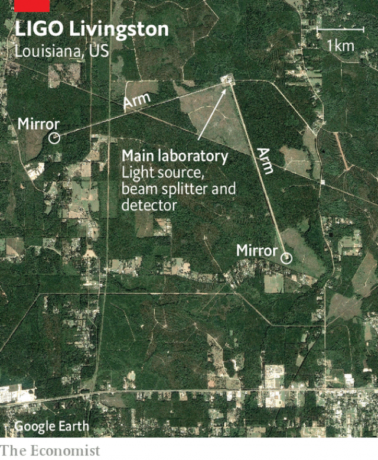
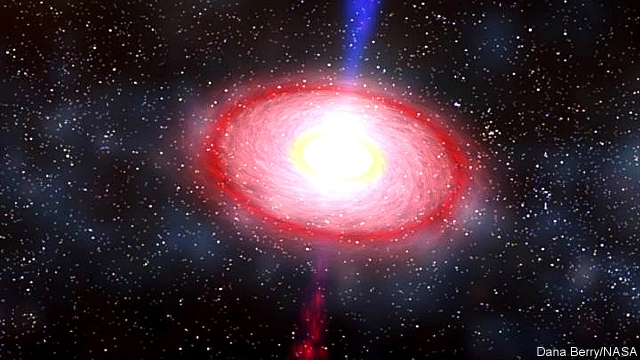

###### Space

# Gravitational astronomy proves its maturity 

 

> print-edition iconPrint edition | Science and technology | Aug 22nd 2019 

ON AUGUST 14TH, just after 9pm Universal Time, a ripple of gravitational waves reached Earth. Until a few years ago no one would have noticed such an event. But 2015 saw the reopening, after an upgrade, of the Laser Interferometer Gravitational-wave Observatory (LIGO), a pair of detectors in Washington state and Louisiana. These were joined in 2017 by Virgo, an upgraded instrument in Italy. Together, the three instruments not only recorded the wave’s passage, they also worked out where in the sky it had come from and then texted that information to the world’s astronomers. 

This stimulated the deployment of a host of other devices, to look at the wave’s point of origin near the border between the constellations of Cetus and Sculptor. Telescopes capable of examining all parts of the spectrum, from gamma rays to radio waves, were brought into play. And, courtesy of IceCube, an instrument at the South Pole, the sky was also scanned for tiny particles known as neutrinos that might have been released by whatever humungous event it was that had disturbed the fabric of the space-time continuum to create such a gravitational ripple. 

The provisional conclusion of all this “multimessenger” activity is that the detectors were witness to the merger, 900m light-years away, of a neutron star and a black hole—an event prosaically dubbed S190814bv by LIGO’s masters. If confirmed, S190814bv will the first such merger discovered (previous gravitational-wave observations were of two black holes or two neutron stars colliding). As in many other walks of life, three may be taken as a trend, and the detection of this third type of event thus marks the coming of age of the new field of gravitational astronomy. 

Gravitational waves are distortions of space-time that transmit the force of gravity from one place to another. They were predicted by Albert Einstein in 1916 as part of his general theory of relativity (which, despite its name, is really a theory of gravity). However, in the context of astronomical objects then known, the waves’ expected size was so small that Einstein himself doubted they would be measurable. 

That changed with the discovery of dense, massive objects such as neutron stars (the remnants of supernova explosions) and black holes (objects of various origin in which mass is so concentrated that even light cannot escape their gravity fields). Calculations showed that mergers between these sorts of objects would produce gravitational waves that might be detectable by big enough, sensitive enough instruments. Meanwhile, a century of economic growth and technical progress since Einstein’s day has provided both the money and the prowess for those instruments to be constructed. 

 

Gravitational-wave detectors work (see diagram) by splitting a laser beam in twain. The two halves of the beam are then sent down separate arms, several kilometres long, that are oriented at right angles to one another (see satellite photograph below). Each arm has a mirror at the end to reflect its half-beam back whence it came, and the reflected half-beams are then recombined. Normally, this recombination causes peaks in one half-beam’s waves to overlie troughs in the other’s, and vice versa, resulting in darkness. But if the lengths of the arms are distorted by a passing gravitational wave then the beams will not match in this way. Instead, they generate an interference pattern which gives away the characteristics of the passing gravitational blip. Even when the objects generating a gravitational wave are as massive as neutron stars or large black holes, the blip’s effects are tiny—a distortion a thousandth of the width of a proton over the course of a 4km-long detector arm. But laser interferometry, as this technique is known, is sensitive enough to pick up such tiny differences. 

 

LIGO bagged its first quarry, a signal from the merger of two black holes, in September 2015. Since then, it and Virgo have recorded and confirmed another nine such events, and also noted the merger of two neutron stars. If S190814bv does prove to have been a neutron star/black hole merger, that will make it easier to compare and contrast these different types of event. 

Gravitational waves are, as the text messages following the detection of S190814bv show, now part of a bigger endeavour involving the collation of data from many different sources. This was first done successfully after the detection, in August 2017, of the first neutron-star merger. The cosmic fireworks set off by that merger started with a burst of gravitational waves 100 seconds long. Less than two seconds after this burst had begun, a pair of space-based observatories, NASA’s Fermi Telescope and the European Space Agency’s International Gamma-ray Astrophysics Laboratory, detected a burst of gamma rays coming from a galaxy known as NGC 4993, 130m light-years from Earth in a constellation called Hydra. Nor did events end with the gamma rays. They were followed by a kilonova—a burst of optical and ultraviolet radiation powered by the radioactive decay of heavy elements newly formed in the explosion. For a year afterwards, the debris left behind glowed with radiation ranging from X-rays to radio waves. 

GW170817, as this neutron-star merger was dubbed, was a gold mine for astronomers—literally. The kilonova’s spectrum suggests gold and platinum were among the elements generated by the event, confirming that such explosions are a source of these metals, which are too heavy to be created, as lighter elements are, by ordinary nuclear processes inside stars. The near-simultaneous arrival of GW170817’s gravitational waves and gamma rays also confirmed the prediction made by Einstein that gravitational waves would travel at the speed of light. 

What GW170817 did not bring, which S190814bv might, is a chance to see inside a neutron star itself, if the black hole ripped it apart before the two merged. There are plenty of ideas about what might be going on inside neutron stars, but because it is impossible to replicate the conditions found there in a laboratory on Earth, no one knows for sure. Theory suggests that matter more than a kilometre below a neutron star’s surface will be compressed into blobs, tubes and sheets—a state of being referred to as “nuclear pasta” because of its resemblance to gnocchi, spaghetti and lasagne. If nuclear pasta exists, it is probably the strongest material in the universe. One calculation suggests it would be 10bn times stronger than steel. 

Whether S190814bv will reveal that neutron stars are cosmic primi piatti remains to be seen. The closer that the two objects involved turn out to have been in mass, the longer it would have taken the black hole to tear the neutron star apart, and the more time that object’s glowing innards would have been on display to the universe (and watching astronomers) before the black hole consumed them. If, however, the black hole was a lot bigger than its partner, the neutron star would probably have fallen into it with little fanfare. 

Black holes and neutron stars form when large stars run out of fuel and collapse. Though both are heavy and dense, their physical natures are strikingly different. Neutron stars, as their name suggests, are made largely of neutrons. These are constituents of ordinary matter, found in the nuclei of all atoms except the lightest isotope of hydrogen, which is a lone proton. Black holes, by contrast, are “singularities”. This means they have no internal structure, only mass. 

One consequence of this difference is, as Christopher Berry, an astronomer at Northwestern University and a member of the LIGO Scientific Collaboration, puts it, that “neutron stars, being made of stuff, can get distorted, whereas black holes do not.” It is from the imprint those distortions make on the gravitational waves which a collision generates that information about things like nuclear pasta can be deduced. 

In the case of S190814bv the crucial mass ratio that might expose the pasta has yet to be determined. The reason astronomers believe they have witnessed a neutron star/black hole merger is the masses of the objects involved. The larger had more than five times the mass of the sun, and physics dictates that something this massive which is generating no starlight to counteract the pull of its gravity must be a black hole. The smaller object, by contrast, was below three solar masses. That is too light to have collapsed into a black hole and so it was presumably a neutron star. But the objects’ precise relative masses—and thus the likelihood of the neutron star having spilled its guts—remain to be determined. 

Collisions involving neutron stars give astronomers an insight into the properties of these bodies. But LIGO and Virgo should also be able to detect non-colliding neutron stars, as long as they are spinning rapidly. Rapidly spinning neutron stars are called pulsars. They produce a beam of electromagnetic waves that can be seen only if it points directly at an observer, in the manner of a lighthouse. They may also produce detectable gravitational waves. Any imperfection on a pulsar’s surface—even a bump just a millimetre high—would do the trick. It would broadcast gravitational waves that would likewise be beamed in a lighthouse pattern. Given the intense gravity at a neutron star’s surface, the height of any millimetric mountains, measured by the strength of the gravitational waves arriving at Earth, would provide astronomers with a way to measure how stiff the neutron star’s internal nuclear pasta really is. 

Another eagerly awaited source of gravitational waves is a supernova, an explosion marking the death throes of a massive star. Watching such an explosion with modern instruments, including LIGO, Virgo and neutrino detectors such as IceCube, would not be easy. Gravitational waves from a supernova explosion are predicted to be weak, so the source would have to be close by (ie, within Earth’s home galaxy, the Milky Way) for LIGO and Virgo to be able to detect them. The estimated rate of such events in the Milky Way is one to three per century and the last known example, concealed from human eyes at the time by dust and gas but discovered subsequently by radio astronomy, occurred near the beginning of the 20th century. 

Unlike electromagnetic radiation or neutrinos, gravitational waves from a supernova could tell astronomers how the dense matter within a star was swirling around as it exploded. They could also help determine whether an exploding star collapsed symmetrically or not. And, after a supernova explosion has blown off much of the stellar material, what remains often becomes a neutron star or a black hole. By observing the evolution of a supernova, astronomers would be able to watch in real time as the material inside the original star settled and those most extreme cosmic objects were born out of it. 

While some astronomers seek to use gravitational waves to understand the structure of cosmic objects, others want to employ this new era of astronomy to test the limits of the general theory of relativity. So far, every prediction made by this theory has been borne out, yet physicists know that relativity cannot be the last word on matters gravitational because it stubbornly refuses to mesh with quantum theory, which is the best available explanation for everything else in the universe. Szabolcs Marka, a physicist at Columbia University in New York, and one of those who pioneered the collaborative ideas behind multimessenger astronomy, thinks that gravitational astronomy might square this circle. He reckons the best bet would be to look for deviations from relativity’s predictions in the waves given out by two black holes orbiting each other. 

A longer-term goal for gravitational-wave astronomers is to see further back in time than has been possible with electromagnetic radiation. Until the universe was around 400,000 years old, it was so hot and dense that any light generated was instantly absorbed, and so no electromagnetic signal remains. The early universe would, however, have been transparent to gravitational waves. Detecting these so-called cosmological waves could provide a picture of the moment when the singularity from which the universe was born began its Big Bang expansion. 

After 13.8bn years of the expansion of space since the Big Bang happened, cosmological gravitational waves would now be tenuous things indeed. They would be hidden under layers of background hum composed of gravitational waves from random astrophysical processes going on all over the sky. If astronomers did manage to detect them, however, they would be able to study the earliest seconds of the universe, answering long-asked questions about how quickly it expanded to start with and how uniform that expansion was. 

 

After that they will seek to check some highly theoretical ideas. Gravitational waves could help with the search for cosmic strings—putative enormous, superdense filamentary structures in space. “If they do exist, those cosmic strings can kind of wriggle and wiggle around, and every so often, the wiggling leads to a cracking, like cracking a whip,” says Patrick Brady, an astronomer at the University of Wisconsin-Milwaukee who is the LIGO Scientific Collaboration’s spokesman. “And,” he continues, “the whipcrack generates gravitational waves that could be detectable by us.” 

The true excitement, says Dr Brady, would be if astronomers saw a blip inexplicable by neutron stars, black holes, supernovae or even cosmic strings. “We’re constantly looking for such things—we refer to them as unmodelled bursts of gravitational waves because, as yet, we don’t have physical theoretical models for them. If we ever did find a blip that was a confident gravitational-wave detection, but was not explained as a compact binary, then it would be incredibly exciting.” 

If all goes well, the current generation of gravitational-wave observatories will be joined at the end of the year by the Kagra interferometer in Japan and, by 2024, by LIGO-India, which is under construction at a site 450km east of Mumbai. Detectors placed all around the world like this will allow astronomers to improve their ability to locate which part of the sky future gravitational-wave discoveries come from, as well as providing independent verification of individual detections. 

LIGO itself is due for another upgrade within the next few years. This will almost double its sensitivity, permitting it to observe with the same rigour a volume of space seven times larger than now. Beyond that, the European Space Agency’s Laser Interferometer Space Antenna (LISA), scheduled for 2034, will be the first orbiting gravitational-wave instrument. Its detectors will be arranged in an equilateral triangle with sides 2.5m kilometres long. LISA will be sensitive to low-frequency waves that currently get lost in the noise. 

Looking still further ahead, another generation of ground-based observatories is competing to take over once LIGO’s useful life is at an end. Europe is offering the Einstein Telescope, a proposed interferometer with three arms arranged in an equilateral triangle buried underground and cooled to within ten degrees of absolute zero, to improve its sensitivity. America proposes the Cosmic Explorer, a version of LIGO with arms 40km long. Either would be able to spot black-hole mergers almost anywhere in the universe. 

The promise of gravitational astronomy is, then, enormous. It will show better how heavy elements are created. It could answer questions about the early universe that have nagged physicists for decades. It might even reconcile general relativity with quantum theory. From Copernicus to Kepler to Newton, understanding gravity and how it binds objects in the universe together was the project that launched physics as an intellectual discipline. The latest results from LIGO and Virgo show that there is life in the old dog yet.■ 

-- 

 单词注释:

1.gravitational[.grævi'teiʃәnәl]:a. 重力的 

2.maturity[mә'tjuәriti]:n. 成熟, 完备, 到期 [医] 成熟, 成熟期, 发育期 

3.Aug[]:abbr. 八月（August） 

4.ripple['ripl]:n. 涟波, 涟漪, 波纹, 粗钢梳 vt. 使起涟漪 vi. 起微波, 起潺潺声 

5.gravitational[.grævi'teiʃәnәl]:a. 重力的 

6.reopen[.ri:'әupәn]:v. 重开, 再开始, 再开 

7.upgrade['ʌpgreid]:n. 上坡, 升级, 上升 adv. 往上 vt. 使升级, 提升, 改良品种 vi. 升级 [计] 升级 

8.lase[leiz]:vi. 发出激光, 以激光照射 

9.interferometer[.intәfә'rɒmitә]:n. 干涉仪 [化] 干涉仪 

10.observatory[әb'zә:vәtәri]:n. 天文台, 气象台, 了望台 

11.ligo[]: [人名] 莱戈 

12.detector[di'tektә]:n. 发现者, 检验器, 检波器 [计] 检波器; 检测器 

13.Washington['wɒʃiŋtn]:n. 华盛顿 

14.Louisiana[lu:.i:zi'ænә]:n. 路易斯安那(美国州名) 

15.virgo['vә:ɡәu]:n. [天]处女座；维尔格铬镍钨 

16.texted[]: text（发短信）的过去式与过去分词形式 

17.deployment[]:[计] 展开 

18.constellation[.kɒnstә'leiʃәn]:n. 星座, 荟萃 [化] 构象 

19.Cetus['si:tәs]:n. 鲸鱼座 

20.sculptor['skʌlptә]:n. 雕刻家 

21.spectrum['spektrәm]:n. 光谱, 范围, 系列 [化] 光谱 

22.gamma['^æmә]:n. 希腊语的第三个字母(Γ,γ) [医] γ(希腊文第三个字母), 丙种, 微克(千分之一毫克) 

23.courtesy['kә:tisi]:n. 礼貌, 谦恭, 好意 [法] 优待, 礼貌, 恩惠 

24.icecube[]:un. 冰块 [网络] 冰立方；微中子观测网；冰立方望远镜 

25.neutrino[nju:'tri:nәu]:n. 中微子 [化] 中微子; 微中子 

26.humungous[hju:'mʌŋ^әs]:a. <俚>极大的,其大无比的 

27.continuum[kәn'tinjuәm]:n. 连续统一体, 连续统, 闭联集 [化] 连续区; 连续谱; 连续介质 

28.provisional[prә'viʒәnl]:a. 暂时的, 暂定的, 临时的 [医] 临时的 

29.multimessenger[]:[网络] 多人 

30.merger['mә:dʒә]:n. 合并, 归并 [经] 购并 

31.neutron['nju:trɒn]:n. 中子 [化] 中子 

32.prosaically[prәu'zeiikli]:adv. 散文式地, 平凡地 

33.dub[dʌb]:vt. 配音, 轻点, 授予称号, 击 n. 一下击鼓声, 笨蛋 

34.collide[kә'laid]:vi. 碰撞, 互撞, 抵触 

35.distortion[dis'tɒ:ʃәn]:n. 扭曲, 变形, 曲解 [计] 畸变; 失真 

36.albert['ælbәt]:n. 艾伯特（男子名） 

37.Einstein['ainstain]:n. 爱因斯坦 [化] 爱因斯坦(能量的单位) 

38.context['kɒntekst]:n. 上下文, 背景, 来龙去脉 n. 上下文 [计] 上下文 

39.astronomical[.æstrә'nɒmikl]:a. 天文学的, 庞大的 

40.remnant['remnәnt]:n. 剩余, 零料, 遗迹 a. 剩余的, 残余的 

41.supernova[.sju:pә'nәuvә]:n. 超新星 

42.cannot['kænɒt]:aux. 无法, 不能 

43.detectable[di'tektәbl]:a. 可察觉的, 易发现的 [计] 可检测的 

44.prowess['prauis]:n. 英勇, 勇敢, 超凡技术 

45.twain['twein]:n. 二, 两, 一对 

46.whence[(h)wens]:adv. 从何处, 出于什么原因, 从哪个 n. 来处, 根源 

47.recombine[.ri:kәm'bain]:vt. 再结合, 重组 

48.recombination['ri:kɔmbi'neiʃәn]:n. 再组合.重组合, 复合, 再化合 [计] 复合的 

49.overlie[,әuvә'lai]:vt. 躺在...上面, 压在...上面, 盖得使窒息, 压得...闷死 

50.trough[trɒ:f]:n. 槽, 水槽, 饲料槽 [化] 料槽 

51.versa[]:a. 反的 

52.distort[dis'tɒ:t]:vt. 扭曲, 歪曲 [法] 歪区, 曲解, 纂改 

53.blip[blip]:n. 光点, 清脆的短音 [电] 小粒 

54.thousandth['θauzndθ]:a. 第一千的, 千分之一的 

55.proton['prәutɒn]:n. 质子 [化] 质子 

56.interferometry[,intәfiә'rɔmitri]:n .干涉测量(法) 

57.quarry['kwɒri]:n. 采石场, 方形石, 猎物, 被追求物, 来源 vt. 挖出, 努力挖掘 vi. 费力地找 

58.endeavour[in'devә]:n. 努力, 力图, 尽力 vi. 努力, 力图, 尽力 

59.collation[kɔ'leiʃәn]:n. 核对, 小吃, 斋日的点心, 茶点, 零食, (牧师职位的)委任 [计] 整理 

60.datum['deitәm]:n. 论据, 材料, 资料, 已知数 [医] 材料, 资料, 论据 

61.cosmic['kɒzmik]:a. 宇宙的, 宇宙航行的, 无限的, 有秩序的 [医] 宇宙的 

62.les[lei]:abbr. 发射脱离系统（Launch Escape System） 

63.observatory[әb'zә:vәtәri]:n. 天文台, 气象台, 了望台 

64.fermi['feәmi]:[化] 费米(长度单位) 

65.astrophysic[]:[网络] 天文物理学 

66.galaxy['gælәksi]:n. 银河, 星系, 一群(显赫的人物) [电] 银河系 

67.NGC[]:abbr. 新总表（New General Catalogue）；喷管间隙控制（Nozzle Gap Control）；国家地理频道（National Geographic Channel） 

68.hydra['haidrә]:n. 水螅, 九头蛇, 难以根除之祸害 

69.ultraviolet[.ʌltrә'vaiәlit]:a. 紫外线的 [化] 紫外线的; 紫外线 

70.afterwards['ɑ:ftәwәdz]:adv. 然后, 后来 

71.debris['deibri:]:n. 碎片, 残骸 [医] 碎屑 

72.platinum['plætinәm]:n. 白金, 铂, 银灰色 [化] 铂Pt 

73.prediction[pri'dikʃәn]:n. 预言, 预报 [化] 预测 

74.rip[rip]:n. 裂痕, 破绽, 拉裂, 浪子, 巨浪 vi. 被拉开, 裂开, 猛冲 vt. 撕, 扯, 劈 

75.merge[mә:dʒ]:vt. 使合并, 使消失, 吞没 vi. 合并, 渐渐消失 [计] 合并 

76.replicate['replikeit]:vt. 折叠, 折转, 复制 n. 复现试验, 复制品, 高八度音 a. 复现的, 复制的, 折转的, 弯回的 

77.blob[blɒb]:n. 一滴, 小斑点 vt. 溅污 

78.pasta['pæstә]:n. 意大利面食 [医] 糊剂, 泥膏剂 

79.resemblance[ri'zemblәns]:n. 相似处, 类似, 肖像 

80.gnocchi['nɔki:, 'nɔ:-]:[复]n.(面粉或马铃薯做的)汤团,团子 

81.spaghetti[spә'geti]:n. 意大利面条 

82.lasagne[ləˈzænjə]:n. 烤宽面条 

83.primi[]:[网络] 最初；普米族；主菜 

84.piatti[]:[网络] 皮亚蒂；皮亚第；巴勃罗·皮亚蒂 

85.innards['inәdz]:n. 内脏 

86.fanfare['fænfєә]:n. 喇叭边(或号角)嘹亮吹奏声, 吹牛 

87.strikingly[]:adv. 显著地, 惊人地, 引人注目地 

88.neutron['nju:trɒn]:n. 中子 [化] 中子 

89.constituent[kәn'stitjuәnt]:n. 成分, 选民, 构成物 a. 构成的, 组织的, 选举的 

90.isotope['aisәutәup]:n. 同位素 [化] 同位素 

91.lone[lәun]:a. 孤单的, 孤立的, 单身的, 寂寞的 

92.singularity[.siŋgju'læriti]:n. 奇异, 突出, 稀有 [化] 奇点 

93.christopher['kristәfә]:n. 克里斯多夫（男子名） 

94.northwestern[.nɒ:θ'westәn]:a. 在西北部的, 西北方的, 来自西北的 

95.collaboration[kә.læbә'ræʃәn]:n. 合作, 勾结 [法] 通敌卖国者, 奸细 

96.imprint[im'print]:vt. 印, 铭刻 n. 印, 印记, 特征, 痕迹, 版本说明 

97.physic['fizik]:n. 药品, 泻药, 医学 vt. 给...服药, 治愈, 使通便 

98.starlight['stɑ:lait]:n. 星光 

99.counteract[.kauntә'rækt]:vt. 抵消, 阻碍, 中和 [法] 抵抗, 阻碍, 抵销 

100.pulsar['pʌlsɑ:]:n. 脉冲星 

101.electromagnetic[ilektrәj'mæ^nitik]:a. 电磁的, 由电磁石产生的 [电] 电磁的 

102.lighthouse['laithaus]:n. 灯塔 

103.imperfection[.impә'fekʃәn]:n. 不完美, 缺点 [化] 缺陷; 疵点; 毛病 

104.bump[bʌmp]:n. 撞击, 肿块 vt. 碰撞 vi. 撞, 颠簸而行 

105.millimetric[]:adj. 微小的 [网络] 毫米的 

106.eagerly[]:adv. 渴望, 热衷于, 热切 

107.throe[θrәu]:n. 剧痛, 阵痛 [医] 剧痛 

108.milky['milki]:a. 乳状的, 乳白色的, 柔和的 

109.subsequently['sʌbsikwәntli]:adv. 后来, 随后 

110.swirl[swә:l]:n. 漩涡, 涡动 vt. 使成漩涡 vi. 打漩, 盘绕, 眩晕 

111.symmetrically[si'metikli]:adv. 匀称地, 对称地 

112.stellar['stelә]:a. 星的, 似星的, 星球的, 主要的 

113.stubbornly[]:adv. 倔强地；顽固地 

114.mesh[meʃ]:n. 网孔, 网丝, 网眼, 网状物, 圈套, 陷阱, 啮合 vt. 以网捕捉, 啮合, 使缠住 vi. 落网, 相啮合 

115.quantum['kwɒntәm]:n. 量, 量子 [计] 量子 

116.Szabolcs[]:[地名] 索博尔奇 ( 匈 ) 

117.marka[]: [地名] [索马里] 马尔卡 

118.Columbia[kә'lʌmbiә]:n. 哥伦比亚 

119.york[jɔ:k]:n. 约克郡；约克王朝 

120.collaborative[kә'læbәreitiv]:a. 合作的, 协作的 

121.reckon['rekәn]:vt. 计算, 总计, 估计, 认为, 猜想 vi. 数, 计算, 估计, 依赖, 料想 

122.deviation[.di:vi'eiʃәn]:n. 背离 [化] 偏差; 误差; 偏斜 

123.cosmological[.kɒzmә'lɒdʒikl]:a. 宇宙哲学的, 宇宙论的 

124.tenuous['tenjuәs]:a. 稀薄的, 微细的, 纤细的, 脆弱的 [医] 细薄的, 纤细的 

125.hum[hʌm]:n. 嗡嗡声, 哼声, 杂声 vi. 发低哼声 vt. 哼, 用哼声表示 interj. 哼, 嗯 

126.astrophysical[.æstrә'fizikl]:a. 天体物理学的 

127.quickly['kwikli]:adv. 很快地 

128.superdense[,sju:pә'dens]:a. 超密的 

129.filamentary[.filә'mentәri]:a. 细丝的, 单纤维的, 似丝的 

130.wriggle['rigl]:n. 蠕动, 蜿蜒 vi. 蠕动, 蜿蜒前进, 摆脱 vt. 使扭动, 扭动着爬 

131.wiggle['wigl]:v. 扭动着行进, 摆动 n. 扭动, 摆动 

132.patrick['pætrik]:n. 帕特里克（男子名） 

133.Brady[]:[经] 布莱迪 

134.spokesman['spәuksmәn]:n. 发言人, 代言者 

135.whipcrack[ˊhwipkræk]:v. 抽响鞭 

136.inexplicable[in'eksplikәbl]:a. 不能说明的, 不能解释的, 费解的 

137.supernovae[,sju:pə'nəuvi:]:n. 超新星 

138.constantly['kɒnstәntli]:adv. 不变地, 不断地, 时常地 

139.unmodelled[]:[网络] 未建模 

140.compact[kәm'pækt]:a. 紧凑的, 紧密的, 简洁的 vt. 使紧密结合, 压缩 vi. 变坚实 

141.binary['bainәri]:a. 由两部分组成的, 二进位的, 二元的 [计] 二进制的; 二态的; 二进制, 二进制文件传输类型设置命令 

142.incredibly[in'kredәbli]:adv. 不能相信地 

143.interferometer[.intәfә'rɒmitә]:n. 干涉仪 [化] 干涉仪 

144.mumbai[]:n. 孟买（印度城市） 

145.verification[.verifi'keiʃәn]:n. 证实, 查证, 证明属实 [计] 验证 

146.sensitivity[.sensә'tiviti]:n. 敏感, 灵敏度 [计] 灵敏度 

147.rigour['rigә]:n. 严格, 严厉, 苛刻, 严酷, 严密, 精确 

148.antenna[æn'tenә]:n. 天线, 触须, 触角 [化] 天线 

149.lisa['li:zә, 'laizә]:n. 丽莎（女子名） 

150.equilateral[.i:kwi'lætәrәl]:n. 等边形 a. 等边的 

151.currently['kʌrәntli]:adv. 现在, 当前, 一般, 普通 [计] 当前 

152.cosmic['kɒzmik]:a. 宇宙的, 宇宙航行的, 无限的, 有秩序的 [医] 宇宙的 

153.nag[næg]:n. 老马, 驽马, 劣等竞赛马, 唠叨 v. 不断地唠叨, 恼人 

154.reconcile['rekәnsail]:vt. 使和解, 调停, 使和谐, 使一致, 使听从 [经] 对帐, 使一致 

155.Copernicus[kәu'pә:nikәs]:n. 哥白尼 

156.kepler['keplә]:n. 开普勒（德国天文学家, 物理学家, 开普勒定律的发现者）；开普勒环形山（在月球东北象限, 直径为35公里） 

157.newton['nju:tn]:n. 牛顿 [化] 牛顿 

