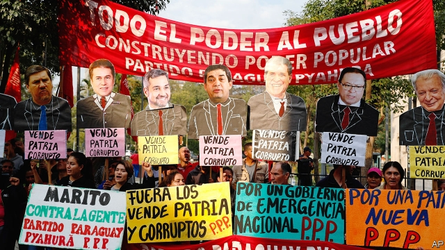
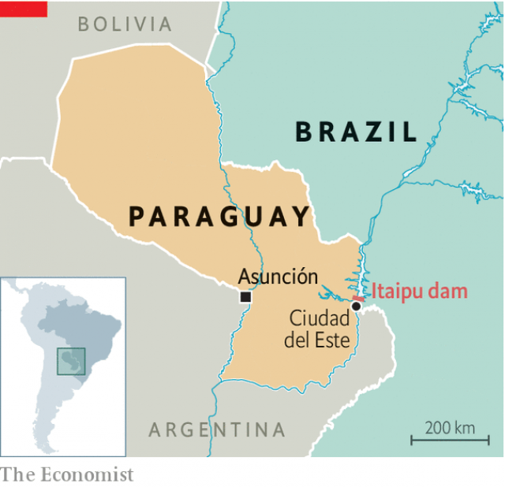

###### A dam mess

# A secret hydropower deal with Brazil causes a political crisis in Paraguay 

 

> print-edition iconPrint edition | The Americas | Aug 22nd 2019 

WHEN BRAZILIAN soldiers invaded Paraguay in 1865, after banding together with Argentina and Uruguay, the country lost a quarter of its territory and perhaps 90% of its male population. A century later Brazil sent soldiers to a disputed border region and withdrew only after the two countries agreed to build the world’s largest hydro-electric dam. 

The dam, named Itaipu, is still a sore subject in Paraguay. Last month it emerged that in May Paraguay’s current president, Mario Abdo Benítez, had struck a secret deal with Brazil, further reducing Paraguay’s access to cheap power. The resulting outcry has put Mr Abdo Benítez at risk of impeachment. The fiasco has underlined the importance of renegotiating the dam’s governing treaty, which expires in 2023. 

Under the current agreement, which was signed in 1973, each country has the right to half the dam’s output. Paraguay, a country of 7m people with little industry, only uses about a quarter of its share, which fulfils 90% of its electricity needs. It sells the rest to Brazil, which depends on the dam for 15% of its power. But Paraguay is paid only the cost of production (including debt repayments for construction), not the market price of electricity. According to the calculations of Miguel Carter of DEMOS, a think-tank, had Brazil been made to pay full whack, between 1985 and 2018 it would have paid $75.4bn more, or roughly twice Paraguay’s current annual GDP. 

In 2009 Brazil’s then-president, Luiz Inácio Lula da Silva, agreed to triple Brazil’s annual payment and to take steps to allow Paraguay’s state power company, ANDE, to sell directly to private Brazilian companies. But in May’s secret deal, a clause that would have made Brazilian companies bid for power was struck out. Paraguay also agreed to receive around 18% less money over the next three years. 

The agreement became public in July, when the head of ANDE, Pedro Ferreira, refused to sign it, resigned and accused Mr Abdo Benítez of “high treason”. He and Paraguay’s minister of foreign relations—who also resigned, along with three other officials—told prosecutors that a “parallel negotiation” was under way to sell power exclusively to a Brazilian energy company, Léros. A politician from the party of Brazil’s president, Jair Bolsonaro, travelled to Paraguay three times on behalf of Léros. 

 

Mr Ferreira gave text messages to the Paraguayan press purporting to show that an adviser to Paraguay’s vice-president, Hugo Velázquez, acting with the knowledge of Mr Abdo Benítez, was arranging meetings with Léros and lobbying on its behalf. In the messages, the adviser, José Rodríguez, claims that the Brazilian politician, Alexandre Giordano, represents not only Léros, but also Mr Bolsonaro’s family and the Brazilian government. 

The vice-president now denies employing Mr Rodríguez, though he admitted to meeting him to discuss the possibility of Léros buying energy from Paraguay. Mr Ferreira has a different story: he says the vice-president personally introduced Mr Rodríguez as his legal adviser. In one of the text messages, Mr Velázquez asks Mr Ferreira how negotiations for the sale are going. 

News of the secret deal prompted thousands of people to take to the streets, calling for Mr Abdo Benítez to be impeached. On August 1st Mr Bolsonaro agreed to scrap the agreement. Proceedings in Paraguay’s congress, which had the support of some of the president’s allies, were then dropped. But it is too late to stop the outcry about energy policy. In 2023 the $2bn loan taken out to build the dam will at last be paid off. The question is what to do then. “People on the streets are already talking about the renegotiation [of the deal],” says Mercedes Canese, a former vice-minister from Frente Guasú, an opposition party. 

Many in Paraguay argue that the country should use the excess power itself to industrialise. Drawn by low taxes as well as cheap electricity, car companies have started manufacturing cables in Paraguay to export to Brazil. In Ciudad del Este, just south of the dam, many locals engage in Bitcoin mining, an exceptionally power-hungry business. Demand from homes and offices is growing quickly, too. Within a few decades, Paraguay’s half of Itaipu’s output “will go to air-conditioning”, says Christine Folch, the author of “Hydropolitics”, a forthcoming book about the dam. 

At that point, the country will need new energy sources. Until then, however, most of the power will still be sold to Brazil. Brazil’s economy is 50 times bigger than that of its landlocked neighbour. And Paraguay’s negotiating position is weak. Whereas Mr Bolsonaro put a trio of generals in charge of the Brazilian half of Itaipu, Paraguay does not even have a fully fledged energy ministry. The messages published by Mr Ferreira show how Brazil sets the agenda. 

Public pressure may help change that. On August 7th Paraguay’s government appointed Geraldo Blanco, an engineering professor with a plan to use more of Itaipu’s electricity in Paraguay, to the dam’s governing council. As it contemplates its strategy for 2023, Paraguay may look to other smaller countries’ battles with big neighbours. In the 1970s a campaign involving the actor John Wayne helped persuade America to pass a law that returned Panama’s canal in 1999. As for the businesses best suited to provide the investment needed for Paraguay��s industrialisation, they are right over the border in Brazil. ■ 
<<<<<<< HEAD

-- 

 单词注释:

1.hydropower['haidrәupauә]:n. 水力发出的电力 

2.Brazil[brә'zil]:n. 巴西 

3.Paraguay['pærәgwai]:n. 巴拉圭 

4.Aug[]:abbr. 八月（August） 

5.Brazilian[brә'ziljәn]:n. 巴西人 a. 巴西的, 巴西人的 

6.banding['bændiŋ]:[机] 模式带 

7.Argentina[.ɑ:dʒәn'ti:nә]:n. 阿根廷 

8.Uruguay['uru^wai]:n. 乌拉圭 [经] 乌拉圭 

9.itaipu[]:[网络] 伊泰普；世界第一大水电站；参观世界第一大水电站 

10.mario['mæriәj, 'mɑ:-]:n. 马里奥（男子名） 

11.abdo[]:n. (Abdo)人名；(阿拉伯)阿卜杜；(葡)阿布多 

12.outcry['autkrai]:n. 尖叫, 倒彩, 强烈抗议, 喊价 vi. 喊叫 vt. 叫得比...响 

13.impeachment[im'pi:tʃmәnt]:[法] 控告, 检举, 弹劾 

14.fiasco[fi'æskәu]:n. 惨败, 大失败 

15.renegotiate[.ri:ni'gәuʃieit]:vt. 重新谈判 

16.expire[ik'spaiә]:vi. 期满, 呼气, 断气 vt. 呼出 

17.repayment[ri'peimәnt]:n. 付还, 偿还, 报复, 付还的钱 [经] 偿还, 付还 

18.Miguel[mi'gel]:n. 米格尔（男子名） 

19.carter['kɑ:tә]:n. 运货马车夫 

20.Demo['demәu]:n. 演示, 样本唱片 [计] 演示 

21.whack[hwæk]:vt. 猛击, 重打, 削减 vi. 重击 n. 重击, 重打 

22.luiz[]:n. (Luiz)人名；(西、葡)路易斯 

23.lula[]:n. 卢拉（男子名） 

24.DA[,di:'ei]:美国地方检察官 [计] 数据采集, 数据管理员, 数据分析, 设计自动化 

25.silva['silvә]:n. 森林, 森林志 

26.triple['tripl]:n. 三倍数, 三个一组 a. 三倍的 vt. 使增至三倍 vi. 增至三倍 

27.ande[]:n. 安德（人名） 

28.Brazilian[brә'ziljәn]:n. 巴西人 a. 巴西的, 巴西人的 

29.clause[klɒ:z]:n. 子句, 条款 [计] 子句 

30.les[lei]:abbr. 发射脱离系统（Launch Escape System） 

31.pedro['pi:drәu]:n. 彼得牌戏（一种纸牌戏） 

32.Ferreira[]:n. 费雷拉（人名） n. 费雷拉（地名） 

33.prosecutor['prɒsikju:tә]:n. 实行者, 告发者, 公诉人 [法] 原告, 起诉人, 检举人 

34.negotiation[ni.gәuʃi'eiʃәn]:n. 谈判, 磋商, 交涉 [经] 谈判, 协商 

35.jair[]:[网络] 睚珥；贾伊尔；睢珥 

36.Paraguayan[,pærә'^waiәn, -'^wei-]:n. 巴拉圭人 

37.purport['pә:pɒ:t]:n. 意义, 要旨, 目的 vt. 意味着, 声称, 打算 

38.adviser[әd'vaizә]:n. 顾问, 劝告者, 指导教师 [法] 顾问, 劝告者 

39.hugo['hju:^әu]:n. 雨果（男子名, 等于Hugh） 

40.lobby['lɒbi]:n. 大厅, 休息室, 游说议员者 vi. 游说议员, 游说 vt. 游说 

41.Alexandre[]:n. 亚历山大（马其顿国王） 

42.Giordano[]:n. 佐丹奴（公司名）；焦尔达诺（男子名） 

43.impeach[im'pi:tʃ]:vt. 控告, 怀疑, 检举, 弹劾 [法] 控告, 检举, 弹劾 

44.scrap[skræp]:n. 碎片, 残余物, 些微, 片断, 铁屑, 吵架 vt. 扔弃, 敲碎, 拆毁 vi. 互相殴打 a. 零碎拼凑成的, 废弃的 

45.proceeding[prәu'si:diŋ]:n. 进行, 程序, 行动, 诉讼程序, 事项 [化] 会议论文集 

46.ally['ælai. ә'lai]:n. 同盟者, 同盟国, 助手 vt. 使联盟, 使联合, 使有关系 vi. 结盟 

47.renegotiation[]:[经] 重议价 

48.mercedes['mә:sidi:z]:n. 梅塞德斯（人名）；梅赛德斯（公司名） 

49.frente[]:[网络] 佛朗迪合唱团；面对；在……前面 

50.opposition[.ɒpә'ziʃәn]:n. 反对, 敌对, 相反, 在野党 [医] 对生, 对向, 反抗, 反对症 

51.industrialise[in'dʌstriәlaiz]:vi.vt. (使)工业化 

52.manufacturing[.mænju'fæktʃәriŋ]:n. 制造业 a. 制造业的 

53.Ciudad[]:n. （西）城市 n. (Ciudad)人名；(西)休达 

54.DEL[del]:[计] 数据输入语言, 作废; DOS内部命令:从磁盘上删除一个或多个文件 

55.este[]:abbr. 工程的特殊试验设备（Engineering Special Test Equipment） 

56.bitcoin[]:[网络] 比特币；虚拟货币比特币；位元币 

57.exceptionally[]:adv. 特殊地；异常地；例外地 

58.quickly['kwikli]:adv. 很快地 

59.christine['kristi:n]:n. 克莉丝汀（女子名） 

60.forthcoming['fɒ:θ'kʌmɑŋ]:a. 即将来临的 n. 来临 

61.landlock['lændlɔk]:n. 内陆国 

62.trio['tri:әu]:n. 三重唱 

63.fully['fuli]:adv. 十分地, 完全地, 充分地 

64.fledge[fledʒ]:vt. 喂养, 用羽毛盖上, 装上羽毛 vi. 长羽毛 

65.geraldo[]:n. (Geraldo)人名；(葡)热拉尔多 

66.Blanco['blæŋkәj]:<英> ([复]-cos) n.布兰可擦白剂 vt.用布兰可擦白剂擦 

67.contemplate['kɒntempleit]:vt. 注视, 沉思, 盘算 vi. 冥思苦想 

68.john[dʒɔn]:n. 盥洗室, 厕所, 嫖客 

69.wayne[wein]:n. 韦恩（男子名） 

70.industrialisation[ɪndʌstrɪəlaɪzeɪ'ʃən]:n. 工业化 
=======
>>>>>>> 50f1fbac684ef65c788c2c3b1cb359dd2a904378

