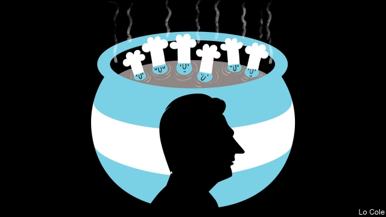

###### Bello

# Argentina’s crisis shows the limits of technocracy 

 

> print-edition iconPrint edition | The Americas | Aug 22nd 2019 

IF YOU CAN’T beat them, join them. That seems to be Mauricio Macri’s response to his crushing defeat in presidential primary elections on August 11th. He won 32% of the vote against the 48% secured by the Peronist slate of Alberto Fernández and Cristina Fernández (no relation), a populist former president. At first Mr Macri blamed the outcome on the voters for “believing that returning to the past is an alternative”, a scolding for which he later apologised. Then the blame shifted to his finance minister, Nicolás Dujovne, who had been slashing the budget as demanded by the $57bn agreement the government negotiated with the IMF last year. Mr Dujovne resigned on August 17th after Mr Macri scrapped VAT on staple foods, increased hand-outs and temporarily froze petrol prices in a desperate effort to placate Argentines. These are the kind of measures typically associated with his Peronist opponents, and they are contrary to the IMF agreement. 

Mr Macri is not quite beaten yet. The presidential election is not until October 27th. But in Argentina’s peculiar system, the primaries are a dress rehearsal. Few think he can overturn a 16-point deficit in nine weeks. The fact that the peso crashed after the primary result will add to inflation of 50% a year and makes his task even harder. 

This drubbing came as a shock, but it probably should not have done. Mr Macri’s search for a second term always looked quixotic after the economy ran into trouble last year. Argentines are worse off than they were four years ago. The economy is forecast to have shrunk by around 4% over this period; prices have increased by more than 250%; the peso has gone from 15 to the dollar to almost 60, while real wages have fallen by 10% in the past 15 months. 

Many had high hopes for Mr Macri, a former businessman turned successful mayor of Buenos Aires. After years of economic debauchery under Ms Fernández, he promised that Argentina would rejoin the world as a normal country. He appointed a team of brilliant technocrats. So what went wrong? 

One hypothesis is that he erred in trying to stabilise the economy gradually. That decision was political: the hope was that growth would cushion the blow of cuts and big rises in the cost of electricity and transport as Ms Fernández’s huge subsidies were withdrawn. It meant that the government had to finance a still-large deficit, mainly through debt. In 2018 investors became alarmed about Argentina, forcing the government into the arms of the IMF and the economy into recession. 

That alarm was partly because of the rise in interest rates in the United States. A severe drought also cut Argentina’s farm exports, driving up its current account-deficit. But the main blow was self-inflicted: the government’s decision in December 2017 to loosen its own inflation targets, which undermined the credibility of the central bank. According to Federico Sturzenegger, the bank’s then-president, who opposed the decision, it did so because (other) officials worried about the bank’s relatively tight monetary policy; some did not want inflation to fall so swiftly because of the fiscal cost. Tax revenues would rise less in nominal terms but much spending (such as on pensions) would keep rising fast, because it was indexed to past inflation. 

As this highlights, the government had too many economic cooks following different recipes. They wanted, variously, to slash inflation, increase economic growth and tighten the budget. Some wanted a weaker peso (for growth) and others a stronger one (to fight inflation). They should have accepted that the price of fiscal gradualism was tighter money. 

Populist politicians are often skilled at explaining away economic reverses and persuading voters that they feel their pain. Technocrats find that harder. Mr Macri’s re-election campaign was based on fear, that the return of Ms Fernández would turn Argentina into Venezuela. She deftly defused that. By opting to run for vice-president behind Mr Fernández, a more moderate Peronist, she turned the election into a referendum on Mr Macri’s economic record. 

Mr Macri’s advisers trusted in social media and marketing, and failed to see the strength of sentiment on the Argentine street. “What happened was that the government ended up with no politics and couldn’t explain anything,” Mr Fernández told Clarín, a newspaper. Everything suggests Argentina will end up with him. Many fear the worst. But Argentina’s current circumstances leave little room for populist excess. And Mr Fernández is not his namesake.■ 
<<<<<<< HEAD

-- 

 单词注释:

1.bello[]:n. 贝罗（姓氏） 

2.technocracy[tek'nɒkrәsi]:n. 技术专家政治论, 技术专家治国论 [经] 专家管理, 技术管理 

3.Aug[]:abbr. 八月（August） 

4.Mauricio[]:n. 毛利西奥（男子名） 

5.presidential[.prezi'denʃәl]:a. 总统制的, 总统的, 首长的, 统辖的 [法] 总统的, 议长的, 总经理的 

6.Peronist[pә'rәjnist]:a. (阿根廷总统)庇隆的,庇隆主义的, 庇隆主义者的 

7.slate[sleit]:n. 板岩, 页岩, 提名名单, 人选, 记录, 石板 a. 石板色的 vt. 铺石板, 责骂, 痛打 

8.alberto[]:n. 阿尔贝托（阿塞拜疆教练） 

9.Cristina[]:n. 克里斯蒂娜（电视剧中的人物） 

10.Populist['pɔpjulist]:n. 民粹派的成员 

11.macri[]: [人名] 麦克里 

12.voter['vәutә]:n. 选民, 投票人 [法] 选民, 选举人, 投票人 

13.apologise[ә'pɔlәdʒaiz]:vi. 道歉（等于apologize） 

14.slash[slæʃ]:v. 猛砍, 乱砍 n. 猛砍, 乱砍, 删减 [计] 斜线 

15.IMF[]:国际货币基金组织 [经] 国际货币基金 

16.scrap[skræp]:n. 碎片, 残余物, 些微, 片断, 铁屑, 吵架 vt. 扔弃, 敲碎, 拆毁 vi. 互相殴打 a. 零碎拼凑成的, 废弃的 

17.VAT[væt]:n. 大桶 vt. 装入大桶, 在大桶里处理 

18.staple['steipl]:n. 主要产物, 常用品, 主要要素, 原料, 订书钉, 钩环 a. 主要的, 重要的 vt. 分级, 钉住 

19.temporarily['tempәrәrәli]:adv. 暂时, 一时, 临时 

20.placate[plә'keit]:vt. 抚慰, 平息, 使和解, 怀柔 

21.argentine['ɑ:dʒәntain]:n. 银, 银白色金属, 银白色鱼鳞, 阿根廷人 a. 银的, 银色的, 阿根廷的 

22.typically['tipikәli]:adv. 代表性地；作为特色地 

23.overturn[.әuvә'tә:n]:n. 倾覆, 破灭, 革命 vt. 推翻, 颠倒 vi. 翻倒 

24.deficit['defisit]:n. 赤字, 不足额 [医] 短缺 

25.peso['peisәu]:n. 比索 [经] 比索 

26.inflation[in'fleiʃәn]:n. 胀大, 夸张, 通货膨胀 [化] 充气吹胀; 膨胀 

27.drubbing['drʌbiŋ]:n. 殴打, 痛击 

28.alway['ɔ:lwei]:adv. 永远；总是（等于always） 

29.quixotic[kwik'sɔtik]:a. 堂吉诃德式的, 愚侠的, 狂热而侠义的, 理想而不实际的, 充满幻想的 

30.Buenos[]:n. (Buenos)人名；(西)布埃诺斯 

31.aire[]:n. 亚耳河（英国约克郡西部河流） 

32.debauchery[di'bɒ:tʃәri]:n. 放荡, 堕落 

33.Argentina[.ɑ:dʒәn'ti:nә]:n. 阿根廷 

34.rejoin[ri'dʒɒin]:vt. 使再结合, 再加入, 回答 vi. 重新聚合, 回答, 第二次答辩 

35.technocrat['teknәukræt]:n. 技术专家治国论者, 技术专家统治论者 

36.hypothesis[hai'pɒθәsis]:n. 假设 [化] 假设 

37.err[ә:]:vi. 犯错, 做错, 犯罪 [法] 弄错, 犯错误, 陈述 

38.stabilise['steibilaiz]:vt.vi. (使)稳定, (使)安定, (使)坚固 vt. 装稳定器 

39.investor[in'vestә]:n. 投资者 [经] 投资者 

40.recession[ri'seʃәn]:n. 后退, 凹处, 衰退, 归还 [医] 退缩 

41.undermine[.ʌndә'main]:vt. 在...下面挖, 渐渐破坏, 暗地里破坏 [法] 暗中破坏, 以阴谋中伤伤害 

42.credibility[.kredi'biliti]:n. 可信用, 确实性, 可靠 [法] 证据能力, 可信程度, 确实性 

43.Federico[]:n. 费德里科（人名） 

44.sturzenegger[]:[网络] 施图尔岑奈格；施图尔辛格；辰涅格 

45.monetary['mʌnitәri]:a. 货币的, 金钱的 [经] 货币的, 金融的 

46.swiftly['swiftli]:adv. 很快地, 即刻 

47.fiscal['fiskәl]:a. 财政的, 国库的 [经] 财政上的, 会计的, 国库的 

48.les[lei]:abbr. 发射脱离系统（Launch Escape System） 

49.nominal['nɒminl]:a. 名义上的, 名字的, 有名无实的, 稍许的 n. 名词性词 

50.variously['veәriәsli]:adv. 各种各样, 种种, 不同, 多方面, 多才多艺, 许多, 各个, 个别, 杂色, 彩色 

51.tighten['taitn]:vt. 勒紧, 使变紧 vi. 变紧, 绷紧 

52.gradualism['^rædʒuәlizәm]:n. 渐进主义 

53.Populist['pɔpjulist]:n. 民粹派的成员 

54.Venezuela[,vene'zweilә]:n. 委内瑞拉 

55.deftly[]:adv. 灵巧地；熟练地；敏捷地 

56.defuse[.di:'fju:z]:vt. 去掉...的引信, 平息 

57.opt[ɒpt]:vi. 选择 

58.referendum[.refә'rendәm]:n. （就重大政治或社会问题进行的）全民公决，全民投票 

59.adviser[әd'vaizә]:n. 顾问, 劝告者, 指导教师 [法] 顾问, 劝告者 

60.marketing['mɑ:kitiŋ]:n. 行销, 买卖 [经] 推销, 在市场买卖, 销售 

61.sentiment['sentimәnt]:n. 感情, 感伤, 情操, 情绪, 感想, 意见 [医] 情感, 情操 

62.argentine['ɑ:dʒәntain]:n. 银, 银白色金属, 银白色鱼鳞, 阿根廷人 a. 银的, 银色的, 阿根廷的 

63.politic['pɒlitik]:a. 精明的, 明智的, 策略的 
=======
>>>>>>> 50f1fbac684ef65c788c2c3b1cb359dd2a904378

