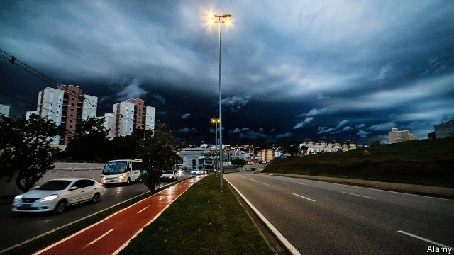

###### Darkness on the edge of town

# Forest fires in the Amazon blacken the sun in São Paulo 

 

> print-edition iconPrint edition | The Americas | Aug 22nd 2019 

IN THE MIDDLE of the afternoon on August 19th South America’s largest city went dark. Under a thick, black cloud at 3pm, the lights flickered on in São Paulo’s skyscrapers; on the motorways brake lights started to glow in the city’s bumper-to-bumper traffic, and many Paulistanos were worried. Social-media users posted pictures of the gloom, juxtaposing the dystopian afternoon sky with fictional apocalyptic places such as Gotham City from “Batman”, Mordor from “Lord of the Rings” and “the upside down” from “Stranger Things”. 

Meteorologists scrambled to explain what was going on. But the most likely explanation, most accept, is that fires burning far away in the rainforest are to blame. Climatempo, a popular private meteorology website, reported that a cold front brought low-lying clouds which then combined with smoke to form the thick black smog. According to the National Institute for Space Research (INPE), forest fires are more common than ever. The number detected so far this year is 84% higher than in the same period last year. Just over half of the fires are in the Amazon. 

During the Amazon’s dry season, it is common for farmers to set fires illegally to clear land. Brazil’s populist president, Jair Bolsonaro, has encouraged them by weakening the agencies that enforce environmental regulations. He holds the view that protecting the forest hinders economic development. When asked about the fires, he ludicrously responded by accusing environmental NGOs of setting the fires themselves so as to make his government look bad, in retaliation for his cuts in their funding. 

Mr Bolsonaro argues that he is fighting an “information war” over the Amazon; he says he wants foreign governments and NGOs to stop meddling in Brazil. After INPE released data showing increasing deforestation in July, the president claimed the numbers were fake. He then sacked the head of the agency, Ricardo Magnus Osório Galvão, a well-respected physicist. 

Such belligerence outrages scientists and environmentalists. “Firing the director is an act of revenge against those who expose the truth,” says Marcio Astrini of Greenpeace, a pressure group. But the destruction of the rainforest tends to be out of sight, out of mind for a lot of Brazilians, most of whom live in large cities near the coast. The darkness brought deforestation to their doorsteps. “We don’t have much time,” a columnist wrote in the daily newspaper Folha de São Paulo. “Night will fall on all of us.”■ 

-- 

 单词注释:

1.amazon['æmәzɒn]:n. 亚马孙河 [医] 无乳腺者 

2.blacken['blækәn]:vt. 使变黑, 诽谤 vi. 变黑 

3.paulo[]:n. 保罗（男子名） 

4.Aug[]:abbr. 八月（August） 

5.flicker['flikә]:n. 闪烁, 闪光, 颤动 vi. 闪动, 闪烁, 摇动, 扑动翅膀 vt. 使摇曳, 使闪烁 

6.motorway['mәutәwei]:n. 高速公路 

7.paulistanos[]:[网络] 巴西人总说圣保罗本地人；圣保罗市的市民 

8.gloom[glu:m]:n. 忧郁, 暗处, 幽暗 vi. 变忧沉, 变黑暗 vt. 使忧郁, 使黑暗 

9.juxtapose[.dʒʌkstә'pәuz]:vt. 并置, 并列 [法] 使连接, 毗连, 并列 

10.dystopian[dis'tәjpiәn]:a. 反面乌托邦的,反面假想国的  n. 反面乌托邦的鼓吹者(或描写者) 

11.fictional['fikʃәnl]:a. 虚构的, 编造的, 小说式的 [法] 拟制的, 假定的, 虚构的 

12.apocalyptic[ә.pɒkә'liptik]:a. 天启的, <<启示录>>的 

13.gotham['gәutәm]:n. 哥谭镇(英传说中愚人村), (美国)纽约市 

14.batman['bætmәn]:n. 勤务兵 

15.mordor[]: 魔多 

16.upside['ʌpsaid]:n. 上侧, 上段, 上部 [机] 上侧, 上部 

17.meteorologist[.mi:tiә'rɒlәdʒist]:n. 气象学者 

18.scramble['skræmbl]:n. 攀缘, 爬行, 抢夺, 混乱, 紧急起飞 vi. 攀缘, 杂乱蔓延, 争夺, 拼凑, 匆忙 vt. 攀登, 扰乱, 使混杂 

19.rainforest['rein'fɔrist]:[生态]雨林 

20.meteorology[.mi:tiә'rɒlәdʒi]:n. 气象学, 气象状态 [医] 气象学 

21.inpe[]:[网络] 巴西国家太空署；巴西国家空间研究院；巴西国家空间研究所 

22.illegally[]:[法] 非法地, 不合法地, 违法地 

23.Populist['pɔpjulist]:n. 民粹派的成员 

24.jair[]:[网络] 睚珥；贾伊尔；睢珥 

25.environmental[in.vaiәrәn'mentәl]:a. 周围的, 环境的 [经] 环境的, 环保的 

26.hinder['hindә]:a. 后面的 v. 阻碍, 打扰 

27.ludicrously['lu:dɪkrəslɪ]:adv. 滑稽地, 荒唐地 

28.ngos[]:abbr. non-government organization 非政府组织，非政府机构 

29.retaliation[ri.tæli'eiʃәn]:n. 报复 [法] 报仇, 报复, 回敬 

30.meddle['medl]:vi. 干涉, 干预, 擅自摸弄 [法] 干预, 插手, 弄乱 

31.Brazil[brә'zil]:n. 巴西 

32.datum['deitәm]:n. 论据, 材料, 资料, 已知数 [医] 材料, 资料, 论据 

33.deforestation[di:.fɒ:ri'steiʃәn]:n. 采伐森林, 森林开伐 [法] 砍伐森森 

34.fake[feik]:n. 假货, 欺骗, 诡计 a. 假的 vt. 假造, 仿造 vi. 伪装 

35.Ricardo[ri'kɑ:dәu]:里卡多(姓氏) 

36.magnus['mæ^nәs]:[医] 大的 

37.Osório[]:[地名] 奥索里乌 ( 巴西 ) 

38.belligerence[bi'lidʒәrәns]:n. 交战, 好战性, 斗争性 

39.outrage['autreidʒ]:n. 暴行, 侮辱, 愤怒 vt. 凌辱, 虐待, 触犯 

40.environmentalist[in,vaiәrәn'mentlist]:n. 环保人士 

41.marcio[]:[网络] 马尔西奥；马西奥；马西欧 

42.greenpeace['gri:npi:s]:n. 绿色和平组织（保护动物不遭捕猎等） 

43.Brazilian[brә'ziljәn]:n. 巴西人 a. 巴西的, 巴西人的 

44.doorstep['dɒ:step]:n. 门阶 

45.columnist['kɒlәmist]:n. 专栏作家 

46.folha[]:[网络] 圣保罗页报；圣保罗之页 

47.de[di:]:[化] 非对映体过量 [医] 铥(69号元素铥的别名,1916年Eder离得的假想元素) 

