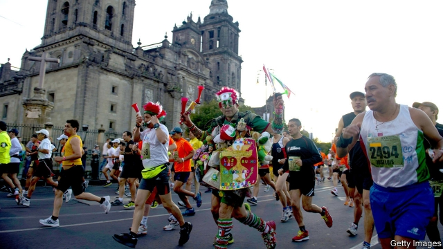

###### Chocolate rush

# Why the Mexico City marathon attracts so many cheats 

 

> print-edition iconPrint edition | The Americas | Aug 22nd 2019 

IN RECENT YEARS the Mexico City marathon has caused crowding on the city metro. That is not just because the city shuts down numerous roads above ground for the 42-kilometre race. It is also because cheating marathoners have been known to hop on for a quick detour to the finish line. Last year 5,000 of the 28,000 runners who finished were disqualified. Hundreds more were kicked out mid-race. No other race admits to stripping so many competitors of their places. Ahead of this year’s event, on August 25th, organisers are hoping for scurrying without skulduggery. 

Most of the corredores de chocolates (Mexican slang for fake runners) are easy to spot. Each runner carries a chip across electronic checkpoints placed along the course. Those who skip to the end are doomed to disqualification—but only days later, well after they receive their medal and the crowd’s adulation. Over the past six years marathon medals have each been emblazoned with a letter. Collectively, they spell out “Mexico”. That has motivated some people to cheat and complete the set, says Javier Carvallo, the Mexico City marathon’s chief. This year a new series of six medals, which together will make up a map of the city, begins. 

Other cheaters give their bib to a speedier “bib mule” before the race, hoping to attain a time in their name that qualifies for the prestigious Boston marathon. In 2017 organisers disqualified a man for wearing a bib registered to a woman called María. Others still enlist multiple runners for the race who treat the bib like a relay baton. Organisers track them down by reviewing interval times to see if a runner’s speed is unrealistically quick or varies suspiciously. 

Many Mexicans think that paying the 650 peso ($33) entrance fee gives them a right to run the race however they like, says Mr Carvallo. In 2007 Roberto Madrazo, a former presidential candidate, was disqualified from the Berlin marathon after cutting a third of the course. Mr Madrazo insisted he had never intended to run the whole race. Social media can warp behaviour. Those who broadcast their preparation for the race grow desperate to post a triumphant selfie after it. But boasts on Facebook and Instagram are risky, Mr Carvallo says. Clutching a medal without a bead of sweat can lead to disqualification. Serious runners and jealous friends enthusiastically dob in suspects to organisers. 

All this tomfoolery dents the reputation of the marathon, which is among the fastest-growing in the world. It also affects the contest. Die-hard runners expect clear streets only to find them full of plodding course-cutters, says Derek Murphy of Marathon Investigation, a blog that dashes after the bad sports of marathons around the world. This year, an ad campaign is promoting honesty. For the first time, cheaters will be banned for life. That might be enough to keep los chocolates at bay.■ 

-- 

 单词注释:

1.Aug[]:abbr. 八月（August） 

2.metro['metrәu]:n. 地铁 

3.marathoner[]:n. 马拉松运动员 

4.hop[hɒp]:n. 单脚跳, 跳跃, 舞会, 飞行 vi. 单脚跳, 跳跃 vt. 跃过, 跳上, 加蛇麻子于, 服麻醉药 [计] 跳跃式传输 

5.detour['di:tuә]:n. 绕路, 迂回 v. (使)绕道 

6.disqualify[dis'kwɒlifai]:vt. 使不适合, 取消...资格 

7.scurry['skʌri]:vi. 急赶, 急跑, 急转 n. 急赶, 急跑, 急转, 阵雪, 阵雨 

8.skulduggery[skʌl'dʌgәri]:n. 欺骗, 欺诈, 作假 

9.corredores[]:[网络] 廊子 

10.de[di:]:[化] 非对映体过量 [医] 铥(69号元素铥的别名,1916年Eder离得的假想元素) 

11.slang[slæŋ]:n. 俚语 v. 辱骂, 用俚语说 

12.fake[feik]:n. 假货, 欺骗, 诡计 a. 假的 vt. 假造, 仿造 vi. 伪装 

13.chip[tʃip]:n. 屑片, 薄片, 碎片 vt. 削, 切, 削成碎片, 使摔倒, 凿 vi. 削下屑片 [计] 孔屑; 组件; 晶片; 芯片 

14.checkpoint['tʃekpɒint]:n. 检查站 [计] 检查点 

15.doom[du:m]:n. 厄运, 不幸, 法律, 宣告, 判决, 死亡 vt. 命中注定, 判决 

16.adulation[.ædju'leiʃәn]:n. 谄媚, 过分的称赞 

17.emblazon[im'bleizn]:vt. 用纹章装饰, 盛饰, 颂扬 

18.collectively[]:adv. 集合, 聚合性, 共同, 集体主义, 集团, 集体 

19.Javier[]:n. 哈维尔（第80届奥斯卡最佳男配角）；海威尔（美国联合商业协会中国区副会长） 

20.carvallo[]:[网络] 吸气时增强；卡法洛；卡瓦罗家族 

21.sery[]:n. (Sery)人名；(俄)谢雷；(科特)塞里 

22.cheater['tʃi:tә]:n. 骗子, 诈手 [法] 骗子 

23.bib[bib]:n. 围涎 v. (使)大量喝酒 

24.speedy['spi:di]:a. 快的, 迅速的 [经] 快的, 迅速的 

25.mule[mju:l]:n. 骡, 倔强之人 

26.prestigious[pre'stidʒiәs]:a. 享有声望的 

27.Boston['bɒstәn]:n. 波士顿 

28.enlist[in'list]:vt. 征募, 参与, 谋取 vi. 从军, 应募, 赞助 

29.baton['bætәn]:n. 指挥棒, 接力棒, 警棍 

30.unrealistically[,ʌnriə'listikli]:adv. 不切实际地；不现实地 

31.suspiciously[]:adv. 猜疑地；怀疑地 

32.peso['peisәu]:n. 比索 [经] 比索 

33.Roberto[]:n. 罗伯托（人名） 

34.madrazo[]:[网络] 马德拉索 

35.presidential[.prezi'denʃәl]:a. 总统制的, 总统的, 首长的, 统辖的 [法] 总统的, 议长的, 总经理的 

36.Berlin[bә:'lin]:n. 柏林, (软质)柏林毛线 

37.warp[wɒ:p]:n. 变形, 弯曲, 歪曲, 乖僻, 偏差, 偏见 vt. 使变形, 弄歪, 使翘曲, 使不正常, 歪曲, 使有偏见 vi. 变弯, 变歪 

38.triumphant[trai'ʌmfәnt]:a. 得胜的, 得意洋洋的 

39.selfie['sel.fi]:n. 自拍照 

40.facebook[]:n. 脸谱网 

41.Instagram[]:一款图片分享应用 

42.risky['riski]:a. 危险的 

43.clutch[klʌtʃ]:n. 抓紧, 掌握, 离合器, 一窝小鸡 vt. 抓住, 踩汽车离合器踏板 vi. 抓 [计] 联轴器; 离合器 

44.bead[bi:d]:n. 珠子, 滴 vt. 用珠装饰 vi. 形成珠 [计] 珠 

45.disqualification[dis,kwɔlifi'keiʃәn]:n. 不适合, 剥夺资格, 不合格, 无资格 [法] 无资格, 不合格, 取消资格 

46.enthusiastically[in.θju:zi'æstikli]:adv. 热心地, 狂热地 

47.DOB[]:[计] 数据输出总线 

48.tomfoolery[tɒm'fu:lәri]:n. 愚蠢的举动, 无聊的小玩意 

49.dent[dent]:n. 凹痕 vt. 使凹下, 削弱 vi. 塌陷 

50.plod[plɒd]:n. 沉重的步伐, 辛勤工作 vi. 沉重地走, 辛勤工作, 孜孜从事 vt. 沉重缓慢地走 

51.derek['derik]:n. 德里克（男名） 

52.murphy['mә:fi]:n. 马铃薯 

53.blog[]:n. 博客；部落格；网络日志 

54.los[lɔ:s]:abbr. 月球轨道航天器（Lunar Orbiter Spacecraft）；视线（Line of Sight） 

