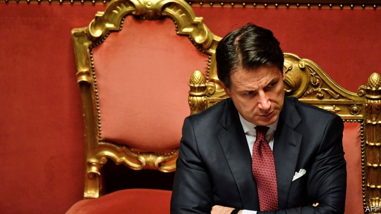

###### Forest apocalypse

# Politics this week 

 

> Aug 22nd 2019 

Giuseppe Conte, Italy’s prime minister, resigned after Matteo Salvini, the leader of the Northern League party, withdrew his support for the coalition government. The coalition’s other party, the Five Star Movement, must now try to form a new government. If that fails, Italy may face a general election. See article. 

An Italian prosecutor ordered a ship carrying around 80 illegal migrants to dock after some of the passengers jumped into the sea. The ship, operated by a Spanish charity, had been held off the Italian coast for three weeks because Mr Salvini, who is also Italy’s interior minister, refused it entry to a port. 

International radiation monitors confirmed they had detected a recent accident near the Russian port of Arkhangelsk, believed to involve a nuclear-powered cruise missile. Separately, and despite worries about safety, Russia launched the world’s first floating nuclear-power plant, which will power its eastern Arctic region. 

Poland’s deputy justice minister resigned amid claims that he had aided a smear campaign against judges deemed insufficiently loyal to the ruling Law and Justice party. The EU has launched legal proceedings against Poland for interfering with the independence of the judiciary. 

Boris Johnson, Britain’s new prime minister, wrote to Donald Tusk, the president of the European Council, to urge that the Irish “backstop”, a means of avoiding a hard border with Ireland post-Brexit, be removed from Britain’s withdrawal agreement with the EU. Mr Tusk’s response was negative. Angela Merkel, the German chancellor, suggested that Mr Johnson had 30 days to come up with an alternative. Emmanuel Macron, the French president, insisted that the backstop is not open to renegotiation. See article. 

In a televised speech, Nicolás Maduro, the president of Venezuela, confirmed that with his permission senior aides have been holding discussions with American officials for months. That stoked speculation that America might be discussing a deal to remove Mr Maduro, whose socialist policies have ruined Venezuela. The UN has reported that 20% of the population is malnourished. 

Argentina’s finance minister resigned in the wake of the market turmoil that followed a triumphal showing by the populist-Peronist presidential ticket in a pre-election vote. The IMF held talks with the government about a $57bn bail-out package, which could be in jeopardy if the populists win October’s actual election. See article. 

São Paulo was shrouded in smog caused by fires raging in the Amazon rainforest 2,700km away. Data from Brazil’s national space centre have shown an 84% rise in the number of fires in the Amazon this year compared with last. Without evidence, Jair Bolsonaro, Brazil’s president, accused green groups of lighting the fires to make him look bad. 

The junta in Sudan signed a power-sharing deal with opposition leaders that could pave the way for civilian rule. A transitional government is to run things until elections are held in 2022. Some worry that the generals, who unlike the civilians have lots of guns and money, will spoil the deal. Sudan’s former dictator, Omar al-Bashir, appeared in a courtroom in Khartoum, where he is on trial for corruption. See article. 

Nigeria marked the third year without a documented case of polio, which cripples children. When it is certified as free of the virus, the whole of Africa will be considered polio-free. Only Pakistan and Afghanistan still harbour the disease. See article. 

Gibraltar released an Iranian tanker that had been detained on suspicion of shipping oil to Syria in violation of European sanctions. America threatened sanctions on any country that helps the ship. Greece, its stated destination, said it would not assist the vessel. See article. 

Dozens of civilians were killed in a Russian-backed offensive by the Syrian government against the last big rebel stronghold. Government soldiers moved into the town of Khan Sheikhoun, which lies on an important supply route and has been under attack since April. Turkey, which backs some of the rebels, said one of its convoys was hit. 

Donald Trump said he would probably release his plan for peace between Israel and the Palestinians after the Israeli election on September 17th. 

Islamic State claimed responsibility for a bomb at a wedding in Kabul. At least 80 people died; it was the worst attack in the Afghan capital since January 2018. IS was not represented at America’s peace talks with the Taliban; a deal under which most American troops will leave Afghanistan is said to be close. 

A policeman and a suspected militant were killed in a gunfight in Indian-administered Kashmir, the first reported deaths since the government recently ended the region’s decades-old special status. 

India’s Chandrayaan-2 spacecraft began its orbit of the Moon. The country’s space agency said it will touch down on September 7th, becoming the first-ever mission to land at the Moon’s south pole. 

More protests were held in Hong Kong. The largest was a rally that passed off peacefully and which organisers claimed was attended by 1.7m people. Twitter removed 936 accounts from its platform which it said were based on the Chinese mainland and had tried to sabotage the territory’s democracy movement. 

China reacted furiously to the American government’s formal approval of the sale of 66 F-16 fighter jets, worth $8bn, to Taiwan. China said the deal undermined its security interests and threatened American companies involved in the sale with sanctions. See article. 

America’s test of a medium-range cruise missile elicited angry responses from China and Russia. The test was conducted just weeks after America officially left the Intermediate-Range Nuclear Forces Treaty, claiming that Russia was not sticking to the rules. 

Some Democrats renewed their call to boycott Israel after two American congresswomen were barred from entering the country because they support sanctions against Israel. See article. 

 

How serious was Donald Trump when he said he wanted America to buy Greenland? The president appeared to be joking when he posted a picture on Twitter of a golden Trump skyscraper imposed on the Danish territory’s landscape. But then he cancelled a state visit to Denmark because, he said, the prime minister had no interest in discussing the purchase and had been “nasty” to him. See article. 

