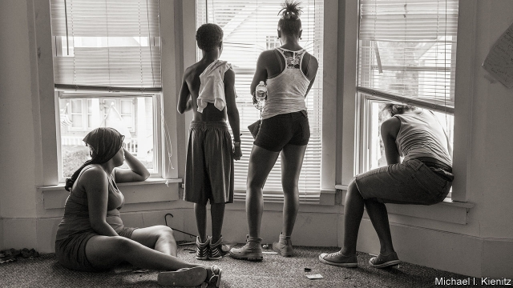
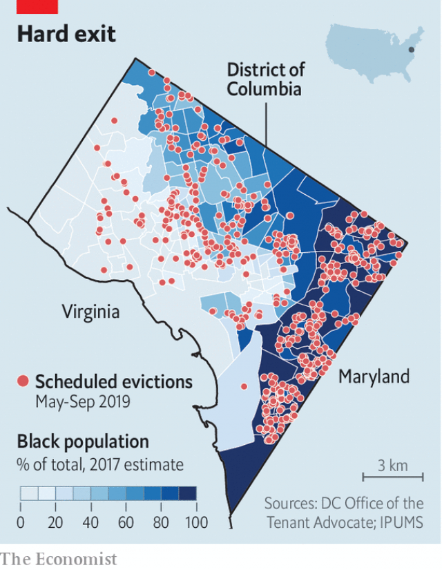

###### Pushed out

# New research probes eviction’s causes and consequences 

 

> print-edition iconPrint edition | United States | Aug 24th 2019 

AT NINE O’CLOCK on a recent Friday, some 80 people—mostly black—waited on pew-like benches for the start of their eviction cases at housing court. The few lawyers in attendance—all white—were present to bring the day’s cases on behalf of landlords, often several dozen at a time. The 25 people who did not show up for court received default eviction orders in the span of a few minutes. Those present could choose to mount legal defences. Most did not. 

Similar scenes play out almost daily in courtrooms across the country. In 2016 there were an estimated 2.4m eviction cases filed in America and nearly 900,000 completed, according to the Eviction Lab, a research outfit at Princeton University led by Matthew Desmond, a sociologist. His bestselling book, “Evicted: Poverty and Profit in the American City”, argues that “eviction is a cause, not just a condition, of poverty”. It won the Pulitzer prize in 2017 and has reinvigorated the neglected field of eviction research. 

It is rare for a sociology book to be widely read, let alone acted on. Yet since the publication of Mr Desmond’s book, New York City has become the first place to guarantee a right to legal counsel in eviction proceedings. Like several other cities, it has also strengthened its emergency rental-assistance programme. The city’s eviction numbers have plummeted from a high of 28,849 in 2013 to just 18,152 in 2018. 

Landlords have the right to enforce tenants’ legal obligation to pay rent. Almost all eviction filings are caused by a tenant failing to meet these obligations. Yet it has become clear that the engine behind evictions is poverty and that they are bad for tenants. The looming question for researchers now is how bad. 

Housing instability wrecks credit histories and disrupts work and school. Seeing one’s possessions thrown onto the street can be scarring. But quantifying the effects on tenants—and, consequently, the benefit of forestalling evictions—is difficult. That is because those facing removal from their homes are often already in dire straits. 

However, economists have recently found that the financial consequences of eviction look less dismal than might be expected. In a recent working paper from the National Bureau of Economic Research entitled “Does eviction cause poverty?”, four economists examined every eviction filing made in Cook County, which includes the city of Chicago. The researchers compared financial outcomes for tenants who were evicted with those who were not. They found that both groups were in remarkably poor financial shape in the years leading up to their eviction cases. They both remained similarly destitute in the years after. Taking advantage of the random assignment of judges—some of whom are more lenient than others—also let the researchers isolate the unique effect of eviction on measures such as credit scores, debt loads, use of payday lenders and neighbourhood poverty levels. 

 

As expected, the authors found negative effects on people who had been evicted. But these were not very large. Credit scores declined somewhat. Yet debt out for collection, use of payday lenders and neighbourhood poverty levels appeared unchanged regardless of whether residents had been evicted or not. “The small causal impacts mean that merely avoiding the eviction itself is unlikely to alleviate a lot of the financial distress that low-income tenants are facing,” says Winnie van Dijk, an economist at the University of Chicago who is also one of the study’s authors. The unfortunate event of an eviction, in their view, is better understood as a culminating indicator of “long, multi-year financial strains”. 

Another recent study by Robert Collinson and Davin Reed, two economists, applied a similar methodology to research on evictions in New York. They found very small negative effects on evicted residents’ employment and earnings. At the same time, they did not see markedly higher use of government benefits such as welfare or food stamps. “Overall, these results suggest that formal evictions may have a quantitatively small direct effect on poverty,” they wrote. Still, an eviction seemed to increase the chances of using both homeless shelters and hospitals for mental-health treatment. Uniquely among American cities, New York maintains a “right to shelter” for all homeless residents, including single adults, which may explain some of the findings. It is possible that evictions may not substantially worsen the financial states of those at risk. 

Even if eviction does not appear to trigger calamitous financial insecurity—if only because it was pre-existing—that does not mean the newfound attention to the problem is undeserved. Homelessness and hospitalisation present enormous costs to the rest of society. In New York the typical eviction case is filed over back rent of $3,900. This amount pales in comparison with the $41,000 the city spends on each homeless resident each year. The long-run consequences of eviction on poor children have not yet been thoroughly studied, but are unlikely to be good. What the new findings suggest is that intervention should not happen only when a case is filed in housing court. The nascent movement towards providing free legal counsel by right is a good one, because tenants with lawyers are able to negotiate better terms. 

But measures such as these can only slow the pace of evictions. They will continue because for a significant share of the population—particularly for black women, whose incomes remain low—housing costs remain high and access to housing subsidies remains sporadic. The second problem might be the most immediately remedied, if there was the will. Approximately one in four Americans who are poor enough to qualify for rental vouchers actually receive them, because housing assistance is not an entitlement. 

Instead, it is a literal lottery in which a mere 25% of randomly selected hopefuls receive vouchers. The losers get nothing and the waiting list for a voucher in high-cost areas such as Washington, DC, is more than a decade long. “There’s a hollowing out,” says Daniel Clark, a lawyer at Rising for Justice, a free service which provides advice to tenants facing eviction. “Those people who do qualify have been insulated, but those [who] do not get squeezed out,” he adds. When asked where those people go, Mr Clark gestures to an elderly black man who has just shuffled into the hallway dragging a suitcase. He was a former client who had been evicted but is now homeless. Every few days he comes by to linger outside their office.■ 

“Does Eviction Cause Poverty? Quasi-Experimental Evidence from Cook County, IL” (John Eric Humphries, Nicholas S. Mader, Daniel I. Tannenbaum, Winnie L. van Dijk; 2019)“The effects of evictions on low-income households” (Robert Collinson, Davin Reed; 2018) 

-- 

 单词注释:

1.probe[prәub]:n. 探索, 调查, 探针, 探测器 v. 用探针探测, 调查, 探索 

2.Aug[]:abbr. 八月（August） 

3.eviction[i'vikʃәn]:n. 逐出, 赶出 [法] 收回财产, 收回租地, 没收 

4.default[di'fɒ:lt]:n. 违约, 不履行责任, 缺席, 默认值 v. 疏怠职责, 缺席, 拖欠, 默认 [计] 默认; 默认值; 缺省值 

5.courtroom['kɒ:trum]:n. 法庭, 审判室 [法] 法庭, 审判室 

6.eviction[i'vikʃәn]:n. 逐出, 赶出 [法] 收回财产, 收回租地, 没收 

7.outfit['autfit]:n. 用具, 配备, 机构 vt. 配备, 供应 vi. 得到装备 

8.Princeton['prinstәn]:n. 普林斯顿 

9.Matthew['mæθju:]:n. 马太, 马太福音 

10.desmond['dezmәnd]:n. 德斯蒙德（男子名） 

11.sociologist[.sәusi'ɒlәdʒist]:n. 社会学家 [法] 社会学家 

12.bestselling[]:a. 畅销的 

13.pulitzer['pulitsә]:n. 普利策（美国新闻业经营者） 

14.reinvigorate[.ri:in'vigәreit]:vt. 使再振作, 使复兴 

15.sociology[.sәusi'ɒlәdʒi]:n. 社会学 [医] 社会学 

16.york[jɔ:k]:n. 约克郡；约克王朝 

17.counsel['kaunsәl]:n. 商议, 忠告, 法律顾问 v. 商议, 劝告 

18.proceeding[prәu'si:diŋ]:n. 进行, 程序, 行动, 诉讼程序, 事项 [化] 会议论文集 

19.plummete[]:[网络] 直线下降 

20.filing['failiŋ]:n. 锉, 琢磨, 锉屑 [计] 编档; 文件编排 

21.loom[lu:m]:n. 织布机, 若隐若现的景象 vi. 朦胧地出现, 隐约可见, 可怕地出现 

22.instability[.instә'biliti]:n. 不安定, 不稳定 [医] 不稳定性 

23.disrupt[dis'rʌpt]:a. 分裂的, 中断的 vt. 使分裂, 使瓦解 

24.quantify['kwɒntifai]:vt. 定量, 用数量表示, 测量 

25.forestal[]:a. forest（森林）的变形 

26.dire[daiә]:a. 可怕的, 悲惨的, 阴沉的, 极端的 

27.economist[i:'kɒnәmist]:n. 经济学者, 经济家 [经] 经济学家 

28.les[lei]:abbr. 发射脱离系统（Launch Escape System） 

29.dismal['dizmәl]:a. 阴沉的, 凄凉的, 令人忧郁的 n. 低落的情绪, 沼泽 

30.Chicago[ʃi'kɑ:gәu]:n. 芝加哥 

31.evict[i'vikt]:vt. 逐出, 赶出, 驱逐 [法] 逐出, 驱逐, 没收 

32.remarkably[ri'mɑ:kәbli]:adv. 显著地, 引人注目地, 非常地 

33.destitute['destitju:t]:a. 穷困的, 缺乏的 

34.lenient['li:njәnt]:a. 宽大的, 温和的, 慈悲为怀的 [法] 宽大的, 仁慈的 

35.payday[]:n. 发薪日, 发工资日, 交割日, 过户结帐日 [法] 发薪日 

36.lender['lendә]:n. 出借人, 贷方 [经] 出借者, 贷方, 贷款人 

37.unchanged[.ʌn'tʃeindʒd]:a. 无变化的 [经] 持稳的 

38.causal['kɒ:zәl]:a. 原因的, 因果关系的, 表示原因或理由的 n. 表示原因的连词 

39.alleviate[ә'li:vieit]:vt. 减轻, 使缓和 

40.winnie[]:n. 维尼（迪斯尼卡通角色名）；温妮（人名） 

41.Dijk[]:n. (Dijk)人名；(荷)戴克 

42.culminate['kʌlmineit]:vi. 到绝顶, 达于极点, 达到高潮 vt. 使到绝顶, 使达到高潮 

43.indicator['indikeitә]:n. 指示器, 指示剂, 指标 [计] 指示器 

44.Robert['rɔbәt]:[法] 警察 

45.Collinson[]:n. (Collinson)人名；(英)柯林森 

46.davin[]: [人名] [爱尔兰姓氏] 戴文 Devane的变体; [人名] 达文; [地名] [加拿大] 达文 

47.methodology[.meθә'dɒlәdʒi]:n. 方法学, 方法论 [化] 操作法; 工艺 

48.earning['ә:niŋ]:n. 收入（earn的现在分词） 

49.markedly['mɑ:kidli]:adv. 显著地, 醒目地, 明显地 

50.quantitatively[]:adv. 量, 数量上, 定量 

51.homeless['hәumlis]:a. 无家的, 无养主的 

52.uniquely[]:adv. 独特地；珍奇地 

53.substantially[sәb'stænʃәli]:adv. 实质上, 本质上, 大体上 

54.worsen['wә:sn]:vt. 使更坏, 使恶化 vi. 变得更坏, 恶化 

55.trigger['trigә]:n. 触发器, 扳机 vt. 触发, 发射, 引起 vi. 松开扳柄 [计] 切换开关 

56.calamitous[kә'læmitәs]:a. 灾难性的, 不幸的 

57.newfound['nju:fajnd]:a. 新发现的 

58.undeserved[.ʌndi'zә:vd]:a. (赏、罚等)不该受的, 不应得的 

59.homelessness[]:n. 无家可归 

60.hospitalisation[,hɔspitәlai'zeiʃәn;-li'z-]:n. <主英>=hospitalization 

61.thoroughly['θʌrәli]:adv. 彻底地, 绝对地, 透彻地, 详尽地, 周到地, 完全地, 完善地, 全面地 

62.intervention[.intә'venʃәn]:n. 插入, 介入, 调停 [经] 干预 

63.nascent['næsnt]:a. 发生中的, 开始存在的, 初期的 [医] 初发的, 初生的 

64.sporadic[spәu'rædik]:a. 偶尔发生的, 零星发生的, 分散的 [医] 散在的, 散发的 

65.rental['rentl]:n. 租费, 租金收入 a. 租赁的, 收取租金的 

66.voucher['vautʃә]:n. 证人, 保证人, 证明者, 凭证, 凭单 vt. 证实...的可靠性 

67.entitlement[]:n. 权利 [法] 权利 

68.literal['litәrәl]:a. 逐字的, 字面上的, 文字的, 字母的 n. 印刷错误 [计] 文字; 直接量; 字面量; 句节 

69.lottery['lɒtәri]:n. 奖券, 彩票, 运气 [经] 抽彩给奖法 

70.randomly[]:adv. 偶然, 胡乱, 无目的, 任意, 随便, 任取, 无规则, 机遇, 胡乱地, 任意地, 随便地 [计] 随机地 

71.loser['lu:zә]:n. 失败者, 遗失者 [法] 失败者, 失物者, 遗失者 

72.Washington['wɒʃiŋtn]:n. 华盛顿 

73.DC[]:直流电 [计] 数据单元, 数据中心, 数据代码, 数据通信, 数据控制, 数字控制, 直流 

74.daniel['dænjәl]:n. 丹尼尔（男子名） 

75.clark[]:n. 克拉克（男子名） 

76.insulate['insjuleit]:vt. 使绝缘, 隔离 [医] 绝缘 

77.shuffle['ʃʌfl]:n. 拖着脚走, 曳步, 混乱, 蒙混, 洗纸牌 v. 拖曳, 马虎地做, 笨手笨脚地穿(脱)衣, 推诿, 洗牌 [计] 混洗 

78.hallway['hɔ:lwei]:n. 门厅；玄关；走廊 

79.client['klaiәnt]:n. 客户, 顾客, 委托人 [计] 客户, 客户机, 客户机程序 

80.linger['liŋgә]:vi. 逗留, 消磨, 徘徊 vt. 消磨 

81.IL[]:[计] 指令表, 中间语言, 解释语言 [医] 钷(61号元素) 

82.john[dʒɔn]:n. 盥洗室, 厕所, 嫖客 

83.eric['erik]:abbr. 科教资源信息中心（Educational Resources Information Center）；电子遥控与独立控制（Electronic Remote and Independent Control） 

84.Humphry[]:汉弗莱 

85.nicholas['nikәlәs]:n. 尼古拉斯（男子名） 

86.S[es]:[计] 标量, 服务员, 符号, 堆栈, 状态, 存储器, 开关, 同步, 系统 [医] 硫[黄](16号元素); 半; 骶骨的; 标记, 用法签; 光滑; 左的; 上转 

87.made[meid]:a. 人工制成的, 成功的, 创造的 make的过去式和过去分词 

88.Tannenbaum[]:n. (Tannenbaum)人名；(英、德、罗)坦嫩鲍姆 

89.L[el]:n. 见习驾驶员 [计] 电感, 标记, 语言, 负载, 局部, 线路 

