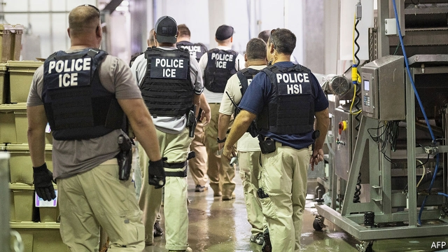
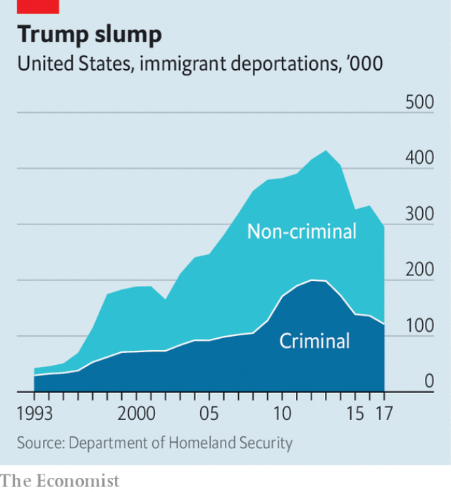

###### Immigration policy

# What do Donald Trump’s immigration raids accomplish? 

 

> print-edition iconPrint edition | United States | Aug 22nd 2019 

THE SCHOOL day on August 7th was just beginning when a counsellor pulled 16-year-old José out of class. Immigration and Customs Enforcement (ICE) agents were raiding seven poultry-processing plants; did he know anyone who worked at one of them? He did. José worked afternoon shifts. His parents worked days, were then at the plant and, like him, were undocumented. They brought José (not his real name) and his family to America four years ago. His thoughts ran to his four brothers and sisters. If his parents were detained and deported, who would feed and care for them? How would they pay rent? 

José’s parents ended up among the 303 people released after being arrested that day. Another 377 remain in ICE facilities in Louisiana and Mississippi. Father Roberto Mena, parish priest of St Michael’s Church in nearby Forest, says his parishioners are frightened. Mark Bowman, a pastor in neighbouring Carthage, says that when his parishioners showed up to donate boxes of food to families of the detained, some “wouldn’t come to the door, because they thought we might be ICE”. 

Barack Obama’s administration deported large swathes of undocumented immigrants. But his directives to ICE were to avoid sweeping raids. President Donald Trump has revived them and has moved to change the way detained migrants are treated. On August 21st his administration unveiled plans that could allow for the indefinite detention of undocumented families—including children—who cross the border illegally. The new rules would replace a decades-old agreement on levels of care for migrant children and the length of time the government can detain them. 

In 2017 Tom Homan, who then headed ICE, ordered workplace enforcement to be increased “four or five times” over then-current levels. The Mississippi raids comprised the seventh workplace raid since April 2018 in which more than 100 people have been arrested. It was the biggest since a raid on a slaughterhouse and meatpacker in Pottsville, Iowa yielded nearly 400 arrests on May 12th 2008, near the end of George W. Bush’s presidency. 

That raid occurred in a different political world. Muzaffar Chishti, a lawyer and policy analyst with the Migration Policy Institute, a think-tank, contends that the Pottsville raid was intended to nudge congressional Republicans into supporting immigration reform by showing them how inhumane enforcement would be without an agreement. The current raids, says Mr Chishti, are “the signal of an anti-immigration president to his base”. 

Bryan Cox, an ICE spokesman, insists that ICE is “equally focused...on those who unlawfully seek employment [and] the employers who knowingly hire them”. But between March 2018 and March 2019 just 11 employers were charged for hiring undocumented workers. None has yet been charged after the raids in Mississippi. Koch Foods, one of the raided processors, noted in a statement that employers cannot demand more documents when employees present authentic-looking papers, and that E-Verify, an online system that is supposed to confirm employees’ legality, does not catch workers using the stolen or borrowed identity of a legal migrant. 

As a show of force, such raids are impressive. As a matter of policy, they are inefficient, requiring large resource expenditures to arrest a few hundred workers. It may sound tough to say that every undocumented immigrant is an equal priority, but from a public-safety perspective it makes no sense. A workplace raid absorbs time that then cannot be spent on more dangerous undocumented immigrants. 

There are signs that this shift in priorities is having consequences. The number of deported people convicted of a crime fell to its lowest level in 2017 since 2008, the year before Mr Obama became president. That figure has started to climb, but remains below the average from Mr Obama’s time in office. 

Nor is it just immigrants whom these raids make nervous. Poultry is Mississippi’s biggest agricultural industry, but cutting chickens is a dangerous job and processors were already struggling to find workers. Allison Crittenden, the congressional-relations director at the American Farm Bureau Federation, an agricultural lobbying group, says her members worry about raids causing “a potential disruption to farming operations”. 

So what do these raids accomplish? For one thing, they help Mr Trump keep his deportation numbers up now that local police are less co-operative than they used to be. Between Mr Bush’s inauguration and the start of Mr Obama’s second term, deportations rose markedly—from 189,000 in 2001 to 432,000 in 2013 (see chart). 

 

Much of that increase stemmed from local police assistance. Metro areas that offer sanctuary to illegal immigrants—as more than three-quarters of those housing most of America’s undocumented population do—limit such co-operation. ICE agents cannot simply wander through immigrant neighbourhoods at random demanding proof of citizenship. Workplaces provide large numbers of undocumented people at a single, predictable site. 

Mr Trump may believe that raids deter would-be migrants, but no evidence backs him up. It is difficult to imagine that someone whose children have been targeted by gangs in Honduras will factor the prospect of being caught in a raid in Mississippi or Ohio into their decision to flee. Raids dominate a couple of news cycles, scare immigrants and let Mr Trump project toughness. 

On a recent afternoon, José’s neighbourhood was deserted. Yet if the administration had set itself against José and his family, his neighbours had not. Pastor Bowman says his parishioners tend to be politically conservative, but also believe that “God tells us explicitly to feed the hungry, to clothe those in need of clothes, to provide shelter to those who are homeless and to care for the immigrant population within the boundaries of our country.”■ 
<<<<<<< HEAD

-- 

 单词注释:

1.Aug[]:abbr. 八月（August） 

2.counsellor['kaunsәlә]:n. 顾问, 辅导员, 律师 

3.enforcement[in'fɒ:smәnt]:n. 执行, 强制 [法] 实施, 加强, 厉行 

4.undocumented[,ʌn'dɔkjjmentid]:a. 无正式文件的, 无事实证明的 

5.detain[di'tein]:vt. 扣留, 扣押, 耽搁 [法] 拘留, 扣押, 留住 

6.deport[di'pɒ:t]:vt. 举止, 驱逐出境 [法] 放逐, 驱逐, 递解 

7.Louisiana[lu:.i:zi'ænә]:n. 路易斯安那(美国州名) 

8.Mississippi[.misi'sipi]:n. 密西西比河, 密西西比州 

9.Roberto[]:n. 罗伯托（人名） 

10.mena[]:n. 米纳（女子名） 

11.parish['pæriʃ]:n. 教区, 堂区 [法] 救贫区, 教区 

12.ST[]:[计] 段表, 状态, 系统测试, 直端连接器 [化] 磺胺噻唑 

13.parishioner[pә'riʃәnә]:n. 教民 

14.bowman['bәumәn]:n. 弓射手, 持弓的兵, 船首的划手 

15.pastor['pæstә]:n. 牧师 

16.Carthage['kɑ:θidʒ]:n. 迦太基 

17.donate['dәuneit]:v. 捐赠 

18.barack[bɑ:'ræk]:n. 巴拉克（男子名） 

19.swathe[sweiθ]:vt. 绑, 裹, 包围 n. 带子, 绷带 

20.directive[di'rektiv]:a. 指导的, 指挥的, 方向的 n. 指令 [计] 指令; 命令 

21.revive[ri'vaiv]:vt. 使苏醒, 使复兴, 使振奋, 回想起, 重播 vi. 苏醒, 复活, 复兴, 恢复精神 

22.migrant['maigrәnt]:n. 候鸟, 移居者 [法] 移居者 

23.unveil[.ʌn'veil]:vt. 揭开, 揭幕, 除去...的面纱 vi. 显露, 除去面纱 

24.detention[di'tenʃәn]:n. 阻止, 监禁, 拘留 [医] 隔离, 拘留, 滞留, 停滞 

25.illegally[]:[法] 非法地, 不合法地, 违法地 

26.tom[tɒm]:n. 雄性动物, 雄猫 

27.homan[]: [人名] [英格兰人姓氏] 霍曼 Holman的变体 

28.enforcement[in'fɒ:smәnt]:n. 执行, 强制 [法] 实施, 加强, 厉行 

29.slaughterhouse['slɒ:tәhaus]:n. 屠杀场 

30.meatpacker[]:[网络] 肉类包装企业；屠宰加工厂 

31.pottsville[]: [地名] [美国] 波茨维尔 

32.Iowa['aiәwә]:n. 衣阿华州 

33.george[dʒɔ:dʒ]:n. 乔治（男子名）；自动操纵装置；英国最高勋爵勋章上的圣乔治诛龙图 

34.W['dʌb(ә)lju:]:[计] 等待, 写, 字 [医] 钨(74号元素) 

35.presidency['prezidәnsi]:n. 总统职权, 总裁职位 

36.muzaffar[]:[网络] 儿童主题；穆扎法尔；扎法尔 

37.chishti[]:[网络] 斯提；契斯提教义；希提 

38.analyst['ænәlist]:n. 分析者, 精神分析学家 [化] 分析员; 化验员 

39.migration[mai'greiʃәn]:n. 移民, 移往, 移动 [计] 迁移 

40.contend[kәn'tend]:vi. 奋斗, 斗争, 竞争 vt. 为...斗争 

41.nudge[nʌdʒ]:n. 用肘轻推, 推动, 讨厌家伙 

42.congressional[kәn'greʃәnl]:a. 会议的, 议会的, 国会的 [法] 代表大会的, 大会的, 议会的 

43.inhumane[.inhju:'mein]:a. 无人情味的, 薄情的, 残忍的 

44.bryan['braiәn]:n. 布赖恩（男子名） 

45.cox[kɒks]:n. 舵手 v. 做舵手 

46.spokesman['spәuksmәn]:n. 发言人, 代言者 

47.equally['i:kwәli]:adv. 相等地, 同样地, 平等地 

48.unlawfully[]:adv. 不正当地；不合法地 

49.knowingly['nәjiŋli]:adv. 会意地, 心照不宣地, 故意地, 有意地, 老练地 [法] 心照不宣地, 故意地, 有意地 

50.koch[kɔx]:n. 科赫（人名） 

51.processor[prә'sesә]:n. 信息处理机, 加工者, 处理者 [计] 处理器 

52.cannot['kænɒt]:aux. 无法, 不能 

53.online[]:[计] 联机 

54.legality[li:'gæliti]:n. 合法, 正当 [经] 合法性 

55.convict[kәn'vikt]:n. 囚犯, 罪犯 vt. 宣告有罪, 使知罪 

56.obama[]:n. 奥巴马(姓) 

57.poultry['pәultri]:n. 家禽 

58.Allison['ælisən]:n. 艾利森（女子名） 

59.crittenden[]: [人名] 克里滕登; [地名] [美国] 克里滕登 

60.federation[fedә'reiʃәn]:n. 联邦, 联合, 联盟 [法] 联邦, 联盟, 联邦政府 

61.lobby['lɒbi]:n. 大厅, 休息室, 游说议员者 vi. 游说议员, 游说 vt. 游说 

62.disruption[dis'rʌpʃәn]:n. 分裂, 崩溃, 瓦解 

63.deportation[.di:pɒ:'teiʃәn]:n. 驱逐出境, 放逐 [法] 递解出境, 放逐, 驱逐 

64.les[lei]:abbr. 发射脱离系统（Launch Escape System） 

65.inauguration[i,nɔ:^ju'reiʃәn]:n. (美)总统就职, 开幕仪式, 就职典礼, 开始, 开辟, 开创, 为...举行开幕式 [法] 就职, 就职典礼, 创造 

66.metro['metrәu]:n. 地铁 

67.sanctuary['sæŋktʃuәri]:n. 圣所(指教堂、寺院等), 耶路撒冷的神殿, 避难所 [法] 庇护所, 避难所, 教堂 

68.citizenship['sitizәnʃip]:n. 国籍, 市民权, 市民的身份 [法] 公民权, 公民资格, 公民身分 

69.predictable[pri'diktәbl]:a. 可预言的 

70.deter[di'tә:]:vt. 制止, 吓住, 威慑 

71.Honduras[hɒn'djurәs]:n. 洪都拉斯 

72.Ohio[әu'haiәu]:n. 俄亥俄 

73.toughness['tʌfnis]:n. 有粘性, 强硬, 强健 [化] 韧性 

74.pastor['pæstә]:n. 牧师 

75.politically[]:adv. 政治上 

76.explicitly[]:adv. 明确地；明白地 

77.homeless['hәumlis]:a. 无家的, 无养主的 
=======
>>>>>>> 50f1fbac684ef65c788c2c3b1cb359dd2a904378

