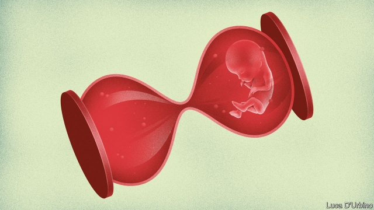

###### Abortion battles

# What explains Donald Trump’s war on late-term abortions? 

 

> print-edition iconPrint edition | United States | Aug 22nd 2019 

WHILE LEROY CARHART, a doctor who specialises in late-term abortions, was finishing his most recent termination, the manager of his clinic in Bethesda, Maryland, outlined the procedure. Abortions in the second half of pregnancy take between two and four days, said Christine Spiegoski, a nurse wearing a T-shirt that read: “Don’t like abortion? Prevent pregnancy by f**king yourself!” First, the doctor injects potassium chloride or digoxin into the fetus’s heart, killing it within minutes. If he is unable to reach the heart and instead pumps the drug into the amniotic sac, death can take up to 24 hours. Dr Carhart euthanises the fetus at the beginning of the procedure because its tissue and skull then soften and contract, easing removal. At 25 weeks a fetus weighs around a pound and a half and is over a foot long; some of those Dr Carhart aborts are older. 

Over the next two or three days, medical staff at the clinic, one of only three in America to provide third-trimester abortions, insert small sticks into the woman’s cervix to stretch it open. Then the woman is induced and the fetus delivered. The goal, says Ms Spiegoski, is a delivery “as much like regular labour as possible”. The procedure she describes is quite different from President Donald Trump’s oft-repeated claim that late-term abortions involve babies being “ripped from their mother’s womb”. But it is not difficult to understand why many people, including those broadly in favour of abortion choice, find it problematic. This is also why Mr Trump has seized upon late-term abortion, the most controversial dimension of an issue that has inflamed American politics for almost half a century, as a campaign issue. 

Data on abortion late in pregnancy in America are patchy. Not all states are required to report abortion statistics to the Centres for Disease Control (CDC), a federal agency, and the 40 states that do provide the gestational ages of aborted fetuses use ranges that do not reveal how many terminations take place in the third trimester. Still, the data suggest late abortions are extremely rare. In 2015, 1.3% of abortions took place after 21 weeks. But they carry huge political weight, as Mr Trump, who once described himself as “very pro-choice” is keenly aware. 

The two sides in America’s abortion war have driven each other to new extremes this year. A flood of early-abortion laws in conservative states, some tantamount to total bans, have prompted other, socially liberal, states to make it easier to have an abortion at the other end of pregnancy. Meanwhile, the Trump administration has set new rules for Title X, a federal family-planning grant programme dating back to the Nixon administration. Organisations receiving Title-X funding are no longer allowed to provide abortions or refer patients to doctors for them. On August 19th Planned Parenthood responded by announcing it would withdraw from the programme—forgoing some $60m in funding—to avoid the new rules. 

Mr Trump’s declaration of war on late abortions, a common theme at his rallies, is not only designed to please the evangelicals who helped elect him in 2016. Gallup polling suggests that whereas a majority of Americans think abortion should “generally be legal” in the first trimester, only 13% think it should in the third. 

Dr Carhart says that people would change their minds sharpish if they or someone they loved needed a late abortion. He vowed a decade ago to continue the work of George Tiller, an abortion doctor in Kansas shot dead by an anti-abortion zealot in 2009. Dr Carhart says he is motivated by injustice: women, he says, tend to shoulder the burden of an unwanted pregnancy. “Men…can just walk away if they don’t want anything to do with it,” he says. “It should be both of their responsibilities.” If a woman feels she cannot, “she shouldn’t be punished to go through that.” 

Try telling that to those on the debate’s opposite side. In the first seven months of 2019 at least 16 states passed or introduced early abortion bans flouting Roe v Wade, the Supreme Court ruling that in 1973 declared abortion a constitutional right. They were emboldened to do so by Mr Trump’s appointment of Justice Brett Kavanaugh, which gave America’s highest court a solidly conservative majority. They hope that one such law will make it to the Supreme Court and help overturn Roe. 

Socially liberal states have pushed back. This year, Illinois, Maine, New York, Rhode Island and Vermont have passed laws loosening restrictions on abortion later in pregnancy, codifying protections for abortion rights, or allowing medical workers other than doctors to perform them. 

These measures are in part designed to ensure uninterrupted abortion services if anti-abortionists’ efforts to overturn Roeprove successful. But they are also, like the legislation that sparked them, political. “We wanted to send a message and make it explicit,” says Ann Pugh, a Democratic congresswoman in Vermont who co-sponsored the bill there, “that the very private, personal matter of abortion should be decided by a woman and a medical practitioner.” Vermont is one of seven states that have no laws governing when or for what reason a woman may have an abortion. 

Why did the two sides become so polarised? The main reason is the way abortion was legalised. In many countries, abortion laws were voted for by elected politicians or in referendums. In America, a seven-to-two majority of justices declared abortion a constitutional right. Anti-abortionists question the interpretation of the constitution that produced that ruling and are furious their voices were not heard. Abortion advocates remain fired up by the knowledge that Roe could yet be overturned. 

Had America’s abortion laws been fought over in Congress, they would probably have been more restrictive. Instead, they are among the most liberal in the world—another reason why abortion is fertile ground for Mr Trump. Of 59 countries that allow abortion on demand, America is one of only seven that allow it after 20 weeks of pregnancy. Supreme Court rulings allow it until the fetus is viable, around 24 weeks. 

Thereafter, according to another ruling handed down on the same day as Roe, abortions are allowed if the fetus has an anomaly or the mother’s life or health is at risk. Doe v Bolton defines health in capacious terms, to encompass many aspects of well-being, from the economic to the familial. Research suggests a minority of abortions later in pregnancy are performed because the fetus has an anomaly or the woman’s life is endangered, so most come down to the health exception. 

For his part, Dr Carhart says that a woman requesting an abortion “has to be a fairly good storyteller. She has to convince me that this really is a problem. The fact that she wants to get into a size eight bathing suit next week—I’m not going to do it for that.” He will always refuse to perform an abortion if the woman is not certain. “I’d rather do an abortion at 30 weeks than have her come in at eight weeks and have the abortion and all of a sudden realise, ‘I wanted to have that baby’,” he says. 

America’s comparatively liberal laws do not mean it is easy to get an abortion. Since 1973, lawmakers have chipped away at Roe by introducing hundreds of state-level regulations. Many of them seem trivial—prescribing, say, the precise width of clinic corridors—but their cumulative effect has been devastating. At least seven states have only one abortion clinic left. 

The result of that may be more late abortions. Data are limited, but research by Daniel Grossman, a professor of gynaecology and reproductive sciences at the University of California, San Francisco, found that abortion restrictions introduced in Texas in 2013 led to a 27% increase in second-trimester abortions the following year. 

America’s abortion war has curtailed access to abortion in other ways, too. Since 1976 the Hyde Amendment has forbidden the use of federal funds for abortion. Some women may have to delay abortions while they raise cash to pay for it. Dr Carhart, meanwhile, says he has performed abortions late in pregnancy because pro-life doctors have chosen not to tell their patients the fetus they are carrying has an anomaly—and then a few weeks before the due date warn them about the condition. 

He says that women often ask for tips on how to disguise their abortions from their doctors for fear they refuse to see them again. “I say to them, why the hell do you want to see that doctor anyway?” He advises those women to find a doctor who shares their beliefs. Even the medical profession is polarised. The only thing that could end America’s destructive abortion war is a political consensus. That, unfortunately, is unimaginable.■ 
<<<<<<< HEAD

-- 

 单词注释:

1.Aug[]:abbr. 八月（August） 

2.Leroy['lerɔi]:n. 勒罗伊（男子名） 

3.carhart[]: [人名] 卡哈特 

4.specialise['speʃә,laiz]:vt. 特加指明, 列举, 使专门化, 限定...的范围 vt.vi. (使)特化, (使)专化 vi. 成为专家, 专务, 专攻, 专门研究, 逐条详述 

5.termination[.tә:mi'neiʃәn]:n. 终止, 结束, 结果, 词尾 [化] 终止 

6.bethesda[be'θezdə]:n. 贝塞斯达（美国马里兰州中部城市）；毕士大（传说中耶路撒冷附近的池子, 据说池水可治百病） 

7.Maryland['merilәnd]:n. 马里兰州 

8.pregnancy['preɡnәnsi]:n. 怀孕；丰富, 多产；意义深长 

9.christine['kristi:n]:n. 克莉丝汀（女子名） 

10.inject[in'dʒekt]:vt. 注射, 注入, 使入轨 [医] 注射 

11.potassium[pә'tæsiәm]:n. 钾 [化] 钾K 

12.chloride['klɒ:raid]:n. 氯化物 [化] 氯化物; 盐酸盐 

13.digoxin[dai'^ɔksin]:n. 地高辛 [化] 地高辛; 异羟基洋地黄毒苷原 

14.amniotic[]:a. 羊膜的 [医] 羊膜的 

15.SAC[sæk]:n. 囊, 液囊, (美)战略空军司令部 [医] 囊, 袋 

16.carhart[]: [人名] 卡哈特 

17.euthanises['ju:θənaiz]:vt. [主英国英语] = euthanize [亦作 euthanatise] 变形： vt. euthanised . euthanising 

18.fetus['fi:tәs]:n. 胎儿 [医] 胎, 胎儿 

19.skull[skʌl]:n. 头盖骨, 头脑, 好学生 [医] 头颅 

20.soften['sɒftn]:v. (使)变柔软, (使)变柔和 

21.abort[ә'bɒ:t]:vi. 流产, 中途失败 vt. 使流产, 使失败, 使中止 

22.cervix['sә:viks]:n. 器官的颈部, 颈 [医] 颈, 子宫颈 

23.induce[in'dju:s]:vt. 引诱, 招致, 归纳出, 感应 [医] 诱导, 感应 

24.rip[rip]:n. 裂痕, 破绽, 拉裂, 浪子, 巨浪 vi. 被拉开, 裂开, 猛冲 vt. 撕, 扯, 劈 

25.womb[wu:m]:n. 子宫, 发源地 [医] 子宫 

26.broadly['brɒ:dli]:adv. 宽广地, 明白地, 无礼貌地 

27.problematic[prɔblә'mætik]:a. 成问题的, 未定的, 疑难的, 有疑问的, 盖然性的, 或然性的 

28.inflame[in'fleim]:vt. 激怒, 点火, 激起 vi. 着火, 激动, 发炎 

29.politic['pɒlitik]:a. 精明的, 明智的, 策略的 

30.datum['deitәm]:n. 论据, 材料, 资料, 已知数 [医] 材料, 资料, 论据 

31.patchy['pætʃi]:a. 补缀的, 凑合的, 不调和的, 散落的, 斑驳的, 不完全的 

32.statistic[stә'tistik]:n. 统计量 a. 统计的, 统计学的 

33.cdc[]:abbr. 疾病防治中心（Centers for Disease Control）；（美）市民民防团（Citizens ' Defense Corps）；控制数据公司（Control Data Corp） 

34.gestational[]:[医] 妊娠的, 受[孕]的 

35.fetuse[]:胎儿的 

36.trimester[trai'mestә]:n. 三个月, 一学期 [医] 三个月, 三月期 

37.keenly['ki:nli]:adv. 锐利地, 敏捷地, 激烈地 

38.tantamount['tæntәmaunt]:a. 同等的, 相等的, 相当于...的 [法] 相等的, 相当的, 同等的 

39.socially['sәuʃәli]:adv. 在社会上, 在社交上, 以社会生活方式 

40.x[eks]:n. 未知数 [计] 交换, 变址, 索引, 传输 

41.nixon['niksn]:n. 尼克松（美国第37任总统） 

42.organisation[,ɔ: ^әnaizeiʃən; - ni'z-]:n. 组织, 团体, 体制, 编制 

43.parenthood['perәnthud]:n. 父母身分 

44.declaration[.deklә'reiʃәn]:n. 宣告, 说明, 宣布 [计] 说明 

45.rally['ræli]:n. 重振旗鼓, 集合, 群众集会, 跌停回升 v. 重整旗鼓, 集合, 恢复精神, 团结, 挖苦, 嘲笑 

46.evangelical[,i:væn'dʒelikәl]:a. 福音派教会的 n. 福音派信徒 

47.Gallup['^ælәp]:n. 盖洛普（姓氏）；盖洛普（George Horace, 1901-美国统计学家, 盖洛普民意测验的创始人） 

48.sharpish[ˈʃɑ:pɪʃ]:a. & adv. 相当锐利的（地） 

49.vow[vau]:n. 誓约, 誓言, 许愿 vi. 起誓, 发誓, 郑重宣言 vt. 立誓, 起誓要, 郑重地宣布 

50.george[dʒɔ:dʒ]:n. 乔治（男子名）；自动操纵装置；英国最高勋爵勋章上的圣乔治诛龙图 

51.tiller['tilә]:n. 耕种者, 分蘖 vi. 分蘖 

52.kansa[]:n. （日语）监察；堪萨人（旧时居住在美国堪萨斯州一带的印第安人） 

53.zealot['zelәt]:n. 热心者, 狂热者, 犹太教狂热信徒 [法] 狂热分子, 激烈分子 

54.unwanted[.ʌn'wɒntid]:a. 没人要的, 不需要的, 多余的 

55.cannot['kænɒt]:aux. 无法, 不能 

56.flout[flaut]:vt. 嘲笑, 愚弄 vi. 表示轻蔑 n. 嘲笑, 愚弄, 轻视 

57.roe[rәu]:n. 狍, 鱼子, 鱼卵 [医] 鱼卵, 牝鹿 

58.V[vi:]:[计] 溢出, 变量, 向量, 检验, 虚拟, 垂直 [医] 钒(23号元素) 

59.wade[weid]:vi. 跋涉 vt. 涉水 n. 跋涉, 浅滩 

60.constitutional[.kɒnsti'tju:ʃәnl]:a. 宪法的, 立宪的, 体质的 [医] 全身的; 体质的 

61.embolden[im'bәuldn]:vt. 使大胆, 使有胆量 

62.brett[bret]:n. 布雷特（男子名） 

63.kavanaugh[]: [人名] 卡瓦诺 

64.solidly[]:adv. 坚硬地；坚固地；团结一致地 

65.overturn[.әuvә'tә:n]:n. 倾覆, 破灭, 革命 vt. 推翻, 颠倒 vi. 翻倒 

66.socially['sәuʃәli]:adv. 在社会上, 在社交上, 以社会生活方式 

67.Illinois[.ili'nɒis]:n. 伊利诺州 

68.Maine[mein]:n. 缅因州 

69.york[jɔ:k]:n. 约克郡；约克王朝 

70.rhode[]:n. 罗德岛 

71.Vermont[vә:'mɔnt]:n. 佛蒙特 

72.codify['kәudifai]:vt. 编成法典 [法] 使成文法化, 编成法典, 编纂 

73.uninterrupted['ʌn.intә'rʌptid]:a. 不间断的, 连续的, 不断的 

74.ann[æn]:n. 安（女子名） 

75.pugh[pju:]:interj. 呸(表示轻蔑、嫌恶) 

76.congresswoman['kɒŋgreswumәn]:n. 国会女议员, 众议院女议员 

77.practitioner[præk'tiʃәnә]:n. 从业者, 开业者 [医] 行医者, 医师 

78.legalise['li:^әlaiz]:vt. 使合法化, 使成为法定, 法律上认可 

79.referendum[.refә'rendәm]:n. （就重大政治或社会问题进行的）全民公决，全民投票 

80.restrictive[ri'striktiv]:a. 限制的, 约束的, 限定的 n. 限制词 

81.ruling['ru:liŋ]:n. 判决, 裁定, 统治 a. 统治的, 支配的, 普遍的 

82.viable['vaiәbl]:a. 能养活的, 能生长发育的 [医] 有活力的, 有生机的 

83.thereafter[.ðєәr'æftә]:adv. 其后, 从那时以后 

84.anomaly[ә'nɒmәli]:n. 不规则, 反常事物, 畸形 [医] 异常, 反常 

85.doe[dәu]:n. 母鹿, 雌兔 

86.bolton['bәultәn]:a. 可用螺栓固定的 

87.capacious[kә'peiʃәs]:a. 容积大的, 广阔的, 宽敞的 

88.encompass[in'kʌmpәs]:vt. 围绕, 完成, 包括, 包含, 环绕, 包围 

89.familial[fә'miljәl]:a. 家族的, 家庭的 [医] 家族的, 全家的 

90.endanger[in'deindʒә]:vt. 危及 [法] 使危险, 危及 

91.storyteller['stɒ:ritelә]:n. 说故事的人, 故事作者 

92.BThE[]:[网络] 实际热效率 

93.alway['ɔ:lwei]:adv. 永远；总是（等于always） 

94.lawmaker[lɒ:'meikә]:n. 立法者 

95.chip[tʃip]:n. 屑片, 薄片, 碎片 vt. 削, 切, 削成碎片, 使摔倒, 凿 vi. 削下屑片 [计] 孔屑; 组件; 晶片; 芯片 

96.cumulative['kju:mjulәtiv]:a. 累积的 [医] 蓄积的, 累积的 

97.devastate['devәsteit]:vt. 毁坏 [法] 使荒废, 毁灭, 掠夺 

98.daniel['dænjәl]:n. 丹尼尔（男子名） 

99.Grossman[]:n. (Grossman)人名；(德、英、捷)格罗斯曼 

100.gynaecology[,dʒaini'kɔlәdʒi,, ^ai-]:n. 妇科学 

101.reproductive[.ri:prә'dʌktiv]:a. 生殖的, 再生的, 复制的 [医] 生殖的, 复现的 

102.California[.kæli'fɒ:njә]:n. 加利福尼亚 

103.san[sɑ:n]:abbr. 存储区域网（Storage Area Networking） 

104.francisco[fræn'siskәu]:n. 弗朗西斯科（男子名, 等于Francis） 

105.Texas['teksәs]:n. 德克萨斯 

106.curtail[kә:'teil]:vt. 缩减, 剥夺, 简略 [法] 剥夺特权 

107.hyde[haid]:n. 海德 

108.amendment[ә'mendmәnt]:n. 修订, 改善, 改良, 改正 [化] 调理剂; 修正 

109.polarise['pәjlәraiz]:vi.vt. (使)极化, (使)偏振, (使)两极分化 
=======
>>>>>>> 50f1fbac684ef65c788c2c3b1cb359dd2a904378

