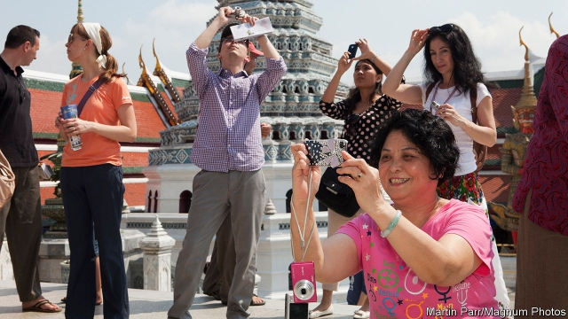
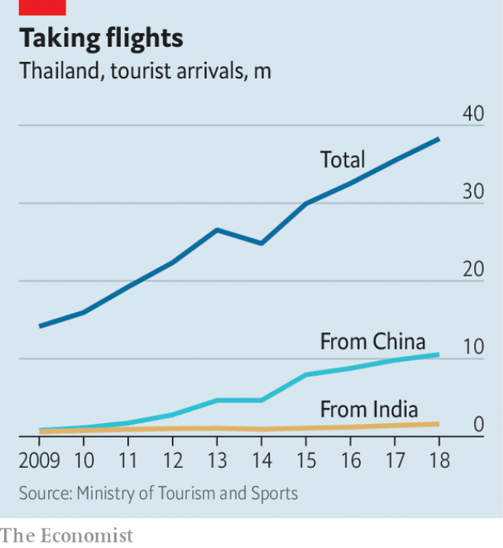

###### Land of nervous smiles

# A fall in the number of Chinese tourists breeds unease in Thailand 

 

> print-edition iconPrint edition | Asia | Aug 31st 2019 

IT IS NOT hard to find Talad Rot Fai, a night market in Bangkok. On leaving the nearby subway station, just follow the column of Chinese tourists. They eagerly try on heart-shaped sunglasses, avocado-patterned socks and other fripperies. Yet the people manning the stalls are glum. Ton, who runs a store selling mobile-phone accessories, flicks through a ledger. On his best days last year, he says, sales came to perhaps 15,000 baht ($485). Now they have slumped to around 6,000 baht. “It is not so good recently and it has been like this for many months already,” explains Mie, who sells shoes nearby. She complains that Chinese visitors rarely buy her trainers. When they do, she says, they drive a hard bargain. 

Thais face tough times. Figures released this month show that the economy grew by a lacklustre 2.3% in the year ending in June, its slowest rate in almost five years. (Last year the economy expanded by 4.1%.) Exports are limp because of the trade war between America and China and the strength of the baht, the local currency. It has risen by more than 5% against the dollar this year, making it the best-performing currency in South-East Asia. Farmers, meanwhile, are cursing the feeblest monsoon in a decade. The country’s central bank, evidently worried about the weakness of the economy, recently cut its benchmark interest rate by a quarter of a percentage point, to 1.5%. 

 

Tourism is another source of concern. The industry generates more than a fifth of GDP. It has grown by leaps and bounds in recent years (see chart). But China’s slowdown and the weakness of its currency seem to be discouraging its citizens, who made up more than a quarter of the 38m foreign visitors to Thailand last year, from enjoying fresh coconuts on balmy beaches. The number of Chinese holidaymakers dropped by nearly 5% in the first six months of this year compared with the same period last year. 

“I think we are still holding our own,” maintains Yuthasak Supasorn, the governor of the Tourism Authority of Thailand. But the strong baht means Thailand isn’t as cheap as it used to be. Overall tourist numbers are slightly higher so far this year than last, but the growth is unusually meagre. 

Not all the industry’s problems are external. Last year the sinking of a boat in Phuket killed 47 Chinese tourists, horrifying prospective holidaymakers. Thailand’s roads are also the most dangerous in Asia, despite government promises to improve them. (A report by the World Health Organisation from 2018 found that only eight other countries in the world have a higher rate of traffic deaths.) And petty crime is rampant. The head of the tourist police in Bangkok recently described the scale of pickpocketing around the Khao San road, a hostel hub, as “unbelievable”. 

Another factor in the slowing growth of tourism is overburdened infrastructure. Packed airports with long queues induce a sense of anything but relaxation among visitors. Even beaches are too crowded. Last year the government closed Maya Bay, the cliff-encircled Eden made famous in the film “The Beach”, to allow its ecosystem to recover from the tourist onslaught of past years. The spot is not expected to reopen until 2021. 

A drop in tourism will be difficult for a variety of companies. Poorly managed state enterprises may be in the worst position to endure a downturn. Thai Airways already loses money and is struggling under more than 100bn baht of debt. Even so, the transport minister has given permission for the carrier to purchase or lease 38 new aircraft. 

Politicians are eager to ensure that tourism picks up again. The tourism minister believes more should be spent on marketing and incentives to attract visitors. On August 16th the government announced a stimulus package of 316bn baht to boost the economy. Among other measures, it extends a programme which provides free visas on arrival for tourists from countries including China and India—happily a country sending ever larger numbers of visitors to Thailand. It also offers 1,000 baht of spending money and a 15% rebate on hotel accommodation to domestic tourists who travel outside their home province. Yet the stimulus package may help only at the margins. In a country riven by coups and political conflict, tourism has succeeded in spite of the government, not because of it. ■ 

