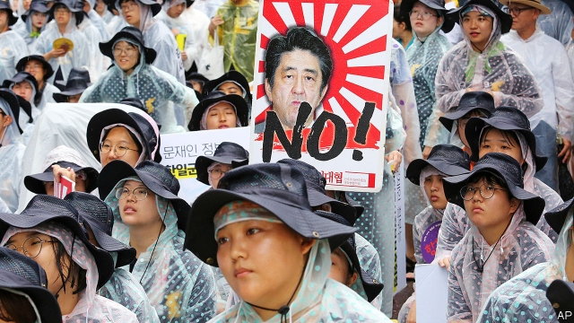

###### Unique low

# An old grudge between Japan and South Korea is getting out of hand 

 

> print-edition iconPrint edition | Asia | Aug 29th 2019 

ORDER A GLASS of Asahi lager in a pub in Seoul these days and chances are the bartender will shake his head disapprovingly before suggesting one of the watery local alternatives. Shopkeepers have relegated Japanese products to the bottom shelf or removed them from view altogether. Owners of sushi restaurants have put up signs stressing that though their dishes may look Japanese, the fish was caught in Korean waters. Many fashionistas will no longer be seen dead in a branch of Muji or Uniqlo, though both Japanese brands are usually very popular. 

The boycott is the most noticeable popular expression of an escalating row between South Korea and Japan, which has evolved from a diplomatic spat over Japan’s conduct in the second world war into a full-blown feud over trade and national security. On August 28th Japanese restrictions on the export of hundreds of products to South Korea came into force. Earlier this week, South Korea conducted scaled-up military exercises around Dokdo, disputed islets which South Korea controls but Japan claims as its own (calling them Takeshima). Days before South Korea had halted an intelligence-sharing pact with Japan. 

The deteriorating relations between two American allies will make it harder to manage rising tensions in East Asia. Russia and China have become increasingly assertive in recent months, testing the patience of the two regional democracies with deep incursions into their airspace. Kim Jong Un, North Korea’s dictator, has continued to expand his missile programme—and in all likelihood, his nuclear one—despite several rounds of denuclearisation talks with America. Over the past few weeks he has tested new weapons which analysts say are designed to foil regional missile-defence systems, making it all the more crucial to keep tabs on their development. 

The spat between South Korea and Japan has little to do with such present-day threats and everything to do with chronic historical grievances, notably over Japan’s annexation of Korea and the suffering inflicted on its people during the war. It became acute last year, when South Korea’s Supreme Court ruled that Japanese companies that used South Koreans as forced labour during the war should pay compensation to surviving victims. Japan says such claims were settled by a treaty in 1965 and has demanded that the South Korean government rein in the court. 

In July Japan elevated the conflict to the commercial realm by restricting exports of chemicals that are essential for manufacturing memory chips, one of South Korea’s biggest industries. This month the dispute spread to matters of security. Japan decided in early August to remove South Korea from a list of preferred trading partners on national-security grounds, citing concerns that components might end up in North Korea. South Korea then announced it would not renew its intelligence-sharing pact with Japan, which America had brokered in 2016, as trust had broken down. 

American officials say they have been taken aback. The State Department issued a rare public rebuke of the South Korean government. But many observers believe the escalation could have been avoided if America had shown more interest earlier on. President Donald Trump has called on the two allies to “get along”, but done precious little to mediate in the dispute, complaining that he has too much on his plate already. He has continued to shrug off Mr Kim’s weapons tests. “The problem is that the administration has no plan for the region other than the president staying in the news,” says Alexis Dudden of the University of Connecticut. 

For all the excitable rhetoric, the immediate consequences for security co-operation are unlikely to be severe. The intelligence-sharing pact does not expire until late November. Even after that, Japan and South Korea will still have access to each other’s intelligence through a trilateral agreement with America. The trade restrictions have yet to bite, too. Japan continues to authorise exports. The red tape generated by the new rules is bothersome but not yet lethal for companies. Businesses in both countries are more worried by the trade war between America and China. 

The erosion of trust is more serious. “This is a fight between friends that will only benefit actual antagonists such as North Korea,” says Park Cheol-hee of Seoul National University. Scrapping the pact is also likely to put South Korea on the back foot in negotiations about how to divide the cost of hosting American troops, and reduce its standing in the eyes of the world, believes Chun In-bum, a former South Korean army general. “I’m disappointed because it makes us look guilty,” he says. 

The dispute is also beginning to rile ordinary people. Two-thirds of South Koreans say they support the boycott of Japanese products and would consider taking part. Four-fifths claim they would not go on holiday to Japan at the moment. Sales of Japanese beer and clothing in South Korea have collapsed since July. Airlines have cut back flights on many popular routes. 

Japanese public opinion is not yet vocally anti-Korean, but a majority of Japanese voters support the government’s stance. Right-wing groups are stoking anti-Korean sentiment by recycling old tropes of “untrustworthy” and “faithless” Koreans, says Ms Dudden. Visitors to Tokyo report a mood of exasperation with what many Japanese perceive as South Korean intransigence. 

This makes it unlikely that the dispute will be resolved quickly. Neither side feels it can be seen to back down, says Mr Park, who thinks South Korea should take the first step towards de-escalation by reversing its decision on the intelligence-sharing pact. But Moon Jae-in, South Korea’s president, who faces legislative elections in April, is struggling with a sickly economy, deadlock in his flagship policy of inter-Korean rapprochement and controversy regarding his favoured candidate for justice minister. Shinzo Abe, Japan’s prime minister, is for his part keen to please his ultranationalist base. As the two allies fan the flames of nationalism, Mr Kim has ample peace and quiet to expand his arsenal. ■ 

