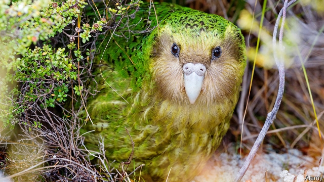

###### Cheep dates

# How eugenics is saving a pudgy parrot 

 

> print-edition iconPrint edition | Asia | Aug 31st 2019 

THE KAKAPO, a cuddly bird that lives in New Zealand, is not designed for survival. Weighing up to 4kg, it is the world’s fattest and least flighty parrot. It mates only when the rimu tree is in fruit, which happens every few years. Like other weird and wonderful creatures of the antipodes, it evolved in the absence of land-based predators, so instead of soaring above the trees it waddles haplessly across the dry forest floor below. When it stumbles across something that might kill it, it has the lamentable habit of standing still. 

Such oddities turned the kakapo into fast food for human settlers—and for the cats, rats and possums they brought with them. It seemed extinct by the 1970s, until scientists stumbled on two undiscovered populations in the country’s south. These survivors were eventually moved to small predator-free islands, where the Department of Conservation has spent decades trying to get them to breed. 

Its patience may finally be rewarded. The rimu was in fruit this year, and more than 80 chicks hatched after a bumper crop, making this the best breeding season on record. Many have survived into adolescence, increasing the number of adult kakapos by a third, to 200 birds. 

But another threat to the kakapo is a lack of genetic diversity, because of low numbers and inbreeding. This is one reason why fewer than half of kakapo eggs hatch. By sequencing the genome of every living bird, scientists can identify closely related individuals and prevent more inbreeding by putting them on different islands. Well-matched birds cannot be forced to mate, but artificial insemination is also proving effective. Every bird is fitted with a transmitter to track its slightest movement. If a female mates with an “unsuitable” male, the process can be “overridden” with another bird’s semen. Time is of the essence, so drones are being used to whizz kakapo sperm to the right place. 

This helps the males whose advances are rejected by fussy females, so would not otherwise procreate. It also allows researchers to identify useful genetic traits. One male, Gulliver, was found to haveunique disease-resistant genes. Andrew Digby, the programme’s scientist, thinks it “could hold the survival of the species”. 

A bias towards male chicks has been corrected with a blunter tool: dieting. Fat females seem to produce more male offspring, so each bird’s transmitter is used to unlock hoppers that dish out strictly calorie-controlled meals. Once laid, some eggs are sent away for incubation and replaced by smart fakes, which wiggle and cheep so that the mother is primed for her hatchling’s return. Sickly babies are reared for months by hand. 

All these efforts cost almost NZ$2m ($1.3m) this breeding season. Yet the kakapo’s future still looks precarious. Earlier this year a fungal disease tore through the population. And tiny as the number of kakapos is, space is running out on the two islands where most of them live. New predator-free havens must soon be found. ■ 
<<<<<<< HEAD

-- 

 单词注释:

1.cheep[tʃi:p]:n. 吱吱的叫声 v. 吱吱地叫 

2.eugenics[ju:'dʒeniks]:n. 优生学 [医] 优生学 

3.pudgy['pʌdʒi]:a. 矮胖的 

4.Aug[]:abbr. 八月（August） 

5.kakapo[,kɑ:kә'pәu]:n. 一种鹦鹉 

6.cuddly['kʌdli]:a. 可爱的, 适于搂抱的, 喜欢拥抱的, 可拥抱的 

7.zealand['zi:lәnd]:n. 西兰岛（丹麦最大的岛） 

8.flighty['flaiti]:a. 轻浮的, 轻狂的, 心情浮动的 

9.rimu['ri:mu:]:n. [植]芮木泪柏(新西兰产乔木) 

10.weird[wiәd]:a. 怪异的, 超自然的, 不可思议的 n. 命运, 预言, 符咒 

11.antipode['æntipәud]:n. 正相反的事物 [化] 对映体 

12.predator['predәtә]:n. 食肉动物, 掠夺者 [医] 捕食者 

13.soar[sɒ:]:n. 高扬, 翱翔 vi. 往上飞舞, 高耸, 翱翔 

14.waddle['wɔdl]:vi. 摇摇摆摆地走, 蹒跚而行 n. 蹒跚 

15.haplessly[]:adv. 倒霉地；不幸地 

16.lamentable['læmәntәbl]:a. 可悲的, 哀伤的, 可怜的 

17.oddity['ɒditi]:n. 奇异, 奇特, 怪人, 怪事, 怪僻 

18.kakapo[,kɑ:kә'pәu]:n. 一种鹦鹉 

19.possum['pɒsәm]:n. 负鼠 

20.undiscovered[.ʌndi'skʌvәd]:a. 未发现的, 未被发觉的, 尚不为人所知的 

21.survivor[sә'vaivә]:n. 生还者, 幸存者 [法] 生还者, 生存者, 辛存者 

22.bumper['bʌmpә]:n. 缓冲器, 满杯 a. 大胜利的 

23.kakapos[]:n. 鸮鹉（新西兰的一种鹦鹉）( kakapo的名词复数 ) 

24.diversity[dai'vә:siti]:n. 差异, 多样性 [化] 多样性 

25.inbreed['in'bri:d]:vt. 使同系繁殖, 使近亲交配, 使内部生成 

26.genome['dʒi:nәum]:[化] 基因组 [医] 染色体组 

27.cannot['kænɒt]:aux. 无法, 不能 

28.insemination[in.semi'neiʃәn]:n. 播种, 受胎, 授精 [医] 授精 

29.transmitter[træns'mitә]:n. 传送者, 传达人, (疾病的)传播者 [计] 发散机; 发送器 

30.override[.әuvә'raid]:vt. 推翻, 无视, 对...有最后发言权, 制服, 践踏, 奔越过 [经] 代理佣金, 代销佣金 

31.semen['si:mәn]:n. 精液, 精子 [医] 种子; 精液 

32.essence['esns]:n. 实质, 本质, 香精 [化] 香精 

33.drone[drәun]:n. 雄蜂, 懒惰者, 嗡嗡的声音, 无人驾驶飞机(或船) vi. 嗡嗡作声, 混日子 vt. 低沉地说 

34.whizz[hwiz]:n. 飕飕声, 精明的人, 专家 v. (使)飕飕作声 

35.sperm[spә:m]:n. 精液, 精虫, 鲸油, 抹香鲸 [化] 鲸蜡油 

36.fussy['fʌsi]:a. 易怒的, 爱挑剔的, 难取悦的, 易烦恼的 

37.procreate['prәukrieit]:vt. 生, 生殖, 产生 vi. 生殖 

38.trait[treit]:n. 特征, 特性, 一笔, 少许 

39.Gulliver['^ʌlivә(r)]:n. 格利佛(《格利佛游记》的主人公) 

40.andrew['ændru:]:n. 安德鲁（男子名） 

41.Digby[]:迪格比 

42.specie['spi:ʃi]:n. 硬币 [经] 硬币 

43.bias['baiәs]:n. 偏见, 斜纹 a. 偏斜的 adv. 偏斜 vt. 使有偏见 [计] 偏流; 偏压; 偏磁; 偏离 

44.blunt[blʌnt]:a. 钝的, 坦率的, 麻痹的 

45.offspring['ɒ:fspriŋ]:n. 子孙, 后代, 产物 [法] 后辈, 子孙, 后裔 

46.unlock[.ʌn'lɒk]:vt. 开...的锁, 开启, 表露, 放出 vi. 被开启, 揭开, 解放 [计] 解出锁定 

47.hopper['hɒpә]:n. 跳跃的东西, 单足跳者, 跳虫 [化] 漏斗; 贮斗; 料斗; 集尘箱; 集尘斗 

48.incubation[.inkju'beiʃәn]:n. 抱蛋, 孵化, 酝酿 [医] 孵育, 孵化, 潜伏, 宿庙求梦(古希腊) 

49.fake[feik]:n. 假货, 欺骗, 诡计 a. 假的 vt. 假造, 仿造 vi. 伪装 

50.wiggle['wigl]:v. 扭动着行进, 摆动 n. 扭动, 摆动 

51.cheep[tʃi:p]:n. 吱吱的叫声 v. 吱吱地叫 

52.sickly['sikli]:a. 病弱的, 令人不快的, 无精打采的 adv. 病态地 vt. 使现病容 

53.precarious[pri'kєәriәs]:a. 不稳定的, 不安的, 危险的 

54.fungal['fʌŋ^әl]:a. 真菌, 突然发生而迅速生长的东西, 真菌类植物, 海绵肿, 真菌类病害 [医] 真菌的, 霉菌的 

55.haven['heivn]:n. 港, 避难所, 安息所 vt. 安置...于港中, 庇护, 入港 
=======
>>>>>>> 50f1fbac684ef65c788c2c3b1cb359dd2a904378

