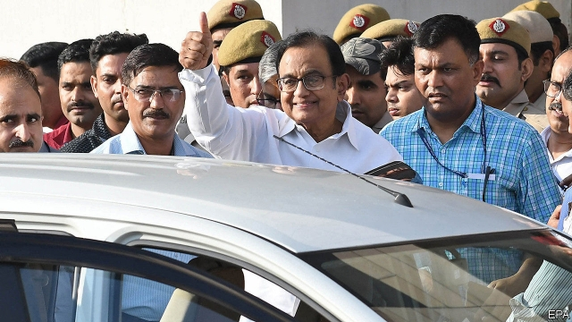

###### Vaulting for probity

# The Indian government’s anti-corruption campaign revs up 

 

> print-edition iconPrint edition | Asia | Aug 31st 2019 

FOR A SEPTUAGENARIAN member of India’s somnolent upper house, five years out of government, Palaniappan Chidambaram is a man much in demand. He served as finance minister in 2004-08 and 2012-14, and as home minister during the interim, in governments led by the Congress party. After Congress was crushed at the polls in 2014 by the Bharatiya Janata Party (BJP) led by Narendra Modi, Mr Chidambaram receded from the spotlight. On August 21st, however, an armada of satellite dish-topped TV trucks appeared at his house to watch plainclothes police officers vault over his garden walls and arrest the ex-minister on corruption charges. 

Mr Chidambaram was one of the most powerful men in the country under the previous regime. For a time he was spoken of as a potential prime minister. In office he maintained a stately air even while bashing together backroom deals (much like his successor as finance minister, Arun Jaitley, who died on August 24th). Since his arrest he has been appearing in court almost daily to plead for bail, arguing that the Central Bureau of Investigation (CBI) has no cause to keep him in custody. At the same time his legal team is fending off the Enforcement Directorate (ED), which handles financial crimes and wants him on related charges. 

Both agencies claim that Mr Chidambaram and his son, a Congress MP, accepted bribes in exchange for approving foreign investment in a media firm in 2007. They argue that he should stay in jail, although they have yet to present any evidence against him. That is unusual: even accused murderers are sometimes released on bail. His lawyers say the government’s motive is revenge. As home minister, Mr Chidambaram once had the man now in the job, Amit Shah, arrested on charges of murder, extortion and kidnapping. Mr Shah, whose case was eventually dismissed, was refused bail for three months. 

In Paris this week Mr Modi told an admiring crowd of expatriates that his “new India” is combating corruption like never before. Three days later the tax authority sacked 22 career bureaucrats who faced pending charges. A prime justification for Mr Modi’s decision to revoke the special autonomy enjoyed by the state of Jammu & Kashmir on August 5th was that corruption in its political class had made reform impossible. Hundreds of Kashmiri politicians and activists have since been locked up. 

Estranged allies of the BJP have come under the cosh, too, including two prominent figures in Hindu nationalist politics in the state of Maharashtra. But the Congress party has received the most attention. The CBI just arrested a nephew of Kamal Nath, the chief minister of the state of Madhya Pradesh, on charges of money-laundering. The ED filed similar charges against two former Congress chief ministers on August 27th. 

Congress is certainly not squeaky clean: a long “season of scams” marred its most recent period in power and was one of the main reasons for its drubbing in 2014. But aggrieved Congress workers point out that the police do not seem to be chasing any current BJP leaders. In several instances, the legal troubles of Congress members seemed to evaporate after they defected to the ruling party. Mr Modi, claims Praveen Chakravarty, a Congress official, is not really interested in stamping out corruption, nor even in persecuting individual politicians. Instead, Mr Chakravarty insists, he is “creating a climate of fear” in an attempt to quell all criticism. 

Mr Chakravarty alleges a second malign motive behind the anti-corruption campaign. He maintains that the government is ginning up a “moral crusade” to distract attention from the ailing economy. Growth has fallen to its lowest level since the Congress party’s last year in office. The current finance minister, Nirmala Sitharaman, has just overhauled her first budget in an apparent panic (see article). But Mr Modi won a second five-year term just months ago. He has plenty of time to repair the economy—and to fight corruption, whether selectively or not. ■ 
<<<<<<< HEAD

-- 

 单词注释:

1.vault[vɒ:lt]:n. 拱顶, 窖, 地下室, 撑竿跳, 穹窿 vt. 做成圆拱形, 撑竿跳过 vi. 成穹状弯曲, 跳跃 

2.probity['prәubәti]:n. 诚实, 正直 

3.rev[rev]:n. 一次回转 v. 加快转速 [计] 反转, 周, 转数 

4.Aug[]:abbr. 八月（August） 

5.septuagenarian[septjjәdʒi'neәriәn]:a. 七十至七十九岁的 n. 七十至七十九岁的人 

6.somnolent['sɒmnәlәnt]:a. 想睡的, 催眠的 [医] 瞌睡的; 嗜眠的 

7.palaniappan[]:[网络] 帕拉尼亚潘 

8.chidambaram[]: [地名] [印度] 吉登伯勒姆 

9.interim['intәrim]:a. 暂时的, 临时的, 间歇的 n. 过渡时期 

10.Bharatiya[]:[网络] 巴拉蒂亚 

11.Janata['dʒʌnətɑ:]:n. （印度）人民团体；人民党（印度联合政党） 

12.bjp[]: [医][=Bence Jones protein]本周（氏）蛋白，凝溶蛋白 

13.narendra[]:[网络] 纳伦德拉；纳兰德；纳然陀 

14.MODI['mәudai]:[计] 模块化光学数字接口 

15.recede[ri'si:d]:vi. 向后退, 退却, 收回, 降低, 减弱 [医] 退缩 

16.spotlight['spɒtlait]:n. 照明灯, 反光灯, 聚光灯 

17.armada[ɑ:'mɑ:dә]:n. 舰队 

18.plainclothe[]:n. 便衣 

19.corruption[kә'rʌpʃәn]:n. 腐败, 堕落, 贪污 [计] 论误 

20.regime[rei'ʒi:m]:n. 政权, 当权期间, 政体, 社会制度, 体制, 情态 [医] 制度, 生活制度 

21.stately['steitli]:a. 庄严的, 宏伟的 

22.bash[bæʃ]:v. 猛击, 打坏 n. 猛撞, 猛击 

23.backroom['bækrum]:n. 后房, 密室 a. 在密室中的 

24.successor[sәk'sesә]:n. 继承者, 接任者 [计] 后继 

25.Arun[]:n. 阿伦（姓氏） 

26.plead[pli:d]:vi. 辩护, 恳求 vt. 为...辩护, 提出...借口, 托称, 恳求 

27.bail[beil]:n. 保释, 拎环, 杓, 栅栏 vt. 保释, 舀水 

28.CBI[]:n. 英国工业联合会 

29.custody['kʌstәdi]:n. 监护, 拘留, 监禁 [经] 保管, 照顾, 保护 

30.fend[fend]:vt. 击退, 保护, 供养 

31.enforcement[in'fɒ:smәnt]:n. 执行, 强制 [法] 实施, 加强, 厉行 

32.directorate[di'rektәrit]:n. 理事之职务, 董事会, 理事会 [经] 董事会 

33.ED[]:[计] 电子设备, 密码设备, 数据结束, 工程设计, 错误检测, 外部设备 

34.MP[]:国会议员, 下院议员 [计] 宏处理程序, 维护程序, 线性规划, 微程序, 多处理器 

35.bribe[braib]:n. 贿赂 vt. 贿赂, 收买 vi. 行贿 

36.amit[]:n. 阿米特（男子名） 

37.shah[ʃɑ:]:n. 沙(伊朗国王的称号) 

38.extortion[ik'stɒ:ʃәn]:n. 勒索, 敲诈, 强取 [经] 勒索, 强夺 

39.kidnap['kidnæp]:vt. 绑架, 诱拐, 拐骗 [法] 拐带, 诱拐, 绑架 

40.expatriate[eks'peitrieit]:n. 移居国外者, 侨民, 被流放者, 背井离乡者 vt. 逐出国外, 脱离国籍, 放逐 vi. 移居国外 

41.combat['kɒmbæt]:n. 争斗, 战斗 vi. 战斗, 争斗 vt. 与...战斗, 与...斗争 

42.bureaucrat['bjuәrәukræt]:n. 官僚作风的人, 官僚, 官僚主义者 [法] 官僚, 官僚作风的人 

43.pending['pendiŋ]:a. 未决定的, 待决的, 行将发生的, 向外伸出的 prep. 在等待...之际, 直到...时为止, 在...期间, 在...过程中 

44.justification[.dʒʌstifi'keiʃәn]:n. 辩护, 证明正当, 释罪 [计] 调整 

45.revoke[ri'vәuk]:vt. 撤回, 废除 vi. 藏牌 n. 藏牌 [计] 取消权限程序 

46.autonomy[ɒ:'tɒnәmi]:n. 自治, 自治权 [医] 自主性 

47.Jammu['dʒʌmu:]:查谟(城市, 位于亚洲查谟和克什米尔的西南) 

48.Kashmir['kæʃmiә]:n. 克什米尔 

49.Kashmiri[kæʃ'miәri]:n. 克什米尔语, 克什米尔人 

50.activist['æktivist]:n. 激进主义分子 

51.estrange[i'streindʒ]:vt. 使疏远, 离间, 使离开 

52.ally['ælai. ә'lai]:n. 同盟者, 同盟国, 助手 vt. 使联盟, 使联合, 使有关系 vi. 结盟 

53.cosh[kɔʃ]:n. 大头棍, 内装金属的橡皮棒, 铅棒, 短棍 vt. 用短棍打, 用棍棒打 

54.Hindu['hindu:]:a. 印度教教徒的 n. 印度教教徒 

55.nationalist['næʃәnәlist]:n. 国家主义者, 民族主义者 

56.politic['pɒlitik]:a. 精明的, 明智的, 策略的 

57.Maharashtra[,mɑ:hə'rɑ:ʃtrə]:n. 马哈拉施特拉邦（印度西部邦） 

58.Kamal[]:n. （印度语）卡马尔（男子名, 涵义为莲花） 

59.Nath[]:n. (Nath)人名；(柬)纳；(德、印、尼、斯里、孟、毛里求)纳特 

60.madhya[]:[网络] 中央；德亚；玛德亚 

61.Pradesh[]:邦 

62.squeaky['skwi:ki]:a. 吱吱响的, 发轧声的 

63.scam[skæm]:n. 骗局, 诡计；故事 

64.mar[mɑ:]:vt. 损毁, 损伤, 糟蹋 n. 三月 

65.drubbing['drʌbiŋ]:n. 殴打, 痛击 

66.aggrieve[ә'gri:v]:vt. 使委屈, 使悲痛, 侵害 [法] 侵害, 使悲痛, 使委屈 

67.praveen[]:[网络] 普拉文；瑞文；精通熟练 

68.chakravarty[]:[网络] 普通外科部查克拉瓦蒂 

69.persecute['pә:sikju:t]:vt. 迫害, 虐待, 困扰, 同...捣乱 [法] 迫害, 虐待, 烦扰 

70.quell[kwel]:vt. 压制, 平息, 减轻 

71.allege[ә'ledʒ]:vt. 宣称, 主张, 提出, 断言 [法] 断言, 指称, 指证 

72.malign[mә'lain]:a. 有害的, 恶性的, 有恶意的 vt. 诽谤, 说坏话 

73.gin[dʒin]:n. 杜松子酒, 轧棉机, 陷阱 vt. 轧棉, 用陷阱捕 

74.crusade[kru:'seid]:n. 改革运动, 十字军东侵 vi. 从事改革运动, 加入十字军 

75.distract[dis'trækt]:vt. 转移, 分心, 使发狂 

76.ailing['eiliŋ]:a. 生病的 [医] 患病的, 病痛的 

77.nirmala[]:[网络] 修女酒店；马拉修女；玛拉修女 

78.overhaul[.әuvә'hɒ:l]:vt. 分解检查, 翻修, 精细检查, 彻底革新 n. 分解检查, 精细检查, 大检修 

79.selectively[]:adv. 有选择地 
=======
>>>>>>> 50f1fbac684ef65c788c2c3b1cb359dd2a904378

