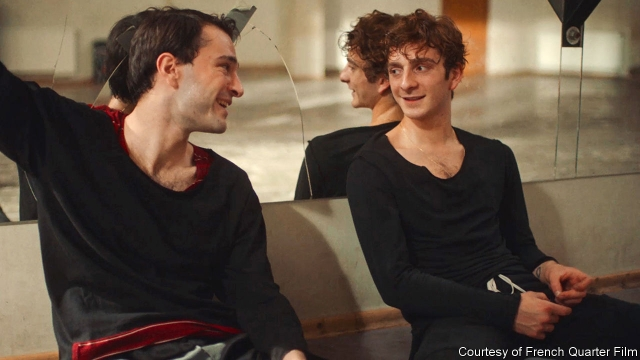

###### The dancer and the dance

# A culture clash in the Caucasus 

 

> print-edition iconPrint edition | Books and arts | Aug 31st 2019 

THE BALKANS have been described as a region that produces more history than it can absorb. About Georgia—another craggy, contested place—it might be said that there is a chronic surplus of culture. Start with indigenous traditions such as epic poetry and polyphonic singing; then factor in the ability of Georgians to master cultural forms born elsewhere, including theatre and classical music. 

When Georgia was pickled in Soviet aspic, those gifts were a lifeline to the world. Its theatre and film directors, with their quietly subversive messages, were revered across the Soviet Union. To Western audiences, they were a reminder that not all was drab in the communist bloc. Now that Georgia is a democracy, many of its artists thrive abroad yet retain close ties to their homeland. Amid the chaos after the Soviet collapse, Luka Okros, now a 28-year-old pianist, startled his parents by showing signs of genius at the age of four. He trained in Moscow and is now based in London, interpreting Liszt, Chopin and Rachmaninov in concert halls around the world, and—like other expatriate maestros—giving at least one big recital a year in Tbilisi. 

But for all the sophistication of Georgia’s capital, there is still a gap between the atmosphere of diaspora communities and the cultural mores of the old country, where the Orthodox church is dominated by ultra-conservatives and has a violent fringe. The reception of a Georgian-language film that deals with a gay romance has brought that divide into focus. 

“And Then We Danced” drew a standing ovation at Cannes in May and has since won praise and prizes across Europe; it will be screened in London and Paris in the near future. But the Georgian authorities, who usually encourage film-making in the country’s ancient, expressive tongue, have kept their distance and refused to provide any funding. In Georgia’s homophobic climate, the shooting of the film—about an affair between two young male dancers—had to be semi-clandestine, says Levan Akin, a Swede of Georgian origin and the title’s director. 

Mr Akin calls the film a love-letter to Georgia, which he often visited as a child. Unlike many of today’s young Georgians, who prefer techno to tradition, he adores the indigenous heritage. But he feels it must be liberated from its self-appointed guardians: people like the film’s steely dance teacher who insists, implausibly, that there is nothing sensual about the gyrations he demands. Mr Akin was inspired to make the movie after reading in 2013 that a gay-pride event in Tbilisi had been harassed by thugs and zealots. (The hand of Russia, which occupies a chunk of the country, may lurk behind such ructions.) 

Towards the film’s end there is a funny, touching exchange between Merab, a dancer and the hero (pictured right), and his boozy, just-married brother David. “I’ll just be another fat, drunk Georgian…and that’s fine,” says David. “But you, Merab, are special and that’s why you must leave Georgia now.” For their part, the dancer-actors who play Merab and Irakli, his partner in a fleeting, passionate relationship, are adamant that they will not emigrate. Both Levan Gelbakhiani and Bachi Valishvili (left) say they will stay and fight for a more tolerant society. “When there’s a leak in your home you don’t leave, you fix it,” says Mr Valishvili. That is brave, given the hate mail (roughly balanced by fan mail) that they have received from compatriots. 

In the main, spiky ideas—as well as people—slide backwards and forwards between Georgia and the world with an ease that would astound a Soviet time-traveller. David Papava, for example, left home in the 1990s and made a name as a director of experimental theatre in London, before returning to Tbilisi. His rendering of Aristophanes’s comedy, “The Birds”, took digs at the country’s extravagant political class. “Some critics didn’t like my work,” Mr Papava recalls, “but I never felt threatened.” Many censorious old habits have waned—but some endure. ■ 
<<<<<<< HEAD

-- 

 单词注释:

1.dancer['dɑ:nsә]:n. 舞蹈演员, 跳舞者 

2.clash[klæʃ]:n. 冲突, 撞击声, 抵触 vi. 冲突, 抵触 vt. 使发出撞击声 [计] 对撞 

3.Caucasus['kɔ:kәsәs]:n. 高加索山脉 

4.Aug[]:abbr. 八月（August） 

5.Balkan['bɒ:lkәn]:a. 巴尔干的 

6.craggy['kræ^i]:a. 多岩的, 崎岖的, 峻峭的, 多峭壁的 

7.chronic['krɒnik]:a. 慢性的, 习惯性的 n. 慢性病患者 

8.indigenous[in'didʒinәs]:a. 本土的, 国产的, 固有的 [医] 原产的, 本土的 

9.epic['epik]:n. 史诗, 叙事诗 a. 史诗的, 叙事诗的 

10.polyphonic[.pɒli'fɒnik]:a. 多音的, 有多种声音的 

11.Georgian['dʒɒ:dʒjәn]:n. 乔治亚州人, 乔治亚人 a. 乔治王时代的, 乔治王时代艺术风格的, 乔治亚的 

12.cultural['kʌltʃәrәl]:a. 文化的, 教养的, 修养的 [医] 培养的 

13.Georgia['dʒɒ:dʒjә]:n. 乔治亚州 

14.pickle['pikl]:n. 盐卤, 腌汁, 泡菜, 困境, 讨厌鬼 vt. 腌制, 酸洗, 葬送(机会等), 泡 

15.aspic['æspik]:n. 花色肉冻 [机] 薰衣草 

16.lifeline['laiflain]:n. 救生索, 生命线 

17.quietly['kwaiәtli]:adv. 安静地, 沉着地, 秘密地 

18.subversive[sәb'vә:siv]:a. 从事颠覆的, 破坏性的 n. 破坏分子, 颠覆分子 

19.rever[]:n. 作梦（歌名） 

20.reminder[ri'maindә]:n. 提醒的人, 暗示 [经] 催单 

21.drab[dræb]:a. 土褐色的, 单调的 

22.bloc[blɒk]:n. 集团 

23.amid[ә'mid]:prep. 在其间, 在其中 [经] 在...中 

24.chao[]:n. 钞（货币） 

25.Luka[]:n. (Luka)人名；(法)吕卡；(德、俄、罗、匈、塞、捷、图瓦)卢卡 

26.Liszt[list]:李斯特(Franz, 1811-1886, 匈牙利钢琴家、作曲家) 

27.chopin[]:n. 肖邦（波兰钢琴家） 

28.Rachmaninov[]:拉赫曼尼诺夫(俄裔作曲家) 

29.expatriate[eks'peitrieit]:n. 移居国外者, 侨民, 被流放者, 背井离乡者 vt. 逐出国外, 脱离国籍, 放逐 vi. 移居国外 

30.recital[ri'saitl]:n. 背诵, 吟诵, 详述 [法] 叙述, 评述, 列举 

31.Tbilisi[tә'bilisi,tbili:'si:]:第比利斯[格鲁吉亚共和国首都] 

32.sophistication[sә.fisti'keiʃәn]:n. 诡辩, 老于世故, 复杂(性) [医] 掺假 

33.Diaspora[dai'æspәrә]:n. 犹太人的离散, 离散的犹太人 

34.orthodox['ɒ:θәdɒks]:a. 正统的, 传统的, 惯常的 

35.fringe[frindʒ]:n. 边缘, 端, 流苏, 穗, 初步 vt. 加穗于, 加饰边于 a. 边缘的, 附加的 

36.romance[rәu'mæns]:n. 冒险故事, 浪漫史, 传奇文学 vi. 写传奇, 作空想, 虚构 

37.ovation[әu'veiʃәn]:n. 热烈欢迎, 大喝采, 小凯旋式 

38.Cannes[kæn]:n. 戛纳 

39.Georgian['dʒɒ:dʒjәn]:n. 乔治亚州人, 乔治亚人 a. 乔治王时代的, 乔治王时代艺术风格的, 乔治亚的 

40.expressive[ik'spresiv]:a. 表达的, 富于表情的 

41.homophobic[,hɔmə'fəubik]:a. 害怕同性恋的 

42.levan['le,væn]:n. [生化]果聚糖 

43.akin[ә'kin]:a. 同类的, 同族的, 同源的 

44.Swede[swi:d]:n. 瑞典人 

45.techno[]:[计] 技术 

46.heritage['heritidʒ]:n. 遗产, 祖先遗留物, 继承物 [医] 遗传性 

47.steely['sti:li]:a. 钢的, 钢制的, 钢铁般的 

48.implausibly[im'plɔ:zəbli]:adv. 难以置信地 

49.sensual['senʃuәl]:a. 肉欲的, 感觉的, 感觉论的 

50.gyration[dʒai'reiʃәn]:n. 旋回, 回转, 旋转 [医] 回旋, 环旋 

51.harass['hærәs]:vt. 使困扰, 使烦恼, 折磨 

52.thug[θʌg]:n. 恶棍, 刺客, 凶手 [法] 凶手, 刺客, 暴徒 

53.zealot['zelәt]:n. 热心者, 狂热者, 犹太教狂热信徒 [法] 狂热分子, 激烈分子 

54.chunk[tʃʌŋk]:n. 大块, 矮胖的人(或物) [经] 定样 

55.lurk[lә:k]:n. 潜伏, 潜行 vi. 暗藏, 潜伏, 埋伏 [计] 隐匿阅读 

56.ruction['rʌkʃәn]:n. 吵闹, 骚动 

57.merab[]:[网络] 米拉；麦洛伯；迈拉卜 

58.boozy['bu:zi]:a. 酩酊的, 嗜酒的 

59.david['deivid]:n. 大卫；戴维（男子名） 

60.irakli[]:[网络] 伊拉克里 

61.passionate['pæʃәnit]:a. 热情的, 热烈的, 易怒的, 热恋的 

62.adamant['ædәmәnt]:n. 坚硬的东西 a. 非常坚硬的, 坚强的, 固执的 

63.emigrate['emigreit]:v. (使)移居, (使)移民 

64.bachi[]:[网络] 八极拳；雨o；罚 

65.tolerant['tɒlәrәnt]:a. 宽容的, 容忍的, (对冷、热)能耐的 [医] 能耐受的 

66.compatriot[kәm'pætriәt]:n. 同国人 a. 同国的, 同胞的 

67.spiky['spaiki]:a. 大钉一般的, 长而尖的, 钉满钉子的, 有穗的 

68.backwards['bækwәdz]:adv. 向后 

69.astound[ә'staund]:vt. 使惊骇, 使大惊 

70.extravagant[ik'strævgәnt]:a. 奢侈的, 挥霍无度的, 浪费的 

71.censorious[sen'sɒ:riәs]:a. 爱批判的, 挑剔的 
=======
>>>>>>> 50f1fbac684ef65c788c2c3b1cb359dd2a904378

