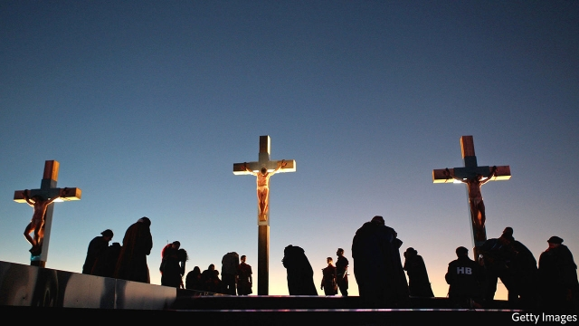

###### The cross’s shadow

# Darwin was more Christian than he thought 

 

> print-edition iconPrint edition | Books and arts | Aug 31st 2019 

Dominion. By Tom Holland. Basic Books; 624 pages; $18.99. Little, Brown; £20. 

IT WAS THE wasps that bothered Darwin most. Brought up as a Christian, he might not have precisely subscribed to the genesis offered by Genesis but—at first—he accepted the principle that God and his works were good. Then came the Ichneumonidae. Slender, almost sensual in shape, the wasps seem a slight foe to stand against 2,000 years of theology. But for Darwin the sting of these parasites, which grow by eating living caterpillars from within, was intolerable: “I cannot persuade myself that a beneficent & omnipotent God would have designedly created [them].” 

The wasps nibbled away Darwin’s belief. Tom Holland’s belief in Darwin’s Christianity has, however, remained strong. In “Dominion”, he argues that many of Darwin’s apparently atheistic traits, from the fanaticism of his followers to his scientific awe, “derived from a much older seedbed”; ie, a Christian one. It is not just Darwin. Look closely at the motifs of almost any modern movement, from the communist hammer and sickle to the dictums of Islamic State, and you can, Mr Holland argues, discern the shadow of the cross. In many ways “Christendom…remains Christendom still.” 

Proving this takes Mr Holland on a sweeping narrative that runs from the fifth century BC via Luther, Voltaire and the abolition of slavery to #MeToo. The occasional purple patch is forgivable, for he is an exceptionally good storyteller with a marvellous eye for detail. He opens with an account of an ancient Persian torture in which prisoners were eaten alive by maggots. It is excellent fun. 

Some of the most interesting sections are from the early centuries when God had not yet realised that He too was Christian. Resolutely monotheistic, later Christians would declare that their God was eternal and omniscient. God, alas, seems not to have known any of this. Bits of the Old Testament hint that, in its earliest stages, the Jewish religion recognised many gods. “Thou shalt have no other gods before me” insists that rivals shall not be worshipped—not that they don’t exist. 

Then came the greatest revolution thus far—the roads and reach of the Roman empire. It was along these that St Paul travelled, spreading the word of this now-Christian God. Time, Mr Holland says, has “dulled” people to the “utter strangeness” of Paul’s message. Greco-Roman deities had tended to favour a carpe diem approach, and to celebrate the proud. The new creed celebrated the weak. The last were to be first and the first last; suffering was extolled; living fully in the Promised Land meant eschewing the pleasures of this one. 

Yet this guarantor of deferred gratification turned out to be better at promising than following through. The Second Coming never came and the Promised Land remained elusive. Still, though the meek did not inherit the Earth, they did acquire a sense of God-given equality, while the powerful, for their part, inherited a God-given sense of unease. It is to these twin impulses that Mr Holland ascribes many social advances of recent centuries, from the end of slavery to LGBTQ rights. 

He is right to stress Christianity’s influence. For more than a millennium the debates and decisions of Europe were made in Christ’s name. From the moment the Venerable Bede invented BC and AD dates, time itself turned on a Christian axis. But Mr Holland makes a bolder claim. Like it or not, he argues, Western values are “traceable back to Christian origins”. 

Whether you agree may depend on whether you want to. Mr Holland—whose own faith faded when he was a teenager—is a superb writer, but his theory has flaws. For one, he uses the word “Christianity” as though it is obvious what that means. It is not. Christianity is a broad church and the Bible is a big and incoherent book. It has furnished verses to suit those who have wanted to enslave Africans or emancipate them, save infidels or slay them. 

And merely to see the form of Christianity in a movement is not to prove it is there. Correlation is not causation. Some people, after all, discern the shape of the Virgin Mary in a piece of burned toast. ■ 

