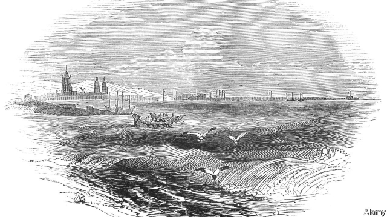

###### Road trip

# Love in the time of the Black Death 

 

> print-edition iconPrint edition | Books and arts | Aug 31st 2019 

To Calais, In Ordinary Time. By James Meek. Canongate; 400 pages; £18.99. 

IN A TALK she gave to the Royal Society of Literature in 2010, Hilary Mantel offered some advice to would-be authors of historical fiction. “Learn to tolerate strange world views,” she said: 

In his sixth novel, “To Calais, In Ordinary Time”, James Meek seems to have taken Ms Mantel’s interdiction as a challenge. This is a book that seeks to compress the distance between past and present, seeking out reflections of contemporary concerns in the medieval world. 

“To Calais…” is the story of three very different protagonists, each setting out for English-held Calais in the summer of 1348. Will Quate, a farm boy from Outen Green (a fictional Cotswold village), joins up with a group of archers heading to fight in the Hundred Years War. Lady Bernadine Corbet, an aristocratic young woman, is bewitched by “Le Roman de La Rose”, a courtly poem, and fleeing a controlling father. Thomas Pitkerro, a Scottish proctor, has come to England from the papal court at Avignon to carry out a survey of the abbey at Malmesbury. The different plot lines overlap and interweave as the three characters move haltingly to Calais, while, just out of sight in France, lurks the greatest catastrophe ever to hit Western civilisation: the Black Death. 

Mr Meek throws ropes from the present to the past. His noblewoman is headstrong and emancipated—almost a millennial—who dreams of a storybook lover and self-harms in secret. Will is pursued by a besotted friend who plays provocatively with binary conceptions of gender. Thomas, the proctor, may live in the 14th century, but his musings carry a powerful message for stratified Brexit-era Britain: 

This is a book about the power of perspective and the importance of broadening horizons. The Black Death is a kind of hold-all catastrophic metaphor: for climate change, political meltdown and moral decay. 

Like all fiction, but perhaps more so, historical novels live or die by their use of language. Few attempt an accurate representation of the speech of a bygone era, seeking rather to forge their own idiom to give the reader the impression of that time. Mr Meek goes further: each protagonist speaks in a different register. Will’s tale is related in a kind of Chaucer-lite; in accordance with her reading, Bernadine’s narrative is French-inflected; Thomas is resolutely Latinate. This tapestry makes for a compelling story that, like all great historical fiction, is not only about the past, but says profound things about the present. ■ 
<<<<<<< HEAD

-- 

 单词注释:

1.Aug[]:abbr. 八月（August） 

2.calais['kælei]:n. 加来（法国城市）；卡莱斯牌汽车 

3.jame[]: 灰岩井 

4.meek[mi:k]:a. 温顺的, 逆来顺受的 

5.canongate[]:[网络] 修士门；坎农给特；卡农门 

6.Hilary['hilәri]:n. 希拉里(m.& f.) , 即Hilarius, Saint 

7.mantel['mæntәl]:n. 壁炉架 

8.interdiction[.intә'dikʃәn]:n. 禁止, 停止, 阻断 [医] 禁止 

9.medieval[.medi'i:vl]:a. 中古的, 中世纪的 

10.protagonist[prәu'tægәnist]:n. 主人公, 主角, 领导者 

11.quate[]:[网络] 奎特 

12.outen['ajtən]:prep. <方>从……里面 

13.fictional['fikʃәnl]:a. 虚构的, 编造的, 小说式的 [法] 拟制的, 假定的, 虚构的 

14.Cotswold['kɔtswәuld]:n. 科次窝德绵羊 

15.archer['ɑ:tʃә]:n. 弓箭手, 射箭运动员 

16.Bernadine['bә:nәdi:n]:n. 伯娜丁(亦作Bernardine)(f.) 

17.corbet[]: [人名] [英格兰人姓氏] 科比特 Corbett的变体 

18.aristocratic[æristә'krætik]:a. 贵族的, 主张贵族统绐的, 有贵族气派的 

19.bewitch[bi'witʃ]:vt. 施魔法于, 蛊惑, 使着迷 

20.LE[]:[计] 小于或等于 

21.de[di:]:[化] 非对映体过量 [医] 铥(69号元素铥的别名,1916年Eder离得的假想元素) 

22.La[lɔ:, lɑ:]:[医] 镧(57号元素) 

23.courtly['kɒ:tli]:a. 谦恭的, 礼让的, 有教养的 

24.thoma[]:n. (Thoma)人名；(阿尔巴、阿拉伯)索玛；(英、德、罗、匈、捷、塞、瑞典)托马 

25.proctor['prɒktә]:n. 代理人, 监考人, 代诉人 [法] 代理人, 代诉人, 监督人 

26.papal['peipl]:a. 罗马教皇的, 教皇制度的 

27.avignon[.ævi:n'jәuŋ]:n. 阿维尼昂绸 

28.abbey['æbi]:n. 大修道院 

29.Malmesbury[]:n. (Malmesbury)人名；(英)马姆斯伯里 

30.overlap[.әuvә'læp]:n. 重叠, 重复, 部分的同时发生 vt. 重叠, 重复, 与...同时发生 vi. 迭盖, 部分的同时发生 [计] 重叠 

31.interweave[intә'wi:v]:v. (使)交织, 织进, (使)混杂 

32.haltingly['hɔ:ltiŋli]:adv. 迟疑不决地；犹豫地 

33.lurk[lә:k]:n. 潜伏, 潜行 vi. 暗藏, 潜伏, 埋伏 [计] 隐匿阅读 

34.noblewoman['nәublwumәn]:n. 女贵族, 贵妇人 

35.headstrong['hedstrɒŋ]:a. 顽固的, 刚愎的, 任性的 

36.storybook['stɒ:ribuk]:n. 故事书, 小说 

37.besot[bi'sɒt]:vt. 使糊涂, 使痴迷, 使沉醉 

38.provocatively[]:adv. provocative的变形 

39.binary['bainәri]:a. 由两部分组成的, 二进位的, 二元的 [计] 二进制的; 二态的; 二进制, 二进制文件传输类型设置命令 

40.conception[kɒn'sepʃәn]:n. 观念, 概念 [医] 妊娠, 受孕; 概念 

41.gender['dʒendә]:n. 性 vt. 产生 

42.musing['mju:ziŋ]:a. 沉思的, 冥想的 

43.stratify['strætifai]:vt. (使)成层 [经] 分层 

44.broaden['brɒ:dn]:vi. 变宽, 扩大 vt. 放宽, 使扩大 

45.catastrophic[.kætә'strɒfik]:a. 悲惨的, 灾难的 

46.meltdown['meltdaun]:[经] 销毁(货币等), 变卖(财产) 

47.representation[.reprizen'teiʃәn]:n. 表示法, 表现, 陈述, 代表 [计] 表示法指定 

48.bygone['baigɒn]:n. 过去的事, 往事 a. 过去的 

49.forge[fɒ:dʒ]:n. 熔炉, 铁工厂 vt. 打制, 锻造, 伪造 vi. 锻造, 伪造 

50.narrative['nærәtiv]:n. 叙述, 故事 a. 叙述的, 叙事的, 故事体的 

51.resolutely[]:adv. 坚决地；毅然地 

52.Latinate['lætineit]:a. 从拉丁文衍生的, 类似拉丁语的 

53.tapestry['tæpistri]:n. 挂毯, 绒绣 vt. 用挂毯装饰 

54.profound[prә'faund]:a. 极深的, 深厚的, 深刻的, 渊博的 
=======
>>>>>>> 50f1fbac684ef65c788c2c3b1cb359dd2a904378

