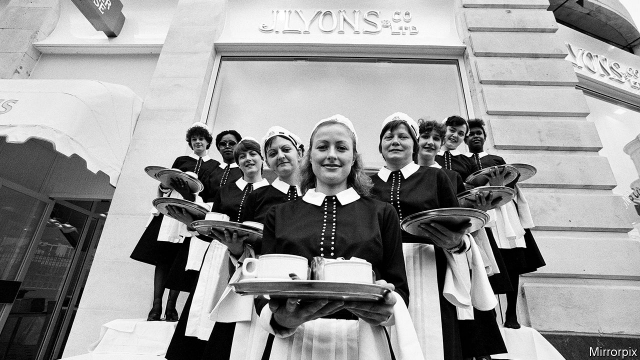

###### Storms in a teacup

# The Jewish immigrants who changed British diets 

 

> print-edition iconPrint edition | Books and arts | Aug 31st 2019 

Legacy: One Family, A Cup of Tea and the Company that Took on the World. By Thomas Harding. William Heinemann; 592 pages; £25. 

A FAMILY IS a little kingdom, Samuel Johnson noted, and in the mercantile principality of Gluckstein and Salmon, the heraldic emblem might have been a sheaf of sticks. A father hands his sons some twigs, Monte Gluckstein once told his nephew, drawing on Aesop’s fable. Break one, the father orders. They do. He bundles the sticks. Now break them, he says. L’union fait la force—“Strength in unity”—was the family motto, explained Monte, third-generation scion of a catering empire. 

Thomas Harding mined the traumatic history of his father’s family in Germany in “The House by the Lake”. In “Legacy” he explores his maternal lineage—an arc spanning five generations from immigrants to tycoons. The Glucksteins and Salmons founded Lyons, a firm that shaped British tastes, catered for Buckingham Palace and owned a hit parade of mega-brands. 

The saga was launched by the flight of a young Hebrew teacher named Lehmann Gluckstein from eastern Europe in the early 1800s, and took root in London where his son Samuel created a small cigar factory. In 1886 Monte, Samuel’s heir and the family visionary, applied the lessons of tobacco manufacturing to catering. J. Lyons and Company was named after a less-Yiddische partner to put off anti-Semites. Thanks to showmanship and an instinct for popular taste, the operation expanded. Lyons fulfilled the largest catering contract in history—8m meals served at the British Empire Exposition of 1924-25. It owned the biggest hotel and ice-cream plant in Europe and the largest tea-packing facility in the world (when Lehmann was growing up, Jews were forbidden to trade in tea, sugar and coffee). It developed the first business computer. 

Family always came first. As did men: the board, Mr Harding ruefully notes, never included women. They were absent, as well, from Monte’s funeral in 1922. Custom cautioned that wealthy women could not “restrain their emotions”. 

Mature British readers will associate the Lyons name with tea shops and Corner Houses (the Starbucks of their time), from which white-aproned waitresses, known as Nippies, made it into the Oxford English Dictionary. The ingredients of success were quality, value, efficiency and food that was consistent down to the carefully calibrated jam in Swiss rolls—Henry Ford applied to comestibles. 

Mr Harding’s affectionate family story is deftly sandwiched in the rise and fall of empire, two world wars, and two centuries of social and political change. A refitted Lyons factory made many of the bombs dropped on Germany in the second world war. Despite the chauvinism at head office, Lyons tea shops are said to have contributed to female emancipation by providing a safe entry to social life and consumerdom. Previously, male-dominated pubs had been practically the only places for many women to order drinks. 

In the end, the sticks threatened to fall apart. A younger generation caught conglomeration fever and binged on acquisitions, adding Baskin-Robbins, an American ice-cream chain, and continental meat-processors. Overreach and spectacularly bad timing—involving an oil crisis, a recession and a sinking pound—brought Lyons to the brink of insolvency. The hotels were sold and then, in 1978, the company itself. But the denouement, a delicate business complicated by lots of heirs, was managed “with care and honour”, Mr Harding writes, and with “friendly relationships intact”. Monte’s bundle held fast. ■ 

-- 

 单词注释:

1.teacup['ti:kʌp]:n. 茶杯, 满茶杯 

2.Aug[]:abbr. 八月（August） 

3.thoma[]:n. (Thoma)人名；(阿尔巴、阿拉伯)索玛；(英、德、罗、匈、捷、塞、瑞典)托马 

4.harding['hɑ:diŋ]:n. 哈丁（姓氏）；哈丁（美国前总统） 

5.william['wiljәm]:n. 威廉（男子名）；[常作W-][美俚]钞票, 纸币 

6.Heinemann[]:海涅曼（人名） 

7.samuel['sæmjuәl]:n. 撒母耳（希伯来先知）；塞缪尔（男子名） 

8.johnson['dʒɔnsn]:n. 约翰逊（姓氏） 

9.mercantile['mә:kәntail]:a. 商业的, 商人的 [经] 商业的 

10.principality[,prinsi'pæliti]:n. 公国, 封色, 侯国, 首长的职位, 校长的权力, 校长的职位, 首长的权力 

11.gluckstein[]: [人名] 格卢克斯坦 

12.salmon['sæmәn]:n. 鲑鱼, 大麻哈鱼 [医] 鲑 

13.heraldic[he'rældik]:a. 纹章学的, 纹章的, 传令官的 

14.emblem['emblәm]:n. 象征, 徽章, 符号 vt. 用象征表示 

15.sheaf[ʃi:f]:n. 束, 捆, 扎 vt. 捆, 束 

16.twig[twig]:n. 小枝, 细枝 v. 懂得, 了解 

17.Monte['mɔnti]:[计] 蒙特卡罗 

18.fable['feibl]:n. 寓言, 神话, 谎言 vi. 虚构, 作寓言 

19.fait[]:[法] 契据, 事实, 行为 

20.La[lɔ:, lɑ:]:[医] 镧(57号元素) 

21.scion['saiәn]:n. 接穗, 子孙 [医] 嫩枝, 接穗 

22.traumatic[trɒ:'mætik]:a. 外伤的, 创伤的 [医] 创伤的, 外伤的 

23.legacy['legәsi]:n. 祖先传下来之物, 遗赠物 [经] 遗产, 遗赠物 

24.maternal[mә'tә:nl]:a. 母亲的, 母系的, 母方的 [医] 属母的, 母的, 母性的 

25.arc[ɑ:k]:n. 弧, 弧形, 弓形, 弧光 [化] 弧 

26.tycoon[tai'ku:n]:n. 企业界大亨, 将军 [经] 企业界巨头, 企业家 

27.gluckstein[]: [人名] 格卢克斯坦 

28.salmon['sæmәn]:n. 鲑鱼, 大麻哈鱼 [医] 鲑 

29.Lyon['laiәn]:n. 里昂 

30.Buckingham['bʌkiŋәm]:白金汉郡[英国英格兰郡名] 

31.saga['sɑ:gә]:n. 传说, 英雄传奇, 冒险故事 

32.Hebrew['hi:bru:]:n. 希伯来人, 希伯来语, 犹太人 a. 希伯来人的, 希伯来语的 

33.Lehmann['leimәn]:莱曼(姓氏) 

34.visionary['viʒәnәri]:a. 幻像的, 幻想的, 梦想的 n. 有眼力的人, 空想家, 梦想者 

35.manufacturing[.mænju'fæktʃәriŋ]:n. 制造业 a. 制造业的 

36.j[dʒei]:n. 字母j 

37.showmanship['ʃәjmәnʃip]:n. 安排演出的窍门, 吸引观众的窍门, 经营术, 招徕生意的手腕 

38.exposition[.ekspә'ziʃәn]:n. 阐述, 讲解, 说明, 博览会, 展览会 [经] 展览会, 集市, 义卖市场 

39.Jew[dʒu:]:n. 犹太人, 守财奴, 犹太教信徒 vt. 欺骗, 杀价 

40.alway['ɔ:lwei]:adv. 永远；总是（等于always） 

41.ruefully[]:adv. 可怜地；悲伤地 

42.starbuck['sta:bʌk]:n. 星巴克（咖啡公司） 

43.Nippies[]:[网络] 乳贴 

44.Oxford['ɒksfәd]:n. 牛津, 牛津大学 

45.carefully['kєәfuli]:adv. 小心地, 谨慎地 

46.calibrate['kælibreit]:vt. 测定口径, 校准, 使标准化, 调整 [化] 校准 

47.ford[fɒ:d]:n. 浅滩, 福特汽车 v. 涉过, 涉水 

48.comestible[kә'mestibl]:a. 可吃的 n. 食物 

49.affectionate[ә'fekʃәnәt]:a. 深情的, 充满情爱的 

50.deftly[]:adv. 灵巧地；熟练地；敏捷地 

51.refit[.ri:'fit]:v. 整修, 改装 n. 整修, 改装 

52.chauvinism['ʃәuvinizm]:n. 盲目的爱国主义, 沙文主义 [法] 沙文主义 

53.emancipation[i.mænsi'peiʃәn]:n. 释放, 解放 [医] 解放(胎儿在母体内成立局部自主状态) 

54.consumerdom[]:[网络] 消费者 

55.conglomeration[kәnglɒmә'reiʃәn]:n. 团块, 混合物, 聚集 [建] 堆集(作用) 

56.binge[bindʒ]:n. 狂闹, 狂欢 

57.continental[.kɒnti'nentl]:a. 大陆的, 洲的 n. 欧洲大陆人 

58.overreach[.әuvә'ri:tʃ]:vt. 扩展...以上, 过度伸张, 走过头 vi. 伸得过远, 过分, 过火 

59.spectacularly[]:adv. 引人注目地；壮观地 

60.recession[ri'seʃәn]:n. 后退, 凹处, 衰退, 归还 [医] 退缩 

61.brink[briŋk]:n. 边缘, 陡岸 

62.insolvency[in'sɒlvәnsi]:n. 无力偿还, 破产 [经] 破产, 无力偿付, 不足抵偿债务 

63.denouement[dei'nu:mɔŋ; (?@) dei'nu:mɔ:ŋ]:n. 结局, 终场 

64.intact[in'tækt]:a. 尚未被人碰过的, 原封不动的, 完整的 [医] 完整的, 无伤的 

