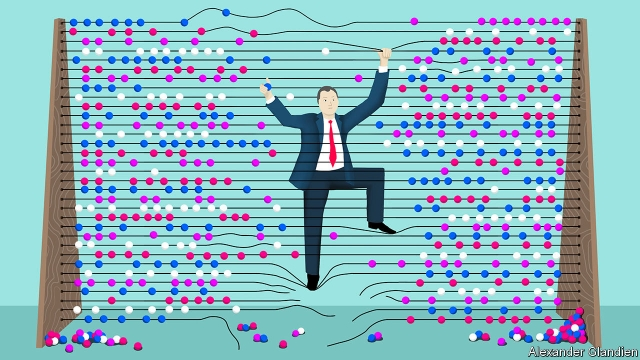

###### The numbers guys

# When economists ruled the world 

 

> print-edition iconPrint edition | Books and arts | Aug 31st 2019 

The Economists’ Hour. By Binyamin Appelbaum. Little, Brown; 448 pages; $30. To be published in Britain by Picador in January; £20. 

FEW ECONOMISTS worked at the Federal Reserve in the early 1950s. Those who were on the staff of America’s central bank were relegated to the basement, at a safe remove from the corridors where real decisions were made. Economists had their uses, allowed William McChesney Martin, then the Fed’s chairman. But they also had “a far greater sense of confidence in their analyses than I have found to be warranted”. They were best kept down with the surplus furniture and the rats. 

The world changes, and it can be hard to say why, writes Binyamin Appelbaum in “The Economists’ Hour”. Despite the clout of a few individuals such as John Maynard Keynes, economists as a class were once held in almost universally low esteem by serious policymakers, who saw them as trumped-up statisticians with strange views about human behaviour. But in the decades after the second world war, the profession clawed its way out of the basement and up to extraordinary influence. 

The rise was made possible by charismatic intellectuals such as Milton Friedman, who in that era spotted the chance to nudge history in their preferred direction. For nearly half a century rumpled theorists held the ear of politicians around the world. Their period of triumph ended in a fog of financial crisis, economic conflict and resurgent nationalism. Mr Appelbaum aims to focus public attention on the role of economists in the miasma’s descent. 

His is a respected voice in American journalism. Now an editorial writer at the New York Times, he spent nearly a decade covering economics and economic policy in Washington. “The Economists’ Hour” is a work of journalism rather than polemic. It is a well reported and researched history of the ways in which plucky economists helped rewrite policy in America and Europe and across emerging markets. 

Some of the stories Mr Appelbaum tells will be unfamiliar. He describes how economists inspired by Friedman persuaded Richard Nixon to abandon military conscription in favour of all-volunteer armed forces. The draft misused resources, they argued, by pressing into service young people whose skills might be better applied elsewhere. The Pentagon might actually save money by relying solely on volunteers, thanks to reduced turnover and thus lower training costs. Nixon had his own reasons for ending conscription. But the economists helped make up his mind. 

And they managed to undercut an age-old American scepticism of big business. In the late 19th and early 20th centuries, America had reined in the behemoths built by robber barons. In the 1950s economists were second-class citizens in the antitrust division of the Department of Justice. The economists’ hour changed all that. 

George Stigler, a friend of Friedman and a fixture at the University of Chicago, reckoned that “competition is a tough weed, not a delicate flower”, and that in practice firms would struggle to maintain and wield market power. Aaron Director, an economist sympathetic to Stigler’s ideas on competition (and Friedman’s brother-in-law), spent most of his career in Chicago as well, instructing law students in the emerging economic perspective on antitrust issues. He became a mentor to Richard Posner, a legal scholar and later a judge, who promoted the notion that justice in the law meant no more and no less than economic efficiency. They and their disciples worked to turn legal attitudes to antitrust on their head, allowing decades of corporate concentration and increasing market power. 

That is not the half of it. Economists helped engineer a wave of deregulation from the 1970s to the 1990s, and provided the intellectual case for tax cuts from the 1960s to the 1980s (much of which this newspaper applauded). All this yielded many benefits: deregulating airlines, to take just one example, made flights cheaper and more accessible. But overall growth never rose as some promised. Inequality widened. Workers and communities increasingly lost out to firms. 

Even the profession’s triumphs deserve reconsideration, Mr Appelbaum suggests. Economists are proud of their role in the defeat of double-digit inflation in the early 1980s. Yet the recessions stoked by monetarism did immense harm. Unemployment soared, and many manufacturing towns hurt by appreciating currencies never recovered. Economists are often quick to dismiss the possibility that inflation might eventually have fallen on its own, as the effects of high oil prices and elevated defence spending abated. 

Could a band of social scientists really wreak so much havoc? Mr Appelbaum’s book places economists at the centre of the story, but they were often mere accomplices to a broader movement of conservatives determined to reverse the encroachment of the state. Free-market economists received financial support from business leaders who were more passionate about reducing tax and regulation than about high-minded research. Joseph Coors, a beer magnate, created the Heritage Foundation as a sort of public-relations firm for capitalism. It was soon publishing economists with friendly messages. “Let’s get taxes cut under any and all circumstances,” Friedman wrote for the think-tank in 1978. Rather than being the tale of an academic discipline’s unlikely rise to influence, Mr Appelbaum’s book can be seen as an account of the easy ascent of a few ideas that appealed to the wealthy and powerful. 

Still, the part played by others does not get the economists off the hook. Many (of assorted political persuasions) laboured quietly to produce valuable research. But some leading lights ignored critics, including within the profession, who warned that their clever theories did not adequately capture society’s complexities. Too many were too impressed with their own intelligence to consider the unintended consequences of their policies. Too few reflected on the implications of the politics that allowed them to enact their ideas. 

Often, their theories operated on the assumption that the self-interested actions of the rich would benefit everyone, even as those self-interested rich used the same economists to pursue their own agenda. The end of the economists’ hour has created room within the field for views that long struggled to get a hearing. But, in an age of nativism and protectionism, other ways of seeing the world now predominate. It may be some time before the dismal science gets a chance to set things right. ■ 

