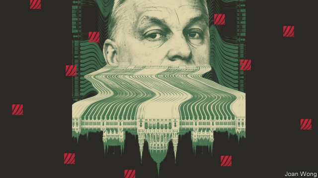
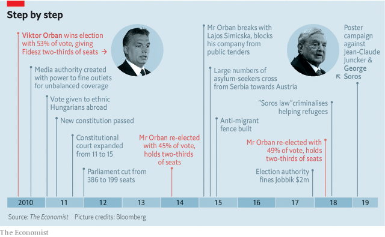
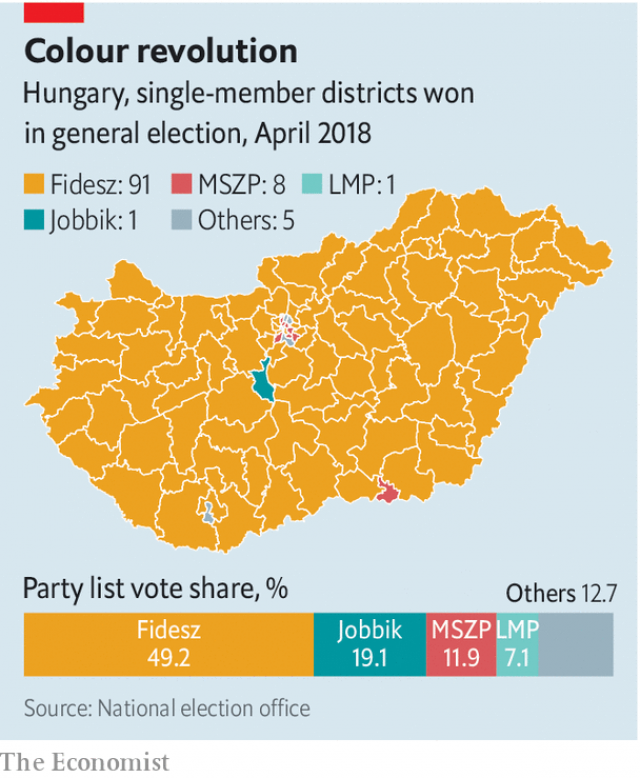
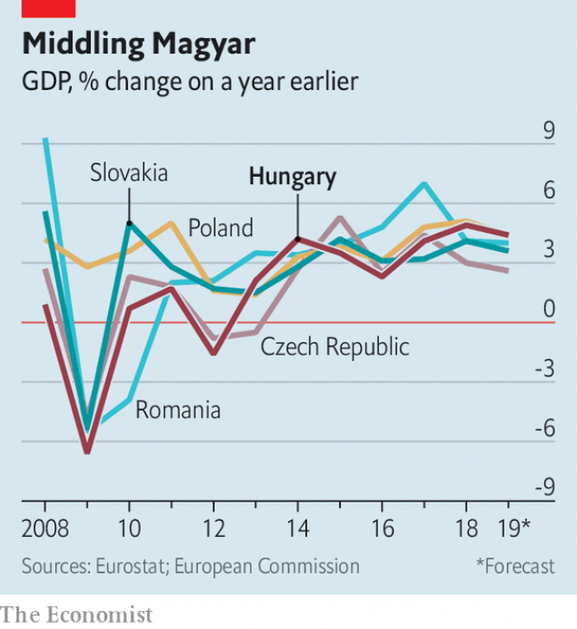
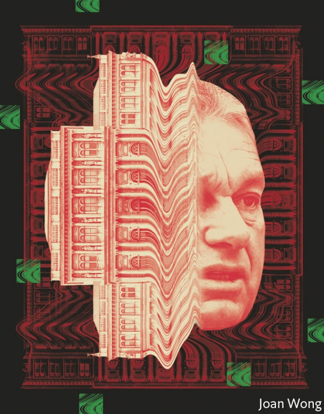

###### The entanglement of powers

# How Viktor Orban hollowed out Hungary’s democracy 

 

> print-edition iconPrint edition | Briefing | Aug 31st 2019 

“A KING”, Bruce Springsteen has pointed out, “ain’t satisfied ‘til he rules everything.” It was to thwart this route to royal satisfaction that 18th-century thinkers such as Montesquieu and James Madison came to prize the separation of powers. If the setting of policy, the writing of laws and the administration of justice were the preserve of different people, absolute power could not end up in one set of hands. This was especially true if the different branches of government had some degree of power over one another. Now it is accepted that a certain amount of friction is the guardian of freedom in a democracy. 

Viktor Orban, the prime minister of Hungary, has other ideas. In the place of such strife, he and his colleagues in Fidesz, the governing party, have over the past nine years sought to align the executive, legislative and judicial powers of the state. Those branches now buttress each other and Fidesz—sometimes unobtrusively, sometimes blatantly. Mr Orban refers to the result of these efforts as the “system of national co-operation”. He used to speak more openly of an “illiberal democracy”. 

Through this systematic entanglement of powers Mr Orban and his associates have turned Hungary into something akin to a one-party state. They have done so with no violence at all and broad public support. The achievement is bad for Hungarian liberty and its long-term prospects—and an object lesson in what is possible for autocrats and would-be autocrats elsewhere. 

The subtle workings of the “system of national co-operation” are testament to the legal expertise of those who fashioned it, including Mr Orban. In 1989, when Soviet power collapsed, he was a law student at Istvan Bibo College, an elite institution in Budapest. He was “domineering” but “sincere and likeable”, according to his roommate Gabor Fodor, later a political rival. His daring speeches at the anti-communist demonstrations sweeping Hungary quickly made him one of the leading lights of Fidesz, then a liberal student movement. 

Mr Orban entered parliament in 1990, and in 1998 he became prime minister. His surprise defeat in the 2002 election accelerated Fidesz’s growing shift from liberalism towards nationalism. Over the course of the 2000s the party grew increasingly jingoistic, and by the time it won again in 2010 its appeal was largely grounded in Christian culture and ethnic identity. During the migrant crisis of 2015, Hungary became the first country in Europe to build a fence to keep out Middle Eastern refugees. 

Fidesz’s image abroad is dominated by such demonstrations of nationalist ideology. But the legal and institutional creativity unleashed at home are a more important part of the story. 

In 2010 a wave of anger at the previous Socialist-led government allowed Fidesz to win a two-thirds majority in parliament with just 53% of the vote. This was possible because of a peculiar electoral system set up after 1989 in which all citizens had two votes, one for a one-representative district and another for a multi-member district. 

There were also 64 non-constituency seats which, as in Germany, are distributed so as to ensure the make-up of parliament was proportional to the national vote. In 2010 that topping-up proved unequal to the task. With the Socialists and several other parties dividing the rest of the vote, Fidesz won all but three of the 176 single-member districts and 84 of the 146 seats in the multi-member ones. Even with 61 of the 64 top-up seats allocated elsewhere, Fidesz ended up with 68% of the MPs. 

The party quickly set about using its two-thirds supermajority to change the constitution. It raised the number of justices on the constitutional court from 11 to 15, appointing four of its own to the new places. It then lowered the compulsory retirement age for judges and prosecutors, freeing up hundreds of posts for Fidesz loyalists. It set up a National Judiciary Office run by Tunde Hando, a college contemporary of Mr Orban’s. Her nine-year term, which is due to end next year and under current laws could not be renewed, makes her unsackable by parliament. Ms Hando can veto judicial promotions and influence which judges hear which cases. Fidesz now enjoys control of prosecutors’ offices, the constitutional court and the Curia (the highest court of appeals). 

With the courts under its thumb, Fidesz pushed through a new constitution, drafted in part by Joszef Szajer, Ms Hando’s husband. In 2013 the constitutional court struck down some of Fidesz’s new laws, including one that threatened various churches with a loss of official recognition. Parliament responded by writing the laws into the constitution. 

In 2018 a new code of procedure gave courts powers to reject civil filings more easily. Peter Szepeshazi, a former judge, says they can stumble over trivial errors such as a wrong phone number: “If it’s unfriendly to the political or economic elite, they have an excuse to send it back.” (The government calls this claim “unsubstantiated”.) A report in April by the European Association of Judges said Ms Hando was riding roughshod over judicial independence. 

The government appears to want yet more say over the judiciary. Since 2016 it has been planning an entirely new system of administrative courts in which the Justice Ministry would have direct influence. These courts would handle, among other things, disputes over the media and elections—areas where the regular courts still, occasionally, rule against the government. The Venice Commission of the Council of Europe, a legal watchdog, has criticised the system, and in May the government put it on hold to keep its membership in the powerful EPP group of the European Parliament, which had threatened to expel it. 

 

It is not clear why Fidesz worries about the power to settle election disputes. Having gerrymandered the single-member districts after winning power in 2010, the party continues to win almost all elections. In 2011 Mr Orban granted voting rights to some 2m ethnic Hungarians who are citizens of neighbouring Romania, Slovakia, Serbia and Ukraine, and who overwhelmingly plump for Fidesz. They are allowed to vote by post. The roughly 350,000 Hungarian citizens living in the West are much less likely to support the party. They have to vote in person at embassies or consulates. 

This all explains how, in the general election last year, Fidesz won 67% of the parliamentary seats—maintaining its supermajority—while taking just less than half of the popular vote. With the system so well re-designed, the party has no need to stoop to voter fraud, as cruder autocracies do. But the “system of national co-operation” is nothing if not thorough. In 2018 the National Election Office ruled thousands of postal votes invalid because the tamper-proof tape on the envelopes had been opened. In response, the government revoked the law requiring tamper-proof tape. 

 

Legal fine-tuning has been used to suppress the opposition’s messages. In 2012, when ESMA, a Spanish-Hungarian company that held the concession for advertising on Budapest’s streetlamps was accepting advertisements from leftist parties, the city council banned all outdoor advertisements within five metres of roadways. The sidewalk kiosks owned by a government-friendly advertising group were exempted from the ban. In 2015 the almost bankrupt ESMA was bought by Istvan Garancsi, a businessman friendly with Mr Orban. The five-metre ban was promptly repealed. 

This is just one of the ways Fidesz keeps the media on its side. The country’s biggest opposition newspaper, Nepszabadsag, was bought out and shuttered in 2016 by a company thought to be linked to Lorinc Meszaros, a boyhood friend of Mr Orban’s who is now the country’s second-wealthiest businessman. Lajos Simicska, a member of Mr Orban’s school and college cohort, built a large business and media empire that supported Fidesz in the 2010s. In 2015 he fell out with Mr Orban and lost most of his companies, but held on to Magyar Nemzet, another newspaper. After Fidesz’s overwhelming election victory in 2018, though, he closed it. Independent media are now confined largely to websites read by a few people in Budapest’s liberal bubble. 

Content is controlled, too. After taking power in 2010, Mr Orban’s government began transforming MTI, the country’s public news agency, into a propaganda organ. In 2011 parliament made MTI’s wire-service free, driving competing news agencies out of business. Regional newspapers that lacked reporting staff became channels for MTI’s pro-government messaging, and it is from those newspapers that Mr Orban’s rural base gets its news. The government uses its advertising budget, which has quadrupled in real terms to more than $300m per year, to bring any rogue newspapers in line. 

The country’s domestically owned television and radio stations are nearly all pro-government. Last November the owners of 476 media outlets, including some of the biggest in the country, donated them free of charge to a new non-profit foundation known as KESMA, whose goals include promoting “Christian and national values”. When opposition groups challenged KESMA for violating the country’s media law, Mr Orban declared the foundation vital to the national interest, removing it from the media authority’s jurisdiction. 

Turning media outlets into propaganda factories has not been good for their quality. In February the KESMA foundation’s first chairman, a former Fidesz MP, carelessly joked in an interview that the pro-government media was so dull that even Fidesz members read the opposition press. (He was forced to resign within hours.) Despite being tedious, though, KESMA and other pro-government media account for more than 80% of the news audience. 

The production of news is managed, too. Parliamentary rules require that the government give notice of new bills and allow time for them to be debated, procedures which can lead to public criticism, even dissent. To avoid such problems, Fidesz often has minor MPs table its bills, rather than doing so itself, which allows them to be rushed through in hours with the opposition nowhere to be seen. 

State-backed “public information” campaigns shape public opinion in ways beneficial to Fidesz. The National Communications Office, set up in 2014, co-ordinates both the government’s advertising spending—which is directed almost exclusively to friendly outlets, not critics—and its public-information efforts. This has been used, among other things, to build up antipathy towards George Soros, a Hungarian-American philanthropist. Although his foundation provided a scholarship which allowed Mr Orban to study in Oxford in the late 1980s, Mr Soros has become an appealing hate figure for Fidesz owing to his liberal politics and wealth. His Jewish background also plays a part. In 2017 the government spent €40m ($45m) on two nationwide surveys asking every citizen whether they favoured an alleged immigration plan supposedly hatched by Mr Soros—in effect, a government-funded propaganda effort. In the first three months of 2019 public-information spending reached €48m, much of it for a billboard campaign that accused Mr Soros of teaming up with Jean-Claude Juncker, president of the European Commission, to promote migration. 

When control of parliament, the legal system and the media do not suffice, the government has other tools. Before the 2018 general election, the biggest threat to Fidesz came from Jobbik, originally a far-right party. It had moved towards the centre in a bid to go mainstream, and at times polled more than 25%. Enter the State Audit Office, headed by a former Fidesz MP who enjoys an election-proof 12-year mandate. In 2017 the audit office accused Jobbik of receiving illegal in-kind financing, and fined it 663m forints ($2m). In 2019, in the run-up to the European election, it tacked on another 272m forints, leaving the party close to insolvency. Two new liberal parties, Momentum and Dialogue for Hungary, as well as the Socialists, Democratic Coalition and the LMP (Green) party, were fined or investigated. Only Fidesz has been left untouched. 

Some institutions have maintained their independence, but Mr Orban’s government seems intent on subverting them. Over the past two years it has harassed the Central European University (CEU), one of the most respected institutions in the region, into leaving Budapest for Vienna. The government insists that the clash stems from a technical dispute over the CEU’s awarding of American-recognised diplomas, and not from the fact that its scholars often criticise Fidesz, or that it was founded and endowed by Mr Soros. 

Most recently, the government went after an organisation with a storied history: the Hungarian Academy of Sciences, launched in 1825 by Count Istvan Szechenyi. The academy helped standardise the Hungarian language, and played a key role in the nationalist awakening that led to the country’s emancipation from Habsburg rule. Last year the government announced that it wanted the academy’s 15 state-funded research institutes to be directly controlled by the ministry of technology and innovation. Negotiations went nowhere, says Zsolt Boda, head of the academy’s social-science institute. The government would show up with nothing on paper about its plans, sticking instead to deniable verbal statements. In July, parliament simply pushed the new structure through. The government says this brings things in line with the way they are done elsewhere, citing Germany’s Max Planck Institutes as an example. Officials at the Max Planck Institutes deny this, saying the Hungarian structure gives the state direct influence over scientists. 

Despite its institutional advantages, Fidesz would not be able to stay in power if it were not so popular. It secures that support though its nationalist appeal and its passable economic record. 

Like other eastern Europeans, most Hungarians saw the rejection of communism as a victory not so much of liberalism or capitalism as of national identity. And Hungary has a very strong sense of identity. The population of 10m is ethnically homogenous. Fewer citizens can read and write in a foreign language than in any other EU country, except Britain. 

All of this made ethnic nationalism a sound strategy for Fidesz. It deployed an economic populism to match: an indigenous “Orbanomics” deemed superior to the supposed globalist neoliberal consensus. Mr Orban was elected shortly after the financial crisis, when Hungary was in a bad shape for which others were to blame. The crisis-induced fall of the forint meant that many Hungarians who had taken out low-interest mortgages in Swiss francs could not repay their debts. Mr Orban forced the banks to redenominate the mortgages in forints at favourable rates. 

In 2011 Mr Orban pulled Hungary out of talks on an IMF rescue package initiated by the previous government. After initially slashing a public-works programme launched by the Socialists, the government doubled its budget starting in 2012, creating hundreds of thousands of jobs. At the same time, it has introduced some relatively radical policies, such as a flat income tax of 15%. Growth and sober budgets have cut the national debt from 80% of GDP in 2010 to 71% last year. 

Orbanomics also fits neatly into the authoritarian toolkit. Research by Gyorgy Molnar of the Hungarian Science Academy shows that in many villages with large numbers of public-works jobs nearly all of the votes go to Fidesz. In many cases, local mayors use public-works employees (who make less than the minimum wage) in their own businesses. 

How well Orbanomics works as an economic policy, as opposed to a means of control, is open to question. Over the past six years growth has averaged 3.5%, and unemployment has fallen to 3.4%, which sounds good. But every country in central and eastern Europe has grown fast over the past five years, and Romania, Slovakia, Poland and the Czech Republic have all outpaced Hungary (see chart). Unemployment is below 4% in most of the region. Hungary is less productive than it could be, says Andras Vertes of GKI, a consultancy in Budapest, and growth is dependent on aid from the EU, which amounts to some 2.5% of GDP, among the highest in the club. 

 

Much of the rest is down to German carmakers, whose plants in Hungary account for up to 35% of industrial exports. The government is very eager to keep them happy. Last year, in one of Fidesz’s occasional political mistakes, the government passed laws allowing companies to demand that employees work longer overtime to be paid for at a later date. Analysts say the so-called slave law was a government effort to placate car companies worried about labour shortages. 

As the “slave law” shows, the government pays less attention to the economic interests of ordinary people than to those of the elite. “The corruption is terrible,” says Mr Vertes. It was bad under the Socialists, he adds, but has got worse. In many industries, “the government decides who wins or loses.” Since the downfall of Mr Simicska, the first and most powerful Fidesz oligarch, Mr Meszaros, Mr Orban’s old village chum, has risen to comparable prominence. In 2010 Mr Meszaros owned three companies with a total equity of €2m; by 2016 he owned 125 firms worth €270m. He is now the second-wealthiest man in the country, according to an annual ranking published by the website Napi.hu. In an interview in 2014 Mr Meszaros said he had never embezzled and had acquired his wealth through hard work—though he also thanked “God, luck and Viktor Orban”. 

Transparency watchdogs monitor the rise and fall of Mr Orban’s coterie by charting who gets the most public contracts. A new entrant on this year’s list of Hungary’s wealthiest 100 is Istvan Tiborcz, Mr Orban’s 33-year-old son-in-law. In 2017 an investigation by OLAF, the EU’s corruption watchdog, recommended that Mr Tiborcz be prosecuted on the basis that his companies had rigged bids for tens of millions of euros in EU-funded municipal-lighting contracts. But OLAF has no enforcement powers, and Hungarian police found no wrongdoing. Top officials tend to declare modest assets but lead luxurious lives. 

Balint Magyar, a sociologist and former education minister who is now at the CEU, argues that the state under Fidesz is essentially a vehicle for capturing the economy and distributing its revenue streams to allies. Unlike communist parties, which had real titles of office and rule-governed internal hierarchies, Fidesz is an ideologically flexible vehicle that can be reorganised as the inner circle wants. Mr Magyar calls Hungary a “mafia state”, run by a clique whose main creed is loyalty. Kim Scheppele, a political scientist at Princeton University, notes the cunning deniability of the “system of national co-operation”. No country’s separation of powers is complete. Most of Fidesz’s arrangements can be found in one country or another. It is the cumulative effect all in one place that makes Hungary special. 

Mr Orban’s system is the object of study beyond the academy. When Poland’s Law and Justice party took power in 2015, it mimicked Fidesz’s first moves, packing the country’s constitutional court and lowering the retirement age for judges. In 2017 Moldova’s oligarch-run government switched the country to a Hungarian-style mix of single-party districts and proportional representation. Binyamin Netanyahu, who has excellent relations with Mr Orban, has rewritten Israel’s constitution to pack more ministers into his cabinet for political convenience. 

What could go wrong for Mr Orban? Other parties, which have tended to fritter away their support on squabbles, might team up against him. For the country’s mayoral elections this autumn they have struck a pact to stand aside in favour of the opposition candidate with the best chance in each constituency. But the parties’ ideological differences make this hard, says Bernadett Szel, the LMP party’s prime ministerial candidate in 2018. Liberal voters have qualms about tactically backing socialists, let alone the nationalists of Jobbik. 

A serious recession or slowdown could also threaten Fidesz. The economy is excessively reliant on Germany, especially its car industry; near-term risks of German recession, and longer-term worries about the survival of the internal-combustion engine, make that reliance worrying. Hungary needs to shift from serving as a low-wage outsourcer to building its own high-value-added companies. But it ranks lower on competitiveness indices than other central European countries that are trying to do the same, says Mr Vertes of GKI. 

Other risks come from the EU. It expects to rejig its multi-year budget to send less aid to central and eastern Europe, which are doing well, and more to southern Europe, which is not. Rule-of-law advocates in Brussels would also like to build in conditionality, so that if countries move towards autocracy, their funding could be cut. But since Hungary would get a veto on this, it is unlikely to become law. Hungary has also opted out of the new European Public Prosecutor’s office, which will prosecute corruption on EU-funded projects. 

“There are no normal democratic tools in place anymore,” says Judith Sargentini, a former Dutch Green MEP. In 2018 she wrote a report on the threat to rule of law in Hungary that led the European Parliament to launch Article Seven procedures against the country; in theory these could lead to the loss of some EU privileges, though plenty of obstacles could get in the way. 

 

And if the EU is a potential problem for Mr Orban, it is a much greater advantage. European officials find it embarrassing to face up to the existence of a quasi-autocracy within the club, and thus have been slow to punish Hungary for its transgressions. More practically, the EU’s guarantee of freedom of movement makes Hungary easy to leave. And this is what many of those dissatisfied with his rule are doing. 

Debrecen, Hungary’s second-largest city, is a conservative town of faded beaux-arts grandeur close to the border with Romania. Lili (not her real name) wants to leave it as soon as she finishes university. To illustrate why, she refers to a scandal at the elite grammar school she attended. In 2018 the Ady Endre school’s popular head was replaced with a primary-school teacher whose chief qualification seemed to be that he was a member of Fidesz. Teachers, parents, students and alumni protested, to no avail. “We have no voice,” Lili says. She plans to move to a more liberal town in the country’s west. 

Others hit the border and keep going. Zsike, a graphic designer from Debrecen, ended up in the Netherlands: “If you don’t have important friends or family [in Hungary], you can never get anywhere.” Maria and her husband went to Austria to keep their children out of Hungary’s increasingly rote-oriented schools. For Monika, an English teacher who also ended up in the Netherlands, the final straw was when the government went after civil-society organisations: “That’s like dystopian, I’m thinking like 1984.” 

Other countries in central and eastern Europe have seen a larger share of their citizens move west since joining the EU. But an analysis by R. Daniel Kelemen, a political scientist at Rutgers University, shows that the number of Hungarians living elsewhere in the EU has gone up by 186% since 2010, the biggest percentage increase of any member state. Those who go tend to be well educated. When Mr Boda, of the Academy of Science, is asked how many of his students are thinking of leaving Hungary after graduation, he replies: “All of them.” 

From the government’s perspective, this may be fine. The emigration of liberal-leaning graduates only cements Fidesz’s power. Hungary’s communists might have been relieved if a free-thinking law student named Viktor Orban had gone off to Oxford and stayed there, ideally on Mr Soros’s dime. Instead, he came home, helped unseat them and replaced them with his own quasi-autocratic rule. “We thought we had come out of socialism and now we were going to be normal,” says Maria. “Instead it’s still the same old shit.” ■ 

-- 

 单词注释:

1.entanglement[in'tæŋglmәnt]:n. 纠缠, 卷入, 缠绕物 [化] 缠结 

2.Viktor[]:维克托（人名） 

3.orban[]: [人名] 奥尔班 

4.Aug[]:abbr. 八月（August） 

5.Bruce[bru:s]:n. 布鲁斯 

6.Springsteen[]:斯普林斯汀（姓氏） 

7.thwart[θwɒ:t]:a. 横放的 vt. 反对, 阻挠, 横过 prep. 横过 adv. 横过 

8.thinker['θiŋkә]:n. 思想者, 思想家 

9.Montesquieu[,mɔntes'kju:]:孟德斯鸠(Charles, 1689-1755, 男爵, 法国政 治哲学家、法学家、启蒙思想家) 

10.jame[]: 灰岩井 

11.madison['mædisn]:n. 麦迪逊（姓氏）；麦迪逊（美国城市） 

12.guardian['gɑ:diәn]:n. 看守者, 监护人, 保护人 a. 保护的 

13.Hungary['hʌŋgәri]:n. 匈牙利 

14.strife[straif]:n. 争吵, 竞争, 冲突 

15.fidesz[]:[网络] 青年民主党；匈牙利执政党青民盟；匈牙利执政党青年民主党 

16.align[ә'lain]:vi. 排列, 排成一行, 结盟 vt. 使结盟, 使成一行, 校正 

17.legislative['ledʒislәtiv]:n. 立法机构 a. 立法的, 有立法权的 

18.judicial[dʒu:'diʃәl]:a. 法庭的, 公正的, 审判上的, 司法的 [法] 司法的, 审判上的, 法官的 

19.buttress['bʌtris]:n. 拱壁, 扶壁, 支持物 vt. 支持, 以扶壁支撑 

20.unobtrusively[,ʌnəb'tru:sivli]:adv. 不显眼地；不容易看到地；客气地 

21.blatantly[]:adv. 喧闹地；公然地；看穿了地 

22.openly['әjpәnli]:adv. 公开地, 坦率地, 直率地, 公然地 

23.illiberal[i'libәrәl]:a. 狭隘的, 无教养的, 吝啬的 

24.akin[ә'kin]:a. 同类的, 同族的, 同源的 

25.Hungarian[hʌŋ'gєәriәn]:a. 匈牙利的, 匈牙利人的, 匈牙利语的 n. 匈牙利人, 匈牙利语 

26.autocrat['ɒ:tәkræt]:n. 独裁者 

27.subtle['sʌtl]:a. 敏锐的, 精细的, 狡猾的, 稀薄的, 灵巧的, 微妙的 [医] 锐敏的; 精细的 

28.working['wә:kiŋ]:n. 工作, 运转, 劳动 a. 工作的, 劳动的, 经营的, 抽搐的, 运转的 

29.testament['testәmәnt]:n. 遗嘱, <<圣约书>> [法] 遗言, 遗嘱, 确实的证明 

30.expertise[.ekspә:'ti:z]:n. 专家意见, 专门技术 [法] 专门知识, 专家意见 

31.Istvan[]:n. (Istvan)人名；(罗)伊斯特万 

32.bibo[]:有界输入有界输出（bounded-input bounded-output） 

33.elite[ei'li:t]:n. 精华, 精锐, 中坚分子 

34.Budapest[bju:dә'pest]:n. 布达佩斯(匈牙利首都) 

35.domineering[,dɔmi'niәriŋ]:a. 盛气凌人的, 跋扈的, 专横的, 专制的 

36.likeable['laikәbl]:a. 可爱的, 值得喜欢的, 迷人的 

37.roommate[]:n. 住在同室的人 

38.Gabor[]:[计] 盖博 

39.Fodor[]:n. (Fodor)人名；(捷、意、塞、法、瑞典、匈、罗、英)福多尔 福多 

40.demonstration[.demәn'streiʃәn]:n. 示范, 实证 [医] 示教, 实物教授 

41.quickly['kwikli]:adv. 很快地 

42.liberalism['libәrәlizm]:n. 自由主义 

43.nationalism['næʃәnәlizm]:n. 民族主义, 民族特性 

44.jingoistic[,dʒiŋ^әu'istik]:a. 强硬外交政策的, 侵略分子的 

45.ethnic['eθnik]:a. 人种的, 种族的 [医] 人种的 

46.migrant['maigrәnt]:n. 候鸟, 移居者 [法] 移居者 

47.refugee[.refju'dʒi:]:n. 难民, 流亡者 [法] 避难者, 流亡者, 难民 

48.nationalist['næʃәnәlist]:n. 国家主义者, 民族主义者 

49.ideology[.aidi'ɒlәdʒi]:n. 思想体系, 意识形态, 观念学, 空论 [医] 观念学, 观念形态 

50.institutional[.insti'tju:ʃәnәl]:a. 制度的, 公共机构的, 学会的 [法] 组织机构的, 制度的, 公共机构的 

51.creativity[.kri:ei'tiviti]:n. 创造力, 创造性 

52.unleash[.ʌn'li:ʃ]:vt. 解开...的皮带, 发出, 发动 

53.electoral[i'lektәrәl]:a. 选举人的, 选举的, (有关)选举的 [法] 选举的, 选举人的, 由选举人组成的 

54.unequal[.ʌn'i:kwәl]:a. 不相等的, 不规则的, 不能胜任的 [经] 不平均的, 不等的 

55.MP[]:国会议员, 下院议员 [计] 宏处理程序, 维护程序, 线性规划, 微程序, 多处理器 

56.supermajority[,sju:pəmə'dʒɔriti, -,dʒɔ:-]:n. 绝对多数制 

57.constitutional[.kɒnsti'tju:ʃәnl]:a. 宪法的, 立宪的, 体质的 [医] 全身的; 体质的 

58.retirement[ri'taiәmәnt]:n. 退休, 隐居, 撤退 [经] 退休, 退股, (固定资产)报废 

59.prosecutor['prɒsikju:tә]:n. 实行者, 告发者, 公诉人 [法] 原告, 起诉人, 检举人 

60.loyalist['lɒiәlist]:n. 忠诚的人, 反对独立者, 反佛朗哥派的人 

61.judiciary[dʒu:'diʃiәri]:a. 司法的, 法院的, 法官的 n. 司法部, 司法系统, 法官 

62.tunde[]:[网络] 端迪 

63.unsackable[,ʌn'sækәbl]:a. 不可解雇的 

64.veto['vi:tәu]:n. 否决权 vt. 否决, 禁止 

65.promotion[prәu'mәuʃәn]:n. 晋级, 创建, 增进 [经] 推广, 推销, 促进 

66.curia['kjuәriә]:n. 中世纪法庭, 地区元老院, 元老院, 法庭 [化] 二氧化锔 

67.filing['failiŋ]:n. 锉, 琢磨, 锉屑 [计] 编档; 文件编排 

68.peter['pi:tә]:vi. 逐渐消失, 逐渐减少 

69.trivial['tiviәl]:a. 琐碎的, 不重要的, 轻微的, 平常的 

70.unfriendly[.ʌn'frendli]:adv. 不友善地 

71.unsubstantiated['ʌnsәb'stænʃieitid]:[法] 未经证实的, 不能肯定的 

72.roughshod['rʌfʃɒd]:a. 马蹄上装有防滑钉的 

73.judiciary[dʒu:'diʃiәri]:a. 司法的, 法院的, 法官的 n. 司法部, 司法系统, 法官 

74.entirely[in'taiәli]:adv. 完全, 全然, 一概 

75.administrative[әd'ministrәtiv]:a. 管理的, 行政的 [法] 行政的, 管理的, 遗产管理的 

76.Venice['venis]:n. 威尼斯 

77.watchdog['wɒtʃdɒg]:n. 看门狗, 监察人 [化] 监控设备; 监视器 

78.criticise['kritisaiz]:v. 批评, 吹毛求疵, 非难 

79.membership['membәʃip]:n. 会员的资格, 全体会员, 会员数目 [法] 会员资格, 成员资格, 会籍 

80.epp[]:abbr. epistles 书信; end plate potential 平面势能终端; edepuolenp iven (Finnish—before noon) （芬兰语）中午之前; excess personal property 过多的个人资产 

81.gerrymander['dʒerimændә]:vt. 为政党利益改划选区 vi. 不公正地划分选区 n. 改变选举区 

82.Hungarian[hʌŋ'gєәriәn]:a. 匈牙利的, 匈牙利人的, 匈牙利语的 n. 匈牙利人, 匈牙利语 

83.Romania[rәu'meinjә]:n. 罗马尼亚 

84.Slovakia[slәu'vækiә]:n. 斯洛伐克 

85.serbia['sә:bjә]:n. 塞尔维亚（南斯拉夫成员共和国名） 

86.ukraine[ju(:)'krein]:n. 乌克兰（原苏联一加盟共和国, 现已独立） 

87.overwhelmingly[.әuvә'hwelmiŋli]:adv. 压倒性地, 不可抵抗地 

88.plump[plʌmp]:a. 圆胖的, 丰满的, 直接下落的, 直率的 vt. 突然放下, 支持, 使丰满, 使鼓起 vi. 扑通落下, 投票赞成, 变丰满, 鼓起 adv. 沉重地, 突然地, 直截了当地 

89.les[lei]:abbr. 发射脱离系统（Launch Escape System） 

90.consulate['kɒnsjulit]:n. 领事, 领事任期, 领事馆 [经] 领事馆 

91.parliamentary[.pɑ:lә'mentәri]:a. 国会的, 议会的, 议会制度的 

92.voter['vәutә]:n. 选民, 投票人 [法] 选民, 选举人, 投票人 

93.fraud[frɒ:d]:n. 欺骗, 欺诈, 诡计, 骗子 [经] 欺诈, 舞弊, 骗子 

94.autocracy[ɒ:'tɒkrәsi]:n. 独裁统治, 独裁统治的国家 [法] 独裁政治, 专制政治, 独裁政府 

95.postal['pәustl]:a. 邮政的, 邮局的 [经] 邮政的 

96.invalid[in'vælid]:n. 病人, 残废者 a. 有病的, 无效的 

97.revoke[ri'vәuk]:vt. 撤回, 废除 vi. 藏牌 n. 藏牌 [计] 取消权限程序 

98.suppress[sә'pres]:vt. 镇压, 使止住, 禁止, 抑制, 查禁 [法] 镇压, 平定, 禁止出版 

99.esma[]:abbr. Electrical Sign Manufacturers Association 电信号厂商协会 

100.concession[kәn'seʃәn]:n. 特许, 让步, 认可 [经] 核准, 许可, 特殊(权) 

101.advertising['ædvәtaiziŋ]:n. 广告业, 广告 a. 广告的 [计] 发广告 

102.streetlamp['stri:tlæmp]:n. 街灯 

103.leftist['leftist]:n. 左翼的人, 左派 a. 左派的 

104.roadway['rәudwei]:n. 车道, 道路, 轨道 [法] 道路, 路面, 快车道 

105.sidewalk['saidwɒ:k]:n. 人行道 

106.kiosk[ki'ɒsk]:n. 亭, 凉亭, 报摊 

107.exempt[ig'zempt]:n. 免税者, 被免除义务者 a. 免除的 vt. 使免除, 豁免 

108.bankrupt['bæŋkrʌpt]:n. 破产者 a. 破产的 vt. 使破产 

109.promptly['prɒmptli]:adv. 敏捷地, 迅速地 

110.repeal[ri'pi:l]:n. 废止, 撤消 vt. 废止, 撤消, 放弃 

111.opposition[.ɒpә'ziʃәn]:n. 反对, 敌对, 相反, 在野党 [医] 对生, 对向, 反抗, 反对症 

112.nepszabadsag[]:[网络] 人民自由报；匈牙利人民自由报；人民自由日报 

113.shutter['ʃʌtә]:n. 百叶窗, 关闭物, 照相机快门, 关闭者 vt. 为...装百叶窗, 以百叶窗遮闭 

114.meszaros[]:[网络] 美莎露斯；梅扎罗斯 

115.boyhood['bɒihud]:n. 少年时代 

116.lajo[]:n. (Lajo)人名；(西)拉霍；(塞)拉约 

117.cohort['kәuhɒ:t]:n. 一群；步兵大队；支持者；共同特点的一群人 

118.Magyar['mægjɑ:]:n. 马札尔人, 乌戈尔语 a. 马札尔人的, 匈牙利人的 

119.overwhelm[.әuvә'hwelm]:vt. 淹没, 受打击, 制服, 压倒, 使不知所措 [法] 打翻, 倾覆, 覆盖 

120.MTI[]:[计] 任务时间改进 

121.propaganda[.prɒpә'gændә]:n. 宣传, 宣传活动 [医] 宣传 

122.regional['ri:dʒәnәl]:a. 地方的, 地域性的 [医] 区的, 部位的 

123.quadruple['kwɒdrupl]:a. 四倍的, 四重的, 四部分组成的 n. 四倍 vt. 使成四倍 vi. 成为四倍 

124.rogue[rәug]:n. 恶棍, 流氓, 小淘气 vt. 欺骗 vi. 游手好闲 

125.domestically[dәu'mestikli]:adv. 家庭式地, 国内地 

126.donate['dәuneit]:v. 捐赠 

127.jurisdiction[.dʒuәris'dikʃәn]:n. 司法权, 审判权, 管辖权 [经] 法律管辖权, 审判权 

128.MP[]:国会议员, 下院议员 [计] 宏处理程序, 维护程序, 线性规划, 微程序, 多处理器 

129.carelessly['kєәlisli]:adv. 不注意地, 粗心地 

130.parliamentary[.pɑ:lә'mentәri]:a. 国会的, 议会的, 议会制度的 

131.dissent[di'sent]:n. 异议 vi. 持异议, 不同意 

132.antipathy[æn'tipәθi]:n. 厌恶, 反感 [医] 反感, 厌恶; 相克疗法 

133.george[dʒɔ:dʒ]:n. 乔治（男子名）；自动操纵装置；英国最高勋爵勋章上的圣乔治诛龙图 

134.Soros[]:n. 索罗斯（投资专家）；索罗斯基金 

135.philanthropist[fi'lænθrәpist]:n. 慈善家, 博爱主义者, 乐善好施的人 [法] 慈善家, 博爱主义者 

136.Oxford['ɒksfәd]:n. 牛津, 牛津大学 

137.politic['pɒlitik]:a. 精明的, 明智的, 策略的 

138.allege[ә'ledʒ]:vt. 宣称, 主张, 提出, 断言 [法] 断言, 指称, 指证 

139.supposedly[sә'pәuzidli]:adv. 想象上, 看上去像, 被认为是, 恐怕, 按照推测 

140.billboard['bilbɒ:d]:n. 广告牌, 布告板 vt. 宣传 

141.juncker[]:[网络] 容克；欧元集团现任主席容克；欧元区主席容克 

142.migration[mai'greiʃәn]:n. 移民, 移往, 移动 [计] 迁移 

143.suffice[sә'fais]:vi. 足够, 有能力 vt. 满足 

144.Jobbik[]:[网络] 比克党；更好的匈牙利运动；匈牙利尤比克 

145.originally[ә'ridʒәnli]:adv. 本来, 原来, 最初, 就起源而论, 独创地 

146.mainstream['meinstri:m]:n. 主流 

147.audit['ɒ:dit]:n. 审计, 查帐 vt. 查(帐), 旁听 vi. 查账 [计] 查帐; 审查; 检查 

148.mandate['mændeit]:n. 命令, 指令, 要求 vt. 委任统治 

149.audit['ɒ:dit]:n. 审计, 查帐 vt. 查(帐), 旁听 vi. 查账 [计] 查帐; 审查; 检查 

150.forint['fɒ:rint]:n. 福林(匈牙利的货币单位) 

151.tack[tæk]:n. 平头钉, 大头钉, 粗缝针脚, 行动方针, 食物 vt. 以大头针钉住, 附加 

152.insolvency[in'sɒlvәnsi]:n. 无力偿还, 破产 [经] 破产, 无力偿付, 不足抵偿债务 

153.momentum[mәu'mentәm]:n. 动力, 动量 [化] 动量 

154.coalition[.kәuә'liʃәn]:n. 结合体, 结合, 联合 [经] 联合, 联盟 

155.lmp[]:abbr. 链路管理协议（Link Manager Protocol） 

156.untouched[.ʌn'tʌtʃt]:a. 未触摸过的, 未改变的, 未受影响的 

157.intent[in'tent]:n. 意图, 含义, 故意 a. 专心的, 决心的, 热心的 

158.subvert[sәb'vә:t]:vt. 推翻, 颠覆, 毁灭 [法] 颠覆, 推翻, 减亡 

159.harass['hærәs]:vt. 使困扰, 使烦恼, 折磨 

160.CEU[]:abbr. 继续教育单位（congenital ectropion uveae） 

161.Vienna[vi'enә]:n. 维也纳 

162.clash[klæʃ]:n. 冲突, 撞击声, 抵触 vi. 冲突, 抵触 vt. 使发出撞击声 [计] 对撞 

163.endow[in'dau]:vt. 捐赠, 捐助, 赋予 [法] 赠送财产给, 分给寡妇一份遗产, 授与 

164.organisation[,ɔ: ^әnaizeiʃən; - ni'z-]:n. 组织, 团体, 体制, 编制 

165.storied['stɒ:rid]:a. 传说上有名的, 以历史画装饰的, 分层的 

166.standardise[]:vt. 使与标准比较, 用标准校验, 使符合标准, 使统一, 使标准化 

167.awaken[ә'weikәn]:vt. 唤醒, 唤起, 使意识到 vi. 觉醒, 意识到 

168.emancipation[i.mænsi'peiʃәn]:n. 释放, 解放 [医] 解放(胎儿在母体内成立局部自主状态) 

169.Habsburg['hæpsb\\:^]:n. (=Hapsburg)哈普斯堡皇室 

170.innovation[.inәu'veiʃәn]:n. 改革, 创新 [法] 创新, 改革, 刷新 

171.negotiation[ni.gәuʃi'eiʃәn]:n. 谈判, 磋商, 交涉 [经] 谈判, 协商 

172.zsolt[]:[网络] 若尔特；生命；泽索特 

173.boda[]: [地名] [中非共和国] 博达; [地名] [瑞典] 布达 

174.deniable[di'naiәbl]:a. 可否认的, 可否定的, 可拒绝的 

175.verbal['vә:bl]:a. 用言辞的, 言语的, 口头的, 逐字的, 动词的 [医] 言语的, 口述的 

176.cite[sait]:vt. 引用, 引证, 表彰 [建] 引证, 指引 

177.MAX[mæks]:[计] 最大 

178.planck[plɑ:ŋk]:n. 普朗克（德国物理学家） 

179.passable['pæsәbl]:a. 可通行的, 可渡过的, 尚可的, 可流通的 

180.rejection[ri'dʒekʃәn]:n. 拒绝, 抛弃, 驳回, 被抛弃的东西, 呕出物 [化] 报废; 拒收 

181.capitalism['kæpitәlizәm]:n. 资本主义 [经] 资本主义 

182.ethnically['eθnikli]:adv. 人种上, 民族上 

183.homogenous[hә'mɔdʒinәs]:a. 同质的, 相似的 [医] 同源的, 纯系的, 同质的 

184.EU[]:[化] 富集铀; 浓缩铀 [医] 铕(63号元素) 

185.deploy[di'plɒi]:v. 展开, 配置 

186.Populism['pɒpjulizm]:n. 平民主义, 民粹主义 

187.indigenous[in'didʒinәs]:a. 本土的, 国产的, 固有的 [医] 原产的, 本土的 

188.deem[di:m]:v. 认为, 相信 

189.globalist[-list]:n. 支持全球主义者 

190.neoliberal[ˌni:əʊ'lɪbərəl]:n. 新自由主义者 

191.mortgage['mɒ:gidʒ]:n. 抵押, 约束性义务, 抵押借款 vt. 抵押, 以...作担保, 把...许给 

192.repay[ri'pei]:v. 偿还, 报答, 报复 

193.redenominate[]:[网络] 重新命名 

194.IMF[]:国际货币基金组织 [经] 国际货币基金 

195.initiate[i'niʃieit]:n. 入会, 开始 a. 新加入的 vt. 开始, 传授基本知识给 

196.initially[i'niʃәli]:adv. 最初, 开头 

197.slash[slæʃ]:v. 猛砍, 乱砍 n. 猛砍, 乱砍, 删减 [计] 斜线 

198.neatly['ni:tli]:adv. 整洁地, 干净地, 匀称地 

199.authoritarian[ɒ:.θɒri'tєәriәn]:a. 独裁的, 独裁主义的 

200.toolkit[]:[计] 工具包 

201.gyorgy[]:[网络] 捷尔吉；匈牙利建筑师乔治 

202.molnar[]: [人名] 莫尔纳 

203.Poland['pәulәnd]:n. 波兰 

204.Czech[tʃek]:n. 捷克人, 捷克语 a. 捷克的, 捷克语的, 捷克人的 

205.outpace[.aut'peis]:vt. 超过...速度, 赶过 

206.Andra[]:安德拉（人名） 

207.verte[]:n. 植物香 

208.consultancy[]:n. 商量, 协商, 磋商, 会诊, 与...商量, 咨询, 请教, 找(医生)看病, 查阅, 考虑 [经] 咨询业务, 咨询服务 

209.carmaker['kɑ:,meikә(r)]:n. 汽车制造商 

210.analyst['ænәlist]:n. 分析者, 精神分析学家 [化] 分析员; 化验员 

211.placate[plә'keit]:vt. 抚慰, 平息, 使和解, 怀柔 

212.corruption[kә'rʌpʃәn]:n. 腐败, 堕落, 贪污 [计] 论误 

213.downfall['daunfɒ:l]:n. 衰败, 大雨 

214.oligarch['ɒligɑ:k]:n. 寡头政治执政者 

215.chum[tʃʌm]:n. 密友, 室友 vi. 结为密友 

216.prominence['prɒminәns]:n. 突起, 突出, 显著, 突出物, 凸出 [医] 隆凸, 凸 

217.equity['ekwiti]:n. 公平, 公正 [经] 权益, 产权 

218.embezzle[im'bezl]:vt. 盗用, 挪用 [经] 贪污(公款), 盗用 

219.transparency[træns'pærәnsi]:n. 透明, 透明度, 透过性, 透明物, 清晰 [计] 透明性; 透明 

220.coterie['kәutәri]:n. 同人, 圈内人, 小集团 

221.entrant['entrәnt]:n. 新会员, 新成员, 进入者 

222.olaf['әulәf, 'ɔl-]:n. 奥拉夫（男子名） 

223.prosecute['prɒsikju:t]:vt. 告发, 起诉, 彻底进行, 执行, 从事 vi. 告发, 起诉, 作检察官 

224.rig[rig]:n. 装备, 帆装 vt. 装配, 装扮, 给船装帆, 垄断, 操纵 

225.tens[]:十位 

226.euro['juәrәu]:n. 欧元（欧盟的统一货币单位） 

227.enforcement[in'fɒ:smәnt]:n. 执行, 强制 [法] 实施, 加强, 厉行 

228.wrongdoing['rɒŋ'du:iŋ]:n. 干坏事, 坏事 

229.asset['æset]:n. 资产, 有益的东西 

230.luxurious[lʌg'zjuәriәs]:a. 豪华的, 奢侈的, 放纵的 

231.balint[]:n. (Balint)人名；(塞、罗、英)巴林特；(法)巴兰 

232.sociologist[.sәusi'ɒlәdʒist]:n. 社会学家 [法] 社会学家 

233.essentially[i'senʃәli]:adv. 本质上, 本来 

234.ally['ælai. ә'lai]:n. 同盟者, 同盟国, 助手 vt. 使联盟, 使联合, 使有关系 vi. 结盟 

235.hierarchy['haiәrɑ:ki]:n. 等级制度, 僧侣统治, 等级体系 [计] 分级结构; 分层结构; 新闻组, 新闻组分层 

236.ideologically[]:adv. 思想上, 思想体系, 意识形态, 观念形态 

237.reorganise[]:vi.vt. 改组, 改革, 整顿, 整编, 改编 

238.mafia['mæfiә]:n. 黑手党, 秘密政党 

239.clique[kli:k]:n. 派系, 集团 vi. 结党 [计] 集团型 

240.creed[kri:d]:n. 宗教信条, 教义, 纲领 

241.kim[]:n. 金姆（人名） 

242.Princeton['prinstәn]:n. 普林斯顿 

243.deniability[di,naiə'biləti]:n. 推诿不知情的本领；否认本领 

244.cumulative['kju:mjulәtiv]:a. 累积的 [医] 蓄积的, 累积的 

245.mimick[]:vt. 模仿, 摹拟 

246.representation[.reprizen'teiʃәn]:n. 表示法, 表现, 陈述, 代表 [计] 表示法指定 

247.binyamin[]:本雅明 

248.Netanyahu[]:n. 内塔尼亚胡（人名） 

249.fritter['fritә]:vt. 浪费, 细切, 剁碎 n. 细片, 屑 

250.squabble['skwɒbl]:vi. 争吵, 口角 n. 争吵, 口角 

251.mayoral['mєәrәl]:a. 市长的 

252.pact[pækt]:n. 契约, 协定, 条约 [化] 合同 

253.constituency[kәn'stitjuәnsi]:n. 选民, 顾客, 读者 [法] 选区, 全体选民, 选区内的选民 

254.ideological[.aidiә'lɒdʒikәl]:a. 意识形态的, 空想的 [法] 思想的, 思想上的, 意识形态的 

255.ministerial[.mini'stiәriәl]:a. 部长的, 内阁的, 执政的 [法] 部长的, 部的, 公使的 

256.qualm[kwɒ:m]:n. 晕眩, 不安, 疑虑 [法] 疑虑, 不安, 内疚 

257.tactically['tæktɪklɪ]:adv. 在战术上 

258.recession[ri'seʃәn]:n. 后退, 凹处, 衰退, 归还 [医] 退缩 

259.slowdown['slәudaun]:n. 降低速度, 减速 

260.excessively[ik'sesivli]:adv. 过多, 极度, 过度, 过分 

261.reliant[ri'laiәnt]:a. 依赖的, 信赖的 

262.outsourcer[]:n. 外包商 

263.competitiveness[]:[经] 竞争 

264.rejig[ˌri:ˈdʒɪg]:vt. 重新装备 n. 重新安排；调整 

265.Brussel[]:n. 布鲁塞尔（比利时首都） 

266.conditionality[kәn.diʃә'næliti]:n. 受限制性, 制约性 

267.opt[ɒpt]:vi. 选择 

268.anymore['eni'mɔ:]:adv. 再也不, 不再 

269.judith['dʒu:diθ]:n. 朱迪思（女子名） 

270.Dutch[dʌtʃ]:n. 荷兰人, 荷兰语 a. 荷兰的 

271.MEP[]:[化] 最低能量途径 

272.transgression[træns'greʃәn]:n. 违反, 犯罪 [医] 亲和转移 

273.Debrecen['debretsen]:德布勒森[匈牙利东部城市] 

274.grandeur['grændʒә]:n. 庄严, 伟大, 壮丽 

275.lili[]:n. 莉莉（女子名） 

276.ady[]:n. (Ady)人名；(英)埃迪；(罗)阿迪；(匈)奥迪 abbr. 美国乳业有限公司（American Dairy，Inc.） 

277.endre[]: [人名] 恩德雷 

278.alumni[ә'lʌmni]:pl. 男毕业生, 男校友 

279.avail[ә'veil]:vi. 有用, 有利 vt. 有利于 n. 效用, 利益 

280.graphic['græfik]:a. 生动的, 轮廓分明的, 绘画似的, 图解的 [计] 图形的 

281.designer[di'zainә]:n. 设计者, 谋划者, 制图者 [计] 设计员 

282.Maria[mә:'raiә, mә'riә]:n. 玛丽亚（女名） 

283.Austria['ɒstriә]:n. 奥地利 

284.Monika[]:n. 莫妮卡；莫尼卡（女子名） 

285.Netherlands['neðәlәndz]:n. 荷兰 

286.dystopian[dis'tәjpiәn]:a. 反面乌托邦的,反面假想国的  n. 反面乌托邦的鼓吹者(或描写者) 

287.R[ɑ:(r)]:[计] 半径, 比例, 读, 接收, 寄存器, 复位, 电阻, 程式 

288.daniel['dænjәl]:n. 丹尼尔（男子名） 

289.kelemen[]:[网络] 善良；匈牙利语 

290.Rutger[]:n. (Rutger)人名；(德)鲁特格尔 

291.emigration[.emi'greiʃәn]:n. 移民, 移居外国(或外地) [医] 血细胞渗出 

292.ideally[ai'diәli]:adv. 完美地, 理想地 

293.dime[daim]:n. 10分硬币(美、加) 

294.unseat['ʌn'si:t]:vt. 剥夺...的席位, 使失去资格, 使退位, 罢免, 使去职, 使退职 

295.shit[ʃit]:vi. 拉屎 vt. 欺骗, 在...拉屎 n. 粪, 屎 interj. 狗屁 

