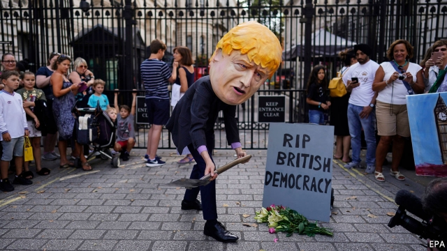

###### Taking back control

# Boris Johnson suspends Parliament, causing uproar 

 

> print-edition iconPrint edition | Britain | Aug 29th 2019 

THE PRESSURE is rising in the battle between Boris Johnson, who is determined to lead Britain out of the European Union with or without a deal on October 31st, and Parliament, where a majority of MPs want to stop a no-deal Brexit. This week opposition parties agreed that, when the Commons returns on September 3rd, they will try to hijack its agenda to pass a law calling for another extension of the Brexit deadline. But a day later Mr Johnson trumped them by announcing a long suspension of Parliament, from September 11th to October 14th, when a Queen’s Speech will start a new session. 

The prime minister claimed this was a normal way for a new government to set out its plans on crime, health and so on. Yet his main goal is the cynical one of shortening the time for MPs to stop no-deal. At almost five weeks, it will be Parliament’s longest suspension before a Queen’s Speech since 1945. The response was apoplectic. Jeremy Corbyn, Labour’s leader, labelled the move a “smash and grab on our democracy”. The Commons Speaker, John Bercow, called it a “constitutional outrage”. Even many Tories were unhappy. Ruth Davidson, the party’s popular leader in Scotland and a long-standing critic of Mr Johnson, quit the next day. 

The oddity is that a week earlier Mr Johnson was speaking of progress towards a Brexit deal. He had junked his vow not even to talk to fellow Europeans until they dropped the Irish backstop, an insurance policy to avert a hard border in Ireland by keeping the entire United Kingdom in a customs union with the EU. Instead, after meeting Germany’s Angela Merkel and France’s Emmanuel Macron, he offered to propose an alternative to the backstop within 30 days. Upsetting hardline Brexiteers, he also said he would not seek other changes to the withdrawal agreement negotiated by Theresa May, his predecessor. 

EU leaders listened politely. Mujtaba Rahman of the Eurasia Group consultancy says that, though sceptical of Mr Johnson’s unspecified alternatives, they may be ready to make small changes to the backstop to reduce its scope or limit it, as first planned, to Northern Ireland. But they also stand behind Ireland’s Leo Varadkar, who insists on keeping the backstop. They believe the withdrawal agreement struck with Mrs May goes as far as feasible to meet British interests without damaging the EU’s single market. And they are not about to surrender to Mr Johnson’s threats of no-deal, any more than they were in 2015 when Greece threatened to quit the euro. 

One conclusion from these events must be that the risk of no-deal is rising fast. Two months ago Mr Johnson talked of it being “a-million-to-one against”. Now he says it is “touch and go”. In political terms, no-deal has appeal to Mr Johnson, as the best chance of fending off Nigel Farage’s Brexit Party while trying to blame Brussels and Remainer “collaborators” for the mess. On the continent, resignation to no-deal is driven not just by an unwillingness to sacrifice Ireland but also by the belief that it will damage Britain far more than the EU. 

The impact on the British economy, which is already teetering near recession, could indeed be severe. The government’s leaked “Operation Yellowhammer” analysis talks of possible shortages of fresh food, medicine and petrol, disruption to ports and the risk of civil unrest, especially in Northern Ireland, where trade across the border could be severely hampered. Manufacturers fret about the effect on just-in-time supply chains of tariffs and non-tariff barriers. Farmers and fishers are worried about duties on sheep, beef and fish exports. Service businesses and the NHS talk of recruitment problems. 

Brexiteers dismiss this as another “Project Fear”, like the prophecies of doom before the June 2016 referendum which turned out to be too gloomy. They concede that there could be bumps in the road. But they also claim that no-deal would end uncertainty for businesses, be harmoniously managed by all sides and lead quickly to a new free-trade deal with the EU. 

As Charles Grant of the Centre for European Reform, a think-tank, notes, the chaos around no-deal would in fact maximise the uncertainty for businesses. Far from being harmonious, it would be acrimonious, especially since Mr Johnson says he would not pay the full £39bn ($48bn) Brexit bill accepted by Mrs May. And an early trade deal looks far-fetched. The EU would insist on the Brexit bill, protection of EU citizens’ rights and an Irish backstop as prerequisites. Any talks would be on a different legal basis from Article 50, which governs the current negotiations, requiring a fresh negotiating mandate, the unanimous approval of EU governments and ratification by national and regional parliaments. 

Given this, most MPs are understandably against no-deal. But can they stop it happening? Next week they will return to work after days of feverish exchanges over what to do. They are helped by the fact that Mr Bercow seems determined to exploit all his power as Speaker to give MPs a say, and that Mr Johnson has a Commons majority of just one. Yet they know that no-deal is the default option in the absence of other action and that, thanks to Mr Johnson’s suspension of Parliament, time is short. Many concede that no-deal Brexiteers are better organised and more ruthless than their opponents. 

Maddy Thimont Jack of the Institute for Government, another think-tank, reckons MPs have just enough time to legislate, if they remain united. The plan is to ask Mr Bercow for an emergency debate under standing order 24 and use this to follow the precedent of the Cooper-Letwin bill that was passed in March. Back then, MPs took control of the Commons agenda for a day to bring in the bill, which required the prime minister to request an extension of the original Brexit deadline of March 29th. MPs might also need to suspend standing order 48, which says only a minister may propose acts costing public money. 

Ms Thimont Jack notes that the March bill became law in less than five days. But that was partly because Mrs May chose not to obstruct it. Even if a similar bill passes the Commons in a single day, as then, it is hard to break a filibuster in the Lords, where the timetable for debate is less easily curtailed. Another problem is that any law can require Mr Johnson only to ask for an extension. He might do so on terms that allow him to refuse any offer from the EU, though Brussels is keen to avoid any blame for a no-deal Brexit. 

These uncertainties make some MPs keen to consider a vote of no confidence in Mr Johnson’s government. But that, too, is fraught with difficulties (see article). So are such options as trying to revoke the Article 50 Brexit application, for which there is much less support in Parliament. The harsh truth is that, although majorities of both MPs and voters are against a no-deal Brexit, an idea not even floated by Brexiteers during the referendum campaign, the timetable makes it tricky to stop, however much Parliament tries.■ 

