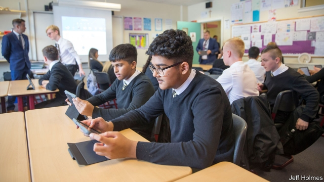

###### Prescribing tablets

# Free iPads for Scottish pupils 

 

> print-edition iconPrint edition | Britain | Aug 31st 2019 

FOR PUPILS at St Thomas Aquinas, a state secondary in Glasgow’s suburbs, the post-summer return to school was leavened with the promise of a gift: an iPad for every child. The tablets cannot download apps, are tracked by the school and come with a firewall to block off-limits parts of the internet, but the pupils can take the devices home. Not all year groups have so far received them, leaving the rest jealous, says Barry Quinn, the deputy head. “They can’t wait for theirs to be deployed.” 

The giveaway is part of a £300m ($370m) contract signed by Glasgow City Council with CGI, a Canadian IT firm, under which iPads will be handed out to nearly 50,000 pupils aged nine to 17 by 2021. More will be sent to nurseries. The deal also covers other services, including Wi-Fi links and data analysis in hospitals, leaving the council unable to say exactly how much has been spent on the iPads. But they are not the only ones to splash cash on gadgets. The city joins Edinburgh, which has 27,000 iPads in its schools, and the Borders, which plans to give them to all children in the same age range as Glasgow. 

According to Glasgow council, tablets will improve digital literacy, preparing pupils for workplaces where tech is ubiquitous. They can be used to share information, set homework and replace textbooks. Teachers have had a year to get up to speed with how to use the things. The project “will result in raising attainment and achievement in every one of our schools and nurseries,” promises Chris Cunningham, Glasgow’s head of education. 

If so, that would make it different from similar past experiments. Philip Oreopoulos of the University of Toronto, co-author of a forthcoming review of randomised control trials on education technology, notes that results show academic consensus: although handing out laptops increases computer use, it has no impact or even (in one study) a negative one on attainment. There is not as much rigorous research on tablets, but little reason to think results would differ. The worry is that they end up distracting pupils more than they help them study. 

Some programmes that use computers for personalised tuition have, though, produced promising results. With the right software and careful management of how they are used, tablets could help, says Mr Oreopoulos. Yet so far their use in Scotland seems to be less well defined. At St Thomas Aquinas, they have been used for catch-up quizzes at the start of maths lessons and to film gymnastics to check on technique. Teachers have been told to use them in every lesson, but left to decide how. 

Another argument for the handout is that it levels the playing field for children who do not have access to the latest technology at home, and does so in a way that does not stigmatise those who most need the help. Critics respond that buying expensive gadgets for all is a poor way to help these pupils, especially when there are cheaper programmes that have shown better results. Giving out iPads may allow politicians to say they are dragging schools into the 21st century, but that does not mean they are a sensible investment. ■ 

