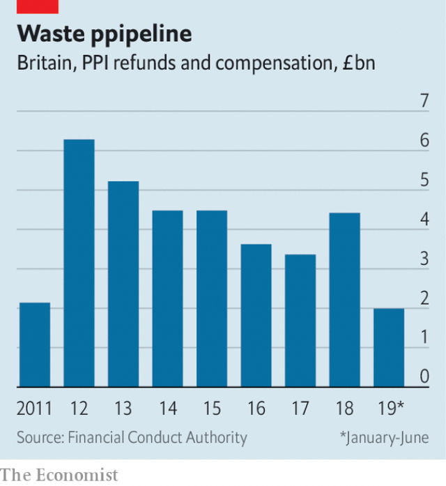

###### Hasta la vista

# PPI was a bonanza—for banks, and then for consumers 

 

> print-edition iconPrint edition | Britain | Aug 29th 2019 

FOR TWO years Britons have been bombarded with bizarre television adverts featuring the animatronic head of Arnold Schwarzenegger. In this guise the actor and former governor of California has been urging them—on behalf of the Financial Conduct Authority (FCA), a regulator—to claim compensation for mis-sold payment protection insurance (PPI) before the deadline of August 29th. 

Banks, which sold the bulk of PPI policies, will be even gladder to see the back of Arnie’s bonce. They hope this week’s cut-off, agreed on in 2017 with the FCA, will draw a line under a scandal that proved costly first for consumers and then for the banks themselves. Between 1990 and 2010 lenders reaped £44bn ($54bn) in premiums—and between 2011 and this June repaid £36bn to customers (see chart). 

 

According to Dominic Lindley of New City Agenda, a think-tank, the total cost to the banks, including administrative expenses and fines, has been £48.5bn. At one point Lloyds Banking Group employed 7,000 people to handle PPI complaints. A late surge of deadline-beating claims will swell the industry’s bill. Lloyds made an extra £550m provision in the second quarter of this year, taking its total over £20bn. 

At some banks, nearly 90% of claims have been upheld. Average payouts have probably exceeded £2,000. Britons have thus enjoyed unexpected windfalls big enough to splash out on holidays or cars. In the peak year, 2012, banks paid out £6.3bn, equivalent to nearly 0.4% of GDP—a handy boost to consumers when the economy was labouring under post-crisis austerity. 

The FCA estimates that 45m PPI policies were sold between 1990 and 2010. Almost half were attached to unsecured loans, for everything from cars to catalogue shopping. One-third were linked to credit- and store-card debt, and one-sixth to mortgages. In theory, loans would be repaid if borrowers lost their jobs or fell ill. 

Not all policies were mis-sold, but plenty were. Borrowers were told that they could have credit only with PPI. Some probably did not know they were paying for it, because premiums were quietly bundled in with interest payments. Some who made insurance claims were rejected, for example because they were self-employed or because their medical history ruled them out. Commissions bulked up premiums. At one bank, notes Mr Lindley, an adviser’s bonus for selling a loan with PPI was six times as much as for one without it. A ruling by the Supreme Court in 2014, that large undisclosed commissions on PPI policies breached consumer-protection law, exposed the banks to further claims. 

Claims-management firms, which seek out policyholders and take a cut of any proceeds, have done nicely out of the scandal, even though the FCA and the Financial Ombudsman Service (FOS), another watchdog, have advised claimants to contact lenders directly. Britons have been irritated by calls and texts from claims companies even more than by Mr Schwarzenegger’s fizzog. 

Banks are hoping that claims will now dry up. But rejected claimants can appeal to the FOS for another six months and claims firms still hope to pursue some through the courts. In any case, the financial-services industry—which came up with endowment mortgages and fiendish interest-rate hedges as well as PPI—will surely supply another outrage eventually, if on a less spectacular scale. ■ 
<<<<<<< HEAD

-- 

 单词注释:

1.hasta[]:prep. （西）直到 

2.La[lɔ:, lɑ:]:[医] 镧(57号元素) 

3.vista['vistә]:n. 远景, 展望, 回想 

4.Ppi[]:[经] 生产者物价指数 

5.Aug[]:abbr. 八月（August） 

6.Briton['britәn]:n. 大不列颠人, 英国人 

7.bombard[bɒm'bɑ:d]:vt. 炮击, 攻击, 轰击 n. 射石炮 

8.bizarre[bi'zɑ:]:a. 奇异的 

9.advert[әd'vә:t]:vi. 提出看法, 引起注意, 留意 n. 广告 

10.animatronic[]:电子动物的 

11.arnold['ɑ:nәld]:n. 阿诺德（男子名） 

12.Schwarzenegger[,ʃwazi'nigə]:n. 施瓦辛格（姓氏名） 

13.guise[gaiz]:n. 相似, 外观, 伪装 v. 穿戴, 伪装 

14.California[.kæli'fɒ:njә]:n. 加利福尼亚 

15.FCA[]:[计] 纠错数组, 功能配置审查 

16.compensation[.kɒmpen'seiʃәn]:n. 补偿, 赔偿金, 工资 [医] 代偿(机能), 补偿 

17.bonce[bɒns]:n. 头；脑袋 

18.lender['lendә]:n. 出借人, 贷方 [经] 出借者, 贷方, 贷款人 

19.repay[ri'pei]:v. 偿还, 报答, 报复 

20.dominic['dɔminik]:n. 多米尼克（男子名） 

21.Lindley[]:n. (Lindley)人名；(英、西、葡)林德利 

22.administrative[әd'ministrәtiv]:a. 管理的, 行政的 [法] 行政的, 管理的, 遗产管理的 

23.lloyd[lɔid]:n. 劳埃德（男子名） 

24.surge[sә:dʒ]:n. 巨涌, 汹涌, 澎湃 vi. 汹涌, 澎湃, 颠簸, 猛冲, 突然放松 vt. 使汹涌奔腾, 急放 [计] 电压尖峰 

25.uphold[ʌp'hәuld]:vt. 支撑, 赞成, 鼓励, 举起, 坚持 [法] 确认, 赞成, 支持 

26.payout['pei'aut]:n. 支出, 付出款项 [经] 付出款项, 花费, 支出 

27.unexpect[]:[网络] 意想不到；使意外 

28.windfall['windfɒ:l]:n. 被风吹落的果子, 横财 [经] 意外损失 

29.austerity[ɒ'sterәti]:n. 朴素, 苦行, 严格, 严峻 

30.unsecured['ʌnsi'kjuәd]:a. 无担保的 [经] 无担保的 

31.mortgage['mɒ:gidʒ]:n. 抵押, 约束性义务, 抵押借款 vt. 抵押, 以...作担保, 把...许给 

32.borrower['bɒrәuә]:n. 借用人, 剽窃者 [经] 借款人, 借用人 

33.premium['pri:miәm]:n. 额外补贴, 奖金, 奖赏, 保险费 [医] 保险费 

34.quietly['kwaiәtli]:adv. 安静地, 沉着地, 秘密地 

35.undisclosed['ʌndis'klәuzd]:a. 未泄露的, 保持秘密的, 不露真名的, 身分不明的 [法] 身份不明的, 隐名的, 未透露的 

36.breach[bri:tʃ]:n. 裂口, 违背, 破坏, 违反, 突破, 破裂 vt. 攻破, 突破 vi. 跳出水面 

37.policyholder['pɒlәsi.hәuldә]:n. 投保者, 保险客户 

38.nicely['naisli]:adv. 漂亮地, 谨慎地, 恰好地 

39.ombudsman['ɒmbudzmæn]:n. (专查官员舞弊的)调查官 [法] 调查专员, 监察专员, 司法专员 

40.FO[]:(英)空军中尉, (英国)外交部, 前进观察员, 校官, 野战命令 

41.watchdog['wɒtʃdɒg]:n. 看门狗, 监察人 [化] 监控设备; 监视器 

42.claimant['kleimәnt]:n. 提出要求者, 原告 [经] 索赔人, 债权人 

43.irritate['iriteit]:vt. 激怒, 使发怒, 使兴奋, 使发炎 vi. 引起不快 

44.fizzog[]: 

45.endowment[in'daumәnt]:n. 捐助, 天赋, 才能 [经] 捐赠, 捐款, 养老金 

46.fiendish['fi:ndiʃ]:a. 恶魔似的 

47.outrage['autreidʒ]:n. 暴行, 侮辱, 愤怒 vt. 凌辱, 虐待, 触犯 

48.les[lei]:abbr. 发射脱离系统（Launch Escape System） 

49.spectacular[spek'tækjulә]:a. 公开展示的, 惊人的, 壮观的 n. 奇观, 惊人之举, 展览物 
=======
>>>>>>> 50f1fbac684ef65c788c2c3b1cb359dd2a904378

