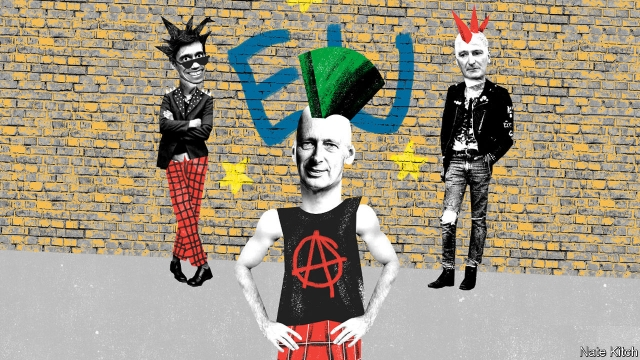

###### Bagehot

# The unlikely Tory rebels 

 

> print-edition iconPrint edition | Britain | Aug 29th 2019 

THE REBEL boot is on the other foot. For years the most prominent Tory troublemakers were Eurosceptics, who were willing to do anything to get Britain out of the European Union. Now the Eurosceptics have captured the government and the most prominent rebels are Euro-moderates, who are willing to do anything to prevent Britain from leaving the EU without a deal. 

The insurgents are about 40 strong, though not all will vote in the same way at the same time. They are a looser alliance than the old rebels who, in the form of the European Research Group, had their own whips and party line. But Boris Johnson’s increasingly hardline policies have stiffened their spines. The alliance contains a collection of Tory grandees, including five former cabinet ministers, and a smaller group of escapees, such as Sir Oliver Letwin and Guto Bebb, who have decided to stand down at the next election. Ruth Davidson’s resignation as leader of the Scottish Conservatives has weakened Toryism north of the border and provided the rebels with another example of the cost of Mr Johnson’s policies. 

The alliance contains some of the oddest rebels ever assembled in politics. Philip Hammond, the closest thing the alliance has got to a leader, joined the Conservative Party when he was still at school and spent the past nine years as transport secretary, foreign secretary and chancellor of the exchequer, before quitting in the last days of Theresa May’s government. His understated manner and fondness for economic orthodoxy earned him the nickname “spreadsheet Phil” (though he is much more entertaining in private than his public persona suggests). When he voted against the government on the Northern Ireland bill last month it was the first time he had broken with his party in 22 years, which is not something that could be said of many Brexiteers. 

In his essay of 1919 on “Politics as a Vocation”, Max Weber made a distinction between the “ethic of responsibility” and the “ethic of conviction”. The ethic of responsibility is all about pragmatism—doing what you can to keep the show on the road—whereas the ethic of conviction is all about moral purity. Mr Hammond is the embodiment of the first, just as Dominic Cummings, Mr Johnson’s chief of staff and, according to his critics, unelected deputy prime minister, is the embodiment of the second. 

David Gauke is a solicitor by profession who ended up as Lord Chancellor. Dominic Grieve is another lawyer—a QC, no less—who served as attorney-general. Greg Clark is a former management consultant who was a quietly effective secretary of state for business. The only member of the alliance who has the whiff of the rebel about him is Rory Stewart, who spent years wandering around dangerous bits of the world as a latter-day Lawrence of Arabia. But Mr Stewart is also a worshipper of British institutions, whose CV includes working as a tutor to Princes William and Harry and serving in the army and the Foreign Office. 

These odd rebels bring a formidable range of skills to their mission. As a former foreign secretary and chancellor, Mr Hammond has a network of contacts both in Britain and the wider EU. He also knows as much as anybody about the potential impact of a no-deal Brexit on business. Mr Gauke is one of the most popular MPs in Parliament—“clever”, “subtle” and “humorous” are a few of the adjectives that fellow members shower on him. Sir Oliver and Mr Grieve are both veterans of the “May wars” to prevent the government from steamrolling Parliament and have created a store of templates and strategies. Mr Grieve also has close relations with Sir Keir Starmer, Labour’s Brexit spokesman. Mr Stewart single-handedly lit up the recent Tory leadership campaign with his improvised walkabouts (which he has recently resumed) and excited a new generation of young people about Conservatism. “Rory is a bit of a messiah,” says an MP who has known him for years, “but at least messiahs have a way of making converts.” 

The rebels should be under no illusion about how difficult their job is. This is not a normal government. It is dominated by brutal ideologues who will use any smear (“traitor”, “collaborator”, “fifth-columnist”) to defeat their opponents. On August 28th Mr Johnson made the extraordinary move of asking the queen to suspend Parliament from September 11th to October 14th, in an attempt to reduce the number of days that MPs have to prevent a no-deal exit on October 31st—a move that Mr Hammond described as a “constitutional outrage” and “profoundly undemocratic”. 

But the rebels have two important things on their side. The most obvious is numbers. Suspending Parliament is a sign of Mr Johnson’s weakness, not his strength. The prime minister has a working majority of only one. The bulk of MPs are opposed to a no-deal Brexit. And Parliament has a good record of winning its battles with the executive. Mrs May lost three times, despite throwing all the government’s time and resources for two years behind getting her deal through. The second thing on the rebels’ side is fear. Several senior members of Mr Johnson’s government are privately terrified that his “do or die” tactics may sink the economy and destroy the Conservative Party for a generation. As Brexit day approaches and the pound sinks, bankruptcies rise, shortages loom and civil disorder resumes in Northern Ireland, the people who crack may not be the Europeans but some unexpected Johnson loyalists. 

The rebels’ deeper problem is what happens to them after October 31st. The Eurosceptics reshaped British politics because they had a single aim and unflinching determination. The Euro-moderates are united on little other than preventing no-deal. Some want a second referendum to overturn Brexit, some want a version of Mrs May’s deal, and some may even want a long-term realignment of politics which would consign the Brexiteers to a party of their own. The alliance could easily fracture as rapidly as it has formed. It is worryingly easy to lose control of a party to the men and women of conviction. It is much more difficult to win it back. ■ 

-- 

 单词注释:

1.Bagehot[ˈbædʒət]:白芝浩；巴杰特（人名） 

2.Tory['tɒ:ri]:n. 托利党党员, 保守党员, 亲英分子 a. 保守分子的 

3.Aug[]:abbr. 八月（August） 

4.troublemaker['trʌbl.meikә]:n. 惹麻烦的人 

5.eurosceptic[ˌjʊərəʊ'skeptɪk]:n. 欧洲统一怀疑论者；反对英国亲近欧盟的人 

6.EU[]:[化] 富集铀; 浓缩铀 [医] 铕(63号元素) 

7.insurgent[in'sә:dʒәnt]:a. 谋叛的, 起义的, 澎湃的 n. 起义者, 叛乱者 

8.loos[]:n. 损耗, 洗手间（loo复数形式） 

9.alliance[ә'laiәns]:n. 联盟, 联合 [法] 同盟, 联盟, 联姻 

10.boris['bɔris]:n. 鲍里斯（男子名） 

11.hardline[]:n. 强硬路线 [电] 硬线 

12.spine[spain]:n. 背骨, 脊柱, 尖刺 [医] 脊柱; 棘, 刺; 马蹄嵴 

13.grandee[græn'di:]:n. 大公, 显贵之人 

14.escapee[i.skei'pi:]:n. 逃亡者, 逃避者 [法] 脱逃者 

15.oliver['ɒlivә]:n. 脚踏铁锤 

16.letwin[]:[网络] 莱特文；希望有天能指哪打哪 

17.guto[]:n. (Guto)人名；(塞)古托 

18.bebb[]:[网络] Bachelor of Engineering and Bachelor of Business 

19.ruth[ru:θ]:n. 怜悯, 悲哀 

20.Toryism['tɒ:riizm]:n. 英国保守党, 英国保守党党员的主义 

21.oddest[]:奇怪的 古怪的（ odd的最高级 ） 

22.politic['pɒlitik]:a. 精明的, 明智的, 策略的 

23.philip['filip]:n. 菲利普（男子名） 

24.hammond['hæmәnd]:n. 哈蒙德（美国城市） 

25.chancellor['tʃɑ:nsәlә]:n. 大臣, 总理, 首相, 大使馆/领事馆的一等秘书, 司法官, 大学校长 

26.exchequer[iks'tʃekә]:n. (英国)财政部, 国库 [法] 国库, 财源, 财政法院 

27.theresa[ti'ri:zә]:n. 特丽萨（女子名） 

28.understate[.ʌndә'steit]:v. 不完全地陈述, 保守地说, 有意轻描淡写 

29.fondness['fɔndnis]:n. 溺爱；爱好 

30.orthodoxy['ɒ:θәdɒksi]:n. 正统说法, 正教, 信奉正教 

31.nickname['nikneim]:n. 绰号, 昵称 vt. 给...取绰号, 叫错名字 [计] 绰号 

32.spreadsheet['spredʃi:t]:n. 空白表格程序, 电子制表软件, 电子数据表 [计] 电子表格 

33.phil[fil]:abbr. 哲学（philosophy） 

34.persona[pә:'sәunә]:n. 人, 人物, 角色, 外表印象, 人格面具 [医] 伪装人格 

35.Brexiteers[]:支持英国退欧的人（Brexiteer的复数） 

36.vocation[vәu'keiʃәn]:n. 职业, 天命, 天职, 才能, 行业 [法] 行业, 职业, 职业上的才能 

37.MAX[mæks]:[计] 最大 

38.Weber['wi:bә]:[计] 韦伯 [医] 韦伯, 库仑 

39.ethic['eθik]:n. 道德规范, 伦理 

40.conviction[kәn'vikʃәn]:n. 定罪, 信服, 坚信 [法] 定罪, 证明有罪, 判罪 

41.embodiment[im'bɒdimәnt]:n. 具体化, 化身 

42.dominic['dɔminik]:n. 多米尼克（男子名） 

43.Cumming[]:n. (Cumming)人名；(英)卡明 卡明 

44.unelected[ˌʌnɪˈlektɪd]:a. 未经选举的 

45.david['deivid]:n. 大卫；戴维（男子名） 

46.solicitor[sә'lisitә]:n. (英)律师, 初级律师, (美)法务官, (美)掮客, 游说者, (美)募捐者 [经] 募损者, 律师 

47.chancellor['tʃɑ:nsәlә]:n. 大臣, 总理, 首相, 大使馆/领事馆的一等秘书, 司法官, 大学校长 

48.QC[]:[化] 质量管理 

49.greg[greg]:n. 格雷格（男子名, 等于Gregory） 

50.clark[]:n. 克拉克（男子名） 

51.quietly['kwaiәtli]:adv. 安静地, 沉着地, 秘密地 

52.whiff[hwif]:n. 一吹, 一吸, 一阵, 一点点, 一口烟 vi. 轻轻地吹, 喷气, 三击不中出局, 垂钓 vt. 吹送, 喷出, 吸, 使三击不中出局 

53.Rory['rɔ:ri,'rәjri]:n. 罗里(m.) 

54.stewart['stjuәt]:n. 斯图尔特（男子名） 

55.lawrence['lɔrәns]:n. 劳伦斯（男子名） 

56.Arabia[ә'reibiә]:n. 阿拉伯半岛 

57.worshipper[]:n. 礼拜者, 崇拜者, 爱慕者 

58.cv[]:abbr. 简历（Curriculum Vitae） 

59.william['wiljәm]:n. 威廉（男子名）；[常作W-][美俚]钞票, 纸币 

60.harry['hæri]:vt. 掠夺, 使苦恼, 强使前行, 折磨, 骚扰 

61.formidable['fɒ:midәbl]:a. 巨大的, 优秀的, 可怕的, 艰难的 

62.Brexit[]:[网络] 英国退出欧盟 

63.MP[]:国会议员, 下院议员 [计] 宏处理程序, 维护程序, 线性规划, 微程序, 多处理器 

64.subtle['sʌtl]:a. 敏锐的, 精细的, 狡猾的, 稀薄的, 灵巧的, 微妙的 [医] 锐敏的; 精细的 

65.steamrolling['stiːm.rəʊl]:v. 用蒸汽碾路机压平[压碎]；施以高压；〈口〉以不可抗拒之势推进 [网络] 人肉战车；极力主张 

66.template['templit]:n. 样板, 模板, 垫木 [计] 模板 

67.Keir[kiә]:n. (kier之变体)漂染缸, 煮布锅 

68.starmer[]:[网络] 斯塔默 

69.spokesman['spәuksmәn]:n. 发言人, 代言者 

70.improvise['imprәvaiz]:vt. 即席创作, 临时做 

71.walkabout['wɔ:kәbajt]:n. 徒步旅行 

72.conservatism[kәn'sә:vәtizәm]:n. 保守, 守旧性, 保守主义, [the]保守党的主张和政策, 保守党 [医] 保守性 

73.messiah[mә'saiә]:n. 弥赛亚 

74.MP[]:国会议员, 下院议员 [计] 宏处理程序, 维护程序, 线性规划, 微程序, 多处理器 

75.brutal['bru:tәl]:a. 残忍的, 野蛮的, 不讲理的 

76.ideologue['aidi:әulɔ^]:n. 理论家, 思想家,空想家 

77.smear[smiә]:vt. 涂, 擦上, 玷污, 把...擦模糊 vi. 被弄脏 n. 污点, 污迹, 污蔑 

78.collaborator[kә'læbәreitә]:n. 合干者, 合作者, 通敌者 [法] 合作者, 协助者, 勾结者 

79.johnson['dʒɔnsn]:n. 约翰逊（姓氏） 

80.constitutional[.kɒnsti'tju:ʃәnl]:a. 宪法的, 立宪的, 体质的 [医] 全身的; 体质的 

81.outrage['autreidʒ]:n. 暴行, 侮辱, 愤怒 vt. 凌辱, 虐待, 触犯 

82.profoundly[prә'fajndli]:adv. 深深地, 深切地 

83.undemocratic['ʌndemә'krætik]:a. 非民主的, 不民主的 

84.Mr['mistә(r)]:先生 [计] 存储器回收程序, 多重请求 

85.privately[]:adv. 秘密地；私下地 

86.tactic['tæktik]:n. 一项战术, 一条策略 a. 战术的, 顺序的, 排列的 

87.bankruptcy['bæŋkrәptsi]:n. 破产者 [经] 破产, 倒闭 

88.loom[lu:m]:n. 织布机, 若隐若现的景象 vi. 朦胧地出现, 隐约可见, 可怕地出现 

89.unexpect[]:[网络] 意想不到；使意外 

90.loyalist['lɒiәlist]:n. 忠诚的人, 反对独立者, 反佛朗哥派的人 

91.reshape[ri:'ʃeip]:vt. 改造, 使成新的形状, 打开新局面 vt. 整形 vi. 整形 [计] 整形 

92.unflinching[.ʌn'flintʃiŋ]:a. 不畏惧的, 不退缩的, 不畏缩的 

93.referendum[.refә'rendәm]:n. （就重大政治或社会问题进行的）全民公决，全民投票 

94.overturn[.әuvә'tә:n]:n. 倾覆, 破灭, 革命 vt. 推翻, 颠倒 vi. 翻倒 

95.realignment[,ri:ә'lainmәnt]:n. 重新排列, 改组, 重新组合 [计] 重新调整 

96.consign[kәn'sain]:vt. 交付, 储蓄, 委托, 寄存 [经] 托卖, 寄存, 寄销 

97.fracture['fræktʃә]:n. 破碎, 骨折 v. (使)破碎, (使)破裂 

98.worryingly['wʌrɪɪŋlɪ]:adv. 焦虑地, 烦恼地 

