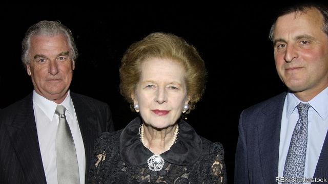

###### Tim Bell, 1941-2019

# Tim Bell, the founding father of fake news 

 

> print-edition iconPrint edition | Britain | Aug 31st 2019 

TIM BELL loathed rules. In his top-floor office in Mayfair, a ritzy district of London, the man who did more than anyone to make Britain’s public-relations industry famous (and infamous) flouted the smoking ban. Even in winter, the smoke from his daily two packs of Dunhills wafted out of the open windows. In the street below, his chauffeur waited to drive him 200 yards down the road for lunch. “I enjoy being stared at,” he said, of his choice of a red Ferrari. The TV was always on, blaring Prime Minister’s Questions or a cricket match. On a table were pictures of his family and his friend, client and idol, Margaret Thatcher, whose uncomplicated devotion to freedom matched his own. 

In death as in life, the role of Lord Bell (as he later became) in Thatcher’s three election victories has been overstated. His job—first at Saatchi & Saatchi, an advertising agency, and later at his own company—was to schmooze clients, not to come up with slogans, like the “Labour isn’t working” pun that mocked the party’s record on unemployment. But Thatcher believed in his magic, smuggling him into Downing Street during the 1987 election after the Saatchis had banned him from working on the campaign, after a falling-out. He was her “man on the Clapham omnibus”, who could channel the views of ordinary folk. 

He became a courtier, dispensing flattery in gravelly tones at family gatherings and Christmas Day lunch. “Boxing Day is just for the cabinet and people who give money to the party,” he boasted. When Thatcher recorded television adverts, he would sit underneath the camera to get her to relax and speak as if addressing an individual not a crowd. Despite her puritanism, she indulged his hard living. She was amused when, waking from a champagne-induced stupor to take her call, he suddenly realised he had been burgled. It was Lord Bell who announced her death, in 2013. 

His more significant legacy is his part in establishing London as a hub for what he termed geopolitical work and others call reputation laundering. At the height of his fame, he switched from advertising to public relations. “His proximity to the PM did his business no harm,” says Bernard Ingham, Thatcher’s press secretary. He won one of his first clients, F. W. de Klerk, then president of South Africa, by cold-calling his private office, supposedly on behalf of Thatcher—which he later insisted “was at least 10% true”. 

Colleagues called him a foul-weather friend, since he had a penchant for the dodgier end of the market. Insisting that “morality is a job for priests, not PR men,” he helped Augusto Pinochet, a Chilean dictator, escape extradition to Spain on charges of torture, and massaged the reputations of Alexander Lukashenko, a Belarusian strongman, and Asma al-Assad, the Syrian president’s wife. In one year he helped devise both pro- and anti-smoking campaigns. Bell Pottinger, the agency he founded in 1998, created fake social-media accounts and blogs. He was casual with facts, “because people are casual”. “The devil’s in the detail—and we didn’t want the fucking devil,” he once explained. 

How many of his campaigns worked is open to question. He advised Pinochet’s finance minister and Jacques Chirac (“you talk too much economic rubbish”) on elections they lost and masterminded the communications strategy for Iraq’s “transition to democracy” in 2004. He had a talent for blaming bloopers on others: he insisted David Mellor, an adulterous MP, decided on an embarrassing photo-op with his family; the unpopular idea to serve Spam fritters to mark the 50th anniversary of D-Day was “suggested by the Royal Marines, not us”. Results mattered less than his charm, which won him contracts from London Underground though he never travelled by Tube, from the National Union of Teachers whose politics he deplored, and from the BBC, months after he called for it to be sold. 

In the end, like his idol, he went on too long. He resisted attempts to tart up Bell Pottinger’s image, failing to grasp the premium that social media places on authenticity and the new spotlight on “fake news”. The firm collapsed in 2017, after a secret campaign to manipulate public opinion in South Africa against “white monopoly capital” was exposed. By then, Lord Bell had quit, blaming the company’s woes on other executives. But he did not retire, and set up another agency, Sans Frontières Associates. Nor did he give up on fun. A friend who visited him a few days before he died found him glued to his beloved cricket. He asked her to light him a cigarette. ■ 

