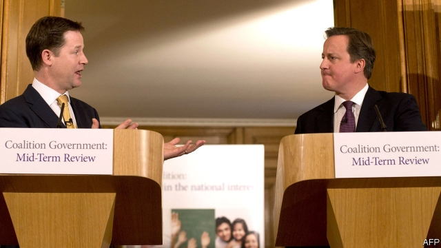
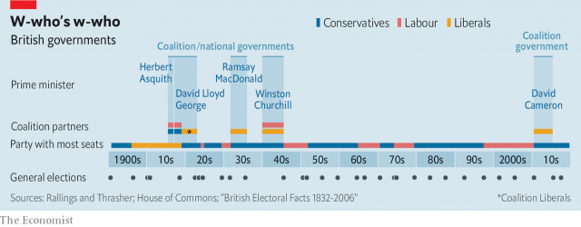

###### All you need to k-know about gnus

# Why governments of national unity are so hard to form 

 

> print-edition iconPrint edition | Britain | Aug 29th 2019 

ALL PARTIES agree their first choice of route to try to stop a no-deal Brexit should be legislation. Yet after Boris Johnson’s decision to suspend Parliament for almost five weeks, some MPs want to have in reserve a vote of no confidence. Such a vote could lead to a government of national unity (gnu) backed by a cross-party majority of MPs. This “letter-writing government”, under a caretaker prime minister, might invite the EU to extend the Brexit deadline of October 31st to allow time for a general election or another referendum. 

Yet the obstacles to a gnu are large. Proposing a vote of no confidence is not the same as winning one. Even winning one is complicated by the 2011 Fixed-term Parliaments Act, which allows 14 days for another government to secure confidence before an election must be called. Mr Johnson would remain prime minister during this period, and might fix the date for an election after October 31st, allowing no-deal by default. 

But the biggest roadblock is who should lead a gnu. As opposition leader, Labour’s Jeremy Corbyn insists he should be prime minister. Yet as he learnt this week, he will not easily win the support of other opposition parties, let alone Tory rebels. Jo Swinson, the Liberal Democrat leader, argues that any gnu should be led by a neutral grandee, such as the Conservatives’ Ken Clarke or Labour’s Harriet Harman. But Labour will not back this idea if Mr Corbyn is not on board. 

 

Andrew Blick of King’s College, London, says history shows that Mr Corbyn is wrong to claim that only the leader of the opposition can become prime minister. In 1916 David Lloyd George ousted Herbert Asquith to form a national government that lasted until 1922, only to see Labour later displace his party. In 1931 the Tories joined a national government under the Labour prime minister, Ramsay MacDonald, but he was then disowned by his own party. In 1940 the Labour opposition told Neville Chamberlain, the Tory prime minister, that it would join a national government only if it was led by Winston Churchill, who won the war but lost the 1945 election. 

Gnus are common beasts in other European countries. But as Benjamin Disraeli said, “England does not love coalitions”, an aphorism confirmed by the recent one under David Cameron. And there is a big flaw in all talk of governments of national unity. What Brexit reveals is a total lack of national unity. ■ 

-- 

 单词注释:

1.gnu[nju:]:n. 牛羚, 角马 [计] GNU 计划，又称革奴计划，是由Richard Stallman在1983年9月27日公开发起的，目标是创建一套完全自由的操作系统 

2.Aug[]:abbr. 八月（August） 

3.Brexit[]:[网络] 英国退出欧盟 

4.boris['bɔris]:n. 鲍里斯（男子名） 

5.MP[]:国会议员, 下院议员 [计] 宏处理程序, 维护程序, 线性规划, 微程序, 多处理器 

6.caretaker['kєәteikә]:n. 照顾者, 看管者, 看守人 [法] 看守员, 管理员, 看管人 

7.EU[]:[化] 富集铀; 浓缩铀 [医] 铕(63号元素) 

8.referendum[.refә'rendәm]:n. （就重大政治或社会问题进行的）全民公决，全民投票 

9.johnson['dʒɔnsn]:n. 约翰逊（姓氏） 

10.default[di'fɒ:lt]:n. 违约, 不履行责任, 缺席, 默认值 v. 疏怠职责, 缺席, 拖欠, 默认 [计] 默认; 默认值; 缺省值 

11.roadblock['rәudblɒk]:n. 障碍, 障碍物 

12.opposition[.ɒpә'ziʃәn]:n. 反对, 敌对, 相反, 在野党 [医] 对生, 对向, 反抗, 反对症 

13.jeremy['dʒerimi]:n. 杰里米（男子名） 

14.Corbyn[]:科尔宾（人名） 

15.Tory['tɒ:ri]:n. 托利党党员, 保守党员, 亲英分子 a. 保守分子的 

16.jo[dʒәu]:abbr. 乔（女子名, 等于Joseph, Josephine） 

17.swinson[]:[网络] 胡才 

18.democrat['demәkræt]:n. 民主人士, 民主主义者, 民主党党员 [经] 民主党 

19.grandee[græn'di:]:n. 大公, 显贵之人 

20.ken[ken]:n. 视野范围, 知识范围, 见地 

21.clarke[]:n. 克拉克（姓氏） 

22.harriet[]:n. 哈里特（女子名） 

23.harman[]:[化] 哈尔满; 阿锐宾 

24.andrew['ændru:]:n. 安德鲁（男子名） 

25.blick[]: [人名] [英格兰人姓氏] 布利克 Bluck的变体 

26.david['deivid]:n. 大卫；戴维（男子名） 

27.lloyd[lɔid]:n. 劳埃德（男子名） 

28.george[dʒɔ:dʒ]:n. 乔治（男子名）；自动操纵装置；英国最高勋爵勋章上的圣乔治诛龙图 

29.oust[aust]:vt. 逐出, 罢黜, 剥夺, 驱逐 [法] 驱逐, 剥夺, 免职 

30.herbert['hә:bәt]:n. 赫伯特（男人名） 

31.Asquith[]:n. (Asquith)人名；(德)阿斯奎特；(英)阿斯奎思 阿斯奎斯 

32.displace[dis'pleis]:vt. 移置, 替换, 转移 

33.Tory['tɒ:ri]:n. 托利党党员, 保守党员, 亲英分子 a. 保守分子的 

34.Ramsay['ræmzi]:拉姆齐(①姓氏 ②Sir William, 1852-1916, 英国化学家, 氦的发现者, 曾获1904年诺贝尔化学奖) 

35.macdonald[mәk'dɔnәld]:n. 麦克唐纳（姓氏）；麦当劳快餐店 

36.disown[dis'әun]:vt. 否认 [计] 不认, 驱逐 

37.Neville['nevil]:n. 内维尔（男子名） 

38.chamberlain['tʃeimbәlin]:n. 内侍, 管家, 掌管财物的人 [法] 管家, 国王侍从, 收款员 

39.winston['winstәn]:n. 温斯顿（姓氏, 男子名） 

40.Churchill['tʃә:tʃil]:n. 邱吉尔 

41.benjamin['bendʒәmin]:[医] 安息香 

42.disraeli[diz'reili]:（英国著名政治家；小说家）迪斯雷利（姓氏） 

43.coalition[.kәuә'liʃәn]:n. 结合体, 结合, 联合 [经] 联合, 联盟 

44.aphorism['æfәrizm]:n. 格言, 警语 

45.cameron['kæmәrәn]:n. 卡梅伦/隆（男子名） 

46.flaw[flɒ:]:n. 缺点, 裂纹, 瑕疵, 一阵狂风 [化] 划痕; 裂缝; 裂纹 

