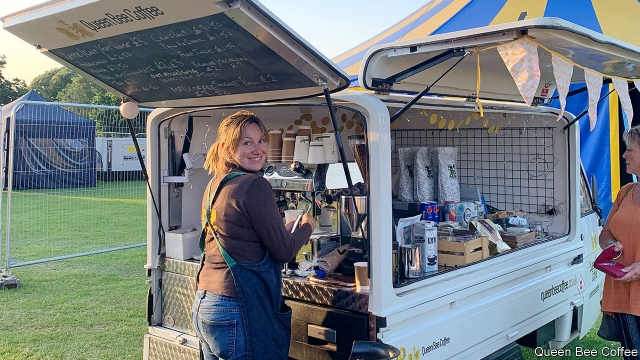

###### Monikers Limited

# “Olympic”, “royal”, “knob”—the names that can get your business banned 

 

> print-edition iconPrint edition | Britain | Aug 31st 2019 

WHEN ANNIE ADAMSON pivoted her coffee business, Bean Here, Bean There, from serving commuters at railway stations to providing sustenance at weddings and parties from the back of a Piaggio Ape three-wheeler, she wanted a new name. “I thought I could be the top dog, the head honcho, the queen bee of mobile coffee,” she says. With such lofty ambitions, the name was obvious: Queen Bean Coffee. She filled in the necessary paperwork and sent it to Companies House. She also emailed the Cabinet Office to ask for permission. “I am in no way inferring any connection to our monarch or indeed any monarch other than that of the bee world,” she wrote (ape is Italian for bee). 

The reply from the Royal Names Team arrived swiftly, telling her she couldn’t be Queen Bean because her connection to “the word Queen is not strong enough”. The email suggested some variations, such as Bean Queen. In the end Ms Adamson settled on Queen Bee Coffee, which makes up in its indisputable status as a common noun what it lacks in bean-based wordplay. She was keen, she says, to pick something that “will work for my business but not displease her majesty’s government”. 

Ms Adamson fell foul of a complex web of rules on the naming of businesses in Britain. A company name must be unique. It must not be offensive. And it must skirt around three categories of sensitive words that require varying levels of permission from a rich assortment of government departments and private entities. A primary list of 135 sensitive words or phrases, such as “queen”, must be approved by a secretary of state or their representative. Another 28, such as “agency” or “assembly”, come with looser preconditions. And there are 25 “other regulated words and expressions”, such as “architect” or variations on “Olympic”. Last year Companies House vetoed 87 names, including Toss Charity, Panda Knob and Royal Nuts—the latter probably because of the first word in its name, rather than the second. 

Industry bodies and regulators keep tabs on would-be impostors. Thus the Financial Conduct Authority must sign off any firm calling itself a “bank”, the Nursing & Midwifery Council anything with the word “nurse”, and so on. The Company of Cutlers must issue a letter of non-objection before any company may use the word “Sheffield”, a city famous for its silverware. Any business using the word “scrivener”, a kind of legal officer, needs clearance from the Church of England, which regulates the profession. “English” at the start of a name requires owners to show that their firm “is pre-eminent or very substantial in its sector”. 

At least entrepreneurs have had more words available to them since 2015, when simpler rules came into effect. Words they can now register without regulation or oversight include “register”, “regulation” and “oversight”.■ 

-- 

 单词注释:

1.moniker['mɔnikә(r)]:n. 名字, 绰号 

2.Aug[]:abbr. 八月（August） 

3.annie['æni]:n. 安妮（女子名） 

4.Adamson[]:阿达姆松（人名） 

5.pivote[]:[网络] 在枢轴上转动 

6.commuter[kә'mju:tә]:n. 乘公共车辆上下班者, 月季票乘客 [经] 非(当地)居民 

7.sustenance['sʌstinәns]:n. 生活资料, 生计, 食物, 支持 [法] 营养物, 维持, 支持 

8.piaggio[]:[网络] 比亚乔；意大利比亚乔；意大利比亚乔公司 

9.ape[eip]:n. 无尾猿 [计] 应用程序评价 

10.honcho['hɒntʃәu]:n. 老板 

11.lofty['lɒfti]:a. 高的, 傲慢的, 崇高的, 高级的, 玄虚的 

12.emailed['iːmeɪl]:n. 电子信函 vt. 给…发电子邮件 n. (Email)人名；(法)埃马伊 

13.monarch['mɒnәk]:n. 帝王, 统治者, 元首 [医] 单原型(植) 

14.ape[eip]:n. 无尾猿 [计] 应用程序评价 

15.swiftly['swiftli]:adv. 很快地, 即刻 

16.Adamson[]:阿达姆松（人名） 

17.indisputable[.indis'pju:tәbl]:a. 无争论之余地的 

18.statu[]:[网络] 状态查看；雕像；特级雪花白 

19.wordplay[ˈwɜ:dpleɪ]:n. 文字游戏, 俏皮话, 双关语 

20.foul[faul]:a. 污秽的, 邪恶的, 恶臭的, 肮脏的, 恶劣的, 淤塞的 vt. 弄脏, 妨害, 污蔑, 犯规, 淤塞 vi. 腐烂, 犯规, 缠结 adv. 违反规则地, 不正当地 n. 犯规, 缠绕 

21.offensive[ә'fensiv]:a. 令人不快的, 侮辱的, 攻击性的 [法] 攻击的, 进攻的, 冒犯的 

22.assortment[ә'sɒ:tmәnt]:n. 分类, 各种各样 [医] [遗传]配列 

23.entity['entiti]:n. 实体, 实存物, 存在 [计] 实体 

24.loos[]:n. 损耗, 洗手间（loo复数形式） 

25.precondition[.pri:kәn'diʃәn]:vt. 事先准备, 事先处理 n. 先决条件, 前提 [计] 前置条件 

26.veto['vi:tәu]:n. 否决权 vt. 否决, 禁止 

27.regulator['regjuleitә]:n. 调整者, 校准者, 校准器, 调整器, 标准钟 [化] 调节剂; 调节器 

28.tab[tæb]:n. 制表(键), 搭襻, 标号, 调整片, (易拉罐)拉环, 帐单, 标签, 制表符 [计] 标签, 制表符, TAB键 

29.impostor[im'pɒstә]:n. 冒名顶替者, 骗子, 冒牌 

30.midwifery['midwaifәri]:n. 助产术, 产科学 [医] 助产学, 产科学 

31.cutler['kʌtlә]:n. 刀匠, 刀剪商 

32.sheffield['ʃefi:ld]:n. 谢菲尔德（英国城市） 

33.silverware['silvәwєә]:n. 银器 

34.scrivener['skrivnә]:n. 代书人, 公证人, 代笔人 [法] 代笔人, 代书人, 公证人 

35.clearance['kliәrәns]:n. 清除, 间隙 [化] 间隙; 空隙 

36.sector['sektә]:n. 扇形, 部门, 部分, 函数尺, 象限仪, 段, 区段 vt. 把...分成扇形 [计] 扇面; 扇区; 段; 区段 

37.entrepreneur[.ɒntrәprә'nә:]:n. 企业家, 主办人 [经] 承包商, 企业家 

38.oversight['әuvәsait]:n. 勘漏, 失察, 失败, 照料 [经] 监督权 

