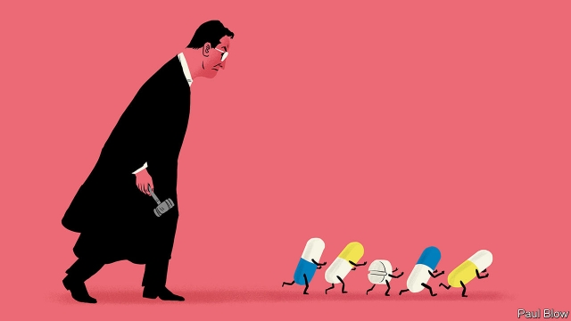
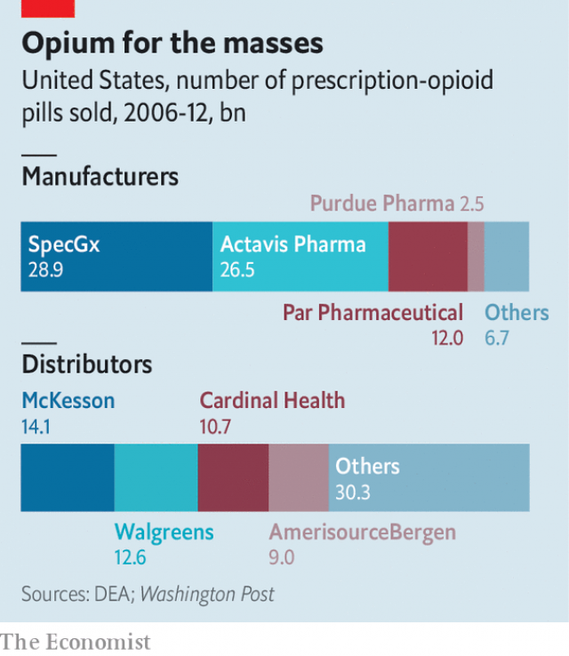

###### Opioids Inc in the dock

# Johnson & Johnson, Purdue and other opioid-peddlers face a reckoning 

 

> print-edition iconPrint edition | Business | Aug 29th 2019 

IN 2015 RICHARD SACKLER, from the billionaire family that controls Purdue Pharma, was deposed in a case related to his company’s alleged use—which it stoutly denies—of deceptive marketing to understate the addictive potential of OxyContin, its powerful opioid painkiller. The transcript of that testimony was unearthed this February, fuelling outrage over Purdue’s role in America’s growing opioid epidemic. On August 27th the video of Dr Sackler defending his firm’s flogging of OxyContin and other opioids finally emerged. This time, though, public fury was soothed by events of the previous day in Oklahoma. Judge Thad Balkman found Johnson & Johnson (J&J) guilty of creating a “temporary public nuisance” by contributing to the opioid epidemic which has claimed the lives of some 6,000 Oklahomans since 2000. He ordered it to pay $572m towards a plan to abate the crisis. 

Critics of the opioid-pushers cheered. As long ago as 2004, Purdue settled a case alleging inappropriate marketing of OxyContin with regulators in West Virginia for $10m, without admitting guilt. Since then, observes Elizabeth Burch of the University of Georgia Law School, nearly all such cases have been settled, with details of the litigation remaining under seal. The landmark trial in Oklahoma, which began in May, has already revealed the industry’s unsavoury practices. The prosecutors’ victory throws open the floodgates to strong legal action and potentially massive financial penalties. It could do to Opioids Inc what lawsuits over cigarettes did to Big Tobacco. And the pain may extend beyond drugmakers to distributors and retailers involved in the opioid trade. 

Oklahoma’s attorney-general spent months locked in a fierce battle with J&J in a state court over its responsibility for the local opioid crisis. Yet victory for the prosecutors seemed unlikely—which is why J&J punted on a trial instead of settling with the state like Purdue and Teva, an Israeli generic-drug manufacturer, which paid out $270m and $85m, respectively. Some scholars were sceptical of the prosecution’s novel interpretation of what counts as a public nuisance, a misdeed typically associated with polluters or owners of brothels. Moreover, J&J accounted for only a tiny share of opioid sales in the state. 

 

Judge Balkman’s verdict therefore came as a surprise to many. It may discourage other companies accused of complicity in the crisis from taking a chance in the courtroom, predicts David Maris of Wells Fargo, a bank. The first test of this hypothesis will be a federal case in Ohio, which is due to go to trial in October. It brings together claims from around 2,000 local governments and Native-American tribes. They are gunning for manufacturers such as J&J and Purdue, as well as lesser-known but much bigger opioid producers such as SpecGx and Actavis Pharma (see chart). But they are also going after big distributors and retailers, including upstanding household names like Walmart and Walgreens. All the companies deny wrongdoing. 

Mr Maris’s theory was bolstered a day after the Oklahoma verdict, when news reports surfaced of a dramatic deal in the works involving Purdue, the federal judge supervising the case in Ohio, and the plaintiffs in that case, as well as various state attorneys-general. The company appears willing to cough up between $10bn and $12bn, with $3bn or more coming from the Sackler family, as part of a bankruptcy transaction that would see the firm reconstituted as a public trust. If the reports are correct, the new trust would continue to produce both opioids and (perversely) drugs to counter their addictive effects. The Sacklers would lose control of their company; any future profits would go to the plaintiffs. 

All this should alarm the peddlers of the pills. Analysts differ on just how worried they ought to be. Tom Claps, a legal expert at Susquehanna Financial Group, an investment firm, calculates that the industry faces a legal risk of perhaps $37bn from ongoing cases. Patrick Trucchio of Berenberg, a German investment bank, thinks that distributors alone could face legal liabilities of $40bn. Across the entire opioid supply chain, Mr Trucchio reckons, the bill could run to a whopping $150bn. 

That is the worst-case scenario. For the time being, investors seem calm. J&J’s share price ticked up on news of the award, a fraction of the $17bn the prosecutors had demanded. It could pay the $572m penalty nine times over from its latest quarterly net profit alone. Its high-powered lawyers, who groused that the state prosecutors’ legal theory was a “radical departure” from long-standing case law, vowed to appeal against the ruling, all the way up to the Supreme Court if necessary. Even if upheld, it may carry no weight beyond Oklahoma’s borders. Most states espouse a common-law understanding of public nuisance that is much narrower than the relevant statute in Oklahoma, notes Richard Ausness of the University of Kentucky Law School. There may be echoes of this argument in future legal cases, says Ms Burch. But nothing about the Oklahoma decision predetermines outcomes elsewhere. 

Other legal theories against drugmakers and distributors have yet to be tested in court. After this week’s development, they may not get a chance. Andrew Pollis of Case Western Reserve University School of Law thinks the rest of the firms may fall in line behind Purdue. “Settlement feels impossible,” he says. “But trial is unthinkable.” ■ 

-- 

 单词注释:

1.opioid[əʊ'pi:əʊɪd]:a. 类鸦片（引起）的 n. 类鸦片活性肽 

2.Inc[]:a. 根据法律组成的公司, 公司 

3.johnson['dʒɔnsn]:n. 约翰逊（姓氏） 

4.purdue[]:n. 普杜大学（美国一所大学） 

5.reckon['rekәn]:vt. 计算, 总计, 估计, 认为, 猜想 vi. 数, 计算, 估计, 依赖, 料想 

6.Aug[]:abbr. 八月（August） 

7.richard['ritʃәd]:n. 理查德（男子名） 

8.sackler[]: [人名] 萨克勒 

9.billionaire[.biljә'nєә]:n. 亿万富翁 

10.pharma[]:n. 制药公司 

11.depose[di'pәuz]:vt. 免职, 废黜, 作证 vi. 作证, 供证 

12.allege[ә'ledʒ]:vt. 宣称, 主张, 提出, 断言 [法] 断言, 指称, 指证 

13.stoutly['stautli]:adv. 刚强地, 坚决地 

14.deceptive[di'septiv]:a. 迷惑的, 虚伪的, 欺诈的 

15.marketing['mɑ:kitiŋ]:n. 行销, 买卖 [经] 推销, 在市场买卖, 销售 

16.understate[.ʌndә'steit]:v. 不完全地陈述, 保守地说, 有意轻描淡写 

17.addictive[ә'diktiv]:a. 上瘾的 

18.oxycontin[]: [医]盐酸羟考酮控释片剂<镇痛药> 

19.painkiller['pein,kilә(r)]:n. 解痛药, 止痛片, 止痛药 

20.transcript['trænskript]:n. 抄本, 副本, 成绩单 [法] 法院文本, 官方记录, 记录的副本 

21.testimony['testimәni]:n. 证言, 证据, 声明 [医] 证据 

22.unearth[.ʌn'ә:θ]:vt. 发掘, 掘出, 从洞中赶出, 揭露, 发现 

23.outrage['autreidʒ]:n. 暴行, 侮辱, 愤怒 vt. 凌辱, 虐待, 触犯 

24.epidemic[.epi'demik]:n. 传染病, 流行病 a. 流行的, 传染性的 

25.sackler[]: [人名] 萨克勒 

26.flog[flɒg]:vt. 鞭打, 鞭策, 严厉的批评, 迫使 

27.fury['fjuri]:n. 愤怒, 狂暴, 狂怒的人 [医] 狂乱, 狂暴, 狂怒 

28.soothe[su:ð]:vt. 缓和, 使安静, 安慰, 奉承 vi. 起安慰作用 

29.Oklahoma[.әuklә'hәumә]:n. 俄克拉何马 

30.thad[]:撒德（男子名） 

31.balkman[]:[网络] 巴尔曼 

32.oklahomans[]:[网络] 俄克拉荷马州人；俄克拉荷马氏 

33.abate[ә'beit]:vt. 减少, 减轻, 减弱, 废除, 打折扣 vi. 减轻, 减弱, 减少, 失效, 被废除 

34.inappropriate[.inә'prәupriәt]:a. 不适当的, 不相称的 

35.regulator['regjuleitә]:n. 调整者, 校准者, 校准器, 调整器, 标准钟 [化] 调节剂; 调节器 

36.Virginia[vә'dʒinjә]:n. 弗吉尼亚 

37.guilt[gilt]:n. 罪行, 内疚 [法] 罪, 犯罪, 罪行 

38.elizabeth[i'lizәbәθ]:n. 伊丽莎白（女子名） 

39.burch[]: [人名] [英格兰人姓氏] 伯奇 Birch的变体 

40.Georgia['dʒɒ:dʒjә]:n. 乔治亚州 

41.litigation[.liti'geiʃәn]:n. 诉讼, 起诉 [经] 诉讼, 纠葛 

42.landmark['lændmɑ:k]:n. 陆标, 划时代的事, 地界标 [医] 界标 

43.unsavoury[,ʌn'seivәri]:a. 没有味道的, 没有香味的, 难吃的, 难闻的, 令人不快的, 不可接受的 

44.floodgate['flʌdgeit]:n. 水门, 水闸, 防潮水闸 

45.potentially[pә'tenʃәli]:adv. 可能地, 潜在地 

46.penalty['penәlti]:n. 处罚, 刑罚, 罚款, 罚球, 报应, 不利结果, 妨碍 [经] 罚金(款), 违约金 

47.lawsuit['lɒ:sju:t]:n. 诉讼 [法] 诉讼, 诉讼案件 

48.drugmaker['drʌ^,meikә(r)]:制药者 

49.distributor[dis'tribjutә]:n. 分发者, 分布者, 散布者, 分配者, 销售者, 分配器, 配电盘, 自动拆版机 [计] 分配器 

50.retailer['ri:teilә]:n. 零售商人, 传播的人 [经] 零售商 

51.prosecutor['prɒsikju:tә]:n. 实行者, 告发者, 公诉人 [法] 原告, 起诉人, 检举人 

52.punt[pʌnt]:n. 方头平底船, 踢悬空球, 赌博者 v. 踢悬空球, 用篙撑船, 赌博 

53.teva[]:[网络] 梯瓦；以色列梯瓦；梯瓦制药 

54.Israeli[iz'reili]:a. 以色列的, 以色列人(语)的 n. 以色列人 

55.misdeed['mis'di:d]:n. 罪行, 犯罪 [法] 不端行为, 犯罪, 恶性 

56.typically['tipikәli]:adv. 代表性地；作为特色地 

57.polluter[]:n. 污染者, 污染物质 

58.brothel['brɒθәl]:n. 妓院 [法] 妓院 

59.verdict['vә:dikt]:n. 裁决, 判决, 判断性意见, 定论, 结论 [法] 定论, 判断, 意见 

60.complicity[kәm'plisiti]:n. 同谋, 串通, 复杂 [法] 共谋, 共犯关系 

61.courtroom['kɒ:trum]:n. 法庭, 审判室 [法] 法庭, 审判室 

62.david['deivid]:n. 大卫；戴维（男子名） 

63.mari[maui]:n. 毛伊岛（位于夏威夷中部） 

64.fargo['fɑ:ɡəu]:n. 法戈（美国北达科他州东南部城市） 

65.hypothesis[hai'pɒθәsis]:n. 假设 [化] 假设 

66.Ohio[әu'haiәu]:n. 俄亥俄 

67.producer[prә'dju:sә]:n. 生产者, 制作者, 制作人 [化] 发生器; (炉煤气)发生炉; 制气炉; 生产者 

68.Actavis[]:[网络] 阿特维斯；阿特维斯制药；冰岛阿特维斯 

69.upstanding[ʌp'stændiŋ]:a. 直立的, 姿势笔直的, 正直的 

70.walmart['wɔlma:t]: 沃尔玛（世界连锁零售企业） 

71.walgreens[]:[网络] 沃尔格林；华尔格林；华格林 

72.wrongdoing['rɒŋ'du:iŋ]:n. 干坏事, 坏事 

73.bolster['bәulstә]:n. 支持, 长枕 vt. 支持, 支撑 

74.supervise['sju:pәvaiz]:v. 监督, 管理, 指导 

75.plaintiff['pleintif]:n. 原告, 起诉人 [经] 原告, 原起诉人 

76.bankruptcy['bæŋkrәptsi]:n. 破产者 [经] 破产, 倒闭 

77.transaction[træn'sækʃәn]:n. 交易, 办理, 学报, 和解协议 [计] 事务处理 

78.reconstitute[.ri:'kɒnstitju:t]:vt. 重新组成, 重新设立 [法] 重新构成, 重新组成, 重新设立 

79.perversely[pə'vɜ:slɪ]:adv. 倔强地 

80.sackler[]: [人名] 萨克勒 

81.peddler['pedlә]:n. (毒品)小贩, 传播者, 沿街叫卖的小贩 

82.analyst['ænәlist]:n. 分析者, 精神分析学家 [化] 分析员; 化验员 

83.tom[tɒm]:n. 雄性动物, 雄猫 

84.Susquehanna[]:n. 萨斯奎哈纳, 萨斯奎汉纳（美国东海岸的一条主要河流） 

85.ongoing['ɒngәuiŋ]:a. 前进的, 进行的, 不间断的 n. 前进, 发展 

86.patrick['pætrik]:n. 帕特里克（男子名） 

87.Berenberg[]:贝伦贝格 

88.liability[laiә'biliti]:n. 责任, 债务, 倾向 [经] 责任, 义务, 负债 

89.whop[hwɒp]:v. 打, 抽出, 打败, 征服 n. 重击, 打击声 

90.scenario[si'nɑ:riәu]:n. 剧本提纲, 情节, 剧本, 方案, 事态 [计] 方案 

91.investor[in'vestә]:n. 投资者 [经] 投资者 

92.grouse[graus]:n. 松鸡, 牢骚 vi. 埋怨 

93.vow[vau]:n. 誓约, 誓言, 许愿 vi. 起誓, 发誓, 郑重宣言 vt. 立誓, 起誓要, 郑重地宣布 

94.uphold[ʌp'hәuld]:vt. 支撑, 赞成, 鼓励, 举起, 坚持 [法] 确认, 赞成, 支持 

95.espouse[i'spauz]:vt. 支持, 赞成, 嫁, 娶 [法] 娶, 出嫁, 信奉 

96.richard['ritʃәd]:n. 理查德（男子名） 

97.ausness[]:[网络] 奥斯内斯 

98.Kentucky[kәn'tʌki]:n. 肯塔基州 

99.predetermine[.pri:di'tә:min]:vt. 预先决定, 预先查明 [经] 预定的, 先定的 

100.andrew['ændru:]:n. 安德鲁（男子名） 

101.pollis[]:[网络] 里斯 

102.unthinkable[.ʌn'θiŋkәbl]:a. 不能考虑的, 不能想像的, 想像不到的, 不合理的 

