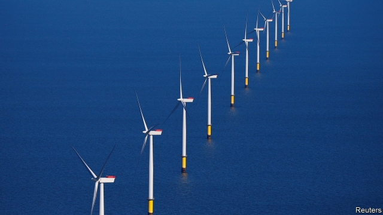
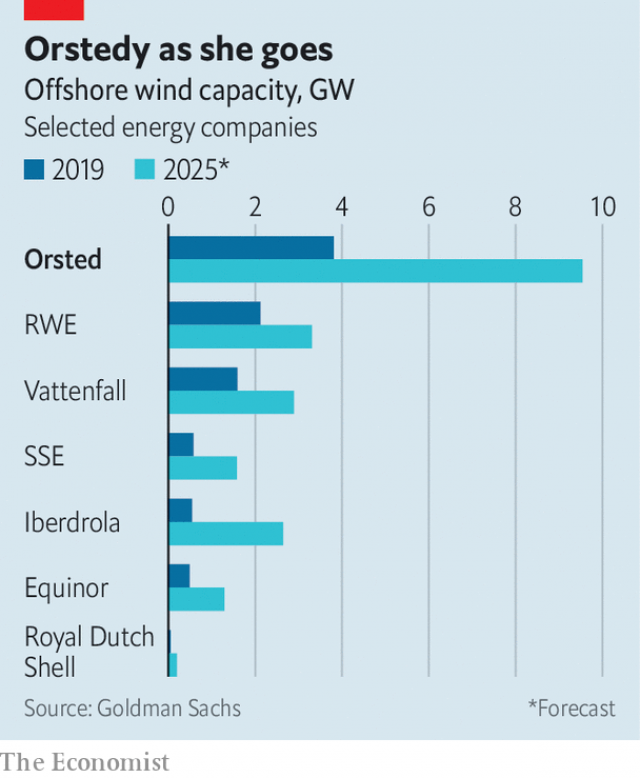

###### Tailwinds

# Orsted has helped boost the prospects of offshore windpower 

 

> print-edition iconPrint edition | Business | Aug 31st 2019 

THIRTY KILOMETRES off the coast of Denmark, in the dark, churning North Sea, 91 white turbines slice through the air. The Scandinavian country is the birthplace of the offshore-wind industry. In 1991 the world’s first such electricity generators were erected there and, 11 years later, the first large-scale offshore wind farm, built with the help of a freighter previously employed to ferry bananas. On a recent gusty day, dangling above the waves, mechanics abseiled down the 40-metre-long blades for routine maintenance. 

Such sights are rare in most of the world; offshore wind generates just 2% of global renewable power. In Denmark they are humdrum. Behind it all is a company that few know and fewer can pronounce. 

Seven years ago Orsted (“ur-sted”) was DONG Energy, Denmark’s state-owned hotch-potch of coal and natural-gas plants, a few wind farms, oil production and more. Today the utility is the world’s biggest offshore-wind developer, with a third of the market outside China. In 2018 offshore wind accounted for about 90% of Orsted’s gross operating profit and 80% of capital employed. As fossil-fuel-dependent rivals grapple with concerns about climate change, Orsted has transformed itself into a darling of environmentalists and investors alike. Its share price has doubled in the past two years. Around the world the Danish success story is being studied closely. 

Orsted’s strategic shift was spurred by crisis. When Henrik Poulsen became DONG’s boss in 2012, gas and coal power plants were ailing. The division which drilled for oil and gas operated in dwindling North Sea fields. “The one business where we had some true differentiation”, Mr Poulsen recalls thinking, “was wind.” 

 

He set about shedding fossil-fuel assets and in 2013 sold an 18% stake to Goldman Sachs, a bank, for $1.2bn to help finance investment in wind. DONG’s initial public offering in 2016 was that year’s second-biggest anywhere. Denmark’s government retained control through a 50.1% stake. But in other ways, the company had changed. To emphasise the metamorphosis, it renamed itself after Hans Christian Orsted, the Danish discoverer of electromagnetism. (Plus, as its advert at the time quipped, “when you hear ‘DONG’ your first thought isn’t green energy.”) 

The bet on offshore wind is paying off. Although it remains a pricier way to generate electricity than onshore wind or solar power, its costs, at €62 ($69) per megawatt-hour in Europe, are less than half what they were in 2012. Unlike solar panels, it works at night. Unlike wind turbines on land, it raises few NIMBYist hackles. Bernstein, a research firm, forecasts that the offshore-wind market will grow at 17% a year to 2030, about twice as fast as onshore wind. 

The Danish firm got a head start by winning early contracts in Britain, which was offering rich subsidies. Britain’s introduction of auctions in 2014 made companies more cost-conscious. Like rival wind developers, Orsted now uses bigger turbines, which are cheaper to build and maintain than a larger number of small ones (and uses purpose-built vessels, not banana freighters). But its focus on wind lets it seek out potential projects years before its generalist rivals, says Deepa Venkateswaran of Bernstein. The decision to manage projects closely and rely less on contractors helps contain costs. Data from 1,150 turbines across Europe help further optimise operations and allow the firm to design new projects more efficiently, adds Peter Bisztyga of Bank of America Merrill Lynch. Orsted expects a return on capital employed to average 10% in the next few years, about what big oil companies manage. 

It may be a creature of northern Europe, with dilled cucumber snacks at its Scandinavian-chic offices, but the company has global ambitions, surveying the world’s open water as hungrily as a property magnate would Manhattan lots. Mr Poulsen thinks Orsted’s worldwide capacity will nearly triple by 2025. It has already secured the right to build 3.8 gigawatts along American and Taiwanese coasts, with local partners. It is starting to invest in onshore wind and solar, which will remain larger markets than offshore wind. 

Not everything has gone smoothly. The sale to Goldman was so controversial it helped fell Denmark’s prime minister (in October 2017 Goldman said it would sell all its remaining shares). Amid uncertainty about the effects of America’s shale boom, it took until 2017 for Orsted to offload its oil-and-gas business. Although the firm plans to phase out coal by 2023, it still runs some fossil-fuel power stations. Hans Christian’s descendants sued (unsuccessfully) over the name. Denmark’s government has objected to Mr Poulsen’s effort to sell a power-distribution business, which would boost payouts for shareholders. 

Global expansion brings new risks. Wind farms are now of a scale that, when a problem occurs, as it did when an outage at an Orsted wind farm off the coast of Yorkshire contributed to a blackout in Britain on August 9th, the world notices. Governments may unexpectedly change their terms, as Taiwan’s did this year. 

Most important, Orsted faces stiffer competition. Equinor and Royal Dutch Shell, two European energy giants with six and 32 times its revenues, respectively, want to set offshore turbines atwirl. RWE, a German power company that is now the Danes’ closest rival, is buying the renewables assets of two other utilities. Macquarie, a bank, is among the heavyweights taking stakes in wind farms, providing capital that fuels more competition. 

Analysts reckon that Orsted can hold its own even against the likes of Shell, which it recently beat in American tenders. If not for Denmark’s controlling stake, the oil giant might well be trying to buy it. ■ 

-- 

 单词注释:

1.tailwind[ˈteɪlwɪnd]:n. （从后面吹来的）顺风 

2.Orsted[]:厄斯特德 

3.windpower[]:un. 风力 [网络] 美国国际风能展览会；美国国际风能大会；风力发电 

4.Aug[]:abbr. 八月（August） 

5.Denmark['denmɑ:k]:n. 丹麦 

6.churn[tʃә:n]:n. 搅乳器 v. 搅拌, 搅动 

7.Scandinavian[,skændi'neivjәn]:n. 斯堪的纳维亚人, 斯堪的纳维亚语, 北欧日耳曼语系 a. 斯堪的纳维亚人的, 斯堪的纳维亚语的, 北欧日耳曼语系的 

8.freighter['freitә]:n. 租船人, 承运人, 托运人, 货船, 运输机 [经] 装货人, 货主, 承运人 

9.gusty['gʌsti]:a. 刮风的, 阵阵猛急的, 突发的, 津津有味的 

10.dangle['dæŋgl]:vi. 摇晃地悬挂着, 追求 vt. 使摇晃地悬挂 n. 悬垂 

11.abseil['ɑ:bzail]:n. (登山运动中的)沿绳滑下法 

12.renewable[ri'nju(:)әbl]:a. 可更新的, 可恢复的, 可继续的, 可换新的, 可重复的, 可重说的 [计] 可更新, 可再生的 

13.humdrum['hʌmdrʌm]:a. 平凡的, 单调的, 令人厌烦的 n. 平凡, 单调, 无聊 vi. 单调令味地进行 

14.dong[dɔŋ]:n. 盾（越南货币单位） 

15.developer[di'velәpә]:n. 开发者 [计] 显影器 

16.grapple[græpl]:v. 抓住, 掌握 n. 抓住, 系紧, 掌握, 与...扭打 

17.environmentalist[in,vaiәrәn'mentlist]:n. 环保人士 

18.investor[in'vestә]:n. 投资者 [经] 投资者 

19.Danish['deiniʃ]:n. 丹麦文 a. 丹麦的, 丹麦人的, 丹麦文的 

20.Henrik[]:n. 亨里克, 亨利克（人名） 

21.poulsen[]: [人名] 波尔森 

22.ailing['eiliŋ]:a. 生病的 [医] 患病的, 病痛的 

23.dwindle['dwindl]:vi. 减少, 缩小, 衰落 vt. 使缩小 

24.differentiation[.difәrenʃi'eiʃәn]:n. 区别, 分化, 变异 [医] 鉴别, 区别, 分化[作用], 微分法 

25.asset['æset]:n. 资产, 有益的东西 

26.goldman[]:n. 高曼（姓氏） 

27.Sachs[zaks]:n. 萨克斯（汽车零配件生产厂商） 

28.emphasise[]:vt. 强调, 重读, 加强...的语气, 着重 

29.metamorphosis[.metә'mɒ:fәsis]:n. 蜕变, 变质, 变形 [医] 变态, 变形, 变质 

30.rename[.ri:'neim]:vt. 重新命名, 再命名, 给...改名 [计] 重命名; DOS内部命令:更改文件名 

31.han[hæn]:n. 汉朝；汉民族 

32.discoverer[dis'kʌvәrә]:n. 发现者 

33.electromagnetism[ilektrәj'mæ^nitiz(ә)m]:n. 电磁, 电磁学 [化] 电磁学 

34.advert[әd'vә:t]:vi. 提出看法, 引起注意, 留意 n. 广告 

35.quip[kwip]:n. 妙语, 遁辞, 讽刺 v. 说讽刺话, 嘲弄 

36.pricy['praisi]:a. 昂贵的, 价格高的 

37.onshore['ɒnʃɒ:]:a. 向陆的, 陆上的, 在国内的 adv. 向陆地, 在陆上, 在国内 

38.les[lei]:abbr. 发射脱离系统（Launch Escape System） 

39.nimbyist[]:[网络] 尼姆兄弟 

40.hackle[hækl]:vt. 梳理, 乱砍 n. 锯齿形裂痕, 针排, 颈羽 

41.Bernstein[bә:n'stein]:[德]琥珀, 伯恩斯坦(姓氏) 

42.auction['ɒ:kʃәn]:n. 拍卖 vt. 拍卖 

43.generalist['dʒenәrәlist]:n. 多面手, 通才 

44.deepa[]:[网络] 迪帕；蒂帕；纵深的 

45.venkateswaran[]:[网络] 范卡德瓦兰；温卡特斯沃伦 

46.contractor['kɒntræktә]:n. 立契约的人, 承包商 [化] 承包者; 承包工厂 

47.datum['deitәm]:n. 论据, 材料, 资料, 已知数 [医] 材料, 资料, 论据 

48.optimise['ɒptɪmaɪz]:vt. 使最优化, 使尽可能有效 

49.efficiently[i'fiʃәntli]:adv. 生效, 能胜任, 有能力, 效率高, 有效 

50.peter['pi:tә]:vi. 逐渐消失, 逐渐减少 

51.bisztyga[]:比什蒂加 

52.Merrill[]:n. 美林（美国证券公司）；美林（美国城市） 

53.lynch[lintʃ]:n. 私刑, 私罚 vt. 处以私刑处死, 加私刑 

54.dill[dil]:n. 莳萝, 莳萝叶 [医] 莳罗 

55.hungrily['hʌŋɡrəlɪ]:adv. 饥饿地; 渴望地, 贪婪地 

56.magnate['mægneit]:n. 大官, 巨头 [法] 大官, 权贵, 大资本家 

57.Manhattan[mæn'hætәn]:n. 曼哈顿 

58.triple['tripl]:n. 三倍数, 三个一组 a. 三倍的 vt. 使增至三倍 vi. 增至三倍 

59.gigawatt['dʒai^әwɔt]:[电] 十万万瓦 

60.taiwanese[,taiwɑ:'ni:z, -'ni:s]:a. 台湾人的；台湾的 

61.amid[ә'mid]:prep. 在其间, 在其中 [经] 在...中 

62.uncertainty[.ʌn'sә:tnti]:n. 不确定, 不可靠, 不确定的事物 [化] 不确定度 

63.shale[ʃeil]:n. 页岩 

64.offload['ɔflәjd, ɔf'lәjd; (?@) 'ɔ:flәjd]:v. 卸下, 卸货 

65.descendant[di'sendәnt]:n. 后裔, 子孙 a. 传下的, 下降的 

66.sue[su:]:vt. 控告, 起诉, 请求 vi. 提出诉讼, 提出请求 

67.unsuccessfully[]:adv. 无用；失败地 

68.payout['pei'aut]:n. 支出, 付出款项 [经] 付出款项, 花费, 支出 

69.shareholder['ʃєә.hәuldә]:n. 股东 [法] 股东, 股票持有人 

70.outage['autidʒ]:n. (水、电、煤)断供, 储运损耗 [化] (蓄水池为了水膨胀)预留的容量; 排出量 

71.Yorkshire['jɔ:kʃә]:n. 约克郡, 约克王朝 

72.blackout['blækaut]:n. 灯火管制, 暂时的意识丧失, 灯火熄灭, 删除 [计] 电网掉电 

73.unexpectedly[]:adv. 想不到的, 突然的, 意外的, 出乎意料的 

74.Dutch[dʌtʃ]:n. 荷兰人, 荷兰语 a. 荷兰的 

75.atwirl[æt'wɜ:l]:a. & adv. 快速旋转的[地] 

76.RWE[]:[网络] 莱茵集团；德国莱茵集团；莱茵能源集团 

77.Macquarie[mə'kwɔri]:麦格里（姓） 

78.heavyweight['heviweit]:n. 重量级拳击运动员, (非正式)有影响的要人 a. 最重量级的 

79.analyst['ænәlist]:n. 分析者, 精神分析学家 [化] 分析员; 化验员 

80.reckon['rekәn]:vt. 计算, 总计, 估计, 认为, 猜想 vi. 数, 计算, 估计, 依赖, 料想 

