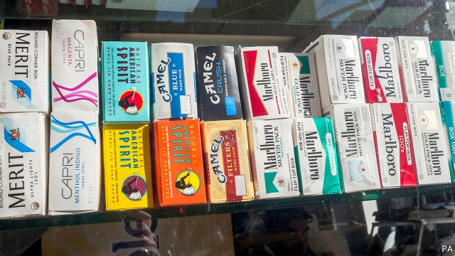

###### Cigarette-making

# Philip Morris and Altria want to merge 

 

> print-edition iconPrint edition | Business | Aug 29th 2019 

A DECADE AGO Altria, which makes Marlboros, span off its non-American business, Philip Morris International (PMI). The split was driven partly by Altria’s share price, which had been languishing below its sum-of-parts value, but also by regulatory hounding of Big Tobacco over its role in causing cancer. When British American Tobacco made a bid for Reynolds American, maker of Camels, in 2016, Bonnie Herzog, an analyst at Wells Fargo, a bank, urged PMI to reunite with its former parent. It took longer than expected. But on August 27th the two said they were in talks to merge. Their combined market value just before the announcement was $210bn. 

Ms Herzog still thinks the merger makes sense, given the benefits of scale and geographical reach in what she calls the “global arms race” for “reduced-risk” products, which use fewer harmful chemicals. Last year Altria spent $12.8bn on 35% of Juul Labs, a maker of popular high-nicotine vaporisers. It paid $1.8bn for 45% of Cronos Group, a cannabis company from Canada (which, along with some American states, has legalised pot). PMI has spent $6bn since 2008 to develop IQOS, a smoke-free device which heats tobacco and is expected to represent 40% of its sales by 2025, up from 14% last year. In April it won approval from the Food and Drug Administration (FDA) to sell IQOS in America, starting next month (under an existing licensing agreement with Altria). 

Worldwide cigarette sales fell by 4.5% in 2018, to $714bn, and may continue to decline. The FDA’s proposed rules on nicotine content, to make smokes “minimally addictive”, could cut profits of American tobacco firms by half, say analysts at Morgan Stanley, a bank. By contrast, e-cigarette revenues may grow by more than 8% annually over the next five years, from $11bn today, according to Mordor Intelligence, a research firm. 

For all that, merging with Altria may expose PMI to regulatory risks from Juul, whose controversial devices are a worrying hit with teenagers. Altria could also be a drag on PMI’s profitability, which has exceeded its parent’s since the split. PMI’s share price fell by 7.8% on the news. The deal may yet go up in smoke.■ 

-- 

 单词注释:

1.philip['filip]:n. 菲利普（男子名） 

2.morris['mɒ:ris]:n. 莫里斯舞 

3.altria[]:[网络] 奥驰亚；奥驰亚集团；奥驰亚公司 

4.merge[mә:dʒ]:vt. 使合并, 使消失, 吞没 vi. 合并, 渐渐消失 [计] 合并 

5.Aug[]:abbr. 八月（August） 

6.marlboros['ɑrbərəs]:n. 万宝路（商标名，Marlboro的复数） 

7.pmi[]:abbr. 采购经理人指数（Purchase Management Index） 

8.languish['læŋgwiʃ]:vi. 憔悴, 凋萎, 苦思 

9.regulatory['regjulәtәri]:a. 受控制的, 统制的, 调整的 [经] 规则的 

10.hound[haund]:n. 猎犬 vt. 带猎犬狩猎, 追捕, 激励, 使追逐 

11.reynolds['renәldz]:n. 雷诺兹（姓氏） 

12.maker['meikә]:n. 制造者, 上帝 [经] 制造者, 出票人 

13.bonnie['bɒni]:a. 漂亮的 

14.Herzog[]:赫尔佐克（人名） 

15.analyst['ænәlist]:n. 分析者, 精神分析学家 [化] 分析员; 化验员 

16.fargo['fɑ:ɡəu]:n. 法戈（美国北达科他州东南部城市） 

17.reunite[.ri:ju:'nait]:v. (使)再联合 

18.merger['mә:dʒә]:n. 合并, 归并 [经] 购并 

19.geographical[dʒiә'græfikl]:a. 地理学的, 地理的 

20.juul[]:[网络] 佛戴格斯先生 

21.vaporiser['veipәraizә(r)]:n. <主英>=vaporizer 

22.crono[]:[网络] 克鲁诺；瑞典站点；坦克 

23.cannabis['kænәbis]:n. 大麻 [化] 大麻 

24.legalise['li:^әlaiz]:vt. 使合法化, 使成为法定, 法律上认可 

25.fda[]:abbr. （美）食品及药物管理局（Food and Drug Administration） 

26.nicotine['nikәti:n]:n. 烟碱, 尼古丁 [化] 烟碱; 尼古丁 

27.minimally[]:adv. 最低限度地；最低程度地 

28.addictive[ә'diktiv]:a. 上瘾的 

29.Morgan['mɒ:gәn]:n. 摩根马 

30.stanley['stænli]:n. 斯坦利（男子名） 

31.annually['ænjuәli]:adv. 一年一次, 每年 [经] 年度的, 每年的 

32.mordor[]: 魔多 

33.profitability[.prɒfitә'biliti]:n. 收益性, 利益率 [经] 可获利润率 

