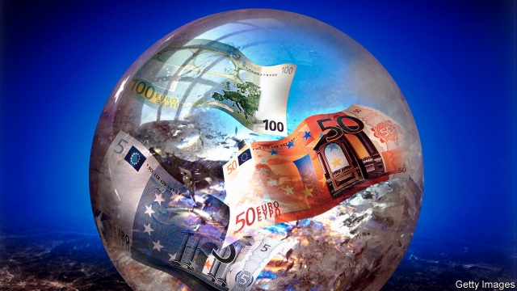
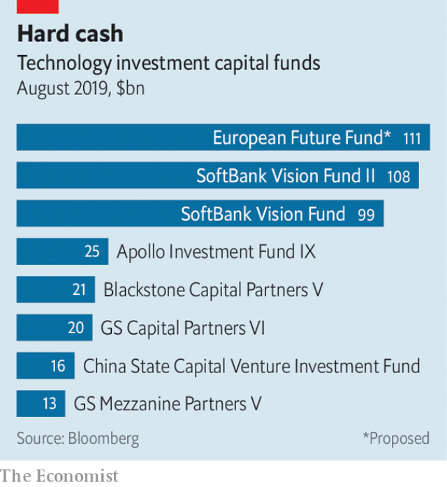

###### Softly, softly

# The Europeans want their own Vision Fund to invest in tech 

 

> print-edition iconPrint edition | Business | Aug 31st 2019 

HOW MUCH does it cost to bend the future to one’s will? Give or take $100bn, reckons Masayoshi Son, boss of SoftBank. That is the size of the Japanese conglomerate’s Vision Fund, which holds stakes in modish technology companies including WeWork and Uber. Mr Son is raising a new, similarly gargantuan pot. Now the EU wants one, too. On August 22nd news filtered out of a proposal to create a €100bn ($111bn) fund to back European firms in “strategically important” industries. 

Its proposed name and high-tech focus notwithstanding, the European Future Fund would hark back to decades past. Politicians across the old continent once believed themselves blessed with the gift of picking corporate winners. That 1970s experiment did not end well: “national champions” backed with taxpayers’ money were kept on life support with yet more of it. 

Concerns about Europe falling behind in technology, too, are old hat. In the early 2000s France and Germany were so worried about Google that they lavishly funded Quaero, a made-in-Europe search engine. A few years and tens of millions of euros later, the project was quietly deleted. 

 

But frustration among politicians about the dearth of a European Google, Amazon or Alibaba lives on. So they are minded to try again—this time seeking to create “European champions”, not national ones. Industries now deemed in need of politicians’ wisdom to thrive—one plausible reading of “strategic”—include batteries and anything related to artificial intelligence (though the French in particular apply the term loosely, once blocking the takeover of Danone, a yogurt-maker, over ill-defined strategic concerns). 

The Brussels machinery could once be trusted to dampen fervour for such industrial policy. In February the European Commission, the EU’s executive arm, blocked a merger of the rail arms of Siemens, a German engineering giant, and Alstom of France on competition grounds, putting paid to Franco-German dreams of a continental titan. 

Now the mood among Eurocrats is shifting. Margrethe Vestager, the bloc’s respected competition chief, who repeatedly kiboshed political efforts to mollycoddle favoured industries, is probably on her way out (of her current job; she will almost certainly stay in Brussels). Historically a French hobby-horse, dirigisme has found favour with German policymakers. Ursula von der Leyen, a German who will take over as commission president on November 1st, has spoken in the past of the need for Europe to “update our industrial policy”. Politicians of most stripes want to erect a Fortress Europe to defend companies from bullying by Trumpian America and assault by state-backed Chinese groups. 

The mooted fund is far from investing its first euro. Ms von der Leyen has distanced herself from the idea. Soon after Politico, a news outlet, reported the proposal, the commission described it as “draft internal brainstorming”. Maybe. It seems pretty thorough in some respects, like how it might be funded (public money bolstered by private-sector investors) and ways it could “support” companies by taking direct stakes in them. In others, less so. Most notably missing is a list of promising high-tech candidates for the pot’s largesse. To bend the arc of progress European politicians need to grab onto something.■ 

-- 

 单词注释:

1.tech[tek]:n. 技术学院或学校 

2.Aug[]:abbr. 八月（August） 

3.reckon['rekәn]:vt. 计算, 总计, 估计, 认为, 猜想 vi. 数, 计算, 估计, 依赖, 料想 

4.masayoshi[]:[网络] 正义；正义大师；正义作 

5.softbank['sɒftbæŋk]: 日本最大的软件销售商 

6.modish['mәudiʃ]:a. 流行的, 时髦的 

7.uber['ju:bә]:[医] 乳房 

8.gargantuan[gɑ:'gæntʃuәn]:a. 巨大的, 庞大的 

9.EU[]:[化] 富集铀; 浓缩铀 [医] 铕(63号元素) 

10.strategically[strә'ti:dʒikәli]:adv. 在战略上, 颇策略地 

11.notwithstanding[.nɒtwiθ'stændiŋ]:adv. 虽然, 尽管 prep. 尽管 conj. 虽然 

12.hark[hɑ:k]:vi. 倾听 

13.corporate['kɒ:pәrit]:a. 社团的, 合伙的, 公司的 [经] 团体的, 法人的, 社团的 

14.google[]:谷歌；搜索引擎技术；谷歌公司 

15.lavishly['læviʃli]:adv. 浪费地, 丰富地 

16.Quaero[]:[网络] 多媒体搜索引擎；上比 

17.tens[]:十位 

18.euro['juәrәu]:n. 欧元（欧盟的统一货币单位） 

19.quietly['kwaiәtli]:adv. 安静地, 沉着地, 秘密地 

20.frustration[frʌs'treiʃәn]:n. 挫折, 顿挫 [医] 挫折 

21.dearth[dә:θ]:n. 缺乏, 粮食不足, 饥馑 

22.amazon['æmәzɒn]:n. 亚马孙河 [医] 无乳腺者 

23.alibaba[]:n. 阿里巴巴（公司名） 

24.deem[di:m]:v. 认为, 相信 

25.plausible['plɒ:zibl]:a. 貌似真实的, 貌似合理的, 说得煞有其事的 [法] 花言巧语的, 似乎有理的 

26.loosely['lu:sli]:adv. 松弛地, 宽松地, 不紧 

27.takeover[]:n. 接管, 接收 [经] 接收 

28.danone[]:[网络] 达能；达能集团；法国达能 

29.Brussel[]:n. 布鲁塞尔（比利时首都） 

30.machinery[mә'ʃi:nәri]:n. 机器, 机械装置, 机构 [化] 机械 

31.dampen['dæmpәn]:vt. 弄湿, 使沮丧 vi. 变湿, 丧气 

32.fervour['fә:vә]:n. 炽热, 热诚, 热情, 热烈 

33.merger['mә:dʒә]:n. 合并, 归并 [经] 购并 

34.siemen[]:[网络] 西门子贝得 

35.alstom[]:n. 阿尔斯通（法国公司） 

36.continental[.kɒnti'nentl]:a. 大陆的, 洲的 n. 欧洲大陆人 

37.Titan['taitn]:n. 提坦, 太阳神, 巨人 

38.Eurocrat['juәrәkræt]:n. 欧洲经济共同体的官员(或职员) 

39.margrethe[]:[网络] 丹麦女王玛格丽特；丹麦玛格丽特；丹麦女王玛格丽特二世 

40.kibosh['kaibɒʃ]:n. 胡说 

41.mollycoddle['mɒlikɒdl]:n. 女性化的男人, 娇生惯养的人, 伪善的人 vt. 溺爱, 娇养 

42.historically[his'tɔrikәli]:adv. 历史上地；从历史观点上说 

43.dirigisme[,di:ri:'ʒi:sm]:n. <法> (政府对国民经济)干预或统制(主义) 

44.policymaker['pɔlisi.meikә]:n. 政策制定者；决策人 

45.ursula['ә:sjulә]:n. 厄休拉（女子名） 

46.Von[vɔn;fɔn;fәn]:[计] 冯·诺伊曼 

47.der[]:abbr. 区分编码规则（Distinguished Encoding Rules） 

48.leyen[]:[网络] 部女部长莱恩 

49.update[ʌp'deit]:vt. 更新, 使现代化 n. 更新 [计] 更新 

50.fortress['fɒ:tris]:n. 城堡, 要塞 vt. 筑要塞, 以要塞防守 

51.bully['buli]:n. 欺凌弱小者, 土霸 vt. 威胁, 恐吓, 欺负 vi. 欺负 a. 特好的, 第一流的 adv. 十分 

52.Trumpian[]:特朗普的 

53.assault[ә'sɒ:t]:n. 攻击, 袭击 vt. 袭击, 攻击 vi. 发动攻击 

54.moot[mu:t]:n. 大会, 模拟案件, 辩论会 a. 未决议的, 无实际意义的 vt. 讨论, 争论 

55.politico[pә'litikәu]:n. 政客 

56.brainstorming['brein,stɔ:miŋ]:自由讨论, 发表独创[创造]性意见, 智力爆发 

57.bolster['bәulstә]:n. 支持, 长枕 vt. 支持, 支撑 

58.investor[in'vestә]:n. 投资者 [经] 投资者 

59.les[lei]:abbr. 发射脱离系统（Launch Escape System） 

60.notably['nәjtbәli]:adv. 显著地, 著名地, 尤其, 特别 

61.largesse[lɑ:'dʒes]:n. 慷慨的赠与, 慷慨赠与物, 慷慨的赏钱 

62.arc[ɑ:k]:n. 弧, 弧形, 弓形, 弧光 [化] 弧 

63.grab[græb]:n. 抓握, 掠夺, 强占, 东方沿岸帆船 vi. 抓取, 抢去 vt. 攫取, 捕获, 霸占 

