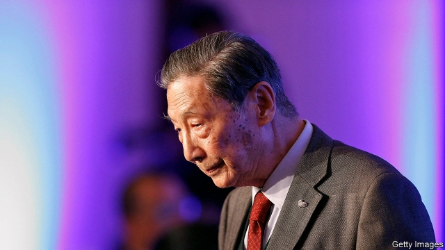

###### Ghost at the feast

# China bans an independent think-tank critical of its policies 

 

> print-edition iconPrint edition | China | Aug 31st 2019 

FOR RESEARCHERS devoted to the rule of law, the end was fitting. Drawing on patchwork regulations that appear to violate the Chinese constitution, local authorities in Beijing at last found a pretext to ban the Unirule Institute of Economics, that rarest of things in China, an independent think-tank known for criticising the government. For years Unirule had faced pressure, including evictions from multiple offices, to quiet down, and yet had managed to go on functioning. But it saw no way around the ban, issued last month, and so on August 26th announced that it would stop all activities. 

Founded in 1993, Unirule always resided on the fringes of Chinese policy discussions, bringing together a collection of liberal economists who were strong believers in free markets. It published a series of books about institutional reform, including on how to slim down state-owned firms. It delved into topics such as the design of China’s health-care system and land-ownership rules. It also convened forums every two weeks; its last, the 600th, was a theoretical discussion about network effects in economics. A steady stream of eminent economists and senior officials came through Unirule’s doors over the years, eager to hear its perspectives, so different from those propagated by right-thinking state-affiliated institutions. 

Unirule’s scholars tried to avoid landmines. For instance, they refrained from criticising Xi Jinping, China’s president, by name. But their dislike of China’s state model always made them vulnerable. As far back as 2004 Unirule lost the support of a government agency that had sponsored it, forcing it to reorganise as the research unit of a consultancy. One of its founders, Mao Yushi, earned admirers abroad: the Cato Institute, an American think-tank, awarded him a prize in 2012 for his advocacy of a more open political system in China. At home, though, he faced attacks. Some bloggers branded him a traitor. 

Over the past few years, as Mr Xi has tightened his grip, Unirule has been increasingly boxed in. Its website was shut down, although it later reopened, hosted abroad. In the past its members could publish articles in more liberal newspapers such as Southern Weekly; these days their submissions are rejected. Their accounts on Chinese social-media platforms such as WeChat are frequently blocked. The authorities have also stepped up harassment of the institute. Last year its landlord briefly welded steel bars across the door to its office, a cramped converted apartment, while staff were inside. 

Sheng Hong, Unirule’s director, maintained his stubborn belief in rules-based governance even as his think-tank met its end. The ban, he says, is a violation of article 35 of China’s constitution, which promises freedom of speech and assembly. But he is under no illusion about what truly lies behind Unirule’s woes. “Leaders today don’t believe that different voices are good for society and good for government,” he says. “That will really come to hurt China.” 

Tellingly, though, he was still more guarded than scholars outside China. “Xi’s tolerance for independent voices and criticism is absolutely zero. It’s non-existent,” laments Minxin Pei of Claremont McKenna College in California. “Forty years after the Cultural Revolution, this is absolutely the worst period.” It is a wonder that Unirule survived as long as it did.■ 

